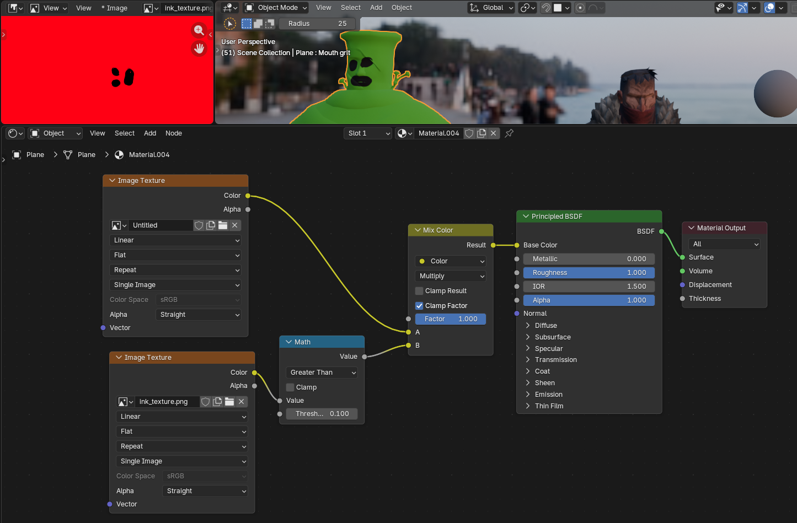
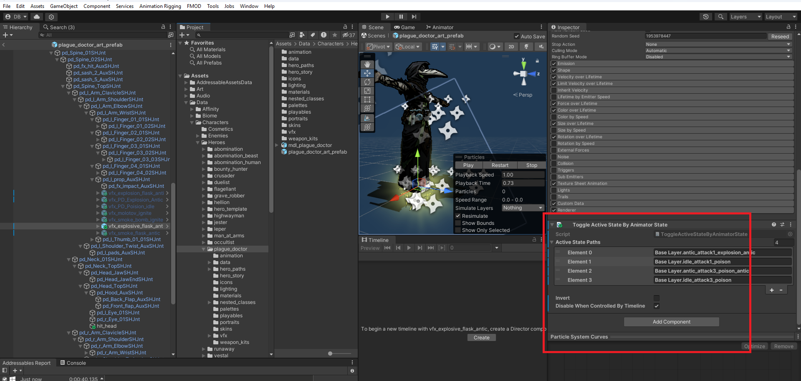

# Creating a new hero for Darkest Dungeon II

<!-- TOC tocDepth:2..3 chapterDepth:2..6 -->

- [Intro](#intro)
    - [What to expect](#what-to-expect)
    - [What I couldn't do](#what-i-couldnt-do)
    - [Amount of work](#amount-of-work)
- [3D modeling, animating](#3d-modeling-animating)
- [Texturing](#texturing)
- [Installing the Mod Kit](#installing-the-mod-kit)
- [Creating a placeholder hero](#creating-a-placeholder-hero)
- [Exporting models to Darkside](#exporting-models-to-darkside)
    - [Adding meshes](#adding-meshes)
    - [Adding textures](#adding-textures)
    - [Fixing the outline](#fixing-the-outline)
    - [Adding effect anchors](#adding-effect-anchors)
    - [Fixing the inn light](#fixing-the-inn-light)
- [Exporting animations to Darkside](#exporting-animations-to-darkside)
- [Skill icons and portraits](#skill-icons-and-portraits)
- [Adding VFX](#adding-vfx)
- [Adding SFX](#adding-sfx)
- [CSV data I](#csv-data-i)
- [Creating a signature inn item](#creating-a-signature-inn-item)
- [CSV data II](#csv-data-ii)
- [Creating hero trinkets](#creating-hero-trinkets)
- [Skills](#skills)
- [Paths](#paths)
- [Creating tokens](#creating-tokens)
- [Localization](#localization)
    - [Syntax](#syntax)
    - [Names and barks](#names-and-barks)
    - [Skills' tooltips](#skills-tooltips)
- [Altar of Hope](#altar-of-hope)
- [Loot tables](#loot-tables)
- [Act 5 boss](#act-5-boss)
- [Shrine of Reflection](#shrine-of-reflection)
- [Run goals](#run-goals)
- [Kingdoms](#kingdoms)
- [Weapon Kits and Origin Skin](#weapon-kits-and-origin-skin)
- [A summoning skill](#a-summoning-skill)
- [CSV data III](#csv-data-iii)
- [Testing](#testing)

<!-- /TOC -->

## Intro

### What to expect

This isn't exactly a guide, rather a document about everything I've experienced while creating a new hero. Before this mod, I had never created any mods for any game, and I didn't consult with anyone experienced in this while creating it. However, this can at least provide some answers to some questions. Not all of these answers are correct, but at least they exist. Also English is not my first language.

I will try to write as much as possible about what I was trying to do, what solutions tried, what issues encountered, what worked, what did not, what are other potential solutions that came to mind. Not all ideas were successful, but I never mean that something is not supposed to work.

While I was able to transfer 3D models and animations from Blender to Darkside, this process produced a lot of issues. If any other guide on this topic is available, it would probably be better than what is offered here.

No paid software is required, but it might make things easier. I used Blender for creating models and animations and faced many problems with exporting files into the game. I guess the developers used Maya and it might be a better option if available.

There is an official tool that can make creating trinkets, combat items, inn items, etc. a bit easier. This is a Microsoft Excel sheet and it requires specifically Microsoft Excel because it uses some of its exclusive features. But later, when I learned more about how the game works, this tool appeared optional to me.

The strongest part of this document is probably description of CSV data. There was a lot of work done. Half of this whole narration explains CSV data of various complexity.

Some guides about modding Darkest Dungeon 2:
- [A more fundamental DD2 modding guide](https://docs.google.com/document/d/1ga3FNrL3eGDRMFekLx9-RKhTDLMxPO603XzXcZa8O78/edit?usp=drive_link)
- [Creating new path skills](https://docs.google.com/document/d/1glkTgWv5mXvleihcnBeC4FIDgf88fz8Qwjz46es6oFA/edit?tab=t.0#heading=h.1xklr55423w9)
- [How to create a mod on Darkest Dungeon 2 that contains multiple tokens](https://docs.google.com/document/d/1FcWUTaz4nRhRtgW_haOZUEuLNB1u41Lqi03kav63f8Y/edit?tab=t.0#heading=h.c976l88xa9o)
- [How to package a mod not for Steam Workshop](https://docs.google.com/document/d/1RYOe7yJqThgUv3s-1MlVGdBEv0dwof8zc2PVu57C-dE/edit?usp=sharing)

Other mods for DD2 that add new hero classes:
- [The Omen Seeker by \*mpregs you\*, Purple, Wallimod, Crisdroid](https://steamcommunity.com/sharedfiles/filedetails/?id=3646513756)
- [The Gunslinger](https://steamcommunity.com/sharedfiles/filedetails/?id=3540263153), [The Cello](https://steamcommunity.com/sharedfiles/filedetails/?id=3483096926), [The Antiquarian](https://steamcommunity.com/sharedfiles/filedetails/?id=3352058826), and [The Houndmaster by THE COLLECTOR](https://steamcommunity.com/sharedfiles/filedetails/?id=3597158251)
- [The Weaver by THE COLLECTOR, 大脏尾，我们走!](https://steamcommunity.com/sharedfiles/filedetails/?id=3633470434)
- [The Servant by THE COLLECTOR, iTKrypton](https://steamcommunity.com/sharedfiles/filedetails/?id=3750745345)

The Omen Seeker and the Servant are the more developed hero mods, and they were my inspiration. Often I had troubles that felt impossible to solve, but when I remembered them, I knew my pursuits were not in vain.

Other resources:
- [DD2 CSV Syntax VSCode extension](https://marketplace.visualstudio.com/items?itemName=PHombie.dd2-csv-syntax)

### What I couldn't do

There is an official tool for creating palettes, weapon kits, and skins for heroes. But this tool right now is limited to vanilla heroes only.

There also seem to be issues with custom audio. Options provided by official tools are very limited.

Since control over audio is limited, custom narration subtitles can't be shown on screen. This was a problem for the Shrine of Reflection.

It also looks like that custom overstress states are not very customizable.

### Amount of work

Creating a new hero requires:
- 3D models for the hero and the weapon
- Preparing models for animation (rigging)
- Textures
- About 20 short (1-3s) animations
- About 20 static poses
- A couple of long (about 10s) animations (battle idle and character sheet)
- VFX for animations
- Small UI portraits
- Bigger portraits for the Shrine of Reflection and Story Choices
- 11 skill icons (450x450 pixels)
- Skill effects for different paths
- Three hero trinkets and a signature item: icons (512x512 pixels) and effects
- Hero story, barks
- Dealing with technical issues

The Shrine of Reflection can increase these numbers.

I believe the process can be somewhat parallelized. After a general idea of the hero is formed, the process can be branched into three areas that aren't very intersected:
1. 3D modeling and animating
2. Creating and balancing effects of skills and items
3. Writing story, barks, party names

\
*Don't take this image seriously I don't know how business processes are done*

Some animations require knowledge of what the skill effects will be like, but many animations are quite abstract. For example, healing animations don't need to know the amount of targets to look good.

Some of the work can be copied from the game (like VFX and SFX), and some things are reused even by vanilla heroes (many have about 8 unique skill animations, some skills share animations).

## 3D modeling, animating

A new hero requires new meshes, textures, and animations. Modding Tools provide examples of those, but when I tried to import one of the models to Blender, I saw a tiny figure near a big bone. Resetting armature's transforms in Pose Mode seemed to bring them back to normal size.

\
*Armature gains weird scale in Blender*

It is more difficult with animation files. Scale transforms are keyframed, even though they don't change. They can be deleted in the Graph Editor. Then resetting armature's transforms in Pose Mode holds models in right scale throughout the animation. These are destructive changes, but their results can be used as examples.

\
*Crusader's animation after deleting scale keyframes*

Character design 3D modeling required a lot more learning than I expected, and tons of mistakes was made and I was trying to fix them throughout the whole mod creation process.

<!-- There are many tutorials. Out of many ways to create a character model, I wanted to try sculpting. I made a mistake by not making the sculpt detailed enough and by not making it in T-pose. -->

\
*Coming up with concept and creating 3D models*

Models can use Smooth Shading with Sharp seams.

\
*Model on the right doesn't use Smooth Shading, which makes edges slightly more visible*

In the game all animations are fixed: there are no ragdolls and no cloth simulation. I don't know how animations were created, but the resulting files use bones for hair and cloth animations.

Heroes can change their facial expressions. There is a bone that is attached to the mouth.

\
*GR's armature has a bone that moves the jaw*

I thought that all expressions are made with bones, but when I tried to replicate the GR's meltdown expression using this bone, textures looked different on the meltdown pose vs. what I could achieve with the armature. The sides of the mouth during meltdown have more black contour.

\
*a: one of the skill poses, b: the effect of using a bone to change the expression, c: the meltdown pose*

Turns out that this is done with Shape Keys. Dismas’ Shape Keys control his eyebrows. Audrey’s Shape Keys control her mouth.

I tried to use Shape Keys too, but for me personally they brought more confusion and struggle than benefit. I bore my Shape Keys up to the point of exporting them to Unity, and they didn't work first try. Instead of trying to figure out how to fix it, I replaced them with bones. It should be possible to use Shape Keys to achieve better expressions, I just don't know how to do it properly.

Heroes can have multiple weapon meshes. Some accessories are weapons in disguise so they can be changed depending on a weapon kit.

\
*Grave Robber has four additional meshes: accessories, a bottle, a dagger, and a pickaxe*

FBX file does not include everything that Blender can create, and Unity does not support everything that FBX file can store. When importing in Unity, some of information of uncommon type, for example modifiers, might be lost. Cloth simulations need to be somehow baked into bones before exporting.

\
*HWM's weapons are attached to his armature*

I believe it doesn't really matter how exactly weapons are animated. As long as there is a separate mesh for the hero, there should be no problem with weapon kits. A weapon kit is actually a completely separate model of a hero and their weapons, not just separate weapon meshes. Technically different weapon kits can even have different animations. Not all animations can be altered easily though.

Jumping ahead: DD2 uses two separate systems to trigger animations. These are Animation Controller and Playable systems. Most of animations are triggered by the first system, and overriding them is straightforward, by just specifying a different animation file.

Other animations that are triggered by Playable files are harder to replace. These animations are: skill execution pose, skill recovery animation, agressive act out execution/recovery, and riposte execution/recovery. Skill anticipation animations are handled by the first system.

A bruteforce solution would be duplicating all bones within one armature and make one set of bones influence one kit/skin, and the other one influence the other kit/skin. So it is possible in theory, but this solution is not ideal. If there is another way, I don't know about it.

Getting back in the swing of things, there are many ways of simulating clothes in Blender: Cloth physics modifier, complex bone constraints (PierrickPicaut's tutorials on YouTube), add-ons like WIGGLE2 or Jiggle Physics. But every tool was falling apart in my hands. I scrapped it all and decided to animate clothes manually.

At first I tried to rig my model myself, but it turned out bad, so I used the Rigify add-on instead.

I wasn't able to add custom palettes, but it sounds like they should just change the texture image of the material that is applied to the hero's mesh.

One Blender file can store multiple animations as Actions. Actions can be added and edited in the Action Editor. Every Action need to be protected with Fake User check mark, otherwise it might get deleted on exiting Blender.

With the default export settings the hero faces the right side in the game (Blender’s negative Y direction in the game will be directed to the right side in the game). In other words, Blender’s Suzanne Monkey will look to the enemies’ side in the game.

This is true for the Crossroads, fights, resolute, meltdown. In some way this is also true for the victory pose. And the camera isn't static. Pressing Ctrl+Numpad 3 in Blender will show how the hero will look like on the first rank. On the fourth rank heroes get a bit distorted.

\
*First image: Ctrl+Numpad 3, second image: rotated view with linear projection, third image: in the game on the fourth rank, fourth image: in the game on the first rank*

In camps and inns the model is rotated, the front of the chair matches Blender’s negative Y direction.

This situation is opposite for enemies. The game inverts their models and animations. So for enemies Blender's negative Y direction is directed to the left in the game.

List of animations:
- Up to 11 skill start animations (antic, anticipation), 2-3 seconds long.
- Looped idle skill animations (1-2s).
- Recovery after skill.
- Crossroads animation.
- Character sheet animation.
- Embark animation (after leaving an inn).
- Idle battle animation (can be more than 10s).
- Entering Death’s Door animation.
- Idle Death’s Door animation.
- Inn item focus animation (about 1s).
- Move rank animation and recover animation (both less than 1s). Move forward and move backward can share the same animations (HWM uses the same animations for moving back or forth).
- Bark animations: bark negative, bark non-negative, listening to barks. I don’t remember them in the game. Maybe I just didn’t pay enough attention.
- Recovering from being hit.
- Recovering from dodge (a few heroes have this animation).
- Recovering from being buffed.

List of poses:
- Up to 11 skill poses.
- Victory pose after fights.
- Idle inn pose (the chair can be simulated by a cube with 0.4m dimensions, this cube’s position is above XY plane and in its center is at {X: 0, Y: 0, Z: 0.2m}).
- Meltdown and resolute poses. Even though the poses are static, their duration matters. When my hero had a Meltdown, he didn’t hold the pose long enough. I increased the duration of the pose from 90 to 200 frames and it looks like it fixed it.
- Negative and positive relationship poses. If a hero is placed on the right side during the relationship reveal, the game flips the model.
- Being hit pose.
- Being backstabbed pose.
- Dodge pose.
- Act out pose (positive and negative).
- Being buffed pose, being guarded pose, guarding pose. The guarding pose can be the same as the being hit pose.

Relationship poses should be offset to the left a bit.

\
*Ignore that the arrow on the second image is pointing to the left*

Animations store frames at rate of 30 FPS, in the game they are interpolated to match the FPS.

## Texturing

Hero and weapon models need two textures. One is for colors (col) and another is for all black details (ink). For heroes textures have 4096×4096 pixel size. Weapons have varied texture sizes: GR’s pickaxe textures are 1024×1024 pixels, and her dagger textures are 512×512 pixels. The ink textures are black & red instead of black & white for some reason. The red color is pure red (`rgb(255, 0, 0)`).

I marked seams for UV unwrapping, didn't do the checkerboard testing even though I should have. The purpose of this testing is to ensure that every part of the model gets the appropriate texture resolution.

Model's material needs to be configured to be able to handle two texture images.

\
*The col image is pure green and the ink image is red with a face. This material can be imported to Blender with File -> Append*

The created material itself is not needed for the game, it's just a way to tell Blender how these two textures work together so it can show them in the right way.

This material did its work, but I noticed that changing the threshold in the Math node changed the size of black strokes a bit. They get bigger when increasing the threshold value from 0 to 0.2 and I can not figure out why it is happening. It looks like the game uses something in-between.

\
*The top image is screenshot from the game, lower images show how my material behaves on different settings*

Drawing textures in Blender can be done in Texture Paint Mode. It has some brushes, allows to mask parts of the model. Separated UV islands can be selected by hovering over an island in the UV editor and pressing L. Clicking on an Image node in the Node Editor allows to switch between col and ink images to paint on. When a Blender session is done, all changed textures must be saved manually, otherwise texture changes might be lost.

Shadows can be turned off by using the Diffuse Color rendering mode.

\
*Texturing*

DD2 mixes smooth gradients, harsh black lines and some textures. Fine textures are subtle, but noticeable, for example, on the MAA’s shield. Heroes have some parts shadowed by black strokes (arm under shoulder plates) and some parts are shadowed softly (under the red strip).

\
*Different shadows*

The same texturing process is applicable for weapons.

## Installing the Mod Kit

The [official guide](https://docs.google.com/document/d/1ga3FNrL3eGDRMFekLx9-RKhTDLMxPO603XzXcZa8O78/edit?usp=drive_link) covers item creation, skins and palettes for vanilla heroes, publishing a mod, some basics and possible issues, turning game cheats on. I will repeat some things from this guide but in my own understanding.

The Mod Kit can be downloaded from Steam in the Library's Tools category. Alternatively, the Kit can be accessed in [Google Drive](https://drive.google.com/drive/u/0/folders/1SlMxq3O2nuOp3P__G-0QIU748RGFIFnu).

The Kit won’t start without Unity installed. The official guide requires to use the 2022.3.16f version. I went to the Unity Archive page and downloaded the 2022.3.16f1 version which I believe is the same.

During installation Unity got stuck at “Installing playback engines”, and there was a recommendation in a Unity forum to shut down the Windows Module Installer process using the Task Manager.

After that another error showed. On opening, Unity showed an error about not finding a license. It turned out that it needs another app called Unity Hub. After downloading it, Unity Hub suggested to download the newest Unity version. Instead, to point to the already existing instance, I specified the .exe file of 2022.3.16f1 version somewhere in the Unity folder in Program Files.

Then I tried to launch the Mod Tools and got another error. This time it said that the project had invalid dependencies. After an hour the problem resolved itself, and I have no idea how it happened. It may have been  temporal issues, it may have been an unexpected sum of my actions.

After that I was able to open the Mod Tools. Unity greeted me with a bunch modding tools. I was happy to see the Hero Creation Tool and the Token Creation Tool among them. At least hero creation is in some way intended. I closed all of them. They can be accessed again through the Window tab at the top.

The Unity console greeted me less hospitably, there was a bunch of errors. But I could not be bothered with them. To learn the tools I followed some examples from the official guide, which is quite short, but I was happy that it existed.

Sometimes when I accidentally modified files outside my mod folder, the mod builder started glitching and produced less files than usual. It can be fixed with the Verify Integrity function in Steam.

## Creating a placeholder hero

To create a new character (a duplicate of HWM), click Window -> EmptyCharacterCreatorWindow. It will ask for an ID. I recommend the ID to be short but unique enough to make sure the game or other mods won't have conflicts. My mod uses mmd as the ID.

\
*Character creation tool*

After that a new folder with ID as its name is created. There are two folders and a building tool inside. The first folder stores graphics, the second folder (one with the _export suffix) stores gameplay and language data. The tool’s purpose is to compile all the mod data from the first folder into the second in a way that DD2 will be able to read it. After building a mod, the exports folder can be copied into the DD2's mods folder for local testing. This tool can also upload mods to Steam Workshop.

I’ll call the first folder “`F`” and the second folder “`exports`”.

Character creation tool creates an empty localization file in the exports folder and a CSV file which has all data necessary to make a hero not glitching.

In the `F` folder there is a bunch of other folders:
- The `animation` folder contains all animations in FBX format and an Animation Controller.
- The `boss_body_spectre` folder is designated for Act 5 boss-related data. When the boss summons a ghost from the past it uses data from this folder.
- The `materials` folder stores textures and materails for models.
- Not all animations are controlled via an Animation Controller. Skill animations consist of four parts: antic animation (played when a skill is selected), idle animation (played when a skill is selected but not executed), skill execution pose, and recovery animation. The first two parts are controlled via Animation Controller. The last two parts should be made into a Playable file in the `playables` folder. This folder also contains files for Act Out, Riposte, and Exultation (Act 5) skills.
- The `icons` folder stores skill icons. It also has a Sprite Atlas but I don’t think it is actually used. The same is for the `portraits` folder which stores different portraits that are used in UI.
- The `data` folder stores objects that serve as connectors between different objects. Files that have Resource Zoom In Skill addition in the Inspector window connect skill icons, SFX, and playables together. The file that has a hero id as its name connects the 3D model, skill files, and portraits together.
- `hero_paths` folder is for images of path seals.
- `hero_story` folder is for the big portrait that is used in the Shrine of Reflection.
- `lighting` and `unlocks` folders. I don't know what they are for.
- `nested_classes` has data about hero's corpse.
- `palettes` and `skins` folders are supposed to store palettes and skins but I couldn't make them work so I deleted their contents because they were adding unwanted palettes and skins to unrelated heroes.

To make this duplicate appear in the game, click on the Steamworks file and click Build Assets in the Inspector. This tool allows to set the title, description, and preview image for the mod. This tool needs to be used every time a change is made in the `F` folder.

\
*Steamworks tool*

When I first tried to build the mod, the console showed me “SBP ErrorException”. For some reason Unity Build Settings were set for “Dedicated Server”. Selecting “Windows, Mac, Linux” fixed this error.

After the build is finished, copy the `exports` folder and paste it in the mods folder that is located here:
```
C:\Program Files (x86)\Steam\steamapps\common\Darkest Dungeon® II\Darkest Dungeon II_Data\StreamingAssets\mods
```
If there is no mods folder, create it. It will then be like this:
```
C:\Program Files (x86)\Steam\steamapps\common\Darkest Dungeon® II\Darkest Dungeon II_Data\StreamingAssets\mods\egg_export
```
After that a new hero will be available at the Crossroads.

\
*Second Highwayman. The text is blue but it's just an indicator for missing localization data*

This placeholder hero works, doesn't crash the game and doesn't break anything. Almost anything. There is one issue that I found about this placeholder hero: when the mod is active, the camera starts to zoom heroes when they pass a turn as if they are using a skill. I will write about this later.

## Exporting models to Darkside

### Adding meshes

This is the part I'm least comfortable with. I encountered a lot of issues, and the solutions that I came up with are inelegant.

First, I exported my model from Blender to an FBX file. This file requires meshes (hero and weapons) and an armature.

\
*Blender's export options for meshes and an armature*

In Unity files can have links to each other. If files are moved in the Unity File Explorer, links remain valid. If a file is deleted and then another file is created with the same name, links are lost. A file can be replaced using Windows File Explorer (replacing it without prior deletion) and links will not be lost. I will try to do things in Unity, restoring links between files manually.

\
*FBX file with meshes and an armature*

Files can be added to a Unity project by dragging them from Windows Explorer to Unity Explorer. I added my FBX file, double-clicked on the egg_art_prefab file, then dragged the FBX file to the Hierarchy window. This showed my mesh intersecting with another model in the Scene Viewer.

\
*egg_exported is the exported from Blender FBX file*

Clicking on the egg_exported element in the Hierarchy window showed its properties in the Inspector window. There I added three components: Animator, Animator State Sender, and Timeline Property Map Bhv. The Animator component required configuration. These components are copies from examples, I don't really know what they do, but they are required for animations.

\
*Adding animation components*

### Adding textures

To add textures to this model, I went to the `F/materials` folder, deleted everything inside except the mat_egg file, added my texture images, then clicked on the mat_egg file, which opened its properties in the Inspector window. Textures can be dragged into the Base and Ink slots.

\
*My textures are called mmd here but a texture's name does not matter I believe*

Then I duplicated the mat_egg file (Ctrl+C, Ctrl+V) and renamed it. The new material file is for the weapon. Textures in this material need to be switched to weapon's textures.

\
*Multiple materials*

Materials can be applied to a model by dragging them from Unity Explorer to the model in the Scene View.

\
*Applying materials*

This model lacks the black outline. It can be added in the mesh's properties by clicking a plus button in the Materials section and choosing the mat_default_character_outline file for it.

\
*Adding the outline shader*

It should have added an outline to the model. But for me it didn't.

### Fixing the outline

If the outline works correctly, this fix is not needed.

\
*Left: with outline. right: without outline*

The issue was connected to tangents. For some reason Unity couldn't calculate them.

\
*My model had Normals data, but not Tangents data*

<!-- 
<details>

<summary>Click to see how I tried to locate the source of the problem</summary>

I knew the problem was with my model, because when I imported a cube, the shader worked.

For some reason my meshes didn’t have tangents data. I don’t know what that is but that was missing. The normals looked fine but the tangents display was black.

\
*Top left: HWM has an outline and my model doesn't even though they have the same material settings. Right side: HWM's model has Normals and Tangents data, but my model only has Normals*

I made some more tests and found that with UV Spheres, the more segments there are the worse is the tangent situation. The tangent situation exactly matched the outline situation. So I knew that the outline was connected to the tangents.

\
*The more segments a UV sphere had, the worse was the outline*

So my mesh was the problem. It looks like polygon size matters. There is logic behind this but without foundational knowledge, this behavior causes confusion. I reduced my model to a single cuboid, added a couple of other cubes, deformed one, and imported all three into Unity. To my surprise, tangents for my reduced model still weren't calculated.

\
*The only thing that differs between these is Scale*

So now I new that the issue was with the scale of my mesh.

</details>
-->

What did not work:
- Scaling the model up 10 times in Object Mode and exporting it.
- Increasing the scale parameter in Blender export settings.

Possible solutions:
- Scaling the model up 10 times in Object Mode, applying Transforms, and exporting it.
- Or, unchecking the Convert Units field in import settings in the Unity Inspector.

I did the second one (unchecking the Convert Units field). It doesn't require applying Transforms, which might break animations.

\
*Disabling units conversion*

This made the model too big. To fix this, I clicked on egg_exported in the Hierarchy Viewer and set the Scale fields to 0.01 in the Inspector. Unchecking Convert Units needs to be done for all animation files too.

\
*Scaling back to normal*

Just a note. My model in Blender has adequate dimensions. The scale is close to 1, and his height is 1.96 m.

### Adding effect anchors

Some visual effects like stress crowns, damage/heal numbers, and buff/debuff texts are connected to anchors in the model. I didn't delete the HWM's model from the prefab to access these anchors. I found five anchors: hit_head, hit_projectile, hit_body, hit_root, stamp_loc, and pop_text_loc.

I moved hit_head to the bone that controls my hero's head, moved hit_projectile with hit_body to a bone near the center of my hero. The other three anchors I moved to the root bone.

\
*On this image my model is on the right side but it's because the list is too long*

After that, the mdl_highwayman element in the Hierarchy window needs to be deleted. Then the mdl_egg file in the Unity File Explorer needs to be deleted too.

I thought that unchecking the field left to the name in the Inspector window would do the same thing as deleting, but later none of my Playable files worked.

Then I built the mod using the Steamworks file and copied the `exports` folder into the game's mod folder.

\
*Textured model in the game*

Unfortunately there was one issue.

### Fixing the inn light

In inns, heroes get highlighted when an item is hovering over them. For my model, the light was too strong.

\
*Don't mind the pose*

I tried many things, in the end came to a weird solution. First, I clicked on the egg_exported file in the Unity File Explorer and checked Bake Axis Conversion on in the Inspector Window.

\
*First step of a weird solution*

Then I clicked on the egg_exported element in the Hierarchy window and changed the settings in the Inspector window. I set X Scale to negative, Y Scale to negative, and X Rotation to 180.

\
*Second step of a weird solution*

After this, the inn lighting became more sensible.

Since the model was rotated, the anchors in the armature became displaced. Inverting the Z Position value for stamp_loc and pop_text_loc fixed them.

\
*Fixed inn light*

This is a very weird solution, and I most certainly did something wrong during model export.

Moreover, this is not a complete fix. Hovering over the icon in the turn order highlighted my hero stronger than other heroes.

\
*Strong highlight in battles*

I don't know how to fix this issue but it is small enough.

## Exporting animations to Darkside

`F/animations` folder stores animation files. One FBX file can store multiple animation clips.

File names in this folder do not have strict rules. It is better to use file names and clip names that reflect what is stored inside. I believe there is only one way in Unity to rename Animation Clips, and it doesn't work if an FBX file contains multiple clips. If a file has multiple clips, their names should be set before creating FBX files.

If an FBX file contains only one clip, this file can be named ID@ID_name, and Unity will rename the clip to ID_name. At least it will make an illusion of renaming.

When Blender exports animations to FBX, each Action transforms into one Animation Clip.

\
*FBX file with two animation clips: antic and idle. Animation clips have a triangle as the icon*

In Darkside animation files have various amount of clips. I think there is no difference in Unity whether there is one FBX file that has all animations in it or if there are fifty FBX files each containing one animation.

At first, I wanted to export one file with all animations, but something in Blender went not my way and my exported animations were broken. Some animation clips were duplicated, and some of them were stuck in T-pose. This wasn't a Unity problem because when I opened the FBX files in Blender, they were broken too. For unknown to me reasons issues disappeared when I exported each Action into a separate FBX file.

Exporting a single animation can be done by unchecking the NLA Strips and All Actions fields in export settings.

\
*Animation export settings*

It can be automated by using this script. It creates a folder and exports Actions into FBX separate files.

```python
HERO_ID = "egg"

import bpy
import os
from datetime import datetime

timestamp = datetime.now().strftime("%Y%m%d_%H%M%S")
export_dir = os.path.join(os.path.dirname(bpy.data.filepath), f"{HERO_ID}_{timestamp}")
os.makedirs(export_dir)

arm = next(obj for obj in bpy.data.objects if (obj.type == 'ARMATURE'))

for action in bpy.data.actions:
    arm.animation_data.action = action
    start, end = map(int, action.frame_range)
    bpy.context.scene.frame_start = start
    bpy.context.scene.frame_end = end

    export_path = os.path.join(export_dir, f"{HERO_ID}@{action.name}.fbx")
    bpy.ops.export_scene.fbx(
        filepath=export_path,
        add_leaf_bones=False,
        use_armature_deform_only=True,
        object_types={'MESH', 'ARMATURE'},
        bake_anim=True,
        bake_anim_use_all_actions=False,
        bake_anim_use_nla_strips=False,
        use_selection=False,
        use_visible=False,
    )
```

I deleted everything in the `F/animations` folder except the file named egg_animation_controller and added my animations instead.

If the Convert Units field was unchecked during the outline fix, this option should be unchecked for all animation files too. If they don't match, the animations in the game will look broken.

If the Bake Axis Conversion field was checked on during the lighting fix, this option should be checked for all animation files too. If they don't match, the animation in the game will look broken.

Unity can change settings for multiple files at once. When one file is selected, clicking on another file while holding Shift selects both files and everything between them. After that, changing settings in the Inspector window will change settings for every file.

Loop Time option should be checked on for animation clips that need to be looped. If a file has multiple clips, they can be configured separately by selecting them in the Clips section.

\
*Making animations looped*

The Animation Controller file in the `F/animations` folder brings many (but not all) animations together in one network. One node has one animation clip assigned to it. Double clicking on the Animation Controller file opens its graph.

\
*Animation Controller*

Since original animation files were deleted, clicking on a node will show None in the Motion field in the Inspector window. The Motion field expects an animation clip as input. If some animations are missing, the game will not break, the hero will just play an idle animation if it exists, otherwise the hero will be in a default pose.

There are many nodes:
- inn_item_antic: an animation that plays in inns when an item is hovered over a hero
- inn_item_idle: an animation or a pose that plays when an item is hovered over a hero for a longer time.
- inn_item_recover: an animation that plays after an inn item stops hovering over a hero
- inn_idle: a default pose in inns
- embark: an animation of a hero exiting an inn and viewing the landscape while all relationships are revealed
- victory: a pose displayed while collecting loot after a fight
- hero: an animation that plays at the Crossroads and in the character sheet
- relationship_test_positive: a pose used when hero's relationship is revealed as positive
- relationship_test_negative: a pose used when hero's relationship is revealed as negative
- resolute: a pose when a hero overcomes the devastating horrors of campaigns
- meltdown: a pose when a hero does not overcome the devastating horrors of campaigns
- move_forward: an animation played when a hero uses their turn to move forward
- move_backward: an animation played when a hero uses their turn to move backward
- move_forward 0: a recovery animation after moving forward
- move_backward 0: a recovery animation after moving backward
- impact_backstab: a pose when an ally backstabs a hero as an act out
- actout_caster: a pose when a hero buffs an ally as an act out
- impact_is_guarding: a pose when a hero shields an ally as an act out
- friendly_buff: a pose when a hero is buffed
- friendly_buff 0: a recovery animation after being buffed
- impact_dodge: a pose when a hero dodges enemy's attack
- impact_was_guarded: a pose when an ally guards a hero
- impact_small: a pose when a hero is hit by an enemy
- impact_recover: a recovery animation after a hero is hit
- I can't remember any bark animations, so I do not know when bark_positive, bark_negative, and bark_listen are used
- deaths_door_exit: supposed to be used when a hero is healed from 0 HP
- The Death node isn't used I think
- there are 14 nodes related to skills, I will write about skill animations separately because they require additional steps

The Idle node is expandable and reveals some more nodes:
- idle_neutral is an idle battle animation
- deaths_door_antic is an animation when a hero enters Death's Door state
- deaths_door_idle is an idle animation when a hero has 0 HP

Node names can be changed, but I think it's better not to rename nodes that aren't connected to other nodes. Nodes like embark, victory, and hero aren't connected to anything else, and I think the game uses their names to identify them.

After assigning animation clips to nodes, rebuilding the mod with Steamworks tool, and copying the `exports` folder, the game will show animations.

\
*This is a different animation that I made for a test*

Adding skill animations requires more work.
1. In the `F/playables` folder duplicate the [hero id]_grapeshot_blast file. Or [hero id]_Take_AIm, if the camera shouldn't be shaking during skill animation. This isn't very important, because visual effects can be changed. Rename the new file to match the custom skill.
2. Double click on the duplicated file, a Timeline window will open.
3. Delete elements in the top row.
4. Find the antic animation clip and drag it to the top row in the Timeline window, resize it so it's about 60 frames.
5. Find the idle animation clip and drag it to the top row in the Timeline window. Set the Ease Out Duration parameter in the Inspector window for the recovery clip. This parameter can be anything, for example the Flagellant has some animations with Ease Out Duration of 16 frames and some of 24 frames.

\
*Setting up a Playable file*

6. In the `F/data` folder duplicate the [hero id]_wicked_slice file. This is a Resource Zoom In Skill file that serves as the connector between animations, icons, and gameplay effects of a skill. There is a such file for every skill, I’ll call this type of files RZIS.
7. Rename the duplicated file to [hero id]_[skill name]. Name of the file matters.
8. In the Inspector window set the Select Skill Id Override field to [hero id]_[skill name], same as the file name.
9. If skill sprites are created, slot them to the Skill Sprite field.
10. Set Timeline Sequence to the according Playable file.
11. In the `F/data` folder click on the [hero id] file. This is a Resource Actor file.
12. In the Skills category replace one of the resources with custom RZIS file.
13. In the `exports` Folder edit the hero_template_data_export.Group.csv file using an external text editor and add a skill definition. An example of CSV entry without upgrades or additional effects (replace text in square brackets):
```csv
element_start,[hero id]_[skill name],ActorDataSkill
m_IsFriendly,False,
launch_ranks,1,2,3,4,
target_ranks,1,2,3,4,
m_IsMultiHit,False,
m_CanBeRiposted,True,
m_AverageRankIgnored,False,
m_ValidActOutTypes,skill_before,skill_after,skill_additional,
m_Tags,melee,[hero id]_[skill name],
m_IsStallInvalidating,True,
element_end
element_start,[hero id]_[skill name],ActorDataStats
key_map,health_damage,health_damage_range,crit_chance,
add_stats,4,4,0.15,
element_end
```
14. If this is one of the five starting skills, find these lines in the same text file and replace one of the Ids to [hero id]_[skill name]. 
```csv
element_start,egg_skill_kit_1,SkillSet
skills,egg_wicked_slice,egg_tracking_shot,egg_pistol_shot,egg_double_cross,egg_duelists_advance,
element_end
```
15. Open the animation controller in the `F/animations` folder.
16. Open the parameters tab in the top left of the Animator window.
17. Add a Trigger and name it select_skill_[hero id]_[skill name].
19. Rename two skill nodes (antic and idle) to fit the skill.
18. Assign animation clips to them.
20. Select the arrow that points into the antic node. Change the condition to the new one.

I would guess that Override Name field exists so skills can share antic and idle animations without adding extra nodes. It makes more sense with Path skills, because each path skill is a separate skill with a separate Resource file.

The `F/playables` folder also has files for riposte and aggressive act out (backstabbing or making a follow-up attack). It is better to modify the existing riposte file and not replacing it with another skill because when I tried to do that the game glitched. The act out file was more lenient. Both of these files are attachable to the hero Resource file same as skill Playables, just in a different section.

To add more skill nodes to the animation controller, press RMB and create an empty state for an antic animation. Then click RMB on the Any State node, make transition to the new node. Click on the transition and set the condition to select_skill_[hero id]_[skill name].

Then add another node, for idle animation, and make transition from the antic node to the new node. Then make transition from the new node to the orange Idle node. Click on this transition and set condition to use_skill.

HWM and many other heroes don't have dodge recovery animation, and the default animation controller doesn't have it either. To add a dodge recovery node, create a new node, make transition from dodge to recovery. Select this transition and set condition to hit_recovery. Then make transition from recovery to the orange Idle node, select StateMachine. Then delete the transition from the dodge node to the orange Idle node.

The position of the hero and the target during animation can be adjusted in the RZIS parameters. Decreasing X value for the Performer Team moves the hero to the left. Decreasing the X value for the Enemy Team moves the enemy to the right. Decreasing both parameters moves the hero and the target apart.

\
*Ignore VFX*

When I made a test animation using bone constraints, the transition between animations caused severe artifacts. I believe it was because my animation was too simple and Blender removed redundant frames during export. Setting the simplify to zero in Blender's export settings and disabling the Animation Compression option in Unity seemed to solve the issue.

\
*Glitched animation and probable cause*

Now after rebuilding the mod and copying the `exports` folder, new animations should appear in the game.

\
*Skill animations in the game*

Some error displays:
- Endless loading screen. This was happening if I didn't set Resource files right.
- White skill icons and glitched text. This was happening if I made an error in the CSV file.
- Invisible skill icons. This was fixed after turning the mod off, loading the save, quitting, turning the mod back on.

<!-- 
\
*There once was a warning about mismatching names. I think this happened because I copied and renamed the files in the Windows explorer instead of doing it in Unity. Letting it fix it did not cause problems*
-->

There was one issue. If the mod is enabled, any character who passes a turn gets zoomed in as if they are performing a skill.

\
*Passing a turn gets a zoom in like other skills*

To fix this, go to the `F/shared/Data` folder, click on the pass_heal file and disable the Zoom In option in the Inspector window. Do the same for the pass_stress file.

## Skill icons and portraits
Skill icons are 450×450 pixel PNG images with a transparency channel.

\
*Skill icons are mostly transparent*

Borders of skill icons in the game are pushed a little inward (about 35 pixel margin) to give icons more depth. The art has a soft black semi-transparent black outline.

<!-- 
\
*I wanted the icons to stand out by the colors, but I couldn't balance the details right so the icons stand out more than I wanted*
-->

If the icon is big enough to overlap the frame, transparency might look weird. I don't remember if transparency matters closer to the center of an icon. Relationship buffs and debuffs add effects outside the border only.

\
*In one of my skill icons the frame is visible under the mushroom*

In Darkside skill icons are stored in the `F/icons` folder. The image type needs to be changed to Sprite before it can be used in RZIS files.

\
*Converting image into a sprite*

There are some Sprite Atlases in the `F/icons` folder. I guess they are supposed to be used but I encountered no issues from ignoring them.

Portraits are stored in the `F/portraits`, `F/shared`, and `F/hero_story` folders. After adding these images to the project their type needs to be changed to Sprite the same way as with skill icons.

These sprites need to be connected to the hero Resource Actor file in the `F/data` folder. If they are not connected to this file, the game will show white squares instead.

\
*There is a column to the right that is filled with `<none>`s. I believe this is where the Sprite Atlas thing can be applied. But the UI is confusing so I didn’t do it*

Portraits for Story Choices and Hospitals consist of three parts. Reference Sprite is the base image, Glow Reference Sprite is the misty aura around the hero (the aura animation is handled by the game, the image by itself is static). Highlight Reference is the image with harsh rim light.

The `F/portraits` folder has Sprite Atlases and ignoring them was perfectly fine.

## Adding VFX

The VFX stuff is stored in various folders (`F/vfx`, `Assets/DataShared/vfx`, `F/lighting`). VFX use Unity Particle System. This whole VFX creation business was too much for me, so instead of creating my own VFX I copied existing ones and adjusted their position and colors.

First I found a fitting VFX (VFX from any hero will work), then copied the prefab file into my `F/vfx/prefabs` folder and renamed the file.

Then I opened the art_prefab file of my hero and dragged the VFX file to the armature root in the Hierarchy window.

For some reason the VFX elements are scattered in space, so I clicked on each element of the VFX and in the Inspector window set Position values to zeros. It gathered effects in the origin of coordinates, but they weren't aligned with any animations.

\
*The fact that they are so dispositioned tells me that this isn't the supposed way to work with VFX*

To preview what the VFX in the Playable file is going to look like:
1. Open the art_prefab file of the hero.
2. In the Hierarchy window click RMB, then Add Empty. Before building the mod, this empty object needs to be deleted or deactivated (the checkbox left to the object name in the Inspector window). If it isn't deleted or deactivated, the hero would play the same animation every time they appear on screen.
3. Select the empty object and in the Inspector window add the Playable Director Component, then attach the Playable file in its settings.
4. Open the Timeline window alongside the Scene Viewport.
5. Deselect and reselect the empty object in the Hierarchy, this will open the playable file in the Timeline window.
6. In the Timeline window click on the white dot in a circle next to the “None (Animator)” and select the model.
7. If animations aren't played on dragging the timeline cursor, remove the Animation Clips from the timeline and reattach them.

\
*Here the VFX duration is too long which led to my hero being stuck in one pose until the VFX was finished*

To edit the VFX position while keeping the animation, press on the lock button on the top right of the Timeline window.

To switch the Playable to be edited, unlock the Timeline window, select the empty object, slot the needed Playable, lock the Timeline window.

To make a VFX follow a specific bone, attach the VFX to the specific bone rather than to the root.

To reuse a VFX with adjustments it's better to duplicate it first.

VFX in the game look much brighter than they do in Darkside. There is a lightbulb in the top right corner of the Scene Viewport that makes the VFX colors look closer to what they are going to be like in the game.

There are also markers (signals) under the timeline scale. They can be used to add secondary effects that are attached to specific body parts of a target (blood splashes from the center of an enemy’s body, bullet contact effects, or healing auras).

These target-attached VFXs are a bit different. They don’t need to be attached to the art_prefab file. And they need to be edited inside their prefab, not in the hero’s prefab. To attach a target effect, click on a marker and slot the prefab file in the Prefab field in the Inspector window.

\
*The VFX’s pinpoint is aligned with a target’s mark in target’s skeleton. Here the effect is attached to the hit_projectile target. And the pinpoint of the effect is at it’s bottom. So in the game the effect is played off the ground.*

To adjust where the target effect will be played, Bone Path field is used. It can be changed to hit_root for ground effects, hit_projectile for body effects, or hit_head for head effects.

There are more signals in the Assets/Data/Playables/Signals for different situations but I didn't explore them.

When I copied VFXs from the `Assets/Data/Characters/Shared/vfx_shared_prefabs` folder, those effects were playing every time the hero appeared on screen. It was fixed after clicking on the VFX prefab and unchecking the Play On Awake option in the Inspector window.

There are also VFX that play during antic animations (HWM's blade shining, or PD's chemicals chemicing). I didn’t do them for my hero but I believe the assignment of these VFX is somehow related to the Toggle Active State By Animator State Component in VFX elements in hero's prefab file.

\
*I am not sure that this component is what triggers the antic VFX, but I found no other connections*

Once I renamed my VFX files and they suddenly disappeared from the game. I am not sure what exactly happened but reattaching VFX to the timeline the problem was fixed.

## Adding SFX

There were some discussions about SFX, but I tuned out and decided that custom audio is not possible. So all SFX will be copied from existing audio.

SFX can be specified in RZIS files. I think that all SFX need to come from one single hero but I didn't test it.

SFX of a skill includes all three parts: antic sounds, execution sounds, recovery sounds.

After selecting a RZIS, the Inspector window will show the Override Sfx Skill field. It needs to be filled with the RZIS file of the skill that has suitable SFX.

\
*Setting the SFX skill source*

After that I selected the hero’s Resource Actor file and in the Inspector window there was the Override Sfx Subpath Resource Actor field. I changed it to the Resource Actor file of the hero from whom SFX is copied.

\
*Setting the SFX hero source*

I don't know how to listen to audio outside the game.

## CSV data I

CSV files store a lot of things: numbers, DOT effects, buffs, loot tables, etc. I will try to explain how these files work, but everything here comes from personal experience.

CSV data can be separated into multiple files, but it isn't necessary, I use one file for all my CSV data. It might be necessary for overriding the vanilla data, but it isn't required for creating a new hero.

CSV data consists of blocks called elements. Every element has an ID, a type, a beginning, and an end. Everything between element_start and element_end is data attached to this element. This data content varies depending on element's type. The order of lines inside an element doesn't matter.
```csv
element_start,add_1_dodge,Effect
m_Chance,1,
m_TokenAddId,dodge,
m_TokenAddAmount,1,
m_ShowValue,False,
element_end
```
Here **add_1_dodge** is the ID of this element. It should be unique enough so it doesn't conflict with vanilla data or with other mods (common way is to add hero's ID as a prefix). *Effect* is the type of this element.

The order of elements does not matter. For example, this
```csv
element_start,effect1,Effect
m_Chance,1,
element_end

element_start,effect2,Effect
m_Chance,0.5,
element_end
```
is equivalent to this
```csv
element_start,effect2,Effect
m_Chance,0.5,
element_end

element_start,effect1,Effect
m_Chance,1,
element_end
```

I believe there is no way to add comments in CSV files. I used `//` to add some comments, and it worked until I tried to comment out entire elements. When I did that, the game began glitching. It looks like the game treats these `//` symbols the same as other letters, so when an entire element is commented out, the game just sees comma-separated values instead of comments and tries to parse them.

```csv
// fake comment
```

The game treats spaces as self-sufficient characters. The data below will produce two independent effects with IDs `effect` and ` effect` (with space in the beginning).
```csv
element_start,effect,Effect
m_Chance,0.5,
element_end

element_start, effect,Effect
m_Chance,1,
element_end
```

Editing CSV data doesn't require rebuilding the mod with the Steamworks tool. CSV files can be edited in the `exports` folder and then copied into DD2 mods folder. Editing CSV files in DD2 mods folder directly is a bit risky because they can be accidentally replaced.

There is an official tool that is intended to make editing CSV data easier. But this tool does not cover all possible situations, exploring raw CSV data might be required to find out how certain effects are implemented.

At the same time the tool does provide an interface that makes learning CSV data easier. So I will try to explain a bit about the tool too. This tool is a Microsoft Excel file, and it's published in [Google Drive](https://drive.google.com/drive/u/0/folders/1SlMxq3O2nuOp3P__G-0QIU748RGFIFnu?ths=true). Its called dd2_mod_data_exporter.xlsm. It specifically requires Microsoft Excel and not any alternative because it uses features exclusive to this program.

The installation of this tool is covered in the [official guide](https://docs.google.com/document/d/1ga3FNrL3eGDRMFekLx9-RKhTDLMxPO603XzXcZa8O78/edit?usp=drive_link). Since this Excel book uses macros, it requires some more steps after downloading.

This book has multiple sheets for different items: trinket, rest (inn item), combat (combat item), sc_general (stagecoach cargo), sc_pet, memory (Altar of Hope memories).

I will focus on the inn item creation. The corresponding sheet looks like this:

\
*Inn item sheet*

But first I will write about some technical issues that I encountered using this tool. For some reason the export buttons were completely unresponsive no matter what I did. The workaround is to open the Visual Basic tool in Excel's Developer tab. Double clicking on Sheet8 (rest) opened the code. Here the button functionality can be called directly by selecting the ExportGroupedButton_Click() function and clicking on the run button on top. This will create a CSV file in a folder. This CSV file should be placed in the `exports` folder so the game can find it.

\
*Calling the function directly*

One more technical trouble emerged because I live in a country that uses comma as the decimal separator (probabilities are written in decimal form). This is a problem because the game uses commas to separate different values in CSV files. There is a setting in Excel that is supposed to fix this behaviour but it didn't work for me. This can be fixed by finding this line in the code:
```vba
csvValue = csvValue & exportCell
```
and replacing it with this piece:
```vba
If IsNumeric(exportCell) Then
	csvValue = csvValue & Trim(Str(exportCell))
Else
	csvValue = csvValue & exportCell
End If
```

Getting back on track, here is the sheet again.

\
*The same table*

This sheet describes six elements.

| # | ID | Type |
| :---: | :--- | :--- |
| 1 | **rh_example_rest_item** | *Item* |
| 2 | **rh_example_effect_add_buff_rest** | *Effect* |
| 3 | **rh_example_buff_substat_resistance_inn_start** | *Buff* |
| 4 | **rh_example_buff_substat_resistance_inn_start** | *ActorDataStats* |
| 5 | **rh_example_effect_add_positive_quirk_hidden** | *Effect* |
| 6 | **Inn_valley** | *LootTable* |

The first element (**rh_example_rest_item**) has the *Item* type. Elements of this type store general information about items:
- *m_conditionIds* field describes on what conditions this item can be used. Here this field is empty so any hero can use it.
- *m_type* field is set to rest. It marks this item as an inn item. It can also be set to *trinket*, *combat*, *stage_coach_upgrade*, etc.
- *m_tags* field allows to add such tags as *serrated*, *noxious*, *flammable*, etc.
- *m_maxQty* field tells what is the stack size of this item.
- *m_numberOfTargets* field tells if this item affects one hero, two heroes, or the full party. Here it is set to 1 which means that this item will not be shared with other heroes.
- *m_buyCostId* field tells the cost of the item. Here it says **cost_relics_32** which is actually the ID of another element that stores a number of relics. This element is not present in the table because it's already defined in game's files. So elements can be connected by using IDs.
- *m_effectIds* field has two values. Some fields allow multiple values and some don't. Those that allow it use plural form in their names. For example **m_tags** also allows to use multiple values. I don't know what the limit is.

*m_effectIds* links this element to two more elements: **rh_example_effect_add_buff_rest** and **rh_example_buff_substat_resistance_inn_start**. Both of them have the *Effect* type.

Gameplay effects are generally stored in elements of two types: *Effect* and *Buff*. *Effect* elements are purposed for instantaneous one-time gameplay effects. For example: adding a token, removing a disease, healing stress, pulling an enemy, applying a buff.

*Buff* elements are purposed for things that last a certain amount of time (rounds, turns, regions, etc.)

Inn items can only have links to *Effect* elements because they only do something when consumed. But in this moment of consuming, it can also apply a buff.

Trinkets, on the contrary, operate in buffs, constantly checking for suitable conditions.

It doesn't mean that inn items cannot apply buffs. Applying a buff is an instantaneous action. And this is what the **rh_example_effect_add_buff_rest** element does. It applies the **rh_example_buff_substat_resistance_inn_start** buff with 100% chance upon using the item. This buff increases Move RES by 20% for one region (*inn_start* stands for regions).

The second effect, **rh_example_effect_add_positive_quirk_hidden**, is less complicated. It adds one quirk with 100% chance. Quirks are also elements, and they can have tags the same way as Items can. Some quirks are tagged *positive*, some are tagged *meltdown*, some are tagged *pipeweed*. This second effect says that it adds a *positive* quirk, meaning it will add any quirk that has the *positive* tag.

Another way to connect elements is to use the same ID. Only some element types support this sort of connection. In this example the **rh_example_buff_substat_resistance_inn_start** ID belongs to two elements. One is a *Buff* element, another one is an *ActorDataStats* element. There are some other elements that are addable. But if CSV data has elements with the same ID that are not addable, the game will only register the first element and will ignore the second one, unless the file is located in the `Overrides` folder.

The last element is **Inn_valley** element. *LootTable* elements have special behavior. CSV file can have multiple LootTable elements with a shared ID, and the game will merge all these elements into one table. In this example, the **Inn_valley** element says that the Valley Inn will have this new item for sale with 100% chance. The game already **Inn_valley** table with lots of items for sale, but nothing will be overwritten, the game will merge these elements, extending the inn store.

\
*Connections between elements of the example item*

After executing this tool's code a CSV file appears with the following content:
```csv
element_start,rh_example_rest_item,Item
m_conditionIds,
m_type,rest,
m_tags,
m_maxQty,1,
m_DiscardGameScorePerQty,1,
m_combinable,True,
m_usedInCombat,False,
m_usedInDriving,False,
m_usedInInn,True,
m_isConsumable,True,
m_numberOfTargets,1,
m_effectIds,rh_example_effect_add_buff_rest,rh_example_effect_add_positive_quirk_hidden,
m_buyCostId,cost_relics_32,
element_end

element_start,rh_example_effect_add_buff_rest,Effect
m_Chance,1,
buffs,rh_example_buff_substat_resistance_inn_start,
element_end

element_start,rh_example_buff_substat_resistance_inn_start,Buff
m_DurationType,inn_start,
m_DurationAmount,1,
m_Tags,buff_pop_text,
element_end

element_start,rh_example_buff_substat_resistance_inn_start,ActorDataStats
sub_stat,resistance,move,0.2,
element_end

element_start,rh_example_effect_add_positive_quirk_hidden,Effect
m_Chance,1,
m_QuirkAddTag,positive,
m_QuirkAddAmount,1,
m_QuirkAddAmountRange,0,
m_IsVisible,True,
element_end

element_start,inn_valley,LootTable
m_chances,1,
m_qtys,1,
m_ids,rh_example_rest_item,
m_types,item,
element_end

```

This text describes the same six elements. The 32 relics cost element isn't generated because the game already has it.

## Creating a signature inn item

A single CSV file can add an item to the inn's store, but it can't assign any graphics to it. It's icon will be a white square. ItemCreationTool in Darkside can be used to create an item with an icon.

\
*Tool for item creation*

This tool created `mmd_penicillin` folder in the `UserMods` folder. Inside, there is an `Art` folder, a Resource Item file, and a Prefab Asset file.

The `Art` folder has some example sprites. They can be deleted. After adding a custom image, it needs to be configured in the Inspector window. Texture Type needs to be set to Sprite, Sprite Mode to Single, and Pixels Per Unit to 1.

\
*Ignore additional sprites in the folder*

Double clicking on the Prefab Asset file opens it in the Hierarchy window. In this window there is a default_item_icon element. Clicking on it will open it's properties in the Inspector window, where a custom sprite can be attached.

\
*Assigning the sprite to the Prefab Asset*

The Resource Item is already connected to the Prefab Asset so no aditional changes are required.

<!-- 
Gameplay-wise there is more single target (6) signature items than the ones that have two targets (5) or the ones that target the whole party (4). Most of them have only positive effects, with the exception of four signature items that belong to Runaway, Hellion, HWM, and Flagellant. Almost all of them have one or two effects. The ones that have three effects might not apply all three. The PD’s Remedy always applies two effects out of three (might be wrong), and the Flagellant’s Pain Box has a chance of applying only the two guaranteed effects out of four total.
-->

For this item I wanted to make these effects:
- A chance of removing a disease.
- A chance of increasing disease RES for 1 region.
- A chance of increasing blight RES for 1 region.

The tool generated an example CSV file in the `exports` folder. I will CSV data manually. In this file I deleted all elements except the Item element. The ID of the element should match the ID that was used in the ItemCreationTool. This way the game can connect CSV data with graphic data. Then I changed the effect list.
```csv
element_start,mmd_penicillin,Item
m_type,rest,
m_tags,
m_maxQty,1,
m_DiscardGameScorePerQty,1,
m_combinable,True,
m_usedInCombat,False,
m_usedInDriving,False,
m_usedInInn,True,
m_isConsumable,True,
m_numberOfTargets,4,
m_effectIds,mmd_penicillin_effect_cure,mmd_penicillin_effect_disease,mmd_penicillin_effect_blight,
m_buyCostId,cost_relics_32,
element_end
```

Right now this is a generic inn item that targets the whole party and has three effects that aren't yet defined. The official tool does not provide any example on how to make the item signature, so exploring CSV files is required. The game stores CSV files in this folder:
```
C:\Program Files (x86)\Steam\steamapps\common\Darkest Dungeon® II\Darkest Dungeon II_Data\StreamingAssets\Excel
```

I needed to search for a signature item to see how it should be done. Since there are many files, an additional program that allows searching through multiple files, such as Visual Studio Code or Notepad++, is required.

There is also a VSC extension that is made for highlighting DD2 CSV data: [DD2 CSV Syntax](https://marketplace.visualstudio.com/items?itemName=PHombie.dd2-csv-syntax).

\
*DD2 CSV Data syntax highlighting*

I searched for "remedy" to find PG's signature item. It produced a long list of entries.

\
*Search results*

Five files contained that word. These files are designated for effect definitions, buff definitions, item definitions, loot chances, and run goal rewards.

Item definitions are located in the ```item_data_export.Group.csv``` file. There I found the needed element.

There were three important lines:
```
sub_type,hero,
m_possessionLimit,1,
m_conditionIds,hero_party_has_plague_doctor,
```
The first field says it's a signature item. The second field says that it's not possible to obtain multiple Experimental Remedies. The third field says that this item is not usable without PD in party.

**hero_party_has_plague_doctor** is a *Condition* element:

```csv
element_start,hero_party_has_plague_doctor,Condition
m_ConditionType,party_class,
m_ConditionString,plague_doctor,
m_ConditionNumber,1,
m_ConditionNumberType,EQUAL,
element_end
```

I copied these lines to my element changing PD's IDs to mine.

```csv
element_start,mmd_penicillin,Item
m_type,rest,
m_tags,
m_maxQty,1,
m_DiscardGameScorePerQty,1,
m_combinable,True,
m_usedInCombat,False,
m_usedInDriving,False,
m_usedInInn,True,
m_isConsumable,True,
m_numberOfTargets,4,
m_effectIds,mmd_penicillin_effect_cure,mmd_penicillin_effect_disease,mmd_penicillin_effect_blight,
m_buyCostId,cost_relics_32,
sub_type,hero,
m_possessionLimit,1,
m_conditionIds,hero_party_has_mmd,
element_end

element_start,hero_party_has_mmd,Condition
m_ConditionType,party_class,
m_ConditionString,mmd,
m_ConditionNumber,1,
m_ConditionNumberType,EQUAL,
element_end
```

Now I needed to define the *Effect* elements. The first one is the disease removal effect. The Excel tool doesn't tell how to do this either. I knew that Experimental Remedy can remove diseases, so I searched "remedy" again, and found this element:
```csv
element_start,remove_1_disease_experimental_remedy,Effect
m_Chance,1,
m_QuirkRemoveTag,disease,
m_QuirkRemoveAmount,1,
m_QuirkRemoveAmountRange,0,
all_conditions,target_is_diseased_hidden,
element_end
```

Turns out disease is technically a quirk. I copied this element into my CSV file and modified it.
```csv
element_start,mmd_penicillin_effect_cure,Effect
m_Chance,0.8,
m_QuirkRemoveTag,disease,
m_QuirkRemoveAmount,1,
m_QuirkRemoveAmountRange,0,
all_conditions,target_is_diseased_hidden,
element_end
```

The *all_conditions* field tells what targets will roll for this effect. It is set to **target_is_diseased_hidden** which means the effect will roll only for heroes that have a disease. It is called hidden to emphasize that this condition isn't showed in the tooltip. I believe this line is optional here because nothing will happen if the game will try to remove a disease from a hero that isn't diseased. Conditions listed in *Effect* elements don't block items from being used.

\
*Heroes can use Experimental Remedy even if they have full HP and don't have diseases or negative quirks*

The second effect is disease RES buff. This one is not new.

```csv
element_start,mmd_penicillin_effect_disease,Effect
m_Chance,0.6,
buffs,mmd_penicillin_buff_disease,
element_end

element_start,mmd_penicillin_buff_disease,Buff
m_DurationType,inn_start,
m_DurationAmount,1,
m_Tags,buff_pop_text,
element_end

element_start,mmd_penicillin_buff_disease,ActorDataStats
sub_stat,resistance,disease,0.3,
element_end

```
The third effect is blight RES buff.

```csv
element_start,mmd_penicillin_effect_blight,Effect
m_Chance,0.6,
buffs,mmd_penicillin_buff_blight,
element_end

element_start,mmd_penicillin_buff_blight,Buff
m_DurationType,inn_start,
m_DurationAmount,1,
m_Tags,buff_pop_text,
element_end

element_start,mmd_penicillin_buff_blight,ActorDataStats
sub_stat,resistance,blight,0.2,
element_end
```

Now the CSV data is ready. Here is the whole text:
```csv
element_start,mmd_penicillin,Item
m_conditionIds,hero_party_has_mmd,
m_type,rest,
m_tags,
m_maxQty,1,
m_DiscardGameScorePerQty,1,
m_combinable,True,
sub_type,hero,
m_possessionLimit,1,
m_usedInCombat,False,
m_usedInDriving,False,
m_usedInInn,True,
m_isConsumable,True,
m_numberOfTargets,4,
m_effectIds,mmd_penicillin_effect_cure,mmd_penicillin_effect_disease,mmd_penicillin_effect_blight,
m_buyCostId,cost_relics_32,
element_end

element_start,hero_party_has_mmd,Condition
m_ConditionType,party_class,
m_ConditionString,mmd,
m_ConditionNumber,1,
m_ConditionNumberType,EQUAL,
element_end

element_start,mmd_penicillin_effect_cure,Effect
m_Chance,0.8,
m_QuirkRemoveTag,disease,
m_QuirkRemoveAmount,1,
m_QuirkRemoveAmountRange,0,
all_conditions,target_is_diseased_hidden,
element_end

element_start,mmd_penicillin_effect_disease,Effect
m_Chance,0.6,
buffs,mmd_penicillin_buff_disease,
element_end

element_start,mmd_penicillin_buff_disease,Buff
m_DurationType,inn_start,
m_DurationAmount,1,
m_Tags,buff_pop_text,
element_end

element_start,mmd_penicillin_buff_disease,ActorDataStats
sub_stat,resistance,disease,0.3,
element_end

element_start,mmd_penicillin_effect_blight,Effect
m_Chance,0.6,
buffs,mmd_penicillin_buff_blight,
element_end

element_start,mmd_penicillin_buff_blight,Buff
m_DurationType,inn_start,
m_DurationAmount,1,
m_Tags,buff_pop_text,
element_end

element_start,mmd_penicillin_buff_blight,ActorDataStats
sub_stat,resistance,blight,0.2,
element_end
```

After building the mod using the Steamwork tool and copying the `exports` folder, the item appeared in the inn shop.

\
*Connections between elements. The screenshot is old so IDs and numbers are different*

This method of searching through CSV files, copying and modifying elements was my primary way of adding gameplay elements to my hero. If I wanted to create something, I tried to remember if the game already has something similar. And if it does, it meant I can probably implement something similar.

## CSV data II

A trinket element connects to *Buff* elements via an intermediary *ActorDataExternalBuffs* element.

For a *Buff* element to do something it requires additional elements: *ActorDatatStats*, *ActorDataEffects*, or *ActorEffectTrigger* elements.

\
*General scheme of trinket elements*

*ActorDataStats* type is a more simple type among them. Elements of this type can increase or decrease hero's stats, buff or debuff DOT dealt, etc.

An example of a trinket that only uses ActorDataStats elements for buffs is the Sharpness Charm trinket.

\
*Vague Sharpness Charm trinket*

Here is its definition in CSV files, without cost elements.

```csv
element_start,trinket_tiered_sharpness_charm_minor,Item
m_type,trinket,
m_possessionLimit,1,
m_maxQty,1,
m_combinable,False,
m_isConsumable,False,
sub_type,common,
m_buyCostId,trinket_tiered_sharpness_charm_minor_buy_cost,
m_sellCostId,trinket_vague_sell_cost,
m_DiscardGameScorePerQty,1,
element_end

element_start,trinket_tiered_sharpness_charm_minor,ActorDataExternalBuffs
buffs,trinket_tiered_minor_sharpness_charm_01,trinket_tiered_minor_sharpness_charm_02,
element_end


element_start,trinket_tiered_minor_sharpness_charm_01,Buff
m_DurationType,infinite,
element_end

element_start,trinket_tiered_minor_sharpness_charm_01,ActorDataStats
key_map,health_damage_dealt_percent,
add_stats,0.1,
element_end


element_start,trinket_tiered_minor_sharpness_charm_02,Buff
m_DurationType,infinite,
element_end

element_start,trinket_tiered_minor_sharpness_charm_02,ActorDataStats
key_map,speed,
add_stats,-2,
element_end
```

Here the *Item* element connects to two buffs through an *ActorDataExternalBuffs* element. Both these buffs say that they last an infinite amount of time. For trinkets (and memories) it means that these buffs work for any amount of time as long as trinkets are equipped.

If a non-trinket buff says that it has infinite duration, it will be lost when a run ends (in an inn or not).

The exceptions are buffs that are connected to a hero through their *ActorDataExternalBuffs* (not trinket's). For example, Altar of Hope unlocks.
```csv
element_start,highwayman,ActorDataClass
⋮
element_end

element_start,highwayman,ActorDataExternalBuffs
buffs,hwm_ut_deathblow_resist_1,hwm_ut_deathblow_resist_2,hwm_ut_deathblow_resist_3,hwm_ut_stun_resist_1,hwm_ut_bleed_resist_1,hwm_ut_disease_resist_1,hwy_signature_item_buff,
element_end
```
HWM has seven buffs in his *ActorDataExternalBuffs* element. They all have duration set to infinity. The last buff looks different, but it's a buff that says that every time an inn is reached, HWM will loot his signature item with 5% chance.

Many trinkets apply effects on turn start, on battle start, on round end, on being hit, etc. For these effects an *ActorDataEffects* element is required. For example, the Sacred Scribblings trinket can apply a vulnerability token on turn start.

\
*Sacred Scribblings trinket*

Here is its definition in CSV files, without cost elements.

```csv
element_start,trinket_city_sacred_scribblings,Item
m_type,trinket,
m_tags,flammable,
m_possessionLimit,1,
m_maxQty,1,
m_combinable,False,
m_isConsumable,False,
sub_type,rare,
m_buyCostId,trinket_city_sacred_scribblings_buy_cost,
m_sellCostId,trinket_distant_sell_cost,
m_DiscardGameScorePerQty,1,
element_end

element_start,trinket_city_sacred_scribblings,ActorDataExternalBuffs
buffs,trinket_city_sacred_scribblings_01,trinket_city_sacred_scribblings_02,
element_end


element_start,trinket_city_sacred_scribblings_01,Buff
m_DurationType,infinite,
element_end

element_start,trinket_city_sacred_scribblings_01,ActorDataStats
sub_stat,dot_extra_duration_dealt,burn,2,
element_end


element_start,trinket_city_sacred_scribblings_02,Buff
m_DurationType,infinite,
element_end

element_start,trinket_city_sacred_scribblings_02,ActorDataEffects
turn_start_effects,add_1_vulnerable_10pct_spd_2orless,
element_end

element_start,add_1_vulnerable_10pct_spd_2orless,Effect
m_Chance,0.1,
m_TokenAddId,vulnerable,
m_TokenAddAmount,1,
m_ShowValue,False,
all_conditions,performer_speed_2orless,
element_end

element_start,performer_speed_2orless,Condition
m_ConditionType,actor_stat_value,
m_ConditionActorType,PERFORMER,
m_ConditionString,speed,
m_ConditionNumber,2,
m_ConditionNumberType,LESS_THAN_OR_EQUAL,
element_end

```

Here the *Item* element connects to two buffs through an *ActorDataExternalBuffs* element. The first buff increases burn duration dealt using an *ActorDataStats* element. The second buff uses an *ActorDataEffects* element to apply effects on start of every turn.

*m_showValue* field tells if the tooltip should show how many tokens will be applied. Here it is set to False, which means the tooltip will say "vulnerability token" instead of "1 vulnerability token".

*ActorDataEffects* element can have many different fields:
- *turn_start_effects*, *turn_end_effects*
- *combat_start_effects*, *combat_end_effects*
- *round_start_effects*, *round_end_effects*
- *target_effects* (when a hero uses a skill)
- *target_apply_limit_effects* (apply one effect only from a list of effects)
- *turn_start_apply_limit_effects*
- *turn_start_friendly_team_effects*, *turn_end_friendly_team_effects*, *turn_start_enemy_team_effects*, *turn_end_enemy_team_effects* I think these don't work consistently in *ActorDataEffects* elements. For me turn-end team-wide effects worked much better when I listed them in *ActorEffectTrigger* elements.
- *friendly_team_effects*, *enemy_team_effects*
- *move_effects* (when a hero moves between ranks)
- *on_hit_as_performer_to_target_effects* (when a hero hits an enemy, this enemy gets something)
- *on_hit_as_performer_to_performer_effects* (a hero gets something when they hit an enemy)
- *on_hit_as_target_to_target_effects* (when a hero is hit, this hero gets something)
- *on_hit_as_target_to_performer_effects* (when a hero is hit, the one who hit them gets something)
- *friendly_death_effects*
- *deaths_door_enter_effects*
- *deaths_door_exit_effects*
- *on_kill_as_performer_to_performer_effects*
- *on_crit_as_performer_to_target_effects*
- *on_miss_as_performer_to_performer_effects*
- *enter_biome_effects*
- *performer_after_target_apply_limit_effects*, *performer_after_target_apply_limit*, *performer_after_target_effects*
- *performer_from_target_effects*
- etc.

Sometimes even these are not enough. The *ActorEffectTrigger* type provides even more customizability. This element allows to:
- affect hero's neighbors or target's neighbors
- apply effects on allies or enemies on hero's death
- apply effects to random targets
- apply effects on DOT/debuff resist
- copying tokens from a hero to others (the opposite, copying to a hero, is possible without *ActorEffectTrigger* elements)

An example of a trinket that targets neighboring allies is the Hastening History trinket.

\
*Hastening History trinket*

Here is its definition in CSV files, without cost elements.

```csv
element_start,trinket_city_hastening_history,Item
m_type,trinket,
m_possessionLimit,1,
m_maxQty,1,
m_combinable,False,
m_isConsumable,False,
sub_type,rare,
m_buyCostId,trinket_city_hastening_history_buy_cost,
m_sellCostId,trinket_distant_sell_cost,
m_DiscardGameScorePerQty,1,
element_end

element_start,trinket_city_hastening_history,ActorDataExternalBuffs
buffs,trinket_city_hastening_history_01,trinket_city_hastening_history_02,
element_end


element_start,trinket_city_hastening_history_01,Buff
m_DurationType,infinite,
element_end

element_start,trinket_city_hastening_history_01,ActorDataEffects
actor_effect_triggers,turn_end_ally_front_speed_token_33pct,
element_end

element_start,turn_end_ally_front_speed_token_33pct,ActorEffectTrigger
m_ActorEffectType,turn_end,
m_ActorEffectTriggerSourceType,target,
m_ActorEffectTriggerTargetType,neighbor,
m_NeighborFrontCount,1,
m_IncludeSourceActor,False,
m_ActorCount,1,
effects,add_1_speed_33pct,
element_end

element_start,add_1_speed_33pct,Effect
m_Chance,0.33,
m_TokenAddId,speed,
m_TokenAddAmount,1,
m_ShowValue,False,
element_end


element_start,trinket_city_hastening_history_02,Buff
m_DurationType,infinite,
element_end

element_start,trinket_city_hastening_history_02,ActorDataEffects
turn_start_effects,add_1_stun_10pct_spd_2orless,
element_end

element_start,add_1_stun_10pct_spd_2orless,Effect
m_Chance,0.1,
m_TokenAddId,stun,
m_TokenAddAmount,1,
m_ShowValue,False,
all_conditions,performer_speed_2orless,
element_end

element_start,performer_speed_2orless,Condition
m_ConditionType,actor_stat_value,
m_ConditionActorType,PERFORMER,
m_ConditionString,speed,
m_ConditionNumber,2,
m_ConditionNumberType,LESS_THAN_OR_EQUAL,
element_end

```

Here the *ActorEffectTrigger* applies an effect to one neighbor in front of the hero.

*ActorEffectTrigger* elements are connected to *ActorDataEffects* through the *actor_effect_triggers* field.

I am quite confused about *ActorEffectTrigger* elements. I will write how I understand them but it is probably wrong. The general idea is this:
- *m_ActorEffectType* tells when effects are going to be applied.
- *m_ActorEffectTriggerSourceType* tells from whom these effects should originate.
- *m_ActorEffectTriggerTargetType* tells to whom these effects should be applied.

But it gets weird in details.
- *m_ActorEffectType*. This field can be set to:
    - *performer*: a hero counts as a performer anytime they perform a skill (in common sense), riposte, pass a turn, uses a turn to move between ranks. When this value is chosen, effects can be applied to performer only (without additional setup).
    - *target*: effects are applied at the same moments as with the *performer* value except no effects are applied on miss. Can apply effects both to performer and the target without additional setup.
    - *enemy_death*: needs to be applied as a hero buff, it doesn't work if it is connected to a skill. This value doesn't allow applying effects to corpses that appear after the killing blow. Effects aren't applied on clearing corpses either.
    - *death*, *deaths_door_enter*, *deaths_door_survive*: didn't test them.
    - *on_resist*: effects are activated on bleed/burn/blight/debuff resist. Didn't test it.
    - *on_[hit / crit / kill / miss]_as_target_to_target*: activates effects when the hero is attacked. It seems that when this value is chosen then values of *m_ActorEffectTriggerSourceType* and *m_ActorEffectTriggerTargetType* fields don't have much role.
    - *on_[hit / crit / kill / miss]_as_performer_to_performer*: activates effects when the hero attacks. Otherwise the same specifics as for the previous one.
- *m_ActorEffectTriggerSourceType* can be either *target*, *performer*, or blank. This field tells from who listed effects should originate from. It has meaning for two-sided effects like copying or stealing tokens. It also matters for skills like Fester, where effects should account for Flagellant's Blight RES Piercing, not corpse's.
- *m_ActorEffectTriggerTargetType* tells to whom the effects should be applied.
    - *friendly_team*, *enemy_team*
    - *performer*, *target*
    - *neighbor*: if this value is set, then additional fields are available:
        - *m_NeighborActorEffectTriggerSourceType* is either *performer* or *target*. It tells whose neighbors will be affected.
        - *m_NeighborFrontCount*: number of neighbors in front of the target or the performer.
        - *m_NeighborBackCount*: number of neighbors behind the target or the performer.
- *m_IncludeSourceActor* tells if the target or the performer should get effects too.
- *m_ActorCount*: number of heroes/monsters to be affected. If this number is less than the number of heroes/monsters that previous fields stated, then effects are applied randomly to no more than to *m_ActorCount* heroes/monsters.
- *m_UseActorDataEffectsConditionCalculationInput*. I have no idea what this does.

I will show some examples of skills and buffs that use *ActorEffectTrigger* elements.

The Aspirant's Burning Stars copies burn from self to target. The copy effect by itself copies burn from the target to the performer, which is the opposite. *ActorEffectTrigger* elements allows to reverse the effect:
```csv
element_start,occ_the_burning_stars_p3_u_aet,ActorEffectTrigger
m_ActorEffectType,target,
m_ActorEffectTriggerSourceType,target,
m_ActorEffectTriggerTargetType,performer,
m_IncludeSourceActor,True,
m_ActorCount,1,
effects,copy_all_burn_dot,
element_end
```
The source (performer) became the target and the target became the source (performer). So the effect was reversed in direction. For the regular copying (from target to performer) this is unnecessary as it can be achieved with a regular *Effect* element directly.

It looks like when *on_[hit / crit / kill / miss]_as_target_to_target* or *on_[hit / crit / kill / miss]_as_performer_to_performer* is used, the hero takes both the target and the performer roles. For example here is a part from the Virtuoso's Finale data.
```csv
element_start,jes_virtuoso_finale_kill_aet,ActorEffectTrigger
m_ActorEffectType,on_kill_as_performer_to_performer,
m_ActorEffectTriggerSourceType,performer,
m_ActorEffectTriggerTargetType,friendly_team,
m_IncludeSourceActor,False,
m_UseActorDataEffectsConditionCalculationInput,True,
m_ActorCount,4,
effects,stress_heal_1_50pct,
element_end
```
And here is a part of the Killer's Glow Infernal Flame data:
```csv
element_start,infernal_killing_blow_allies_aet,ActorEffectTrigger
m_ActorEffectType,On_Kill_As_Performer_To_Performer,
m_ActorEffectTriggerSourceType,target,
m_ActorEffectTriggerTargetType,friendly_team,
m_IncludeSourceActor,False,
m_ActorCount,4,
effects,stress_damage_1_infernal_killing_Blow,
element_end
```

The Virtuoso's Finale removes 1 Stress from allies when an enemy is killed. The Killer's Glow adds 1 Stress to allies when an enemy is killed. Their *ActorEffectTrigger* elements are very similar except for one line: the Finale has *m_ActorEffectTriggerSourceType* set to *performer*, and The Killer's Glow has it set to *target*. I can't think of any explanation other than that *target* and *performer* are the same in this situation. There is also that long weird field in the Finale skill, but I doubt that it has anything to do with this situation.


The Flagellant's Fester skill clears a corpse and applies blight to its neighbors. Here is the definition of the corresponding *ActorEffectTrigger*:
```csv
element_start,flg_fester_neighbor_blight,ActorEffectTrigger
m_ActorEffectType,target,
m_ActorEffectTriggerSourceType,performer,
m_ActorEffectTriggerTargetType,neighbor,
m_NeighborFrontCount,1,
m_NeighborBackCount,1,
m_NeighborActorEffectTriggerSourceType,target,
m_IncludeSourceActor,False,
m_ActorCount,2,
effects,skill_dot_medium_blight,
element_end
```

At first I was confused because seemingly the same effect can be achieved by setting *m_ActorEffectTriggerSourceType* to *target*. This way it wouldn't be necessary to override whose neighbors will be affected.

Turns out, the application of blight needs to account the blight RES Piercing stat. If the *m_ActorEffectTriggerSourceType* were set to *target*, then the Piercing stat would be taken from the targeted corpse. To make it use the Flagellant's Piercing stat this field should be set to *performer*.

\
*I conducted a little experiment: I created two skills that are similar to Fester but one of them used *target* for *m_ActorEffectTriggerSourceType*. Then I gave +2000% Blight RES Piercing to a hero, +1000% Blight RES to a Lost Soul, and +3000% Blight RES to a Widow. A Lost Soul between them wasn't buffed. The skill, that used the performer value, was able to apply Blight to a target with less Blight RES. The second skill, that used the target value, wasn't able to apply Blight to any target*

Meaning of *ActorEffectTrigger*'s fields seems to alter a lot depending on what is set in the *m_ActorEffectType* field. I did some testing and gathered this data:

\
*ActorEffectTrigger elements behave differently depending on what they are attached to (they can be attached to a skill, or they can be attached as a hero buff). In this image, one big square stands for one combination of m_ActorEffectType value and attachment place. For example, the square that has "target, one-sided effect" shows what happened when I tried to use ActorEffectTrigger to apply a one-sided effect, set its type to target, and attached it to a skill.*

I can't figure out a general rule for this data, it looks so weird.

Some trinkets (like Cursed Coin or Hag's Hoard) have some kind of scaling of their effects. The Cursed Coin trinket increases damage per positive token. The Hag's Hoard trinket increases healing received per positive token.

\
*Cursed Coin trinket*

It looks like it is achieved through *Condition* elements. If a condition element is set to *GREATER_THAN*, *GREATER_THAN_OR_EQUAL*, *LESS_THAN*, *LESS_THAN_OR_EQUAL*, *EQUAL*, or *BOOL*, then the effect will be applied at max once. But with the *MULTIPLE* value it is different.

```csv
element_start,trinket_hwy_cursed_coin_01,Buff
m_DurationType,infinite,
m_ConditionId,performer_has_multiple_positive_tokens,
element_end

element_start,trinket_hwy_cursed_coin_01,ActorDataStats
key_map,health_damage_dealt_percent,
add_stats,0.05,
element_end

element_start,performer_has_multiple_positive_tokens,Condition
m_ConditionType,token_tag_amount,
m_ConditionActorType,PERFORMER,
m_ConditionString,positive,
m_ConditionNumber,1,
m_ConditionNumberType,MULTIPLE,
element_end
```

I guess the *MULTIPLE* value allows the Cursed Coin to achieve damage scaling. I see no other distinctive features.

## Creating hero trinkets

Trinkets can be created the same way as inn items. In Darkside they are almost the same.

Since I already had a signature inn item, I duplicated the Prefab file and the Resource Item file three times and renamed them.

\
*Inn items and trinkets can be placed inside the main mod folder without any issues*

I added my images in the `Art` folder, changed their type to Sprite, then connected each Resource Item file to its according Prefab file.

All my CSV data is stored in one file so the trinket CSV data also went in that file.

A trinket can be limited to a class this way:
```csv
element_start,trinket_hero_hwy_cursed_coin,Item
m_type,trinket,
⋮
m_conditionIds,performer_is_highwayman,
element_end
```

Each hero has three associated trinkets and one signature inn item. Hero trinkets usually resemble something from the past. Signature items are more tied to the present.

Hero trinkets have some effects that general trinkets don't. Almost all hero trinkets have three effects (the last effect is always negative, except for the Bounty Hunter’s trinkets). Hero trinkets can affect specific skills or require specific ranks (general trinkets only use relative rank referencing).

There are two ways to make a trinket affect specific skills. GR's His Rings trinket uses both of them.

\
*His Rings trinket*

Here is a shortened definition of this trinket, without cost elements or irrelevant buffs.

```csv
element_start,trinket_hero_gr_his_rings,Item
m_type,trinket,
m_possessionLimit,1,
m_maxQty,1,
m_combinable,False,
m_isConsumable,False,
sub_type,epic,
m_UnlockId,grave_robber_5,
m_buyCostId,trinket_hero_gr_his_rings_buy_cost,
m_sellCostId,trinket_indelible_sell_cost,
m_DiscardGameScorePerQty,1,
m_conditionIds,performer_is_grave_robber,
element_end

element_start,trinket_hero_gr_his_rings,ActorDataExternalBuffs
buffs,trinket_gr_his_rings_01,trinket_gr_his_rings_02,trinket_gr_his_rings_03,trinket_gr_his_rings_04,
element_end


element_start,trinket_gr_his_rings_02,Buff
m_DurationType,infinite,
m_ConditionId,skill_is_gr_pick_to_the_face,
element_end

element_start,trinket_gr_his_rings_02,ActorDataStats
key_map,crit_chance,
add_stats,0.1,
element_end

element_start,skill_is_gr_pick_to_the_face,Condition
m_ConditionType,skill,
m_ConditionActorType,NONE,
m_ConditionString,gr_pick_to_the_face,
m_ConditionNumberType,BOOL,
element_end


element_start,trinket_gr_his_rings_03,Buff
m_DurationType,infinite,
element_end

element_start,trinket_gr_his_rings_03,ActorDataEffects
performer_effects,add_relics_if_dead_of_night,add_baubles_if_dead_of_night,
element_end

element_start,add_relics_if_dead_of_night,Effect
m_Chance,1,
m_LootIds,RELICS_TINY,
all_conditions,skill_is_gr_dead_of_night,
element_end

element_start,add_baubles_if_dead_of_night,Effect
m_Chance,1,
m_LootIds,BAUBLES_MINUSCULE,
all_conditions,skill_is_gr_dead_of_night,
element_end

element_start,skill_is_gr_dead_of_night,Condition
m_ConditionType,skill,
m_ConditionActorType,NONE,
m_ConditionString,gr_dead_of_night,
m_ConditionNumberType,BOOL,
element_end
```

Here **gr_pick_to_the_face** is the ID of the Pick to the Face skill. **gr_dead_of_night** is the ID of the Dead of Night skill.

A buff can be limited to a specific skill by using the *m_ConditionId* field in the *Buff* element. This is used in the **trinket_gr_his_rings_02** buff.

An effect can be limited to a specific skill by using the *all_conditions* field in *Effect* elements. This is used in *Effect* elements that are connected to the **trinket_gr_his_rings_03** buff.

## Skills

A skill element starts with an *ActorDataSkill* element. Same as trinkets and inn items, this element needs to be connected to other elements to obtain more interesting properties.

\
*General scheme of skill elements*

I described adding custom skills in the section about importing Animations. But it is possible to do without touching animations.

1. Create an *ActorDataSkill* element for a custom skill in hero's CSV file.
2. In the `F/data` folder in Darkside rename one of the RZIS files to the ID of the *ActorDataSkill* element. These should match.
3. If this was one of the HWM's five starting skills, then find the *SkillSet* element in hero's CSV file and replace one of the IDs inside to the ID of the custom skill.

\
*I created a new character and did these three steps and it worked. The skill tooltip is empty because I didn't add anything but basic data*

I will explain a couple of simple skills. The first one is HWM's Wicked Slice.

\
*Wicked Slice skill*

Here is the definition of unupgraded version of the skill:

```csv
element_start,hwm_wicked_slice,ActorDataSkill
m_IsFriendly,False,
launch_ranks,1,2,3,
target_ranks,1,2,
m_IsMultiHit,False,
m_CanBeRiposted,True,
m_AverageRankIgnored,False,
m_ValidActOutTypes,skill_before,skill_after,skill_additional,
token_ignores,til_execution_1,
m_Tags,melee,hwm_wicked_slice,
performer_buffs,execution_1_tooltip,
m_IsStallInvalidating,True,
element_end

element_start,hwm_wicked_slice,ActorDataStats
key_map,health_damage,health_damage_range,crit_chance,
add_stats,4,4,0.15,
element_end
```
- *m_IsFriendly* tells from which team this skill will choose a target. If it's set to *False*, the skill will offer to choose a target from the enemy team. If it's set to *True*, the skill will offer to choose a target from the friendly team.
- *launch_ranks* is the list of ranks from which the skill is accessible. *1* stands for the front rank. *4* stands for the back rank.
- *target_ranks* is the list of enemy ranks that the skill can target (friendly ranks if the skill is friendly). The enemy ranks are the same as friendly ones: *1* stands for the front rank for both teams. If the skill only targets the performer then this field is not used.
- *target_ranks* can be replaced with *m_TargetRelativeRanks* for relative rank selection. For example, move skills, Unchained's Absolution or Tempest's Ruin.
- If *m_IsMultiHit* is set to *True* then the skill will try to target all ranks that are specified in the *target_ranks* field.
- *token_ignores* tells which tokens are ignored by the skill.
- *m_Tags* assigns tags to the skill. Common skill tags are *melee*, *ranged*, and *heal*. They are required for some mechanics. For example Act 1 boss can block melee skills, and if the skill isn't tagged as *melee*, it will not be blocked. 
- *m_IsStallInvalidating* is for detecting stalling I guess. Non-damaging hero skills have this field set to *False*, damaging hero skills have this field set to *True*. Enemies' skills have this field set to *False*.
- *m_AverageRankIgnored* is set to *True* for skills that aren't limited by ranks in any way (move skills, act out skills, riposte skills, skills that list all ranks in *launch_ranks* and *target_ranks*). I don't know what it does though.

**til_execution_1** is a *TokenIgnore* element. Other elements that tell what tokens a skill can ignore: **til_execution_2**, **til_execution_3**, **til_ignore_block**, **til_ignore_block_plus**, **til_piercing** (block and block plus), **til_ignore_dodge**, **til_ignore_dodge_plus**, **til_unavoidable** (dodge and dodge plus), **til_ignore_guard**, **til_ignore_stealth** etc.

This skill also has an **execution_1_tooltip** buff. This is an empty buff that serves as a placeholder for the skill's tooltip. For some reason listing **til_execution_1** doesn't add anything to the tooltip. Other *TokenIgnore* elements are visible in tooltips.

Skill's damage range is defined in the *ActorDataStats* element. Skill's damage without modifiers ranges from *health_damage* to *health_damage* + *health_damage_range*.

Upgraded versions of skills are defined almost the same way as the unapgraded versions but with some modifications.
- *launch_ranks* and *target_ranks* should still be defined with the same values. It might be possible to make skills change rank availability but tooltips won't show this change.
- The upgraded version needs *m_ConditionIdOverride* and *m_SkillHistoryIdOverride* fields added and they should be set to the ID of the unupgraded version. I don't know what they do though.
- The upgraded version of the skill doesn't need a separate file in Darkside. One file is enough for both versions of the skill.
- *Unlock* elements are used in many situations where something needs to be unlockable (skills, hero upgrades, palettes, and some other things).
- All upgraded skills have the "*m_SkillModifierChanceModifiers*,*curse*,3," line, but I don't know what it does. Maybe it makes upgraded skills more susceptible to negative relationships.
- Ids of upgraded version have a *_u* suffix. It seems that this suffix is a hard requirement for Ids of upgraded skills.

CSV data of the upgraded version of the HWM's Wicked Slice:

```csv
element_start,hwm_wicked_slice_u,ActorDataSkill
m_IsFriendly,False,
launch_ranks,1,2,3,
target_ranks,1,2,
m_IsMultiHit,False,
m_CanBeRiposted,True,
m_AverageRankIgnored,False,
m_ValidActOutTypes,skill_before,skill_after,skill_additional,
token_ignores,til_execution_1,
m_Tags,melee,hwm_wicked_slice,
m_ConditionIdOverride,hwm_wicked_slice,
m_SkillHistoryIdOverride,hwm_wicked_slice,
performer_buffs,execution_1_tooltip,
m_IsStallInvalidating,True,
m_SkillModifierChanceModifiers,curse,3,
element_end

element_start,hwm_wicked_slice_u,ActorDataStats
key_map,health_damage,health_damage_range,crit_chance,
add_stats,6,3,0.2,
element_end

element_start,hwm_wicked_slice_u,Unlock
m_RequirementIds,hwm_wicked_slice,
m_CostId,hero_skill_upgrade,
element_end
```

Skills can apply buffs in a similar way the inn items do, using intermediary *Effect* elements to apply buffs.

\
*Absinthe skill*

Here's the definition of the Venomdrop's Absinthe skill:

```csv
element_start,gr_absinthe_p3,ActorDataSkill
m_IsFriendly,True,
m_IsFriendlySelfTargetValid,True,
launch_ranks,1,2,3,4,
m_IsMultiHit,False,
m_Limit,3,
m_AverageRankIgnored,True,
m_ValidActOutTypes,skill_before,skill_after,skill_block,
m_Tags,heal,gr_artemisia,
m_ConditionIdOverride,gr_artemisia,
m_SkillHistoryIdOverride,gr_artemisia,
m_IsStallInvalidating,False,
element_end

element_start,gr_absinthe_p3,ActorDataEffects
performer_apply_limit_effects,heal_33pct_self_threshold_high,
performer_apply_limit,1,
performer_effects,remove_all_blight,grv_venomdrop_absinthe_blight_res_e,
element_end


element_start,heal_33pct_self_threshold_high,Effect
m_Chance,1,
m_HealthHealPercent,0.33,
m_CritChance,0.05,
m_CritMultiplier,0.5,
all_conditions,performer_meets_heal_threshold_high,
element_end

element_start,performer_meets_heal_threshold_high,Condition
m_ConditionType,health_percent,
m_ConditionActorType,PERFORMER,
m_ConditionNumber,0.5,
m_ConditionNumberType,LESS_THAN,
element_end


element_start,remove_all_blight,Effect
m_Chance,1,
m_DotRemoveAllTypes,blight,
all_conditions,target_has_blight_dot_hidden,
element_end

element_start,target_has_blight_dot_hidden,Condition
m_ConditionType,dot_tag_amount,
m_ConditionActorType,TARGET,
m_ConditionString,blight,
m_IsVisible,False,
m_ConditionNumber,1,
m_ConditionNumberType,GREATER_THAN_OR_EQUAL,
element_end


element_start,grv_venomdrop_absinthe_blight_res_e,Effect
m_Chance,1,
buffs,grv_venomdrop_absinthe_blight_res,
element_end

element_start,grv_venomdrop_absinthe_blight_res,Buff
m_DurationType,performer_turn_end,
m_DurationAmount,3,
m_Tags,buff,
element_end

element_start,grv_venomdrop_absinthe_blight_res,ActorDataStats
sub_stat,resistance,blight,0.3,
element_end
```

This skill doesn't use *target_ranks* because it only targets the performer. Skills that can target the performer have *m_IsFriendlySelfTargetValid* field set to *True*.

*m_Limit* tells how many times the skill can be used. Some other skill modifiers:
- *m_Cooldown*
- *m_IsFreeAction* (doesn't use a turn if it's set to *True*)

This skill has *gr_artemisia* tag, probably because it was its previous name. It also uses *performer_apply_limit_effects* to link to the healing effect. This field is usually used when only one effect from a list of effects should be applied. But here the list consists from one effect only. I guess this skill was supposed to give random effects before.

Since it is a path skill, it has *m_ConditionIdOverride* and *m_SkillHistoryIdOverride* fields. Path skills need these fields in both upgraded and unupgraded versions

*m_CritMultiplier* here tells that crit will add 50% to the healed value.

**target_has_blight_dot_hidden** condition is not visible in the tooltip (emphasized by the _hidden suffix). To make a requirement invisible in tooltips the *m_IsVisible* field should be set to *False*.

Some buffs can be applied directly to the skill. Usually these are combo buffs that affect damage, RES Piercing, DOT dealt etc. For example, increasing crit chance if the target has a Combo token, or increasing Blight RES Piercing if the target has Bleeding.

*m_Tags* field can be used to add visual indicators to the sides of a healthbar. If a buff is tagged as *buff*, then it will add an indicator to the left to a healthbar. If a buff is tagged as *debuff*, then it will add an indicator to the right to a healthbar. I guess tagging a negative buff as *debuff* will also allow targets to resist this buff.

\
*A buff tagged as debuff*

The Hatchetman's Finishing Blow skill deals double damage if the target has a Combo token.

\
*Hatchetman's skill*

Here's the CSV definition of this skill.

```csv
element_start,pillager_melee_sever,ActorDataSkill
m_IsFriendly,False,
launch_ranks,1,2,
target_ranks,1,2,
m_IsMultiHit,False,
m_AllConditionIds,target_is_combo_primed,
m_CanBeRiposted,True,
m_AverageRankIgnored,False,
m_IsForced,True,
m_IsBlockPass,True,
m_ValidActOutTypes,skill_before,skill_after,skill_additional,
m_Tags,melee,pillager_melee_sever,
performer_buffs,combo_damage_boost_100pct,
m_IsStallInvalidating,False,
element_end

element_start,pillager_melee_sever,ActorDataStats
key_map,health_damage,health_damage_range,crit_chance,
add_stats,3,2,0.1,
element_end

element_start,combo_damage_boost_100pct,Buff
m_DurationType,skill_calculate,
m_DurationAmount,1,
m_ConditionId,target_is_combo_primed,
element_end

element_start,combo_damage_boost_100pct,ActorDataStats
key_map,health_damage_dealt_percent,
add_stats,1,
element_end

element_start,target_is_combo_primed,Condition
m_ConditionType,token_amount,
m_ConditionActorType,TARGET,
m_ConditionString,combo,
m_ConditionNumber,1,
m_ConditionNumberType,GREATER_THAN_OR_EQUAL,
element_end

element_start,pillager_melee_sever,ActorDataEffects
target_effects,stress_damage_1,end_combo,
element_end

element_start,end_combo,Effect
m_Chance,1,
m_IsCombo,True,
m_TokenRemoveId,combo,
m_TokenRemoveAmount,1,
m_ShowValue,False,
m_IsVisible,False,
element_end
```

Combo buffs are connected to the *ActorDataSkill* with a *performer_buffs* field. These buffs have *m_DurationType* set to *skill_calculate* and the *m_DurationAmount* field set to 1.

Combo tokens need to be manually removed by listing the **end_combo** effect.

*m_IsForced* is used for skills that make other skills unavailable if this skill can be used. Examples of forced skills: Sharpshoot's Double Tap (second shot), **pyro_bomb**, **medic_salve**, **harvest_hunger**, etc.

I don't know what *m_IsBlockPass* is but it is always used when a skill is forced and it is always set to *True*.

Warlock's Chaotic Offering grants one Unchecked Power on Round Start if this skill is equipped.

\
*Warlock's Chaotic Offering*

When the Warlock enters a combat, he tries to apply a buff to self. If he has the skill equipped, the buff is applied, otherwise it isn't. This buff gives one Uchecked Power at Round Start. Equipment check is defined by a *Condition* element.

```csv
element_start,occ_warlock,ActorDataPath
m_ActorClassIds,occultist,
m_UnlockId,occultist_7,
m_OrderPriority,2,
m_Tags,warlock,occ_path,
element_end

element_start,occ_warlock,ActorDataEffects
combat_start_effects,occ_chaotic_offering_p2_buff_e,occ_chaotic_offering_p2_u_buff_e,
element_end

element_start,occ_chaotic_offering_p2_buff_e,Effect
m_Chance,1,
buffs,occ_chaotic_offering_p2_buff,
all_conditions,skill_equipped_occ_chaotic_offering_p2,
m_IsVisible,False,
element_end

element_start,occ_chaotic_offering_p2_buff,Buff
m_DurationType,combat_end,
m_DurationAmount,1,
m_Tags,buff,
m_InstanceLimit,1,
element_end

element_start,occ_chaotic_offering_p2_buff,ActorDataEffects
round_start_effects,add_1_unchecked_power_p2_chaotic_chance,
element_end

element_start,skill_equipped_occ_chaotic_offering_p2,Condition
m_ConditionType,skill_equipped,
m_ConditionActorType,PERFORMER,
m_ConditionString,occ_chaotic_offering_p2,
m_ConditionNumberType,BOOL,
element_end
```

Some CSV words that can be helpful when creating skills:
- adding tokens: *m_TokenAddId*, *m_TokenAddTag*
- removing tokens: *m_TokenRemoveId*, *m_TokenRemoveTag*
- ignoring resistances: *m_IgnoreResist*
- positional tokens: *m_IsRankToken*, *m_IsLockedTeamPosition*
- summoning: *m_SummonClassActorId*
- changing class id (carion eater evolving, fanatics igniting, bishop’s reviving): *m_ChangeClassActorId*
- targets of effects: *performer_effects*, *target_effects*
- effects when spawning: *spawn_effects*
- additional effects to all enemies/allies: *enemy_team_effects*, *friendly_team_effects*, *target_team_effects*
- additional effects to some enemies/allies: *m_ActorEffectTriggerSourceType*, *m_ActorEffectTriggerTargetType*
- targeting neighbors: *m_NeighborFrontCount*, *m_NeighborBackCount*
- Adding conditions (disjunction): *any_conditions*, *m_AnyConditionIds*
- Adding conditions (conjunction): *all_conditions*, *m_AllConditionIds*
- inflicting diseases: *m_QuirkAddTag*
- guaranteed Crossroads quirks: *m_IdGuaranteeGenerationLimits*
- rank conditions: **target_is_in_rank_**..., **performer_is_in_rank_**...
- skill cooldown: *m_Cooldown*
- skill max use amount: *m_Limit*
- skill that doesn’t end a turn: *m_IsFreeAction*
- add extra turn: **extra_action**
- token conversion: *m_TokenConvertFromTokenIds*, *m_TokenConvertToId*, *m_TokenConvertFromDotTags*
- stress damage/heal: *m_StressHeal*, *m_StressDamage*
- turn-based effects: *combat_start*, *combat_end*, *round_start*, *round_end*, *turn_start*, *turn_end*
- applying one effect from selection: ...*_apply_limit_effects*
- increasing DOT duration dealt: *dot_extra_duration_dealt*

Some fields look the same but they are not. For example *all_conditions* is used in *Effect* elements, *m_AllConditionIds* is used in *Buff* elements. They can't be used interchangeably: *m_AllConditionIds* does not work in *Effect* elements.

A skill can be limited by conditions on two levels: on *ActorDataSkill* level and on *Effects* level. If the conditions on the Skill level say that no target is available, the skill becomes unselectable.

If the Skill conditions allow an effect to be applied but the *Effect* itself has conditions that say otherwise then the skill is selectable and it can be played, but the effect won't be applied.

Also for some reason zooming into other heroes didn’t work if *friendly_team_effects* is used instead of *target_effects*.

## Paths

Path CSV data starts with an *ActorDataPath* element.

```csv
element_start,hwy_yellowhand,ActorDataPath
m_ActorClassIds,highwayman,
m_UnlockId,highwayman_10,
m_OrderPriority,3,
m_Tags,yellowhand,

element_end
element_start,hwy_yellowhand,DataExternalBuffs
buffs,path_descriptor_hwy_yellowhand,
element_end
```

*m_UnlockId* is used to lock a path behind the Altar of Hope. Without this field paths are available from the start.

*m_OrderPriority* tells what position the path should take in the list of paths. The lower the value, the higher the path will be on the list.

**path_descriptor_hwy_sharpshot** here is a fake buff that just marks the place where path description will be placed.

\
*Path description in the localization file*

Path buffs are added in various ways. For example Yellowhand’s bleed on riposte is a regular effect on the riposte skill. This effect is present in all HWM paths, but inside of the effect there is a condition that checks if the performer has Yellowhand’s tag.

```csv
element_start,hwm_riposte,ActorDataSkill
m_IsFriendly,False,
launch_ranks,1,2,3,4,
target_ranks,1,2,3,4,
⁝
element_end

element_start,hwm_riposte,ActorDataEffects
target_effects,prime_combo_hwy_not_yellowhand_33pct,hwy_yellowhand_riposte_bleed,
element_end

element_start,prime_combo_hwy_not_yellowhand_33pct,Effect
m_Chance,0.33,
m_TokenAddId,combo,
m_TokenAddAmount,1,
m_ShowValue,False,
all_conditions,performer_not_hwy_yellowhand,
m_IsVisible,False,
element_end

element_start,hwy_yellowhand_riposte_bleed,Effect
m_Chance,1,
m_DotAddId,skill_small_bleed_dot,
m_DotAddAmount,1,
all_conditions,performer_is_hwy_yellowhand,
m_IsVisible,False,
element_end

element_start,performer_is_hwy_yellowhand,Condition
m_ConditionType,path_tag_amount,
m_ConditionActorType,PERFORMER,
m_ConditionString,yellowhand,
m_IsVisible,False,
m_ConditionNumber,1,
m_ConditionNumberType,EQUAL,
element_end
```

Another way to add a buff can be found in the Surgeon’s data. To recover some health after a kill, ActorDataEffects element is used:

```csv
element_start,plg_surgeon,ActorDataPath
m_ActorClassIds,plague_doctor,
m_UnlockId,plague_doctor_3,
m_OrderPriority,1,
element_end

element_start,plg_surgeon,ActorDataEffects
on_kill_as_performer_to_performer_effects,hot_heal_small,
element_end
```

In CSV files path-specific skills and effects have _p1, _p2, or _p3 suffix. Unlike the _u suffix for skill upgrades, these suffixes aren't strictly defined and can be substituted with, for example, a path name, though there is not much reason for it.

One more difference from Wanderer skills is that *m_ConditionOverride* and *m_SkillHistoryOverride* are used in both upgraded and not upgraded versions of a path skill. And they both are set to the ID of Wanderer's unupgraded skill. 

The Unlock element of an upgraded version of a path skill needs to be linked to the unupgraded version of the same path skill, not to the Wanderer's skill.

```csv
element_start,hwm_pistol_shot_p2,ActorDataSkill
m_IsFriendly,False,
launch_ranks,3,4,
target_ranks,2,3,4,
⁝
m_ConditionIdOverride,hwm_pistol_shot,
m_SkillHistoryIdOverride,hwm_pistol_shot,
element_end

element_start,hwm_pistol_shot_p2,ActorDataStats
key_map,health_damage,health_damage_range,crit_chance,
add_stats,5,3,0.1,
element_end

element_start,hwm_pistol_shot_p2_u,ActorDataSkill
m_IsFriendly,False,
launch_ranks,3,4,
target_ranks,2,3,4,
⁝
m_ConditionIdOverride,hwm_pistol_shot,
m_SkillHistoryIdOverride,hwm_pistol_shot,
m_SkillModifierChanceModifiers,curse,3,
element_end

element_start,hwm_pistol_shot_p2_u,ActorDataStats
key_map,health_damage,health_damage_range,crit_chance,
add_stats,7,3,0.15,
element_end

element_start,hwm_pistol_shot_p2_u,Unlock
m_RequirementIds,hwm_pistol_shot_p2,
m_CostId,hero_skill_upgrade,
element_end
```

To tell the game that this skill is a path skill, *SkillReplacement* and *ActorDataSkillReplacement* elements are used. The first element tells what element is switched to what. The second element gathers these replacements under one path.

```csv
element_start,hwy_sharpshot,ActorDataSkillReplacement
skill_replacements,sharpshot_double_tap_replacement,sharpshot_double_tap_u_replacement,sharpshot_grapeshot_blast_replacement,sharpshot_grapeshot_blast_u_replacement,sharpshot_pistol_shot_replacement,sharpshot_pistol_shot_u_replacement,sharpshot_point_blank_shot_replacement,sharpshot_point_blank_shot_u_replacement,
element_end

element_start,sharpshot_pistol_shot_replacement,SkillReplacement
m_FromActorDataSkillId,hwm_pistol_shot,
m_ToActorDataSkillId,hwm_pistol_shot_p2,
element_end

element_start,sharpshot_pistol_shot_u_replacement,SkillReplacement
m_FromActorDataSkillId,hwm_pistol_shot_u,
m_ToActorDataSkillId,hwm_pistol_shot_p2_u,
element_end

element_start,sharpshot_grapeshot_blast_replacement,SkillReplacement
m_FromActorDataSkillId,hwm_grapeshot_blast,
m_ToActorDataSkillId,hwm_grapeshot_blast_p2,
element_end

...
```

Even though the connections are established, the game wants more clarification.
1. In the `F/data` folder, copy the RZIS file of the skill that needs to be replaced.
2. Create a folder for the new path.
3. Paste the RZIS file inside the path folder.
4. Rename the file to match the ID of the skill.

\
*RZIS files of path skills*

The upgraded versions of path skills don't need separate RZIS files.

## Creating tokens

I created tokens following [one of the guides](https://docs.google.com/document/d/1FcWUTaz4nRhRtgW_haOZUEuLNB1u41Lqi03kav63f8Y/edit?tab=t.0#heading=h.c976l88xa9o). This guide covered the token creation tool, creating Sprite Assets (here they are required), and file configuration.

The guide focuses on creating multiple tokens but creating one token is similar:
1. In Darkside use the Token Creation Tool.
2. Replace the texture, set its type to Sprite.
3. Inspect the Resource Token file and attach the sprite.
4. Right click on the sprite, then in the Create section select TextMeshPro and then select SpriteAsset. Rename the resulting file to tmp_[token id].
5. Delete the file in the `Sprite Assets` folder.
6. Move the created tmp_[token id] file in the `Sprite Assets` folder.
7. Inspect the file, set BX to 0, set BY to the same value as H.

\
*If this isn't done, the token sprite will be cropped in tooltips*

8. Build the mod using the Steamworks tool and copy the `exports` folder.
9. To make it appear in the Token Glossary the CSV data should have glossary tags, for example "m_TokenGlossaryHeroTag,vestal," line in the *Token* element.

After that the token should appear in the Glossary and in tooltips of skills that use this token.

\
*The name of the token can be set in the localization file.*

To make a token positional the “m_IsRankToken,True,” line needs to be added to the *Token* element. Then the “m_IsLockedTeamPosition,True,” line needs to be added in all *Effect* elements that apply this token. The first line is for the visual square bracket under the token only.

Upgraded token is just a separate token. The upgrade mark can be specified in the localization file. For example, localization file entries for unupgraded and upgraded token:

```
token_mmd_token_heal=<sprite={q}mmd_tokens{q} name={q}mmd_token_heal{q}>
token_name_mmd_token_heal=<color=#{notable}>Healing Spores</color>
token_mmd_token_heal_description=Example Token Description

token_mmd_token_heal_u=<sprite={q}mmd_tokens{q} name={q}mmd_token_heal_u{q}>
token_name_mmd_token_heal_u=<color=#{notable}>Healing Spores<sprite name={q}icon_upgraded_skill{q}></color>
token_name_mmd_token_heal_u_sheet=<color=#{notable}>Healing Spores+</color>
token_mmd_token_heal_u_description=Example Token Description
```

Tokens can be shown in the Token Glossary depending on hero's path. Path-related tokens use *m_TokenGlossaryPathTag* fields.

To merge a token mod with my main mod, I copied the contents of the localization file and CSV file to the appropriate files in my main mod folder, then moved token_mod/F data in the hero mod folder.

Everything was good except the tooltips. They were showing text instead of icons.

\
*The tooltip just showed raw text from my localization file instead of substituting it with my image*

I changed the group of the `Sprite Assets` folder to the main mod's group. Then I wrote Sprite Assets in the Addressable field instead of what was there. This fixed the problem

\
*It looks like it doesn’t really matter to what folder the token data is being moved to as long as Addressables and Groups are correct*

It is not a complete solution to the merging problem because every time I used the Verify Integrity function in Steam it reset the Addressable field and the Group. Setting these fields back made tokens work right again.

## Localization

### Syntax

The localization file in the `exports` folder allows to set names to heroes, skills, items, etc. It also stores barks, token descriptions, skill tooltip adjustments and other stuff.

The game has its localization files as open as its CSV files:
```
C:\Program Files (x86)\Steam\steamapps\common\Darkest Dungeon® II\Darkest Dungeon II_Data\StreamingAssets\Localization\
```

I didn't translate my mod into any other language but by the look in the `Localization/Poedit` folder I guess that it can be done using Poedit software.

Localization files use different syntax than CSV files. Every entry in localization files is one line and they have structure similar to this:
```
item_translation_id=Item's name on screen
```

Localization files allow comments:
```
# comment
```

If something needs to be written in multiple lines, `\n` is used:
```
actor_verbose_description_mmd=“Defences crumble as the spores\nfill the air.”
```

Text can be colored by using this syntax:
```
actor_class_mmd_corpse=<color=#{deathdoor}>Parasitic Form</color>
```

Some common colors:
- `<color=#{deathdoor}></color>`
- `<color=#{notable}></color>`
- `<color=#{buff}></color>`
- `<color=#{debuff}></color>`
- `<color=#{move}></color>`
- `<color=#{heal}></color>`
- `<color=#{bleed}></color>`
- `<color=#{burn}></color>`
- `<color=#{blight}></color>`
- `<color=#{stress}></color>`
- `<color=#{disease_quirk}></color>`

And some specific colors:
- `<color=#{stat_reg}></color>`
- `<color=#{item_nameline}></color>`
- `<color=#{item_coach}></color>`
- `<color=#{item_pet}></color>`
- `<color=#{item_radiant}></color>`
- `<color=#{item_infernal}></color>`
- etc.

Parts of text can be emphasized, for example:
```
bark_act_out_start_my_turn_stress_dmg_partner+resentful=And we're supposed to trust <i>your</i> genius?
```

Some localizations can have fallbacks:

```
bark_item_blasphemous_idol=What harm is there in a small prayer and a bit of blood?
bark_item_blasphemous_idol+occultist=I will try to extract favours from this imp.
```

Here if the Occultist uses this idol then the game will display the second line. If a new hero that has ID, for example, **mmd**, uses this item then the game will try to find `bark_item_blasphemous_idol+mmd` localization. If there is no such localization, then the game will use the first line.

Localizations can use icons:
```
buff_leper_revenge_strength=Turn Start: <sprite name={q}token_strength{q}>
buff_combo_increase_bleed_amount_2=<color=#{buff}>+2 <sprite name={q}icon_bleed{q}> Dealt</color>
```

One way of localizing is to look at the blue text in the game and copy it to the localization file. For example I had this blue text:

\
*Missing localization*

I wrote this in my localization file:
```
effect_tooltip_loot_id_mmd_forager_loot=Get an Inn Item (50%)
```
And it fixed it.

\
*Fixed localization*

This is an intuitive way of localizing, but sometimes it is not enough.

Editing localization data doesn't require rebuilding the mod with the Steamworks tool. Localization files can be edited in the `exports` folder and then this folder can be copied into the mod folder straight away. Editing localization files in the mod folder directly is a bit risky because it can be accidentally replaced and changes will be lost.

The game does not generate tooltips for custom tokens in Token Glossary. They need to be manually defined in the localization file.

### Names and barks

Hero's class and name are localized in this way:
```
highwayman=Highwayman
hero_select_highwayman=<sup><size=90%>The</size></sup> Highwayman
hero_name_canonical_highwayman=Dismas
```
The description and the four main traits are specified like this:
```
actor_verbose_description_highwayman=“Violently versatile, ruthlessly pragmatic.”
actor_descriptors_highwayman=+ Any Rank\n+ High Dmg\n+ Versatile\n+ Riposte
```
Hero’s canonical name wasn’t working for me until I disabled and reenabled the mod.

Path localization is done in this way:
```
hero_path_name_hwy_wanderer=Wanderer
hero_path_flavour_hwy_wanderer=\n"To seek is to find."\n
buff_desc_path_descriptor_hwy_wanderer_override=<color=#{buff}>Riposte applies <sprite name={q}token_combo{q}></color>(33%)

hero_path_name_hwy_reserve=Wanderer
hero_path_flavour_hwy_reserve=\n"To seek is to find."\n

hero_path_name_hwy_yellowhand=Yellowhand
hero_path_flavour_hwy_yellowhand=\n"Let's go another round, then."\n
buff_desc_path_descriptor_hwy_yellowhand_override=A rank-flexible Bleed specialist.\n\n<color=#{buff}>Riposte apply <sprite name={q}icon_bleed{q}></color><color=#{bleed}>2</color>
```

I don’t know what the reserve path is.

Party names are set this way:
```
party_name_plague_doctor_grave_robber_runaway_hellion=Sisters of Battle
party_name_hellion_plague_doctor_man_at_arms_highwayman=Highway to Hell
```

The amount of all possible party names for a given number `n` of heroes can be calculated as the number of permutations of `n` taken `4`. For example, for five heroes this would be:

```P(5,4) = 5! / (5 - 4)! = 120```

If some heroes (`r`) out of selection should be present in all party combinations, the number of parties can be calculated as:

```C(n-r, 4-r) × 4!```

If one hero out of five should be present in all parties, then this number can be calculated as `C(5-1, 4-1) × 4! = 96`. If two heroes out of five should be present in all parties, then it would be further reduced to `C(5-2, 4-2) × 4! = 72`.

This code prints all party combinations for a given number of heroes with some of them being required. It can be run using any online Python interpreter.

```python
import itertools

def print_party_combinations(required_heroes, nonfocus_heroes):
    names = list(generate_party_combinations(required_heroes, nonfocus_heroes))
    names.sort(key=lambda x: tuple(x.index(kw) for kw in required_heroes))
    print_party_names(names)

def generate_party_combinations(required_heroes, nonfocus_heroes):
    n_free_slots = 4 - len(required_heroes)
    secondary_combinations = list(itertools.combinations(nonfocus_heroes, n_free_slots))
    for comb in secondary_combinations:
        four_heroes = required_heroes + list(comb)
        permutations = list(itertools.permutations(four_heroes))
        for perm in permutations:
            yield list(perm)

def print_party_names(combinations):
    loc_line = "party_name_{}_{}_{}_{}="
    for comb in combinations:
        print(loc_line.format(*comb))

required_heroes=["mmd"]
nonfocus_heroes=["grave_robber", "plague_doctor", "man_at_arms", "highwayman"]

print_party_combinations(required_heroes, nonfocus_heroes)
```

`required_heroes` is a list with heroes that should be present in all parties, `nonfocus_heroes` is a list of heroes that will be included in party names but not in all of them.

\
*An online interpreter*

It isn't required to write any party names at all, but I wanted to name all parties that include my hero and the Unusual Suspects, and was shocked by the number of combinations.

Most of hero barks have a default fallback localization, but there are some that don't. I hope this is the full list of barks that have no fallback version and thus need to be written.

```
bark_act_out_rest_item_hate_block+envious
bark_act_out_rest_item_hate_block+hateful
bark_act_out_rest_item_hate_block+resentful
bark_act_out_rest_item_hate_block+tumultuous
bark_god_summon_failure
bark_hero_failure_kill
bark_item_experimental_remedy
bark_item_guided_meditation
bark_item_improvised_strategy
bark_item_morbid_joke
bark_item_oddly_tuned_lute
bark_item_precious_collection
bark_item_tar_filled_colambre
bark_item_the_very_best
bark_item_war_paint
bark_node_exit_altarofhope
bark_node_exit_bridge
bark_node_exit_bridgegang
bark_node_exit_cache
bark_node_exit_cachegang
bark_node_exit_failure_creatureden
bark_node_exit_failure_dungeon
bark_node_exit_failure_gauntchirurgeon
bark_node_exit_failure_guardian
bark_node_exit_failure_storycultist
bark_node_exit_failure_storyresist
bark_node_exit_gate
bark_node_exit_gate+kingdominnsieged
bark_node_exit_heroselect
bark_node_exit_hospital
bark_node_exit_oasis
bark_node_exit_store
bark_node_exit_storyassist
bark_node_exit_storyassistgang
bark_node_exit_storycosmic
bark_node_exit_success_creatureden
bark_node_exit_success_dungeon
bark_node_exit_success_gauntchirurgeon
bark_node_exit_success_guardian
bark_node_exit_success_storycultist
bark_node_exit_success_storyresist
bark_node_exit_watchtower
bark_route_combat
bark_route_hazard
bark_route_oblivion_tear
bark_route_rough_patch
bark_route_safe
skill_hover_bark_god_face_your_failure
story_bark_assist_avoid_101
story_bark_assist_combat_items_1
story_bark_assist_compassionate_1
story_bark_assist_curmudgeon_1
story_bark_assist_donate_1
story_bark_assist_donate_2
story_bark_assist_donate_3
story_bark_assist_donate_4
story_bark_assist_donate_5
story_bark_assist_food_1
story_bark_assist_greed_stealfood_1
story_bark_assist_greed_stealrelics_1
story_bark_assist_inn_items_1
story_bark_assist_inspire_1
story_bark_assist_inspire_2
story_bark_assist_inspire_3
story_bark_assist_inspire_4
story_bark_assist_inspire_5
story_bark_assist_lazy_1
story_bark_assist_raconteur_1
story_bark_assist_repair_armor_1
story_bark_assist_repair_wheels_1
story_bark_assist_scout_1
story_bark_assist_selfish_1
story_bark_assist_stealfood_101
story_bark_assist_stealrelics_101
story_bark_assist_thanatomania_1
story_bark_assist_torch_1
story_bark_assist_torch_lowtorch_1
story_bark_assist_vicious_slay_1
story_bark_assist_vicious_stealrelics_1
story_bark_oasis_avoid_101
story_bark_oasis_high_stress_1
story_bark_oasis_rare_1
story_bark_oasis_standard_1
story_bark_oasis_supplies_1
story_bark_valley_stagecoach_item_01
story_bark_valley_supply_01
story_bark_valley_trinket_01
```

For example, `bark_hero_failure_kill` should be changed to something like this (**mmd** is my hero's ID):
```
bark_hero_failure_kill+mmd=You'll fall like any other sick critter.
```

All barks can be changed this way, not only the ones that have no fallbacks.

A script that searches for barks that have no default value:
```python
source_dir = r"C:\Program Files (x86)\Steam\steamapps\common\Darkest Dungeon® II\Darkest Dungeon II_Data\StreamingAssets\Localization\Sources"

# Examples:
# 1.
# bark_act_out_start_my_turn_stress_heal_partner=Steady those hands. We shall win this.
# bark_act_out_start_my_turn_stress_heal_partner+highwayman=You're tougher than this. Breathe.

# will output nothing.

# 2.
# bark_act_out_start_my_turn_buff_partner+highwayman=Shoot to kill.
# bark_act_out_start_my_turn_buff_partner+man_at_arms=Show them what you're made of!

# will output bark_act_out_start_my_turn_buff_partner

# 3.
# bark_act_out_rest_item_hate_block+envious+highwayman=You'd love that, I'm sure.
# bark_act_out_rest_item_hate_block+envious+highwayman=Let me cut you off there - no.

# will output bark_act_out_rest_item_hate_block+envious

# 4.
# bark_node_exit_gate+kingdominnsieged+highwayman+beastmen=Keep vigilant at choke points.
# bark_node_exit_gate+kingdominnsieged+highwayman+beastmen=Air's so stagnant. Not a breath of wind.

# will output bark_node_exit_gate+kingdominnsieged

import os

markers = {
    "highwayman",
    "man_at_arms",
    "grave_robber",
    "plague_doctor",
    "occultist",
    "jester",
    "leper",
    "hellion",
    "runaway",
    "vestal",
    "flagellant",
}

generic_bases = set()
special_bases = set()

def parse_file(file_path):
    encoding = "utf-8-sig" # to remove \ufeff at the beginning of each file
    with open(file_path, encoding=encoding) as f:
        for line in f:
            key = line.strip().split("=", 1)[0]
            parts = key.split("+")

            # find a marker
            special_idx = None
            for i, part in enumerate(parts):
                if part in markers:
                    special_idx = i
                    break

            if special_idx is None:
                # generic entry
                generic_bases.add(key)
            else:
                # if additional +something are present before a marker, they count as part of the base.
                # If they are present after a marker, they are ignored.
                base = "+".join(parts[:special_idx])
                special_bases.add(base)

for root, dirs, files in os.walk(source_dir):
    for filename in files:
        file_path = os.path.join(root, filename)
        parse_file(file_path)

missing_generics = sorted(special_bases - generic_bases)
for base in missing_generics:
    print(base)
```

It also prints out lines that start with "bark_item_ccourtier_blood_default". It's probably a typo in the MAA's lines.

### Skills' tooltips

Skill names are localized in this way:
```
skill_name_hwm_wicked_slice=Wicked Slice
skill_name_hwm_wicked_slice_u=Wicked Slice<sprite name={q}icon_upgraded_skill{q}>
```

Tooltips for skill effects are automatically generated by the game. If the effects are of common type, these tooltips are fine. But for complicated skills the generation is flawed.

It is better to keep tooltip adjustments minimal, because if a skill is changed, the localization needs to be changed too, and it's tedious and easy to forget. Also these adjustments are only visual. If a skill's CSV data is set up incorrectly, localization will only mask it, real effects will still be broken. If an automatically generated skill description is good, then it almost surely means that this skill will work as expected, but more complex skills that require tooltip adjustments require some testing.

I will explain how I fixed some of my skills.

\
*This tooltip misses a rank condition on the second line (this skill has the same effect for enemies and allies). Skill tooltips often break when a skill has multiple conditions*

Since there is no blue text apart from the skill name, a deeper dive into localization syntax is required. The rules for adjusting tooltips are written in the beginning of this file:
```
C:\Program Files (x86)\Steam\steamapps\common\Darkest Dungeon® II\Darkest Dungeon II_Data\StreamingAssets/Localization/Sources/hero_skill_hardcode_tooltips.txt.
```
These rules explain how to get the localization Ids of skills, effects, buffs, conditions, etc.

| Purpose | Syntax |
| --- | --- |
| ENTIRE Effect List | <span style="white-space: nowrap;">effect_skill_[ActorDataSkill ID]_[ActorDataEffectType]_override=TEXT</span> |
| Effect | <span style="white-space: nowrap;">effect_skill_[EffectDefinition ID]_override=TEXT</span> |
| Effect Condition | <span style="white-space: nowrap;">effect_skill_condition_[Effect ID]_[Condition ID]_override=TEXT</span> |
| Skill Condition | <span style="white-space: nowrap;">effect_condition_[Condition ID]_override=TEXT</span> |
| Buff | <span style="white-space: nowrap;">buff_desc_[BUFF ID]_override=TEXT</span> |
| Ignore | <span style="white-space: nowrap;">token_ignore_desc_[TOKEN IGNORE DEF ID]_override=TEXT</span> |
| Performer Buff | <span style="white-space: nowrap;">performer_buff_desc_BUFFID_override=TEXT</span> |
| Target Buff | <span style="white-space: nowrap;">target_buff_desc_BUFFID_override=TEXT</span> |
| Path Seal Data | <span style="white-space: nowrap;">buff_desc_path_descriptor_PATH_override=\nDESCRIPTOR\n\n<color=#{debuff}>BUFF AND DEBUFF TEXT</span> |

Entire effect list phrase can be a bit confusing. The skill that I showed has two effect lists:

\
*At first I thought entire effect list means everything in the picture*

I tried to use this effect list override. `[ActorDataSkill ID]` part is the ID of the skill, `[ActorDataEffectType]` can be substituted with *target*, *performer*, *enemy_team*, *friendly_team*, etc. I wrote these lines in the localization file:
```csv
effect_skill_mmd_disturbing_spores_enemy_team_override=<color=#{notable}>Enemy on Rank 1: <sprite={q}mmd_tokens{q} name={q}mmd_token_disturb{q}></color>
effect_skill_mmd_disturbing_spores_friendly_team_override=<color=#{notable}>Ally on Rank 1: <sprite={q}mmd_tokens{q} name={q}mmd_token_disturb{q}></color>
```

This gave me the following result:

\
*This is embarassing but this is an edited image. I forgot to the closing `</color>` element and the tooltip was wrong*

An alternative way to fix a tooltip is to use the second type of override (Effect override). `EffectDefinition ID` is the ID of the *Effect* element. This time there is only one localization line as this skill uses one effect for both teams.
```csv
effect_skill_mmd_disturbing_spores_rank_1_effect_override=<color=#{notable}>Rank 1: <sprite={q}mmd_tokens{q} name={q}mmd_token_disturb{q}>
```
This changed the tooltip into this:

\
*I think this way is a bit better because it uses less overriding*

It almost worked, I just needed to remove the generated condition explanation. This is easily achievable with the *m_IsVisible* field in CSV data:

```csv
element_start,mmd_disturbing_spores_target_is_in_rank_1,Condition
⁝
m_IsVisible,False,
element_end
```
After this the tooltip looked like this:

\
*This skill was fixed. But it didn't last long because positional tokens are weird and I had to remake the skill*

The next weird skill that I had was the Slowdown. Here the problem was the opposite. I made it so the skill ignores the Stun RES, but the tooltip wasn’t showing it.

\
*Some details aren't generated by the tooltip engine*

The application of deduction yielded me the conclusion that additional information is supplemented via fake buffs and effects. For example there is a buff called **execution_1_tooltip**, and it has a condition **always_return_false_hidden**, which means this buff is never active. One of the localization files says:
```
#Performer Buff - execution_1_tooltip (fake buff to carry a tool tip)
performer_buff_desc_execution_1_tooltip_override=<color=#{buff}>Execution 1\n
```
So I did the same. I created a fake buff and attached it to the *ActorDataSkill* via *performer_buffs*.
```csv
element_start,mmd_slowdown_fake_ignore_resist,Buff
m_DurationType,skill_calculate,
m_DurationAmount,1,
m_ConditionId,always_return_false_hidden,
element_end
```

And in the localization file added:
```
performer_buff_desc_mmd_slowdown_fake_ignore_resist_override=Ignores  RES
```

Now the tooltip has a new note.

\
*I forgot to make this skill a free action*

This hassle with fake buffs is only required if additional information needs to be printed above effect lists (in the same section where max usage info is printed)

## Altar of Hope

Most heroes have these upgrades in the Altar of Hope:
1. Unlocking the hero 
2. +5 Deathblow resist
3. Hero trinket unlock
4. Path unlock
5. Stat buff
6. Hero trinket unlock
7. Path unlock
8. +5 Deathblow resist
9. Stat buff
10. Hero trinket unlock
11. Path unlock
12. Stat buff
13. +5 Deathblow resist
14. Signature item unlock

First, the *Unlock* elements need to be added. These elements define the Ids of unlocks and their cost. Here are the Hellion's first two *Unlocks*:

```csv
element_start,hellion_1,Unlock
element_end

element_start,hellion_1,Cost
m_ProfileValueType,candles,
m_ProfileValue,5,
element_end

element_start,hellion_2,Unlock
element_end

element_start,hellion_2,Cost
m_ProfileValueType,candles,
m_ProfileValue,2,
element_end

...
```

To tell the game that these are the Altar of Hope unlocks, they need to be gathered in the *UnlockTrack* element.
```csv
element_start,hellion,UnlockTrack
m_ProgressGroupId,base,
unlocks,hellion_1,hellion_2,hellion_3,hellion_4,hellion_5,hellion_6,hellion_7,hellion_8,hellion_9,hellion_10,hellion_11,hellion_12,hellion_13,hellion_14,
element_end
```

To make the hero themselves unlockable, *m_ExpeditionUnlockId* element is used:
```csv
element_start,hellion,ActorDataClass
⁝
m_ExpeditionUnlockId,hellion_1,
⁝
element_end
```

To assign a buff to an *Unlock*, the *m_UnlockId* field is used.

```csv
element_start,hel_ut_deathblow_resist_4,Buff
m_DurationType,infinite,
m_UnlockId,hellion_13,
element_end

element_start,hel_ut_deathblow_resist_4,ActorDataStats
sub_stat,resistance,death,0.05,
element_end
```

These buffs need to be attached to hero's *ActorDataExternalBuffs* element.

```csv
element_start,hellion,ActorDataExternalBuffs
buffs,hel_ut_deathblow_resist_1,hel_ut_deathblow_resist_2,hel_ut_deathblow_resist_3,hel_ut_deathblow_resist_4,hel_ut_max_hp_1,hel_ut_disease_resist_1,hel_signature_item_buff,
element_end
```


To assign a trinket or a path to an *Unlock*, the same field is used.

```csv
element_start,trinket_hero_hel_bloodied_branch,Item
⁝
m_UnlockId,hellion_3,
⁝
element_end

element_start,hel_ravager,ActorDataPath
⁝
m_UnlockId,hellion_4,
⁝
element_end
```

The signature inn item unlock is a bit different. This is technically a buff that adds a chance of looting hero's signature inn item every time the stagecoach enters an inn. This buff also needs to be in *ActorDataExternalBuffs*.

```csv
element_start,hellion,ActorDataExternalBuffs
...,hel_signature_item_buff,
element_end

element_start,hel_signature_item_buff,Buff
m_DurationType,infinite,
m_UnlockId,hellion_14,
element_end

element_start,hel_signature_item_buff,ActorDataEffects
inn_start_effects,hel_signature_item_effect,
element_end

element_start,hel_signature_item_effect,Effect
m_Chance,0.05,
m_LootIds,war_paint_inn,
element_end

element_start,war_paint_inn,LootTable
m_chances,1,
m_qtys,1,
m_ids,war_paint,
m_types,item,
element_end
```

Here **war_paint_inn** is a loot table with only one item in it, and **war_paint** is the Hellion's signature inn item. This *LootTable* can be used for run goal rewards.

Unlocks have titiles:
- Trinket unlocks are called Trinket
- Path unlocks are called Path
- Signature Item unlocks are called Trademark Item
- Unlocking the hero is called Presence.
- Deathblow resist buff is called Resolution.
- Stun resist buff is called Unshakeability.
- Move resist buff is called Foundation.
- Debuff resistance buff is called Persistence.
- Blight resistance buff is called Circulation.
- Fire resistance buff is called Sturdiness.
- Bleed resistance buff is called Toughness.
- Disease resistance buff is called Cleaniness.
- Max health buff is called Health.
- Speed buff is called Haste.

Titles are set in the localization file:
```
upgrade_track_highwayman_1_title=Resolution
upgrade_track_highwayman_2_title=Trinket
upgrade_track_highwayman_3_title=Path
upgrade_track_highwayman_4_title=Unshakeability
...
upgrade_track_highwayman_12_title=Resolution
upgrade_track_highwayman_13_title=Trademark Item
```

If paths, items, or buffs aren't locked behind the Altar of Hope (if they don't use the *m_UnlockId* field) then they behave in the same way as if they were unlocked.

## Loot tables

This CSV entry adds a specific item to the Valley Inn stock with 100% chance.

```csv
element_start,inn_valley,LootTable
m_chances,1,
m_qtys,1,
m_ids,rh_example_rest_item,
m_types,item,
element_end
```

But to make this item lootable as all other signature items, another table is needed. Signature items have their own loot table called **SIGNATURE_INN_ITEMS**. Signature items can be added to this table like this:

```csv
element_start,SIGNATURE_INN_ITEMS,LootTable
m_chances,1,1,
m_qtys,1,1,
m_ids,abm_diary,abm_diary,
m_types,item,item,
m_tags,
m_conditions,hero_party_has_abomination,kingdom_inn_has_abomination,
element_end

element_start,kingdom_inn_has_abomination,Condition
m_ConditionType,kingdom_class,
m_ConditionString,abomination,
m_ConditionNumber,1,
m_ConditionNumberType,EQUAL,
element_end
```

Here **abm_diary** is the ID of the Abomination's signature item.

Hero Trinkets have more loot tables. And since there is three trinkets, lines get a bit long.

```csv
element_start,TRINKETS_HERO_ALL,LootTable
m_chances,1,1,1,1,1,1,
m_qtys,1,1,1,1,1,1,
m_ids,trinket_hero_abm_lock,trinket_hero_abm_antidote,trinket_hero_abm_confession,trinket_hero_abm_lock,trinket_hero_abm_antidote,trinket_hero_abm_confession,
m_types,item,item,item,item,item,item,
m_tags,
m_conditions,hero_party_has_abomination,hero_party_has_abomination,hero_party_has_abomination,kingdom_inn_has_abomination,kingdom_inn_has_abomination,kingdom_inn_has_abomination,
element_end

element_start,TRINKETS_HERO_ALL_UNCONDITIONAL,LootTable
m_chances,1,1,1,
m_qtys,1,1,1,
m_ids,trinket_hero_abm_lock,trinket_hero_abm_antidote,trinket_hero_abm_confession,
m_types,item,item,item,
m_tags,
m_conditions,
element_end

element_start,TRINKETS_HERO_ABM,LootTable
m_chances,1,1,1,
m_qtys,1,1,1,
m_ids,trinket_hero_abm_lock,trinket_hero_abm_antidote,trinket_hero_abm_confession,
m_types,item,item,item,
m_tags,
m_conditions,hero_party_has_abomination,hero_party_has_abomination,hero_party_has_abomination,
element_end

element_start,TRINKETS_HERO_ABM_UNCONDITIONAL,LootTable
m_chances,1,1,1,
m_qtys,1,1,1,
m_ids,trinket_hero_abm_lock,trinket_hero_abm_antidote,trinket_hero_abm_confession,
m_types,item,item,item,
m_tags,
m_conditions,
element_end
```

The first two tables add trinkets to the standard hero trinket tables. The third table is not used anywhere, at least not in CSV files. The fourth table is used for run goal rewards.

It is possible to create custom loot tables.

My Forager path loots an inn item when a combat starts. For this I created a loot table with limited assortment.

```csv
element_start,mmd_forager_loot,LootTable
m_chances,1,1,1,1,
m_qtys,1,1,1,1,
m_ids,pipeweed,speed_bag,wild_tea,restorative_herbs,
m_types,item,item,item,item,
element_end

element_start,mmd_forager_loot,LootTable
m_chances,1,1,1,1,1,
m_qtys,1,1,1,1,1,
m_ids,clarifying_poultice,clotting_poultice,impermeable_poultice,soothing_poultice,stimulating_poultice,
m_types,item,item,item,item,item,
element_end
```

Here *m_chances* are weighted probabilities, *m_qtys* are quantities of looted items. Custom tables with shared ID merge the same way as other loot tables: looting from a **mmd_forager_loot** table can give items from both entries.

Getting an item from a loot table is possible in an *Effect* element.

```csv
element_start,mmd_forager_combat_start_effect,Effect
m_Chance,0.5,
m_LootIds,mmd_forager_loot,
element_end
```

*m_LootIds* field tells what loot table is going to be used.

## Act 5 boss

To set up the Ghost of the Past for the final fight, it is enough to change settings of the Resource Actor file in the `F/boss_body_spectre/data` folder.

Three things are to be configured here.
- The Prefab Reference is a prefab file that contains the model.
- The skills section needs a RZIS file that defines the attack skill. If CSV data for Act 5 wasn’t changed, the file needs to be named failure_[id]_attack.
- Turn Order Icon.
- SFX settings.

I don't know why but I couldn't make the ghost use SFX other than the example SFX.

\
*Audio settings in Resource Actor and RZIS example files*

Now the boss will summon a new ghost.

\
*I forgot that Ghosts have a VFX under them so it doesn't look like they just float. Later I copied this effect from another hero's ghost*

The localization file needs these lines:
```
boss_body_failure_[id]=Spectre
skill_name_failure_[id]_attack=Regression
skill_name_failure_ult_[id]=Exultation
```

After a hero defeats their ghost from the past, they use their Exultation skill. The RZIS file of this skill is located in the `F/data` folder. Its antic animation can be set by using the Select Skill Id Override field. Its recovery animation can be set by specifying a Timeline file.

## Shrine of Reflection

It looks like since it’s not possible to add audio to the game, the regular narrations for the stories are not possible either. I tried to do the narration with subtitles only, but in the game reflection sessions didn't show any subtitles and it skipped to the result screen.

But Academic's subtitles aren't the only way to display text. It is possible to create custom enemies that have text instead of 3D models. It means that every reflection session was going to be a fight technically. I will explain the first two fights.

Shrine of Reflection data starts with a *StoryChoice* element.

```csv
element_start,herostory_MMD_01,StoryChoice
m_AnyTags,Hero,
m_DrawTags,herostory,
m_Chance,1,
m_AlignmentId,
m_ProgressGroupId,base_story,
all_conditions,performer_is_mmd,
m_ResultType,COMBAT,
m_ResultBattleConfigurationId,mmd_chapter_1,
element_end
```
For another hero all MMD and mmd should be replaced with that hero's ID.

Progression is stored via unlocks.

```csv
element_start,herostory_MMD_01,Unlock
element_end

element_start,herostory_MMD_01,Condition
m_ConditionType,profile_unlock,
m_ConditionString,herostory_MMD_01,
m_ConditionNumberType,BOOL,
element_end
```

To lock a skill behind the Shrine of Reflection, the *m_ProfileUnlockId* field is used:

```csv
element_start,mmd_concealing_mist,ActorDataSkill
⁝
m_ProfileUnlockId,herostory_MMD_01,
element_end
```

*BattleConfiguration* element stores fight configuration data.
```csv
element_start,mmd_chapter_1,BattleConfiguration
m_Chance,1,
m_BackgroundSceneOverride,combat_arena_hero_story_hellion_origin_1,
m_TorchOverride,no_torch,
m_RunDataStatsId,no_retreat,
m_EndAtMaxStress,True,
m_PlayerActors,peasant_militia_melee_b,
m_EnemyActors,mmd_story_plate_1,
m_CompleteStoryLootTables,hero_story_rewards_all,
m_ResultActors,peasant_militia_melee_b,
m_IsStallInvalidating,True,
m_IsRollBattleModifier,False,
m_TokenViewValid,False,
element_end
```
*m_BackgroundSceneOverride* allows to change background of the fight. *m_PlayerActors* allows to set hero's party. I used a militia fighter but ideally it should be a custom origin character. *m_ResultActors* tells who will appear on screen after the reflection session ends. *m_EnemyActors* allows to set the enemy party. Here I used my custom enemy called **mmd_story_plate_1**.

```csv
element_start,mmd_story_plate_1,ActorDataClass
m_Tags,monster,
m_IsBattleComplete,False,
m_Size,1,
m_IsTickTriggerValid,True,
m_TokenViewValid,False,
m_IsEffectsReasonValid,False,
element_end

element_start,mmd_story_plate_1,ActorDataStats
key_map,health_max,speed,speed_number_of_turns,
add_stats,1,1,0,
element_end
```

To create this enemy,
1. I copied a Prefab Asset file of a corpse.
2. Opened it, deleted the grave sprite.
3. Added a text frame image that I drew that morning.
4. Added text element by RMB, 3D Object, Text - TextMeshPro.
5. Moved and rotated the frame and text to make it look good in the game.
6. Downloaded a Cambria TFF file for a font and added it to my mod folder.
7. Right clicked on the font file, Create, TextMeshPro, FontAsset, SDF.
8. Changed the font of the text in the prefab file.
9. Copied a Resource Actor file of a corpse and renamed it to a new ID.
10. Inspected it, connected the prefab file.

\
*At first I tried to use images with text instead of text elements, but it looked bad in the game*

This is how it looks in the game.

\
*Each block of text required separate prefab and resource files. I don't know if it's possible to make it easier to maintain*

The second reflection configuration has a couple of differences. First, the *all_conditions* field needs a second condition. It needs to require previous reflection completed.

```csv
element_start,herostory_MMD_02,StoryChoice
⁝
all_conditions,performer_is_mmd,herostory_MMD_01,
⁝
element_end
```

I wanted the second reflection to have a real fight. So I made it that after the text plate is killed, it summons enemies.

```csv
element_start,mmd_story_plate_2,ActorDataClass
m_Tags,monster,
m_IsBattleComplete,False,
m_Size,1,
m_IsTickTriggerValid,True,
m_TokenViewValid,False,
m_IsEffectsReasonValid,False,
element_end

element_start,mmd_story_plate_2,ActorDataStats
key_map,health_max,speed,speed_number_of_turns,
add_stats,1,1,1,
sub_stat,resistance,stun,0.2,
sub_stat,resistance,blight,0.4,
sub_stat,resistance,bleed,0.2,
sub_stat,resistance,burn,0.1,
sub_stat,resistance,disease,0.4,
sub_stat,resistance,move,0.3,
sub_stat,resistance,debuff,0.1,
element_end

element_start,mmd_story_plate_2,ActorDataEffects
actor_effect_triggers,mmd_story_plate_2_death_aet,
element_end

element_start,mmd_story_plate_2_death_aet,ActorEffectTrigger
m_ActorEffectType,death,
m_ActorEffectTriggerSourceType,target,
m_ActorEffectTriggerTargetType,friendly_team,
m_IncludeSourceActor,True,
m_ActorCount,4,
effects,mmd_story_plate_2_death_aet_effect,mmd_story_plate_2_death_aet_effect,mmd_story_plate_2_death_aet_effect,
element_end

element_start,mmd_story_plate_2_death_aet_effect,Effect
m_Chance,1,
m_SummonClassActorId,mmd_corpse_story,
m_SummonLocationType,BACK,
m_SummonIfRoom,True,
element_end
```
**mmd_corpse_story** is a custom actor that I will write about later.

\
*Enemies spawned after killing a story plate*

Heroes have barks before and after reflection sessions. They are set in the localization file.

```csv
story_bark_herostory_MMD_01=A simple search was all that was required...
hero_story_mmd_chapter_title_0=A Search Order
bark_node_exit_success_storyhero+herostory_MMD_01=I believed that these were just rumors.

story_bark_herostory_MMD_02=I was not aware of my actions back then.
hero_story_mmd_chapter_title_1=Ambushed
bark_node_exit_success_storyhero+herostory_MMD_02=My impatience almost killed me.
bark_node_exit_failure_storyhero+herostory_MMD_02=I did nothing wrong!

story_bark_herostory_MMD_03=The universe is a cruel, uncaring void.
hero_story_mmd_chapter_title_2=A Faint Relief
bark_node_exit_success_storyhero+herostory_MMD_03=I thought that I won by surviving.

story_bark_herostory_MMD_04=I wanted answers, more than anything.
hero_story_mmd_chapter_title_3=The Interrogation
bark_node_exit_success_storyhero+herostory_MMD_04=I didn't want this. This shouldn't have happened.

story_bark_herostory_MMD_05=I was hiding long enough.
hero_story_mmd_chapter_title_4=The Call of the Curse
bark_node_exit_success_storyhero+herostory_MMD_05=I am not a human anymore.

bark_node_exit_success_storyhero+herostory_MMD_06=I am changing.

mmd_story_plate_1=Story
mmd_story_plate_2=Story
mmd_story_plate_3=Story
mmd_story_plate_4=Story
mmd_story_plate_5=Story
```

`story_bark_herostory_MMD_01` is a bark when the hero is being selected before reflection sessions. `bark_node_exit_success_storyhero+herostory_MMD_02` is a bark when past is resolved. `bark_node_exit_failure_storyhero+herostory_MMD_02` is a bark when past is not resolved. Heroes have a sixth bark but I don't remember if it is used.

Then I wanted to create more props for the fight. I couldn't make it flawlessly, but here is the path I walked.

Since these props appeared after a plate was removed, they needed a spawn animation. By default they appear instantly. There is an option in Unity that allows to create material animations in Playable files (for example fading to black or reducing transparency). Even though such animations worked in Darkside, making them work in the game turned to be harder than it appeared at first.

There is a "Spawn On Create Timeline" field in Resource Actor files, and it works for armature animations, but material animations were ignored for some reason. The same is with the "Death Timeline" field. I don't know what is the root of this problem, but I decided to copy corpse files and apply minimum changes, because they have spawn and death animations:
1. copied the prefab file from `Assets/Data/Characters/Shared/common_corpse/`
2. copied the shared_corpse material from `Assets/Data/Characters/Shared/common_corpse/materials/`
3. copied the Resource Actor file from `Assets/Data/Characters/Heroes/abomination/nested_classes/abomination_corpse/data/`
4. inspected the Resource Actor file and set "Prefab Reference" to the copied prefab
5. (not working) Ibid set "Spawn On Create Timeline" to "common_corpse_spawn_timeline"
6. replaced the image in the material file
7. opened the prefab file and replaced the material of the grave
8. scaled the image so it isn't squeezed

Now props fade out on death. Unfortunately they don't fade in on spawn. Don't know why. So:

1. I opened the prefab file, selected the "background_corpse_body" element
2. opened the Timeline window, created a new Timeline
3. dragged background_corpse_body into the timeline window, Add Animation Track
4. clicked the Start recording button, set timeline's cursor to zero
5. inspected background_corpse_body and set material's dissolve to max
6. set timeline's cursor to some other timestamp, changed material properties, stopped recording.

The "Play On Awake" option is turned on by default, and it allowed props to play animation on spawn. Sadly, when props spawn, there is a brief moment when the prop is fully visible before it disappears and the spawn animation plays. Also this corpse material makes textures very dark and unsaturated.

\
*Here the textplate's fading out is inherited from a corpse, props' fading in was created using the Record function in a Playable file, and it is visible how props flash before playing their spawn animation. Text's compression animation is made with bones*

I don't know how to fix these issues.

It is possible to reset the Shrine of Reflection progress. To do this open this file:
```
C:\Users\xxx\AppData\LocalLow\RedHook\Darkest Dungeon II\SaveFiles\xxx\profiles\mod_profile_x.json
```
Kepp the game opened in the main menu, otherwise Steam will restore previous state. Search for `herostory_[ID]_` and delete unlock lines of chapters that need to be reset. Save the file, exit the game, and reopen it. Without exiting the game will restore data by itself.

\
*Resetting Shrine of Reflection progress*

It is possible to reentry a Shrine of Reflection node after completing it. To do this, keep the game opened in the main menu, go to this folder and delete the last folder(s):
```
C:\Users\xxx\AppData\LocalLow\RedHook\Darkest Dungeon II\SaveFiles\xxx\mod_profile_xxx_runs\xxx_xxx
```

\
*Here Save 0039 stores data upon arriving at a Shrine, Save 0040 stores data after a hero is selected for reflection*

Deleting these files does not require exiting the game, a run can be loaded right after deletion.

If somehow a latter reflection session is resolved while the previous ones were not, the game will give an option to complete previous reflections upon arriving at a shrine.

## Run goals

Wanderer paths have a candle bonus for reaching the second inn.

\
*The left image is without the Wanderer bonus*

This can be set in CSV files:
```csv
element_start,mmd_wanderer,ActorDataRunGoals
run_goals,mmd_visit_two_inn,
element_end

element_start,mmd_visit_two_inn,RunGoal
all_conditions,performer_visit_inn_2,
m_Score,2,
element_end
```

Other goals are not tied to paths.

Before the Altar of Hope is completed, all goals reward candles only. And all these goals are shared between heroes.

After the completion of the Altar of Hope new goals appear. These goals reward signature items or hero trinkets. Killing 8 Cosmic beings rewards with a signature inn item. Killing a lair boss rewards with a random hero trinket.

Here are all of the Abomination-specific goals:

```csv
element_start,h_kill_cosmic_abm,RunGoal
m_Chance,1,
m_RunGoalCategoryId,hard,
m_CompletionLimit,-1,
all_conditions,performer_kill_cosmic_8,
m_ActorClassIds,abomination,
generation_all_conditions,profile_has_100pct_base_altar,
m_LootTableId,abm_diary_inn,
m_GoalIconOverride,rest,
element_end

element_start,h_kill_lair_boss_city_abm,RunGoal
m_Chance,1,
m_RunGoalCategoryId,hard,
m_CompletionLimit,-1,
any_conditions,performer_kill_lair_boss_city_1,performer_kill_lair_boss_city_1_ignite,
m_ActorClassIds,abomination,
generation_all_conditions,profile_has_100pct_base_altar,
m_LootTableId,TRINKETS_HERO_ABM_UNCONDITIONAL,
m_GoalIconOverride,trinket,
element_end

element_start,h_kill_lair_boss_coast_abm,RunGoal
m_Chance,1,
m_RunGoalCategoryId,hard,
m_CompletionLimit,-1,
all_conditions,performer_kill_lair_boss_coast_1,
m_ActorClassIds,abomination,
generation_all_conditions,profile_has_100pct_base_altar,run_boss_is_not_brain,
m_LootTableId,TRINKETS_HERO_ABM_UNCONDITIONAL,
m_GoalIconOverride,trinket,
element_end

element_start,h_kill_lair_boss_farm_abm,RunGoal
m_Chance,1,
m_RunGoalCategoryId,hard,
m_CompletionLimit,-1,
all_conditions,performer_kill_lair_boss_farm_1,
m_ActorClassIds,abomination,
generation_all_conditions,profile_has_100pct_base_altar,run_boss_is_not_brain,
m_LootTableId,TRINKETS_HERO_ABM_UNCONDITIONAL,
m_GoalIconOverride,trinket,
element_end

element_start,h_kill_lair_boss_forest_abm,RunGoal
m_Chance,1,
m_RunGoalCategoryId,hard,
m_CompletionLimit,-1,
all_conditions,performer_kill_lair_boss_forest_1,
m_ActorClassIds,abomination,
generation_all_conditions,profile_has_100pct_base_altar,
m_LootTableId,TRINKETS_HERO_ABM_UNCONDITIONAL,
m_GoalIconOverride,trinket,
element_end
```

These goal elements are collected by the game automatically, they don't need to be explicitly connected to any gathering element.

## Kingdoms

*SkillSet* elements store information about starting skill sets for the semi-random skill mode in Kingdoms.

```csv
element_start,flg_skill_kit_1,SkillSet
skills,flg_punish,flg_lash_gift,flg_redeem,flg_fester,flg_endure,
element_end
element_start,flg_skill_kit_2,SkillSet
skills,flg_punish,flg_lash_gift,flg_reclaim,flg_fester,flg_suffer,
element_end
element_start,flg_skill_kit_3,SkillSet
skills,flg_punish,flg_lash_gift,flg_reclaim,flg_rain_of_sorrows,flg_endure,
element_end
element_start,flg_skill_kit_4,SkillSet
skills,flg_punish,flg_lash_gift,flg_redeem,flg_rain_of_sorrows,flg_suffer,
element_end
```

Hero upgrades in Kingdoms work similar to how they work in the Altar of Hope. These upgrades are buffs that are attached to a hero through a *ActorDataExternalBuffs* element and their unlocking condition is specified using an *m_UnlockId* field. This time, however, *Unlock* elements shouldn't be explicitly defined.

```csv
element_start,highwayman,ActorDataExternalBuffs
buffs,hwm_kingdoms_buff_1,hwm_kingdoms_buff_2,hwm_kingdoms_buff_3,hwm_kingdoms_buff_4,hwm_kingdoms_buff_5,
element_end

element_start,highwayman,ActorDataEffects
respawn_effects,respawn_add_quirk,respawn_remove_unlock,temp_kingdom_roster_buff,
element_end

element_start,hwm_kingdoms_buff_1,Buff
m_DurationType,infinite,
m_UnlockId,kingdom_hero_upgrade_1,
m_Tags,character_sheet_condition,
element_end

element_start,hwm_kingdoms_buff_1,ActorDataStats
sub_stat,resistance,death,0.05,
sub_stat,resistance,disease,0.1,
sub_stat,resistance,stun,0.1,
add_stat,wound_percent_max,-0.1,
element_end

...
```

Camp animations in Kingdoms use inn animations.

## Weapon Kits and Origin Skin

Weapon Kits and Skins are very similar. Turns out, they are basically the same. Adding a skin requires creating an additional art_prefab file that has hero model, weapons, armature. It can have its own animation controller, materials, VFX. Everything that is stored within an art_prefab file can be customized. Target-attached VFX I think can't be altered because they are not taken from art_prefab files.

\
*Bigby's origin version has different arm placement and more fluid hair animation*

Weapon Kits require the same art_prefab files and the same parameters can be changed. Even though Kits don't usually alter anything but weapons, their art_prefab files still require a hero model with an armature, so Kits have the same power as skins.

To create a Weapon Kit, use the Weapon Kit Creator Tool. There is no option for a non-vanilla hero, so select any class.

\
*Weapon Kit Creator Tool*

Then inspect the Resource Actor Weapon Kit file and configure all settings except the Actor Override.

\
*Settings of Resource Actor Weapon Kit*

After other fields are set, open the Resource Actor Weapon Kit file using a text editor. Then locate the m_ActorOverride line and replace a vanilla ID to the ID of the custom hero. This step should be performed last, because if Resource Actor Weapon Kit's settings are changed afterwards, then the ID will fallback to bounty_hunter and it will be needed to edit the file again. The Actor Override field in the inspector will always show bounty_hunter, but it does not matter.

\
*Editing Resource Actor Weapon Kit's content*

An Origin Skin can be created the same way, using the Hero Skin Creator Tool. The Resource Actor Skin file has an additional field "Unlock Id". It can be used to lock a skin behind Shrine of Reflection by setting it to "herostory_[ID]_05".

\
*Origin skin's unlock localization is assigned automatically*

Kits and skins can have animations that differ from the default kit. Replacing animations that are triggered by the Animation Controller is straightforward: it is enough to attach a different Animation Controller file in the kit's or skin's art_prefab file.

Replacing animations for Playable files (skill execution pose, skill recovery animation, agressive act out pose/recovery, and riposte pose/recovery) is harder. Ideally kits and skins should be fully compatible with the main armature and animations so changing these animations won't be required.

If a kit/skin has an additional detail, this detail can be animated just by adding an additional bone. But if a shared part of a kit/skin is incompatible with the default kit, alterating animations that are triggered by a Playable file can become problematic.

Since kits/skins require separate art_prefab files, VFX and anchors need to be copied reattached. When I copied VFX from a prefab file to another they got displaced. Grouping them under an empty object and then copying the empty object instead copied vfx keeping them in the right position.

\
*Existing VFX tracks shouldn't be deleted*

I still don't understand how Playable files work. They store timelines for VFX, armature animations, camera movement. It is possible to alterate VFX for skins by creating another VFX prefab file and attaching it to a separate track in Playable files. I imagined that animations can be altered the same way, by adding another track with a different animation clip. But it didn't work, I couldn't make the second animation track work, hero always took animations from the first track.
<!-- 
\
*One skill can have different VFX depending on hero's kit/skin, I didn't change the mod between taking these images* -->

It is still possible to achieve completely different animations for skills even without touching Playables. A bruteforce solution would be creating two sets of bones within a single armature. Both sets are always active and moving, but since a skin/kit can have a completely separate set of vertices, only one set of bones produces visible animations. I used it for facial expressions.

\
*Different VFX and facial expressions depending on a skin, I didn't change the mod between taking these images, exaggerated on purpose*


<!-- Unfortunately for me I created an origin skin and animated it not even knowing about this pitfall. I just forgot that Playable files exist. My hero's origin skill had different facial animations and I didn't want to fix weight paint and reanimate. -->


<!-- What I had: two Blender files, one for the default skin, one for the origin skin. They shared the same armature by a link. One file had a skill animation with one facial expression, the other file had this animation with a different expression. Since I couldn't specify two different animations in Playables, I put both facial expressions in one animation.

1. Duplicated the bones that need to act differently depending on kit/skin.
2. Renamed them and moved them to a different Bone Collection so they are distinguishable.
3. Since animations were already made, I moved skin's keyframes to the duplicated bones.
4. Renamed skin's Vertex Groups to move bone weights to the duplicated bones.
5. 

I renamed duplicated bones by adding a sknOrigin_ prefix to them. This script moves animations from a bone X to the bone prefix+X.

<!-- \
** -->

<!-- 1. Duplicated the armature, added a prefix to all bone names.
2. Renamed Bone Collections to make duplicated bones separatable from the originals.
3. Joined the two armatures and made them share one root bone.
5. Added prefixes to the skin's vertex groups to attach them to the duplicated bones.
4. Since I created animations for original bones, I needed to transfer them to the duplicated bones.
6. Profit?

Or, in more detail:
1. make a backup because this is a questionable solution
1. create a new blender file
2. delete all objects
3. File -> Append, open the file with the armature, go into the Object folder, select the armature
4. select the armature, switch to the Pose Mode
5. open the Batch Rename tool by pressing Ctrl+F2
6. set these settings: All, Bones, Set Name, Prefix, specify this prefix. I added "~sknOrigin_" prefix
7. rename/reorganize bone collections so duplicated bones can be easily separated
7. save and close the file
8. open the main file
9. File -> Link, open the created file, select the renamed armature.
10. in the outline, right click on the linked armature, Library Override, Make, Selected.
11. switch to the Object Mode, select the linked armature, then the main armature, Ctrl+J
12. switch to the Edit Mode, create a new bone that will work as a parent to the main and duplicated root bones. It will be the new root bone.
13. select the old root bone, select the new root bone, Ctrl+P, Keep Offset
14. select the duplicated root bone, select the new root bone, Ctrl+P, Keep Offset

Now there are two sets of bones. Great.

If animations were created for bones without the prefix, this script can transfer keyframes to the prefixed bones:

```python
PREFIX = "~sknOrigin_"

import bpy
from bpy_extras import anim_utils

arm = next(obj for obj in bpy.data.objects if (obj.type == 'ARMATURE'))

def redirect_animation(fcurve, prefix):
    data_path = fcurve.data_path
    bone_name = data_path.split('"')[1]
    
    is_a_bone_animation = data_path.startswith('pose.bones["')
    its_a_prefixed_bone = data_path.startswith(f'pose.bones["{prefix}')
    there_is_a_prefixed_bone = (prefix + bone_name) in arm.data.bones
    
    if is_a_bone_animation and (not its_a_prefixed_bone) and there_is_a_prefixed_bone:
        fcurve.data_path = data_path.replace('pose.bones["', f'pose.bones["{prefix}')


for action in bpy.data.actions:
    for slot in action.slots:
        channelbag = anim_utils.action_get_channelbag_for_slot(action, slot)
        for fcurve in channelbag.fcurves:
            redirect_animation(fcurve, PREFIX)
```
To transfer weights from original bones to the duplicated ones, rename the mesh's Vertex Groups by adding the prefix to them.

If a kit/skin are stored in a separate file:
1. File -> Link, select the file with the skin, go into the Object folder, select the mesh.
2. in the Outliner right click on the linked object, Library Override, Make, Selected.
3. select the mesh in the Object Mode, Alt+P, Clear Parent.
4. select the mesh, select the armature, Ctrl+P -->

I couldn't make palettes work. It is possible to change the colors of the default palette icon though.

\
*Changing default palette icon's colors*

The Mountain section of the Altar of Hope has buttons for each hero's palettes and kits. I don't know how to add a custom button, but kits' unlock can be assigned to other progressions, for example, to the Living City, if needed.

## A summoning skill

I think there are two ways to create a summon:
1. Base it on a hero
2. Base it on an NPC

Both ways have their difficulties. If a summon is based on a hero then it should be removed from rosters. It might be a more powerful way of creating a summon, but I felt like there would be a lot of unexpected nuances that I wouldn't be able to solve easily, so I didn't try making a summon by creating a hero.

Instead I modified my hero's corpse. First, I duplicated the `Data/Characters/Shared/common_corpse/common_corpse_art_prefab` file and attached a new model in it. Then I added materials and animation components as to a hero.

Since I didn’t use any scale references in Blender the model was too big. Fortunately changing scaling models using the Inspector window doesn't break anything.

Every hero has a separate corpse even though all corpses look the same. So adding another corpse does't affect other ones.

\
*Summon's prefab*

Then I created an Animation controller and added idle, impact, and antic animations.

\
*There are two attacks because this controller is used by two different summons*

In the `nested_classes` folder there was a Resource Actor for my hero’s corpse. I switched the prefab reference to my new prefab file. So when my hero dies this new creature appears instead of a grave.

To give it a skill I copied an attack RZIS file, renamed it, attached an icon sprite and a Playable to it. Then I attached this RZIS to the corpse’s Resource Actor file.

To add it a spawn animation, I created a Playable file, and attached it to the summon's Resource Actor file.

\
*Adding a spawn animation*

But when I summoned it, it played a summon animation and froze. It can be fixed by setting the clip's Post-Extrapolate field to None in the Playable file.

\
*Fixing a spawn animation*

A summoning skill can be defined this way:
```csv
element_start,mmd_parasitic_forms,ActorDataSkill
⁝
m_AllConditionIds,hero_party_has_less_than_4_allies_hidden,
element_end

element_start,mmd_parasitic_forms,ActorDataEffects
performer_after_target_apply_limit_effects,mmd_parasitic_forms_summon,
performer_after_target_apply_limit,1,
friendly_team_effects,clear_corpse,
element_end

element_start,mmd_parasitic_forms_summon,Effect
m_Chance,1,
m_SummonClassActorId,mmd_corpse,
m_SummonLocationType,BACK,
m_SummonIfRoom,True,
element_end
```

The **hero_party_has_less_than_4_allies_hidden** only checks if the party has less than four actors with the *ally* tag. If the summon doesn't use this tag, the summoning skill might not be blocked.

Corpses have zero turns each round. It can be changed by changing the value of *speed_number_of_turns* to 1 in its *ActorDataStats* element.

There was a glitch. When the summon killed an enemy, this enemy turned into a corpse, but only visually. This enemy corpse was still attacking. Removing the *corpse* tag in summon's CSV data seemed to fix it.

Opening character sheet while it's the summon's turn shows a very broken sheet.

\
*No stats, no quirks, no names. Metamorph was replaced with “actor”. Everything was purple instead of blue*

I would guess that since this summon is not a hero, this sheet can't be fixed. I see several potential solutions:
1. Block the sheet menu. If it doesn’t appear on a screen then there is no problem. Militia already have this quirk. Unfortunately I couldn't find a setting to control this behavior.
2. Remove its turns entirely so there will be no time to open the sheet. But it needs to do something. Here I see two options:
    - The summon gains taunt and riposte tokens on each Round Start. Even though it doesn't have any turns, Round Start effects are still applied to it.
    - The summon uses Act Out system. Technically banter is Act Out, so it can be triggered without relationships. I tried to trigger an Act Out by giving my hero a quirk that causes them to Act Out (like the Crimson Curse does). It worked. Unfortunately, I don't know how to add quirks to a non-hero actor.
3. Make it act randomly. It can be achieved by adding a "m_ActorControllerType,RANDOM," line to the summon's *ActorDataClass* element. If it has pass skills then it will choose randomly between common skills and passing a turn. Common skills can be made into forced skills, and if, for example, the Shackles block all of its common skills, it will use its turn pass skill. But the pass turn skill can be removed entirely from it, then, if all skills are blocked, it will skip a turn the same way enemies do when all heroes are in stealth.

I didn't know that making something act randomly was possible until I saw the mod that [makes enemies controllable](https://steamcommunity.com/sharedfiles/filedetails/?id=3319111967).

I will describe *ActorDataClass* of my summon. First I removed the corpse tag because it was breaking the game. I put a *meat* tag instead. Thrilling Tablet counts the amount of *ally* tags in hero party so I didn't add it.

I deleted the *m_SkillBlockId* field and set *m_IsTickTriggerValid* field to true but I don't know what these fields do.

Removing the *m_DeathRound* field didn't have any effect for some reason. Summons still disappeared after three turns. So I just set it to a big number.

Since I based the summon on a corpse, the *m_ClearContainerTypes* has to stay. When I tested the final boss, my hero's spectre didn't disappear after hero's death. Turned out the boss applies hidden tokens to heroes to track if there is any hero that faces their failure. Removing this field broke this fight.

I believe *m_IgnoredSkillAttributeTypes* blocks some effects from being applied. Corpses ignore tokens, quirks, and buffs. I allowed my summon to get tokens and buffs.

```csv
element_start,mmd_corpse,ActorDataClass
m_Tags,meat,
m_IsBattleComplete,True,
m_Size,1,
m_IsTickTriggerValid,True,
m_DeathRound,30,
m_TokenViewValid,False,
m_IsEffectsReasonValid,False,
m_ClearContainerTypes,BuffContainer,TokenContainer,DotContainer,
m_IgnoredSkillAttributeTypes,QUIRK_ADD,
m_ActorControllerType,RANDOM,
element_end
```

Creating multiple summons is also possible. It is enough to duplicate the Resource Actor file, rename it, duplicate CSV data and change Ids.

\
*I summoned both versions. One version has higher HP. I added the ability to generate block to one version and the ability to generate Death’s Door Armor to the other one. They both worked as expected.*

VFX and SFX can be added the same way. But there was a problem when this summon wasn't playing any SFX when it was on enemies' side (Act 5, Shrine of Reflection), unless it was SFX from enemies from HWM's first Shrine fight.

## CSV data III

I will try to explain how the Sharpshoot's Double Tap skill and one of the Tribecaller's passives work, then I will write about my Disturbing Spores skill and Cursed Spores token. CSV definitions of these are a bit complicated.

\
*Sharpshoot's Double Tap*

This Second Shot mechanic is actually just an extra action with a lot of limitations. What is interesting is how these limitations were achieved. I believe this skill works this way:

1. HWM fires the first shot.
2. If it doesn't kill the target, the target gets an X token.
3. If it doesn't kill the target, HWM gets an extra action and a Y token.
4. Some tokens have an ability to force to use a certain skill (Hunger token, Pyro Bomb token). This Y token forces HWM to use his extra action and fire a second shot. This second shot skill is actually a completely different skill that just has the same icon and name.
5. This second shot skill can only target those enemies that have an X token.
6. X and Y tokens are removed after the second shot is used.

Here is a shortened definition of the skill:

```csv
element_start,hwm_double_tap_p2,ActorDataSkill
m_IsFriendly,False,
launch_ranks,2,3,4,
⁝
element_end

element_start,hwm_double_tap_p2,ActorDataStats
key_map,health_damage,health_damage_range,crit_chance,
add_stats,2,2,0.05,
element_end

element_start,hwm_double_tap_p2,ActorDataEffects
performer_on_kill_fail_effects,add_1_hwy_double_tap,extra_action_sharpshot_double_tap,
target_effects,add_1_hwy_double_tap_target,
on_miss_as_performer_to_target_effects,add_1_hwy_double_tap_target,
performer_effects,move_backward_1,
element_end

element_start,extra_action_sharpshot_double_tap,Effect
m_Chance,1,
m_AddTurn,1,
⁝
element_end

element_start,add_1_hwy_double_tap,Effect
m_Chance,1,
m_TokenAddId,hwy_double_tap,
⁝
element_end

element_start,add_1_hwy_double_tap_target,Effect
m_Chance,1,
⁝
element_end
```

This skill just adds extra action and applies tokens.

The definition of the token that is applied to the target:
```csv
element_start,hwy_double_tap_target,Token
m_Chance,1,
m_ConsumeTypes,manual,
m_Tags,token,bottom,hwy_double_tap,
m_DurationType,round_end,
m_DurationAmount,1,
m_Limit,1,
element_end
```

Tokens that shouldn't be displayed need to have the *bottom* tag. When I was making something similar I didn't add this tag and the game stopped working.

The definition of the token that is applied to HWM:
```csv
element_start,hwy_double_tap,Token
m_Chance,1,
m_ConsumeTypes,manual,
m_Tags,token,bottom,
m_DurationType,round_end,
m_DurationAmount,1,
m_Limit,1,
element_end

element_start,hwy_double_tap,ActorDataSkill
m_IsFriendly,False,
launch_ranks,1,2,3,4,
target_ranks,1,2,3,4,
m_IsMultiHit,False,
m_AllConditionIds,target_has_hwy_double_tap_target,performer_has_hwy_double_tap,
m_CanBeRiposted,True,
m_ValidActOutTypes,skill_additional,
m_IsForced,True,
m_IsBlockPass,True,
token_ignores,til_ignore_taunt,
m_Tags,ranged,hwy_double_tap,
m_IsBlockPass,True,
m_IsStallInvalidating,True,
m_ActorDataEffectsId,hwy_double_tap_skill,
element_end

element_start,hwy_double_tap,ActorDataStats
key_map,health_damage,health_damage_range,crit_chance,
add_stats,2,2,0.05,
element_end

element_start,hwy_double_tap_skill,ActorDataEffects
target_effects,remove_all_hwy_double_tap_target,
performer_after_target_effects,remove_all_hwy_double_tap,
on_miss_as_performer_to_target_effects,remove_all_hwy_double_tap_target,
element_end

element_start,remove_all_hwy_double_tap,Effect
m_Chance,1,
m_TokenRemoveId,hwy_double_tap,
⁝
element_end

element_start,remove_all_hwy_double_tap_target,Effect
m_Chance,1,
m_TokenRemoveId,hwy_double_tap_target,
⁝
element_end
```
The ID of this token is shared with the ID of the second shot skill. I believe this is how a token can add a foreign skill to a hero. I don't know why but this skill's *ActorDataEffects* file is connected not via the same ID, but through a *m_ActorDataEffectsId* field.

\
*Scheme of the Sharpshoot's Double Tap skill*

Many restrictions of this skill can be removed. This allows, for example, to select an enemy target and a friendly target in one skill. Not simultaneously, but still.

\
*Damaging an enemy and healing an ally in "one turn". It takes much time for a simple effect, but they can become complicated if needed. There can also be a selection of skills rather than just one follow-up skill*

The Tribecaller enemy from K1 has a passive: when an adjacent ally is hit, the Tribecaller gets one Berserk token.

\
*Tribecaller's passive*

The problem here is that this *on_hit_as_target_to_target* event is not actually triggered on the Tribecaller when an ally is hit. This event can only be triggered when the bearer of the buff is hit, it doesn't care for allies.

The desired effect was achieved by giving this buff to all Beast Clan members. On combat start the Tribecaller gives this buff to all allies. And when an ally is hit, the event gets triggered and it checks if this ally has an adjacent Tribecaller, and if there is one or two, it gives them one Enrage token.

```csv
element_start,beastmen_tribecaller_combat_start_aet,ActorEffectTrigger
m_ActorEffectType,combat_start,
m_ActorEffectTriggerSourceType,target,
m_ActorEffectTriggerTargetType,friendly_team,
m_IncludeSourceActor,True,
m_ActorCount,4,
effects,beastmen_tribecaller_enrager_e,
element_end

element_start,beastmen_tribecaller_enrager_e,Effect
m_Chance,1,
buffs,beastmen_tribecaller_enrager,
element_end

element_start,beastmen_tribecaller_enrager_aet,ActorEffectTrigger
m_ActorEffectType,on_hit_as_target_to_target,
m_ActorEffectTriggerSourceType,target,
m_ActorEffectTriggerTargetType,neighbor,
m_NeighborFrontCount,1,
m_NeighborBackCount,1,
m_NeighborActorEffectTriggerSourceType,performer,
m_IncludeSourceActor,False,
m_ActorCount,2,
effects,add_1_enrage_33pct_tribecaller,
element_end
```

To make sure that two Tribecallers won't apply the buff twice, *m_InstanceLimit* field is used.

```csv
element_start,beastmen_tribecaller_enrager,Buff
m_DurationType,infinite,
m_InstanceLimit,1,
element_end
```

Now about my skills and tokens. There is a problem with positional tokens. They aren’t applied if the enemy dies from the skill. They also aren’t applied if the target is already a corpse. Strangely, killing an enemy while they have a positional token doesn’t remove the token. If an enemy dies the token also disappears.

Rank-locked token behaviour is also not very clear when an enemy takes more than one rank. I guess in situations where there is one size 2 enemy, the game treats rank-locked tokens as if there were three ranks total. So if this big enemy moves to any side, the rank token will be transferred to another enemy, even if the big enemy moved only by one rank. When a big enemy dies (a big corpse disappears), the game assigns the token to the rank closest to the front. But I didn't test it enough.

This is why my Hyphae Rock skill has its limitation. When I tried to bypass it, my first idea was to replace the corpses with something else. Like one of the infernal torches transforms corpses into Carion Eaters. Unfortunately I couldn’t implement it. I think it is because when an enemy dies they kind of disappear and a corpse appears on their place and the link between them is lost and it's not possible to know what corpse to transform.

\
*I had a choice between adding this limitation and removing all corpses behind the enemy*

For my Disturbing Spores skill I wanted to assign positional tokens to the first ranks no matter what. So I decided that the skill should clear corpses.

\
*Disturbing Spores skill*

The problem: when I tried to clear corpses and apply a positional token at the same time, the corpses were cleared but if the first rank was occupied with a corpse, then the token wouldn't be applied. It often lead to asymmetric situations where only hero's team gained a positional token. Order of effects didn't make anything different.

The solution was to clear corpses as a skill action and add an intermediary token that handles the application of positional tokens:
1. Skill clears corpses.
2. Skill applies a temporary token to the Metamorph.
3. On turn end this temporary token applies positional tokens and removes itself.

There is actually a something that is supposed to achieve this without intermediary tokens: *turn_end_friendly_team_effects* and *turn_end_enemy_team_effects* but for some unknown to me reason when I tried to apply those with *enemy_team_effects* and *friendly_team_effects* they didn't work. It might be that I did something wrong. But there is only two examples of those fields in the game, and they are literally two simple examples which aren’t actually used in the game.

The Cursed Spores token is applies a Combo token to a target when this target is hit. The problem was that if a skill removes a Combo token then my effect doesn't reapply it. I guess when the game gets instructions to both add and remove a certain token then this token won't be applied. Or with a block token: if the game gets instructions to remove block tokens, add block tokens, and add vulnerability token at the same time, then the result would be a vulnerability token. But it's just a guess, I didn't test it.

\
*Cursed Spores token*

The challenge here is that I don't know who hits a cursed target. In the previous case I knew that the performer was the Metamorph and his turn is going to end right now. With this token I can't just wait until the Metamorph's turn. I had to change the tactic a bit:
1. The Metamorph applies the Cursed Spores token to an enemy.
2. An ally hits the enemy and tries to remove a Combo token.
3. If the enemy had a Combo token, it gets removed.
4. On hit the Cursed Spores token applies an X token to the enemy.
5. On hit the Cursed Spores token applies a Y token to the ally.
6. On hero's turn end the Y token converts all X tokens to Combo tokens and removes itself.

This also needs to account for situations when an enemy attacks a hero and gets riposted. Both sides get tokens, but turn end effects aren't triggered until it's the end of hero's turn, even though tokens were applied during enemy's turn. To fix this, X token should also get a turn end effect:

7. On enemy's turn end the X token removes all Y tokens and converts all X tokens to Combo tokens.

There is much more to explore in CSV files. I haven't tried to understand Abomination's transformations, various DoT mechanics, edge cases of forced skills, obscure fields and values.

## Testing

There is a log file. When the game opens it clears this file and writes some messages there.

```
C:\Users\xxx\AppData\LocalLow\RedHook\Darkest Dungeon II\Player.log
```

This file often pointed me the IDs that I misspelled. Messages about missing IDs and some other warnings after a "VALIDATION" word.

Sometimes when the save has an ongoing expedition, mod changes won't be registered by the game until this expedition is ended.

Sometimes to make the game register mod changes it might be needed to turn the mod off, load the save, exit to main menu, and turn the mod back on.

For some changes (like minor CSV changes) it is enough to exit to main menu and load the save.

Turning game cheats on is very helpful. The [official guide](https://docs.google.com/document/d/1ga3FNrL3eGDRMFekLx9-RKhTDLMxPO603XzXcZa8O78/edit?usp=drive_link) explains how to do it. For unknown reasons cheat interface was glitching, and some options became inaccessible. But it allowed me to:
- add candles
- add stress, heal stress
- deal damage to heroes, heal health
- skip a region, get a trophy for the Mountain
- get relics or baubles
- teleporting to Altar or Crossroads
- there are many other buttons, but I don't know what most of them do

There is a mod that allows to skip Cultist fights before bosses:
[Skip Mountain Cultist](https://steamcommunity.com/sharedfiles/filedetails/?id=3740321028)

I haven't encountered any differences between local and Workshop versions of my mod. Uploading a mod to Workshop worked without issues.

Some other mods can serve as example. Downloaded mods are stored in this folder:

```C:\Program Files (x86)\Steam\steamapps\workshop\content```

This folder only has files from `exports` folders, assets are not easily accessable, but CSV and localization data are open.

<!-- 
Some issues that might appear with modded heroes:
- passing a turn zooms in a hero as if it is a normal skill
- meltdown and resolute poses aren't held long enough
- overly strong inn highlight
- overly strong turn order highlight
- ?winning against the ghost of the past
- ?losing against the ghost of the past
- ?shrine of reflection
- ?kingdoms skillsets and hero upgrades
- ?shackles blocks
- ?getting stunned on extra action
- ?getting riposted, moving, passing a turn, using a combat item
-->

## Cloning this mod

It is better to create a new hero from scratch, using the official EmptyCharacterCreator tool. It can create a working copy of HWM in a couple of clicks.

But if the goal is to base a mod on this particular one (with minor changes) or to use it as an example, then, to add this mod to a Darkside project:
1. Download and install Darkside from official resources
2. Download the `mmd_with_dependencies.unitypackage` file from the `Darkside package` folder on this page
3. In the Darkside project, open the `Assets` folder
4. In this folder click RMB, select Import package, Custom package
5. Select the downloaded package file, click Import
6. Open the `mmd/mmd_tokens` folder
7. Click on the `Sprite Assets` folder, check the Addressable field on
8. Write `Sprite Assets` in the Addressable field instead of a path
9. Change the group to `mmd`
10. Build the mod using the `Steamworks` file in the `UserMods/mmd` folder, copy the Exports folder to the DD2 mods folder

DD2 mods folder (Steam version):
```
C:\Program Files (x86)\Steam\steamapps\common\Darkest Dungeon® II\Darkest Dungeon II_Data\StreamingAssets\mods\
```

Since mods must have unique IDs, a clone of this mod will not be compatible with the original one (the game will be stuck in an endless loading screen if both mods are activated).

<!-- 

To change ID of a hero, all filenames in every folder and prefab should be changed.

1. Acquire the free [Mulligan Renamer](https://assetstore.unity.com/packages/tools/utilities/mulligan-renamer-99843) asset from Unity AssetStore.
2. Install it in the Darkside project.

\
*Mulligan Renamer*

3. Open the renamer through Window -> Red Blue -> Mulligan Renamer.
4. Open Unity Search window through Window -> Panels -> Search.
5. Search `mmd`.
6. Switch to the All tab.
7. Click on the first element, then scroll to the end, Shift+Click on the last element. This should select all elements.
8. Drag selected files to the Renamer.

\
*Renaming all files*

9. In the Renamer set the Search for String field to `mmd`.
10. Set the Replace with field to the new ID.
11. Click Rename.
12. Open the CSV file in the `exports` folder, replace all `mmd` strings with the new ID, save file.
13. Open the localization file in the `exports` folder, replace all `mmd` strings with the new ID, save file.

\
*Replacing ID in CSV and localization files. Case sensitivity should be disabled*

14. In Darkside, click on the Steamworks tool and switch it to Debug mode.

\
*Debug mode*

15. Change the Sanitized Name field to the new ID.

\
*Sanitized Name*

16. Switch the Steamworks tool back to Normal mode.
17. Go to the `Sprite Assets` folder in the token folder.
18. Click on the TMP Sprite Asset file, rename tokens.

\
*Fixing tokens*

19. If the new hero needs to apply the same tokens as the Metamorph (otherwise there will be duplicates of tokens) then:
    1. Delete token definitions in the CSV file of the new hero (lines 405 - 855).
    2. Find and replace `[id]_token_curse` with `mmd_token_curse`. 
    2. Find and replace `[id]_token_mire` with `mmd_token_mire`. 
    2. Find and replace `[id]_token_heal` with `mmd_token_heal`. 
    2. Find and replace `[id]_token_disturb` with `mmd_token_disturb`. 
    3. Save the file.
20. Build the mod, copy the `exports` folder to the DD2 mod folder.

After that Duncan's doppelganger should appear in the game.

\
*I don't know why would anybody want my hero doubled but at least it works*

I don't know reliable this ID changing is, but I'm inclined to believe that there shouldn't be any big problems.

-->

## Afterword

This process was a lot of fun. I remember how happy I was when my 3D model appeared the game for the first time, even though it was just a T-pose. I felt so smart when I created skills that I didn’t even know were possible, and when I made the Shrine of Reflection work, even if some workarounds were needed.
<!-- 
I loved the process of 3D modeling, texturing, drawing, animating, editing CSV data, figuring out how the game works, polishing things.

- Day 1: trying to come up with the idea.
- Day 2: drew a concept art.
- Day 3: drew a signature item and trinkets, installed modding tools.
- Day 4: watched some tutorials, created my first inn item.
- Day 5: transformed the inn item into a signature item, started 3D modeling.
- Day 6: finished a mesh for the hero.
- Day 7: created a mesh for the weapon.
- Day 8: textured the meshes.
- Day 9: fixed the mesh and the rig, created a couple of animations.
- Day 10: created all generic animations.
- Day 11: drew skill icons, made six skill animations.
- Day 12: figured out how to import animations in Darkside.
- Day 13: imported skill icons in Darkside.
- Day 14: created the summon’s model and animations.
- Day 15: was trying to figure out how to implement a summon.
- Day 16: finally implemented a summon.
- Day 17: fixed the outline issue, fixed the inn light issue, drew portraits.
- Day 18: added vfx to some animations, drew token icons, imported token icons in Darkside.
- Day 19: fixed token tooltips, implemented token effects.
- Day 20: redrew token icons, defined some skills, adjusted some tooltips.
- Day 21: finished wanderer skills, added vfx to all skills.
- Day 22: discovered issues with positional tokens, changed some skills, drew path seals.
- Day 23: tried to create palettes and skins, added sfx.
- Day 24: redrew trinkets and the signature item, added altar progression, finished a new path.
- Day 25: finished all paths.
- Day 26: added trinket effects, set loot tables up.
- Day 27: learned how the Shrine of Reflection works, added barks.
- Day 28: implemented the Shrine of Reflection story.
- Days 29-36: preparing everything for publication.
 -->


## Appendix: List of element types

<!-- I generated this list with a script, it is flawed but I believe it is a complete list of element types and fields that they can have based on CSV files. Still, some fields, types, or values might not present in those files, even though the game can work with them. For example: `m_ActorControllerType,INPUT,`. And not all fields, types, or values that files have will work in the game, some of it might be deprecated or unused. -->


<details>
<summary>Achievement</summary>

| Field | Values | Multiple Values | Comment |
| :---- | :----- | :-------------- | :------ |
|m_allTags|Tags|Yes||
|m_anyTags|Tags|Yes||
|m_avoidTags|Tags|Yes||
|m_destinationTags|Tags|No||
|m_eachTags|Tags|Yes||
|m_number|2...4|No||
|m_sourceTags|Tags|No||
|m_targetFloat|0.25...20000.00|No||
|m_targetInt|1...100|No||
|m_type|<details><summary>Click&#8201;to&#8201;expand</summary>actor_death<br>actor_death_combat_sum<br>actor_death_count_from_source<br>actor_death_inventory_full<br>actor_death_run_sum<br>actor_death_skill_use_active_tokens<br>actor_death_with_source<br>affinity_overstress<br>affinity_overstress_chain<br>altar_of_hope_total_progress<br>biome_complete<br>biome_complete_group<br>collected_trophies<br>combat_party_has_quirk<br>combat_skill_hits<br>combat_victory<br>confession_victory<br>confession_victory_consecutive<br>driving_distance<br>game_mode_transition<br>hire_mercenary<br>hospital_full_service<br>inn_treasure_campaign_sum<br>inn_visit_all<br>inventory_full<br>inventory_item_add<br>inventory_item_purchase<br>item_triggered_effects<br>kingdom_campaign_use_items<br>kingdom_inn_capstones<br>kingdom_kill_contracts<br>kingdom_victory<br>kingdom_victory_uninfected_heroes<br>node_deliverable_campaign_sum<br>party_classes<br>party_relationship_pair<br>party_relationships<br>party_wipe<br>profile_unlock<br>profile_unlock_group<br>quest_complete<br>quest_step_story_choices<br>release_anniversary<br>replacement_hero_add<br>roster_confirm<br>roster_relationships_unique<br>run_end<br>skill_health_damage<br>skill_mastery<br>skill_use<br>skill_use_processed_tokens<br>tokens_removed_campaign_sum<br></details>|No||

</details>

<details>
<summary>ActOut</summary>

| Field | Values | Multiple Values | Comment |
| :---- | :----- | :-------------- | :------ |
|all_conditions|Condition&nbsp;ID |Yes||
|any_conditions|Condition&nbsp;ID |No||
|effects|Effect&nbsp;ID |Yes||
|m_ActorType|OTHER<br>PARTY<br>PERFORMER<br>SELF<br>TARGET|No||
|m_AdditionalSkillTags|Tags|No||
|m_BarkSwapPerformerAndTarget|Boolean|No||
|m_Chance|0.02...0.40|No||
|m_DelayCooldownDurationAmount|2...2|No||
|m_DelayCooldownDurationType|every_turn_end|No||
|m_DisplayType|crimson_curse_bloodlust<br>crimson_curse_craving<br>crimson_curse_passive<br>crimson_curse_wasting<br>negative<br>positive|No||
|m_EffectSwapPerformerAndTarget|Boolean|No||
|m_IsFriendly|Boolean|No||
|m_IsGuardingValid|Boolean|No||
|m_IsMultihitValid|Boolean|No||
|m_IsZoomIn|Boolean|No||
|m_Priority|0.25...1.00|No||
|m_RandomStartCooldownDurationAmount|3...3|No||
|m_RandomStartCooldownDurationType|round_end|No||
|m_SelectCooldownDurationAmount|1...3|No||
|m_SelectCooldownDurationType|node<br>round_end|No||
|m_SelectDelayTags|Tags|No||
|m_SourceIdLimit|1...1|No||
|m_SourceTypeLimit|1...2|No||
|m_Tags|Tags|Yes||
|m_Type|banter<br>skill_additional<br>skill_after<br>skill_before<br>start_turn|No||

</details>

<details>
<summary>ActorDataActOut</summary>

| Field | Values | Multiple Values | Comment |
| :---- | :----- | :-------------- | :------ |
|act_outs|ActOut&nbsp;ID |Yes||

</details>

<details>
<summary>ActorDataClass</summary>

| Field | Values | Multiple Values | Comment |
| :---- | :----- | :-------------- | :------ |
|m_ActorChangeClassHealType|MAX_HP_DELTA|No||
|m_ActorControllerType|RANDOM|No|RANDOM makes this actor act on their own. Also supports INPUT value|
|m_ClearContainerKeepTags|Tags|Yes||
|m_ClearContainerTypes|BuffContainer<br>DebuffContainer<br>DotContainer<br>TokenContainer|Yes|If another actor was transformed into this actor, buffs/DOTs/tokens will be removed. This is important, for example, for the final Confession boss that uses hidden tokens to track if a hero is still alive.|
|m_DeathBackActorClassIds|<sub>parse fail</sub>|No||
|m_DeathChainIds|<sub>parse fail</sub>|No|If the actor referenced by this field dies, this actor dies too|
|m_DeathChainLootIds|none|No||
|m_DeathClassAddsTurn|Boolean|No||
|m_DeathClassRemovesTurns|Boolean|No||
|m_DeathFrontActorClassIds|<sub>parse fail</sub>|No||
|m_DeathLootIds|LootTable&nbsp;ID |No||
|m_DeathRound|0...99|No||
|m_DefaultActorDataPathId|ActorDataPath&nbsp;ID |No||
|m_EquippedCombatSkillLimit|5...5|No|It can be increased, but values above 6 lead to UI overlaps, at least on my screen.|
|m_ExpeditionUnlockId|Unlock&nbsp;ID |No||
|m_IgnoredSkillAttributeTypes|BUFF_ADD<br>QUIRK_ADD<br>TOKEN_ADD|Yes|Disallows this actor to gain buffs/quirks/tokens|
|m_IsActOutSkillAdditionalInvalidating|Boolean|No||
|m_IsActoutValid|Boolean|No||
|m_IsBarkTriggerValid|Boolean|No||
|m_IsBattleComplete|Boolean|No|If set to True, then fights will finish even if this actor is alive|
|m_IsCombatHoverable|Boolean|No||
|m_IsDeathPhase|Boolean|No||
|m_IsEffectsReasonValid|Boolean|No||
|m_IsHealthless|Boolean|No||
|m_IsRelationshipValid|Boolean|No||
|m_IsStallCounted|Boolean|No||
|m_IsStallInvalidating|Boolean|No||
|m_IsStartRoundSkillsCounted|Boolean|No||
|m_IsStressTriggerValid|Boolean|No||
|m_IsTargetable|Boolean|No||
|m_IsTickTriggerValid|Boolean|No||
|m_LocalizationGender|female<br>male|No||
|m_NameOverrideId|<sub>parse fail</sub>|No||
|m_QuirkContainerId|QuirkContainer&nbsp;ID |No|A default roster_quirk_container can be swapped to make hero's starting quirks predefined.|
|m_RankTags|Example: `m_RankTags,2,sweet_spot,3,sweet_spot,`<br>Slot 2 values:<br>sweet_spot|Yes||
|m_ReserveActorDataPathId|ActorDataPath&nbsp;ID |No||
|m_ResistAlwaysIds|Resist&nbsp;ID |Yes||
|m_ResistMaxOverrides|Example: `m_ResistMaxOverrides,death,1,`<br>Slot 1 values:<br>death|Yes|Caps specified resistances so they can't go above the given value|
|m_ResistMinOverrides|Example: `m_ResistMinOverrides,death,0.33,`<br>Slot 1 values:<br>death|Yes|Caps specified resistances so they can't go below the given value|
|m_RosterOrderPriority|5...20|No|Specifies hero's order priority at the Crossroads. PD's priority is 19, Abomination's priority is 5.|
|m_Size|1...4|No||
|m_SkillBlockId|SkillBlock&nbsp;ID |No||
|m_SpawnLootIds|LootTable&nbsp;ID |No||
|m_StartingRosterStatusType|hire<br>idle|No||
|m_Tags|Tags|Yes|I guess that brain_blessing means that this actor can become ordained in Act 1. Other blessings: lungs_blessing, eyes_blessing, arms_blessing, final_blessing,|
|m_TokenViewValid|Boolean|No||
|modes|ActorDataMode&nbsp;ID |Yes||
|overstresses|Overstress&nbsp;ID |Yes||
|skill_sets|SkillSet&nbsp;ID |Yes||
|summon_any_conditions|Condition&nbsp;ID |Yes||

</details>

<details>
<summary>ActorDataEffects</summary>

| Field | Values | Multiple Values | Comment |
| :---- | :----- | :-------------- | :------ |
|actor_effect_triggers|ActorEffectTrigger&nbsp;ID |Yes||
|change_class_effects|Effect&nbsp;ID |Yes||
|combat_end_effects|Effect&nbsp;ID |Yes||
|combat_health_damage_apply_limit|1...1|No||
|combat_health_damage_apply_limit_effects|Effect&nbsp;ID |Yes||
|combat_health_damage_effects|Effect&nbsp;ID |Yes||
|combat_health_damage_enemy_team_effects|Effect&nbsp;ID |No||
|combat_health_damage_friendly_team_effects|Effect&nbsp;ID |No||
|combat_health_heal_apply_limit|1...1|No||
|combat_health_heal_apply_limit_effects|Effect&nbsp;ID |Yes||
|combat_health_heal_effects|Effect&nbsp;ID |Yes||
|combat_health_heal_enemy_team_effects|Effect&nbsp;ID |No||
|combat_health_heal_friendly_team_effects|Effect&nbsp;ID |No||
|combat_health_heal_friendly_team_random_effects|Effect&nbsp;ID |No||
|combat_start_apply_limit|1...2|No||
|combat_start_apply_limit_effects|Effect&nbsp;ID |Yes||
|combat_start_effects|Effect&nbsp;ID |Yes||
|combat_stress_damage_apply_limit|1...1|No||
|combat_stress_damage_apply_limit_effects|Effect&nbsp;ID |Yes||
|combat_stress_damage_effects|Effect&nbsp;ID |Yes||
|combat_stress_damage_enemy_team_effects|Effect&nbsp;ID |No||
|combat_stress_damage_friendly_team_effects|Effect&nbsp;ID |No||
|combat_stress_heal_effects|Effect&nbsp;ID |No||
|combat_stress_heal_enemy_team_effects|Effect&nbsp;ID |No||
|combat_stress_heal_friendly_team_effects|Effect&nbsp;ID |No||
|death_effects|Effect&nbsp;ID |Yes||
|deaths_door_enter_effects|Effect&nbsp;ID |Yes||
|deaths_door_exit_effects|Effect&nbsp;ID |Yes||
|deaths_door_survive_effects|Effect&nbsp;ID |No||
|enemy_death_effects|Effect&nbsp;ID |No||
|enemy_death_team_effects|Effect&nbsp;ID |Yes||
|enemy_team_apply_limit|1...1|No||
|enemy_team_apply_limit_effects|Effect&nbsp;ID |Yes||
|enemy_team_effects|Effect&nbsp;ID |Yes||
|enemy_team_member_random_effects|Effect&nbsp;ID |Yes||
|enter_biome_effects|Effect&nbsp;ID |No||
|friendly_death_effects|Effect&nbsp;ID |Yes||
|friendly_death_team_effects|Effect&nbsp;ID |No||
|friendly_team_effects|Effect&nbsp;ID |Yes||
|inn_start_effects|Effect&nbsp;ID |No||
|kingdom_cleanse_effects|Effect&nbsp;ID |Yes||
|kingdom_contagion_effects|Effect&nbsp;ID |No||
|move_apply_limit|1...1|No||
|move_apply_limit_effects|Effect&nbsp;ID |Yes||
|move_effects|Effect&nbsp;ID |Yes||
|move_enemy_apply_limit|1...1|No||
|move_enemy_apply_limit_effects|Effect&nbsp;ID |Yes||
|move_enemy_effects|Effect&nbsp;ID |Yes||
|move_friendly_effects|Effect&nbsp;ID |No||
|node_before_effects|Effect&nbsp;ID |No||
|node_execute_started_effects|Effect&nbsp;ID |Yes||
|on_attack_as_performer_to_performer_effects|Effect&nbsp;ID |No||
|on_attack_as_performer_to_target_effects|Effect&nbsp;ID |No||
|on_attack_as_target_to_performer_apply_limit|1...1|No||
|on_attack_as_target_to_performer_apply_limit_effects|Effect&nbsp;ID |Yes||
|on_attack_as_target_to_performer_effects|Effect&nbsp;ID |Yes||
|on_attack_as_target_to_target_effects|Effect&nbsp;ID |No||
|on_crit_as_performer_to_performer_effects|Effect&nbsp;ID |Yes||
|on_crit_as_performer_to_target_effects|Effect&nbsp;ID |Yes||
|on_crit_as_target_to_performer_effects|Effect&nbsp;ID |No||
|on_crit_as_target_to_target_apply_limit|1...1|No||
|on_crit_as_target_to_target_apply_limit_effects|Effect&nbsp;ID |Yes||
|on_crit_as_target_to_target_effects|Effect&nbsp;ID |No||
|on_hit_as_performer_to_performer_apply_limit|1...2|No||
|on_hit_as_performer_to_performer_apply_limit_effects|Effect&nbsp;ID |Yes||
|on_hit_as_performer_to_performer_effects|Effect&nbsp;ID |Yes||
|on_hit_as_performer_to_target_apply_limit|1...2|No||
|on_hit_as_performer_to_target_apply_limit_effects|Effect&nbsp;ID |Yes||
|on_hit_as_performer_to_target_effects|Effect&nbsp;ID |Yes||
|on_hit_as_target_to_performer_apply_limit|1...1|No||
|on_hit_as_target_to_performer_apply_limit_effects|Effect&nbsp;ID |Yes||
|on_hit_as_target_to_performer_effects|Effect&nbsp;ID |No||
|on_hit_as_target_to_target_apply_limit|1...1|No||
|on_hit_as_target_to_target_apply_limit_effects|Effect&nbsp;ID |Yes||
|on_hit_as_target_to_target_effects|Effect&nbsp;ID |Yes||
|on_kill_as_performer_to_performer_effects|Effect&nbsp;ID |Yes||
|on_kill_as_target_to_performer_apply_limit|1...1|No||
|on_kill_as_target_to_performer_apply_limit_effects|Effect&nbsp;ID |No||
|on_kill_as_target_to_performer_effects|Effect&nbsp;ID |No||
|on_miss_as_performer_to_performer_effects|Effect&nbsp;ID |No||
|on_miss_as_performer_to_target_effects|Effect&nbsp;ID |No||
|on_miss_as_target_to_performer_effects|Effect&nbsp;ID |No||
|on_miss_as_target_to_target_effects|Effect&nbsp;ID |Yes||
|on_not_crit_as_performer_to_performer_effects|Effect&nbsp;ID |No||
|on_not_crit_as_performer_to_target_effects|Effect&nbsp;ID |Yes||
|on_overstress_effects|Effect&nbsp;ID |Yes||
|on_release_per_round_captured_effects|Effect&nbsp;ID |No||
|on_release_per_turn_captured_effects|Effect&nbsp;ID |Yes||
|performer_after_target_apply_limit|1...4|No||
|performer_after_target_apply_limit_effects|Effect&nbsp;ID |Yes||
|performer_after_target_effects|Effect&nbsp;ID |Yes||
|performer_apply_limit|1...3|No||
|performer_apply_limit_effects|Effect&nbsp;ID |Yes||
|performer_effects|Effect&nbsp;ID |Yes||
|performer_from_target_apply_limit|1...1|No||
|performer_from_target_apply_limit_effects|Effect&nbsp;ID |Yes||
|performer_from_target_effects|Effect&nbsp;ID |Yes||
|performer_neighbor_random_effects|Effect&nbsp;ID |No||
|performer_neighbors_effects|Effect&nbsp;ID |Yes||
|performer_on_crit_single_effects|Effect&nbsp;ID |Yes||
|performer_on_kill_fail_effects|Effect&nbsp;ID |Yes||
|performer_per_crit_effects|Effect&nbsp;ID |Yes||
|performer_per_target_effects|Effect&nbsp;ID |Yes||
|performer_team_effects|Effect&nbsp;ID |Yes||
|performer_team_others_apply_limit|1...1|No||
|performer_team_others_apply_limit_effects|Effect&nbsp;ID |Yes||
|performer_team_others_effects|Effect&nbsp;ID |Yes||
|performer_team_others_member_random_effects|Effect&nbsp;ID |No||
|respawn_effects|Effect&nbsp;ID |Yes||
|rest_item_effects|Effect&nbsp;ID |No||
|roster_status_exit_effects|Effect&nbsp;ID |Yes||
|round_end_effects|Effect&nbsp;ID |Yes||
|round_start_apply_limit|1...3|No||
|round_start_apply_limit_effects|Effect&nbsp;ID |Yes||
|round_start_effects|Effect&nbsp;ID |Yes||
|spawn_apply_limit|1...1|No||
|spawn_apply_limit_effects|Effect&nbsp;ID |Yes||
|spawn_effects|Effect&nbsp;ID |Yes||
|target_apply_limit|1...2|No||
|target_apply_limit_effects|Effect&nbsp;ID |Yes||
|target_effects|Effect&nbsp;ID |Yes||
|target_neighbor_random_effects|Effect&nbsp;ID |No||
|target_neighbors_apply_limit|1...1|No||
|target_neighbors_apply_limit_effects|Effect&nbsp;ID |Yes||
|target_neighbors_effects|Effect&nbsp;ID |No||
|target_team_effects|Effect&nbsp;ID |No||
|target_team_hit_member_random_effects|Effect&nbsp;ID |Yes||
|target_team_member_random_effects|Effect&nbsp;ID |No||
|target_team_others_effects|Effect&nbsp;ID |Yes||
|turn_end_apply_limit|1...2|No||
|turn_end_apply_limit_effects|Effect&nbsp;ID |Yes||
|turn_end_effects|Effect&nbsp;ID |Yes||
|turn_end_enemy_team_effects|Effect&nbsp;ID |No||
|turn_end_friendly_team_effects|Effect&nbsp;ID |No||
|turn_skip_effects|Effect&nbsp;ID |No||
|turn_start_apply_limit|1...1|No||
|turn_start_apply_limit_effects|Effect&nbsp;ID |Yes||
|turn_start_effects|Effect&nbsp;ID |Yes||
|turn_start_enemy_team_effects|Effect&nbsp;ID |No||
|turn_start_enemy_team_random_effects|Effect&nbsp;ID |No||
|turn_start_friendly_team_effects|Effect&nbsp;ID |No||

</details>

<details>
<summary>ActorDataExternalBuffs</summary>

| Field | Values | Multiple Values | Comment |
| :---- | :----- | :-------------- | :------ |
|buffs|Buff&nbsp;ID |Yes||
|instance_buffs|Example: instance_buffs,1,&#8203;deaths_head_on_enter_dd_01,&#8203;deaths_head_on_enter_dd_02,&#8203;deaths_head_on_enter_dd_03,&#8203;deaths_head_on_enter_dd_04,|Yes|When an Infernal Flame or a trinket appears in game, it can acquire random buffs until the end of a run|

</details>

<details>
<summary>ActorDataMode</summary>

| Field | Values | Multiple Values | Comment |
| :---- | :----- | :-------------- | :------ |
|m_BarkOverrideKey|bark_abomination_beast|No||

</details>

<details>
<summary>ActorDataPath</summary>

| Field | Values | Multiple Values | Comment |
| :---- | :----- | :-------------- | :------ |
|m_ActorClassIds|<sub>parse fail</sub>|No||
|m_ActorClassTags|Tags|No||
|m_OrderPriority|1...3|No||
|m_Tags|Tags|Yes||
|m_UnlockId|<sub>parse fail</sub>|No||
|m_ViewedByDefault|Boolean|No||

</details>

<details>
<summary>ActorDataRunGoals</summary>

| Field | Values | Multiple Values | Comment |
| :---- | :----- | :-------------- | :------ |
|run_goals|RunGoal&nbsp;ID |No||

</details>

<details>
<summary>ActorDataSkill</summary>

| Field | Values | Multiple Values | Comment |
| :---- | :----- | :-------------- | :------ |
|launch_ranks|1...4|Yes|Ranks on which this skill can be used. I guess if its actor occupies several ranks, only the rank closest to the front counts.|
|m_ActorDataEffectsId|ActorDataEffects&nbsp;ID |No|Only used in forced skills.|
|m_ActorDataModeId|ActorDataMode&nbsp;ID |No||
|m_AdditionalDamageActorType|PERFORMER<br>TARGET<br>TARGET_NEIGHBOR_FRONT|No||
|m_AdditionalDamageValueMultiplier|0.50...2.00|No||
|m_AdditionalDamageValueString|dot|No||
|m_AdditionalDamageValueType|DOT_TAG_TOTAL_HEALTH_DAMAGE_OVER_TIME|No||
|m_AllConditionIds|Condition&nbsp;ID |Yes|Conjunctive conditioning. If any of its conditions fail, this skill becomes unavailable.|
|m_AnyConditionIds|Condition&nbsp;ID |Yes|Disjunctive conditioning. If all of its conditions fail, this skill becomes unavailable.|
|m_AverageRankIgnored|Boolean|No||
|m_CanBeRiposted|Boolean|No||
|m_ConditionIdOverride|ActorDataSkill&nbsp;ID |No||
|m_Cooldown|0...9|No||
|m_DeathClassTagIgnores|Tags|No|If used, enemies killed by this skill will not leave corpses|
|m_HideIfNotValid|Boolean|No||
|m_HideInvalidSkillTargetValidityTypes|invalid_condition|No||
|m_IgnoreDamageMultipliers|Boolean|No||
|m_IsActOut|Boolean|No||
|m_IsAdditionalEffectsValid|Boolean|No||
|m_IsAlwaysCooldownUpdating|Boolean|No||
|m_IsAlwaysEquipped|Boolean|No||
|m_IsAlwaysInput|Boolean|No||
|m_IsAlwaysTargetable|Boolean|No||
|m_IsAutoSelectSelfTarget|Boolean|No||
|m_IsBlockPass|Boolean|No||
|m_IsForced|Boolean|No||
|m_IsFreeAction|Boolean|No||
|m_IsFriendly|Boolean|No||
|m_IsFriendlySelfTargetValid|Boolean|No||
|m_IsLootWindowVisible|Boolean|No||
|m_IsMoveToTarget|Boolean|No||
|m_IsMultiHit|Boolean|No||
|m_IsOnlySelfTargetValid|Boolean|No||
|m_IsRiposteDamaging|Boolean|No|Used in riposte skills. If set to True, this riposte skill is activated whenever its actor is damaged.|
|m_IsRiposteNonDamaging|Boolean|No|Used in riposte skills. If set to True, this riposte skill is activated whenever its actor targeted.|
|m_IsStallInvalidating|Boolean|No||
|m_IsStartCooldownOnValidMode|Boolean|No||
|m_IsStressTriggerValid|Boolean|No||
|m_IsTokenViewVisible|Boolean|No||
|m_LaunchRanks|0...3|Yes||
|m_Limit|1...4|No||
|m_MatchingSkillIds|ActorDataSkill&nbsp;ID |Yes||
|m_ModeLinkedActorDataSkillId|<sub>parse fail</sub>|No||
|m_MultiHitAllTargetsConditionIds|Condition&nbsp;ID |No||
|m_MultiHitTargetLimit|2...2|No||
|m_ProfileUnlockId|Unlock&nbsp;ID |No||
|m_RandomSelectChance|0.30...3.00|No||
|m_SkillHistoryIdOverride|ActorDataSkill&nbsp;ID |No||
|m_SkillModifierChanceModifiers|Example: `m_SkillModifierChanceModifiers,curse,3,`<br>Slot 1 values:<br>curse|Yes||
|m_Tags|Tags|Yes|Common skill tags: melee,ranged,heal,stress_heal|
|m_TargetRelativeRanks|-3...3|Yes||
|m_Type|end_round<br>start_round|No||
|m_ValidActOutTypes|skill_additional<br>skill_after<br>skill_before<br>skill_block|Yes||
|multi_hit_guaranteed_ranks|1...2|No||
|multi_hit_shared_token_ignores|TokenIgnore&nbsp;ID |No||
|performer_buffs|<sub>parse fail</sub>|Yes||
|target_buffs|Buff&nbsp;ID |Yes||
|target_ranks|1...4|Yes||
|token_ignores|TokenIgnore&nbsp;ID |Yes||

</details>

<details>
<summary>ActorDataSkillReplacement</summary>

| Field | Values | Multiple Values | Comment |
| :---- | :----- | :-------------- | :------ |
|skill_replacements|SkillReplacement&nbsp;ID |Yes||

</details>

<details>
<summary>ActorDataStats</summary>

| Field | Values | Multiple Values | Comment |
| :---- | :----- | :-------------- | :------ |
|add_stat|Example: `add_stat,wound_percent_max,-0.1,`<br>Slot 1 values:<br>crit_chance<br>health_damage_dealt_percent<br>kingdom_actor_travel_distance<br>kingdom_actor_travel_effect_chance<br>kingdom_wound_heal_multiplier<br>speed<br>wound_percent_max|Yes||
|add_stats|-99.00...999.00|Yes||
|key_map|<details><summary>Click&#8201;to&#8201;expand</summary>crit_chance<br>deaths_door_chance<br>health_damage<br>health_damage_dealt_mult_percent<br>health_damage_dealt_percent<br>health_damage_range<br>health_damage_received_percent<br>health_heal_dealt_percent<br>health_heal_percent_between_nodes<br>health_heal_received_percent<br>health_max<br>kingdom_actor_travel_distance<br>kingdom_actor_travel_effect_chance<br>route_choice_chance<br>speed_number_of_turns<br>stress_max<br>wound_percent_max<br></details>|Yes||
|multiply_stat|Example: `multiply_stat,kingdom_actor_travel_distance,-1,`<br>Slot 1 values:<br>kingdom_actor_travel_distance|Yes||
|multiply_stats|-1.00...1.00|No||
|sub_stat|Example: `sub_stat,resistance,death,0.04,`<br>Slot 1 values:<br><details><summary>Click&#8201;to&#8201;expand</summary>affinity_relationship_tag_chance_modifier<br>affinity_relationship_tag_extra_duration<br>dot_effect_value_dealt_change<br>dot_effect_value_dealt_multiplier<br>dot_effect_value_received_change<br>dot_effect_value_received_multiplier<br>dot_extra_duration_dealt<br>dot_extra_duration_received<br>effect_performer_chance_multiplier<br>health_heal_dealt_percent<br>health_heal_received_percent<br>inn_quirk_generation_chance_modifier<br>overstress_chance_modifier<br>resistance<br>resistance_ignore<br>rest_item_effect_chance_modifier<br>route_choice_preference</details><br>Slot 2 values:<br><details><summary>Click&#8201;to&#8201;expand</summary>Bridge<br>Cache<br>CreatureDen<br>Dungeon<br>Gate<br>HeroSelect<br>Hospital<br>Inn<br>Oasis<br>Store<br>StoryAssist<br>StoryCosmic<br>StoryCultist<br>StoryHero<br>StoryHeroReplacement<br>StoryResist<br>Unknown<br>WatchTower<br>abm_moribund_stress_multiplier<br>bleed<br>blight<br>burn<br>death<br>debuff<br>disease<br>food<br>horror<br>hot<br>meltdown<br>move<br>neg_inn_normal<br>neg_inn_rare<br>negative<br>positive<br>positivetoken<br>resolute<br>rest_item<br>skill<br>stress<br>stun</details>|Yes||

</details>

<details>
<summary>ActorEffectTrigger</summary>

| Field | Values | Multiple Values | Comment |
| :---- | :----- | :-------------- | :------ |
|effects|Effect&nbsp;ID |Yes||
|m_ActorCount|1...4|No||
|m_ActorEffectTriggerSourceType|performer<br>target|No||
|m_ActorEffectTriggerTargetType|enemy_team<br>friendly_team<br>neighbor<br>party<br>performer<br>target|No||
|m_ActorEffectType|<details><summary>Click&#8201;to&#8201;expand</summary>On_Crit_As_Performer_To_Performer<br>On_Kill_As_Performer_To_Performer<br>change_class<br>combat_start<br>combat_stress_damage<br>death<br>deaths_door_enter<br>deaths_door_survive<br>enemy_death<br>move<br>node_after<br>node_before<br>node_execute_started<br>on_attack_as_performer_to_performer<br>on_crit_as_performer_to_performer<br>on_crit_as_target_to_performer<br>on_hit_as_target_to_target<br>on_kill_as_performer_to_performer<br>on_miss_as_performer_to_performer<br>on_resist<br>performer<br>round_end<br>round_start<br>spawn<br>target<br>turn_end<br>turn_start<br></details>|No||
|m_ApplyLimit|1...2|No||
|m_ApplyTargetToSource|Boolean|No||
|m_IncludeSourceActor|Boolean|No||
|m_NeighborActorEffectTriggerSourceType|performer<br>target|No||
|m_NeighborBackCount|1...3|No||
|m_NeighborFrontCount|1...3|No||
|m_UseActorDataEffectsConditionCalculationInput|Boolean|No||

</details>

<details>
<summary>ActorStatus</summary>

| Field | Values | Multiple Values | Comment |
| :---- | :----- | :-------------- | :------ |
|enter_effects|Effect&nbsp;ID |No||

</details>

<details>
<summary>AffinityLeaningLevel</summary>

| Field | Values | Multiple Values | Comment |
| :---- | :----- | :-------------- | :------ |
|m_LeaningMax|0...20|No||
|m_LeaningMin|0...20|No||
|m_RelationshipTagChances|Example: `m_RelationshipTagChances,negative,0.9,positive,0,`<br>Slot 1 values:<br>negative|Yes||

</details>

<details>
<summary>AffinityRelationship</summary>

| Field | Values | Multiple Values | Comment |
| :---- | :----- | :-------------- | :------ |
|m_Chance|1...2|No||
|m_Tags|Tags|No||
|skill_modifiers|SkillModifier&nbsp;ID |Yes||

</details>

<details>
<summary>AffinityTickTrigger</summary>

| Field | Values | Multiple Values | Comment |
| :---- | :----- | :-------------- | :------ |
|all_conditions|Condition&nbsp;ID |Yes||
|m_BarkSwapPerformerAndTarget|Boolean|No||
|m_Chance|0.00...1.00|No||
|m_IsTelegraphed|Boolean|No||
|m_LeaningChange|-2...1|No||
|m_RoleType|OBSERVING_PERFORMER<br>PARTICIPATING|No||
|m_SkillAttributeTags|Tags|No||
|m_SkillAttributes|buff_add<br>dot_remove<br>stress_heal<br>token_add<br>token_remove|No||
|m_SkillIsCrit|Boolean|No||
|m_SkillIsFriendly|Boolean|No||
|m_Type|banter<br>effect<br>follow_up<br>health_heal<br>performer_moved<br>revenge<br>skill|No||
|performer_effects|Effect&nbsp;ID |No||

</details>

<details>
<summary>ArenaModifier</summary>

| Field | Values | Multiple Values | Comment |
| :---- | :----- | :-------------- | :------ |
|enter_actor_apply_limit_effects|Effect&nbsp;ID |Yes||
|enter_actor_effects|Effect&nbsp;ID |No||
|exit_actor_effects|Effect&nbsp;ID |No||
|m_ActorDataTags|Tags|No||
|m_Cooldown|1...1|No||
|m_DurationAmount|1...1|No||
|m_DurationType|round_end|No||
|m_EnterActorEffectsApplyLimit|1...1|No||

</details>

<details>
<summary>BarkTrigger</summary>

| Field | Values | Multiple Values | Comment |
| :---- | :----- | :-------------- | :------ |
|m_Chance|0.05...100.00|No||
|m_DisplayType|negative<br>neutral<br>positive|No||
|m_Limit|1...2|No||
|m_Priority|1...1|No||
|m_RoleType|OBSERVING_PERFORMER<br>OBSERVING_TARGET<br>PERFORMER<br>TARGET|No||
|m_Tags|Tags|Yes||
|m_Type|<details><summary>Click&#8201;to&#8201;expand</summary>ALLY_DEATH<br>ARENA_MODIFIER_START<br>ARENA_MODIFIER_STOP<br>DEATHS_DOOR_SURVIVE<br>DOT_APPLIED<br>INN_STARTED<br>ITEM_APPLIED<br>OVERSTRESS<br>ROUTE_TRIGGERED<br>SKILL_CALCULATED_HIT<br>SKILL_CRIT<br>SKILL_MOVE_BACK<br>STALL<br>STATUS_ENTER<br>STRESS_DAMAGE<br>TORCH_DECREASE<br></details>|No||

</details>

<details>
<summary>BattleConfiguration</summary>

| Field | Values | Multiple Values | Comment |
| :---- | :----- | :-------------- | :------ |
|actorless_effects|Effect&nbsp;ID |Yes||
|actorless_round_start_effects|Effect&nbsp;ID |No||
|end_actor_all_conditions|Condition&nbsp;ID |No||
|hero_effects|Effect&nbsp;ID |No||
|m_AdditionalBattleConfigurationTableId|BattleConfigurationTable&nbsp;ID |No||
|m_BackgroundSceneOverride|<details><summary>Click&#8201;to&#8201;expand</summary>combat_arena_catacombs_creature_den<br>combat_arena_caves_creature_den<br>combat_arena_city_creature_den<br>combat_arena_city_dungeon_exterior<br>combat_arena_city_dungeon_interior<br>combat_arena_coast_creature_den<br>combat_arena_coast_dungeon_exterior<br>combat_arena_coast_dungeon_interior<br>combat_arena_farm_creature_den<br>combat_arena_farm_dungeon_exterior<br>combat_arena_farm_dungeon_interior<br>combat_arena_forest_creature_den<br>combat_arena_forest_dungeon_exterior<br>combat_arena_forest_dungeon_interior<br>combat_arena_hero_story_abomination_origin_1<br>combat_arena_hero_story_abomination_origin_2<br>combat_arena_hero_story_crusader_origin_1<br>combat_arena_hero_story_crusader_origin_2<br>combat_arena_hero_story_duelist_origin_1<br>combat_arena_hero_story_duelist_origin_2<br>combat_arena_hero_story_flagellant_origin_1<br>combat_arena_hero_story_graverobber_origin_1<br>combat_arena_hero_story_graverobber_origin_2<br>combat_arena_hero_story_hellion_origin_1<br>combat_arena_hero_story_hellion_origin_2<br>combat_arena_hero_story_highwayman_origin_1<br>combat_arena_hero_story_highwayman_origin_2<br>combat_arena_hero_story_jester_origin_1<br>combat_arena_hero_story_jester_origin_2<br>combat_arena_hero_story_leper_origin_1<br>combat_arena_hero_story_leper_origin_2<br>combat_arena_hero_story_manatarms_origin_1<br>combat_arena_hero_story_manatarms_origin_2<br>combat_arena_hero_story_occultist_origin_1<br>combat_arena_hero_story_occultist_origin_2<br>combat_arena_hero_story_plaguedoctor_origin_1<br>combat_arena_hero_story_plaguedoctor_origin_2<br>combat_arena_hero_story_runaway_origin_1<br>combat_arena_hero_story_runaway_origin_2<br>combat_arena_hero_story_vestal_origin_1<br>combat_arena_hero_story_vestal_origin_2<br>combat_arena_mountain_boss_arms<br>combat_arena_mountain_boss_body<br>combat_arena_mountain_boss_brain<br>combat_arena_mountain_boss_eyes<br>combat_arena_mountain_boss_lungs<br>combat_arena_stressworld<br>combat_arena_tundra_creature_den<br>combat_arena_tundra_dungeon_exterior<br>combat_arena_tundra_dungeon_interior<br>combat_arena_valley_barricade_gang_beastmen<br>combat_arena_valley_barricade_gang_courtier<br>combat_arena_valley_barricade_gang_coven<br></details>|No||
|m_BattleModifierOverrideId|BattleModifier&nbsp;ID |No||
|m_Chance|1...1|No||
|m_CompleteLootTables|LootTable&nbsp;ID |Yes||
|m_CompleteStoryLootTables|LootTable&nbsp;ID |No||
|m_EndActorConditionClassIds|<sub>parse fail</sub>|No||
|m_EndAtMaxStress|Boolean|No||
|m_EndConditionsIsComplete|Boolean|No||
|m_EndIsAlwaysComplete|Boolean|No||
|m_EndSequenceDelay|5...5|No||
|m_EnemyActors|<sub>parse fail</sub>|Yes||
|m_EnemyRandomOrder|Boolean|No||
|m_EnemySummonControllerConfigurationId|SummonControllerConfiguration&nbsp;ID |No||
|m_HasEndSequence|Boolean|No||
|m_IncompleteLootTables|LootTable&nbsp;ID |No||
|m_IncompleteStoryLootTables|LootTable&nbsp;ID |No||
|m_IsNextBattleOptional|Boolean|No||
|m_IsRollBattleModifier|Boolean|No||
|m_IsStallInvalidating|Boolean|No||
|m_NextBattleConfigurationId|BattleConfiguration&nbsp;ID |No||
|m_NextBattleConfigurationTableId|BattleConfigurationTable&nbsp;ID |No||
|m_PlayerActors|<sub>parse fail</sub>|Yes||
|m_ResultActors|<sub>parse fail</sub>|No||
|m_RoundLimit|6...6|No||
|m_RunDataStatsId|RunDataStats&nbsp;ID |No||
|m_RunLimit|1...1|No||
|m_Tags|Tags|Yes||
|m_TokenViewValid|Boolean|No||
|m_TorchOverride|no_torch|No||
|m_endBossCinematicName|EndBossVictory|No||

</details>

<details>
<summary>BattleConfigurationTable</summary>

| Field | Values | Multiple Values | Comment |
| :---- | :----- | :-------------- | :------ |
|m_chances|0...9999|Yes||
|m_conditions|Condition ID|Yes||
|m_ids|nothing|Yes||
|m_tags|Tags|Yes||
|m_types|battle_config<br>nothing<br>sub_table|Yes||

</details>

<details>
<summary>BattleModifier</summary>

| Field | Values | Multiple Values | Comment |
| :---- | :----- | :-------------- | :------ |
|all_conditions|Condition&nbsp;ID |Yes||
|m_Chance|0...1|No||
|m_Tags|Tags|No||
|m_TeamActorLimit|1...1|No||

</details>

<details>
<summary>Biome</summary>

| Field | Values | Multiple Values | Comment |
| :---- | :----- | :-------------- | :------ |
|m_BiomeGroupTag|Tags|No||
|m_DisabledRunValueTypes|Resist&nbsp;ID |No||
|m_InnTable|<sub>parse fail</sub>|No||
|m_RequiredStageCoachItemSlotType|Trophy|No||
|m_StoryDefaultBattleConfigurationTable|BattleConfigurationTable&nbsp;ID |No||
|road_events|RoadEvent&nbsp;ID |Yes||
|routes|Route&nbsp;ID |Yes||

</details>

<details>
<summary>BiomeGoal</summary>

| Field | Values | Multiple Values | Comment |
| :---- | :----- | :-------------- | :------ |
|invalid_biome_modifiers|<sub>parse fail</sub>|No||
|m_Chance|0...1|No||
|m_CompleteThresholdAmount|1...4|No||
|m_CompleteThresholdType|GREATER_THAN_OR_EQUAL|No||
|m_FailThresholdAmount|1...40|No||
|m_FailThresholdType|GREATER_THAN<br>GREATER_THAN_OR_EQUAL<br>LESS_THAN|No||
|m_LootId|LootTable&nbsp;ID |No||
|m_NumberOfTypicalBiomesMin|2...2|No||
|m_ShowCountProgressInDriving|Boolean|No||
|m_Type|BATTLE_FINISHED_SOURCE<br>BATTLE_STARTED_SOURCE<br>NODE_VISITED<br>RUN_VALUE<br>STAGE_COACH_ITEM_EQUIPPED|No||
|m_TypeStrings|CreatureDen<br>General<br>Hospital<br>Oasis<br>Store<br>StoryAssist<br>StoryCosmic<br>StoryCultist<br>WatchTower<br>barricade<br>dungeon<br>repair<br>story_resist<br>torch|Yes||
|m_ValidBiomeTypes|Biome&nbsp;ID |Yes||

</details>

<details>
<summary>BiomeKillContract</summary>

| Field | Values | Multiple Values | Comment |
| :---- | :----- | :-------------- | :------ |
|m_Chance|2...3|No||
|m_CombatSource|story_resist|No||
|m_LootIds|LootTable&nbsp;ID |No||
|m_MaxDuration|7...7|No||
|m_MinDuration|3...5|No||
|m_OverrideBattleConfigurationTableId|BattleConfigurationTable&nbsp;ID |No||
|m_ValidBiomeTypes|city<br>coast<br>farm<br>forest<br>tundra|No||

</details>

<details>
<summary>BiomeModifier</summary>

| Field | Values | Multiple Values | Comment |
| :---- | :----- | :-------------- | :------ |
|m_Chance|0...1|No||
|m_InfectionCooldownDays|100...100|No||
|m_InnUpgradeIds|InnUpgrade&nbsp;ID |Yes||
|m_LastsForever|Boolean|No||
|m_RoadEventIds|RoadEvent&nbsp;ID |No||
|m_SpreadChance|1...1|No||
|m_SpreadDistance|1...1|No||
|m_SpreadNumberMax|1...1|No||
|m_SpreadNumberMin|1...1|No||
|m_Tags|Tags|Yes||
|m_ValidBiomeTypes|Biome&nbsp;ID |Yes||

</details>

<details>
<summary>BiomeStatus</summary>

| Field | Values | Multiple Values | Comment |
| :---- | :----- | :-------------- | :------ |
|m_DurationAmount|3...3|No||
|m_DurationType|inn_start|No||
|m_Tags|Tags|No||

</details>

<details>
<summary>BiomeUpgrade</summary>

| Field | Values | Multiple Values | Comment |
| :---- | :----- | :-------------- | :------ |
|m_Tags|Tags|No||

</details>

<details>
<summary>Boss</summary>

| Field | Values | Multiple Values | Comment |
| :---- | :----- | :-------------- | :------ |
|boss_modifiers|BossModifier&nbsp;ID |Yes||
|doom_reset_actorless_effects|Effect&nbsp;ID |Yes||
|doom_reset_hero_effects|Effect&nbsp;ID |No||
|m_AcademicsHonorariumLimit|5...5|No||
|m_EndBiomeType|Biome&nbsp;ID |No||
|m_IntroNarrationId|NarrationEntry&nbsp;ID |No||
|m_IsExtendedById|<sub>parse fail</sub>|No||
|m_IsRunGoalGenerating|Boolean|No||
|m_OrderedMidNarrationIds|NarrationEntry&nbsp;ID |Yes||
|m_OutroNarrationId|NarrationEntry&nbsp;ID |No||
|m_PrefabSubdirectoryId|Ambition<br>Cowardice<br>Denial<br>Obsession<br>Prologue<br>Resentment|No||
|m_PrerequisiteBossVictoryIds|<sub>parse fail</sub>|No||
|m_RecurringMidNarrationIds|NarrationEntry&nbsp;ID |Yes||
|m_SelectBiomeType|NarrationEntry&nbsp;ID |No||
|m_TorchLevelGroupId|<sub>parse fail</sub>|No||

</details>

<details>
<summary>BossModifier</summary>

| Field | Values | Multiple Values | Comment |
| :---- | :----- | :-------------- | :------ |
|m_ActorDataEffectsId|ActorDataEffects&nbsp;ID |No||
|m_ActorDataTags|Tags|Yes||
|m_Chance|0.00...1.00|No||
|m_DataExternalBuffsId|DataExternalBuffs&nbsp;ID |No||
|m_NumberOfTypicalBiomesMax|1...3|No||
|m_NumberOfTypicalBiomesMin|1...3|No||

</details>

<details>
<summary>Buff</summary>

| Field | Values | Multiple Values | Comment |
| :---- | :----- | :-------------- | :------ |
|m_ConditionId|Condition&nbsp;ID |Yes|Multiple values are used in the add_coven_glamer_buff buff|
|m_DurationAmount|1...5|No||
|m_DurationType|combat_end<br>embark_end<br>infinite<br>inn_start<br>performer_turn_end<br>performer_turn_start<br>round_end<br>round_start<br>skill_calculate<br>token_calculate_damage|No||
|m_InstanceLimit|1...66|No||
|m_IsVisible|Boolean|No||
|m_RemoveIfConditionNotMet|Boolean|No||
|m_SkillBlockId|SkillBlock&nbsp;ID |No||
|m_Tags|Tags|Yes||
|m_UnlockId|Unlock&nbsp;ID |No||
|m_showPopText|Boolean|No||
|token_ignores|TokenIgnore&nbsp;ID |No||

</details>

<details>
<summary>CinematicSubtitles</summary>

| Field | Values | Multiple Values | Comment |
| :---- | :----- | :-------------- | :------ |
|m_cinematicName|BossSelect<br>EndBossVictory|No||
|m_locKey|<details><summary>Click&#8201;to&#8201;expand</summary>vo_cinematic_denial_0<br>vo_cinematic_denial_1<br>vo_cinematic_denial_10<br>vo_cinematic_denial_2<br>vo_cinematic_denial_3<br>vo_cinematic_denial_4<br>vo_cinematic_denial_5<br>vo_cinematic_denial_6<br>vo_cinematic_denial_7<br>vo_cinematic_denial_8<br>vo_cinematic_denial_9<br>vo_cinematics_final_cinematic_01_0<br>vo_cinematics_final_cinematic_01_1<br>vo_cinematics_final_cinematic_01_10<br>vo_cinematics_final_cinematic_01_2<br>vo_cinematics_final_cinematic_01_3<br>vo_cinematics_final_cinematic_01_4<br>vo_cinematics_final_cinematic_01_5<br>vo_cinematics_final_cinematic_01_6<br>vo_cinematics_final_cinematic_01_7<br>vo_cinematics_final_cinematic_01_8<br>vo_cinematics_final_cinematic_01_9<br></details>|No||
|m_startTime|3.20...105.50|No||

</details>

<details>
<summary>Condition</summary>

| Field | Values | Multiple Values | Comment |
| :---- | :----- | :-------------- | :------ |
|m_ActorIsNotSource|Boolean|No||
|m_ConditionActorType|MONSTERS<br>NONE<br>PARTY<br>PERFORMER<br>PERFORMER_NEIGHBOR_BACK<br>PERFORMER_NEIGHBOR_FRONT<br>TARGET<br>TARGET_NEIGHBOR_FRONT|No||
|m_ConditionMetTarget|Boolean|No||
|m_ConditionNumber|-0.25...999.00|No||
|m_ConditionNumberType|BOOL<br>EQUAL<br>GREATER_THAN<br>GREATER_THAN_OR_EQUAL<br>LESS_THAN<br>LESS_THAN_OR_EQUAL<br>MULTIPLE<br>PARAMETER|No||
|m_ConditionString|Depends on m_ConditionType|No||
|m_ConditionType|<details><summary>Click&#8201;to&#8201;expand</summary>actor_count_value<br>actor_stat_value<br>arena_modifier<br>battle_configuration_tag_count<br>biome<br>biome_count<br>biome_end_node<br>biome_history_count<br>biome_modifier_tag<br>biome_modifier_tag_count<br>biome_siege_strength<br>biome_status<br>biome_sub_type<br>biome_typical_count<br>boss<br>buff_tag_amount<br>class<br>combat_item_equipped<br>combat_source<br>day<br>doom_reset_count<br>dot_tag_amount<br>first_initiative<br>game_type<br>gang<br>health_percent<br>in_relationship_tag<br>incomplete_hero_story_choices_amount<br>inn_siege_resolve_visit<br>inn_tag<br>inn_upgrade<br>item_amount<br>item_equipped_tag<br>item_tag<br>item_tag_amount<br>item_total_percent<br>killed_class_amount<br>kingdom_class<br>last_initiative<br>mode<br>node<br>options_value_bool<br>overstress<br>party_class<br>path_tag_amount<br>profile_calculated_group_progress<br>profile_has_defeated_boss<br>profile_run_end_streak_failure<br>profile_unlock<br>profile_value<br>quest_complete<br>quest_step_complete<br>quest_step_current<br>quirk<br>quirk_tag_amount<br>rank<br>resist<br>resist_tag<br>roster_status<br>roster_status_amount<br>round<br>run_value<br>run_value_percent<br>siege_count<br>size<br>skill<br>skill_equipped<br>skill_equipped_tag<br>skill_received_history_amount<br>skill_received_history_last<br>skill_tag<br>skill_use_history_amount<br>skill_use_history_last<br>stage_coach_upgrade_equipped<br>stage_coach_upgrade_equipped_general_amount<br>stage_coach_upgrade_equipped_pet_amount<br>stage_coach_upgrade_equipped_tag<br>stage_coach_upgrade_equipped_trophy_amount<br>status<br>stress<br>stress_percent<br>tag<br>token_amount<br>token_tag_amount<br>turn<br></details>|No||
|m_IsInverse|Boolean|No||
|m_IsSkillConditionInputValid|Boolean|No||
|m_IsVisible|Boolean|No||
|m_SourceConditionActorType|PERFORMER|No||

</details>

<details>
<summary>Cost</summary>

| Field | Values | Multiple Values | Comment |
| :---- | :----- | :-------------- | :------ |
|m_AddedLocTag|Tags|No||
|m_IsItemEquipped|Boolean|No||
|m_ItemId|Item&nbsp;ID |No||
|m_ItemQty|1...1000|No||
|m_ItemTag|Tags|No||
|m_ProfileValue|1...50|No||
|m_ProfileValueType|Item&nbsp;ID |No||
|m_RunValue|1...40|No||
|m_RunValueType|hero_upgrade_points<br>torch|No||

</details>

<details>
<summary>DataAffinityTickTriggers</summary>

| Field | Values | Multiple Values | Comment |
| :---- | :----- | :-------------- | :------ |
|affinity_tick_triggers|AffinityTickTrigger&nbsp;ID |Yes||

</details>

<details>
<summary>DataExternalBuffs</summary>

| Field | Values | Multiple Values | Comment |
| :---- | :----- | :-------------- | :------ |
|buffs|Buff&nbsp;ID |Yes||

</details>

<details>
<summary>DataNodeReplacements</summary>

| Field | Values | Multiple Values | Comment |
| :---- | :----- | :-------------- | :------ |
|node_replacements|NodeReplacement&nbsp;ID |No||

</details>

<details>
<summary>DataStoryChoiceReplacements</summary>

| Field | Values | Multiple Values | Comment |
| :---- | :----- | :-------------- | :------ |
|story_choice_replacements|StoryChoiceReplacement&nbsp;ID |Yes||

</details>

<details>
<summary>DoomLevel</summary>

| Field | Values | Multiple Values | Comment |
| :---- | :----- | :-------------- | :------ |
|m_DoomMax|0...3|No||
|m_DoomMin|0...3|No||
|m_RunDataStatsId|RunDataStats&nbsp;ID |No||

</details>

<details>
<summary>Dot</summary>

| Field | Values | Multiple Values | Comment |
| :---- | :----- | :-------------- | :------ |
|effects|Effect&nbsp;ID |No||
|m_DurationAmount|2...98|No||
|m_DurationType|performer_turn_start|No||
|m_IgnoreEnemyDealtModifications|Boolean|No||
|m_IgnoreEnemyReceivedModifications|Boolean|No||
|m_IgnoreFriendlyDealtModifications|Boolean|No||
|m_IgnoreFriendlyReceivedModifications|Boolean|No||
|m_Tags|Tags|Yes||
|m_Type|bleed<br>blight<br>burn<br>horror<br>hot<br>taproot_strangle|No||

</details>

<details>
<summary>Effect</summary>

| Field | Values | Multiple Values | Comment |
| :---- | :----- | :-------------- | :------ |
|all_conditions|Condition&nbsp;ID |Yes||
|any_conditions|Condition&nbsp;ID |Yes||
|buffs|Buff&nbsp;ID |Yes||
|doom|1...5|No||
|escalation|1...3|No||
|m_AddTurn|0...1|No||
|m_AffinityLeaningChange|-10...10|No||
|m_ArenaModifierStartId|ArenaModifier&nbsp;ID |No||
|m_ArenaModifierStopId|ArenaModifier&nbsp;ID |No||
|m_BarkId|ID of a bark in localization files, for example: `herostory_abm_1_first_drink`|No||
|m_BiomeKillContractSpawnAmount|3...3|No||
|m_BiomeModifierId|<sub>parse fail</sub>|No||
|m_BiomeModifierSpawnRandom|1...1|No||
|m_BiomeStatusAddId|BiomeStatus&nbsp;ID |No||
|m_BuffRemoveAllTags|Tags|No||
|m_BuffRemoveAmount|1...99|No||
|m_BuffRemoveAmountRange|0...0|No||
|m_BuffRemoveRandom|Boolean|No||
|m_BuffRemoveTag|Tags|No||
|m_Capture|Boolean|No||
|m_Chance|0.00...1.00|No||
|m_ChanceMultiplierStatSubTypes|abm_moribund_stress_multiplier|No||
|m_ChancePerRoundSuffix|Boolean|No||
|m_ChangeClassActorId|<sub>parse fail</sub>|No||
|m_ChangeModeId|ActorDataMode&nbsp;ID |No||
|m_ClearSkillCooldowns|Boolean|No||
|m_ClearSkillUses|Boolean|No||
|m_ConditionId|Condition&nbsp;ID |No||
|m_CritChance|0.00...1.00|No||
|m_CritMultiplier|0.00...2.00|No||
|m_DotAddAmount|1...1|No||
|m_DotAddId|Dot&nbsp;ID |No||
|m_DotCopyAmount|99...99|No||
|m_DotCopyTags|Tags|No||
|m_DotGiveAmount|99...99|No||
|m_DotGiveTags|Tags|No||
|m_DotRemoveAllTypes|horror<br>hot<br>taproot_strangle|Yes||
|m_DotRemoveAmount|1...1|No||
|m_DotRemoveId|Dot&nbsp;ID |No||
|m_DotStealAmount|99...99|No||
|m_DotStealTags|Tags|No||
|m_HealthDamageAmount|1...30|No||
|m_HealthDamageDownToPercent|0.10...0.45|No||
|m_HealthDamagePercent|0.04...1.00|No||
|m_HealthHealAmount|1...40|No||
|m_HealthHealPercent|0.00...1.00|No||
|m_HealthHealPercentRange|0.05...0.66|No||
|m_HealthHealUpToPercent|0.25...1.00|No||
|m_HideHealPreview|Boolean|No||
|m_IgnoreDeathClass|Boolean|No||
|m_IgnoreResist|Boolean|No||
|m_IsAddTurnEndRound|Boolean|No||
|m_IsAddTurnValidOnExtraTurn|Boolean|No||
|m_IsAlwaysApply|Boolean|No||
|m_IsCombo|Boolean|No||
|m_IsKill|Boolean|No||
|m_IsLockedTeamPosition|Boolean|No||
|m_IsSourceOnly|Boolean|No||
|m_IsVisible|Boolean|No||
|m_LootIds|quest_courtier_creature_blood<br>quest_courtier_eldrich_blood<br>quest_courtier_prevent_spread_all<br>test_loot_table_1|Yes||
|m_LootReasonId|<details><summary>Click&#8201;to&#8201;expand</summary>alchemical_gear<br>ancestor_statue_crit<br>bundle_of_contracts<br>catacombs_salt_barrel<br>cave_scrounger_banter<br>chirurgeons_kit<br>city_scrounger_banter<br>courtier_blood_creature_infected_syringe<br>courtier_blood_creature_resilient_syringe<br>courtier_blood_eldrich_infected_syringe<br>courtier_blood_eldrich_resilient_syringe<br>courtier_blood_quest_syringe<br>courtier_cure_item_all<br>courtier_the_blood_syringe<br>explosives_magazine<br>farm_scrounger_banter<br>field_surgeon_banter<br>forest_scrounger_banter<br>griddle<br>mortar_and_pestle<br>pet_tick<br>quest_beastmen_medical_supplies<br>quest_beastmen_medicated_meat<br>quest_beastmen_nurses<br>quest_beastmen_survivors_tale<br>quest_courtier_collect_blood_sample<br>quest_courtier_creature_blood<br>quest_courtier_creature_blood_chc<br>quest_courtier_eldrich_blood<br>quest_courtier_eldrich_blood_chc<br>quest_courtier_formulate_cure_all<br>quest_courtier_fuel_reserves<br>quest_courtier_prevent_spread<br>quest_courtier_research_notes<br>quest_coven_charge_dagger_bleed<br>quest_coven_charge_dagger_blight<br>quest_coven_charge_dagger_burn<br>quest_coven_finger_bomb<br>quest_trophy_crusader_helmet_a<br>rummager_banter<br>shroud_scrounger_banter<br>stew_pot<br>stress_knitter_banter<br>tinkers_bench<br>trapmakers_kit<br>vermin_corpse_death<br>whiskey_still<br>worktable_loom<br></details>|No||
|m_Move|-10...3|No||
|m_MoveRange|2...2|No||
|m_Priority|-10...20|No||
|m_QuirkAddAmount|1...1|No||
|m_QuirkAddAmountRange|0...2|No||
|m_QuirkAddTag|Tags|No||
|m_QuirkRemoveAmount|1...99|No||
|m_QuirkRemoveAmountRange|0...2|No||
|m_QuirkRemoveIsLocked|Boolean|No||
|m_QuirkRemoveTag|Tags|No||
|m_Release|Boolean|No||
|m_RunValuesIsSetTo|Boolean|No||
|m_ShowValue|Boolean|No||
|m_Shuffle|Boolean|No||
|m_SiegeAllDelayChange|-1...3|No||
|m_SiegeAllStrengthChange|-2...3|No||
|m_SiegeSpawnAmount|1...4|No||
|m_SiegeSpawnAmountRange|2...2|No||
|m_SortType|CLASS_NAME<br>NAME|No||
|m_StageCoachUpgradeRemoveId|Item&nbsp;ID |No||
|m_StressDamage|0...10|No||
|m_StressDamageRange|3...3|No||
|m_StressHeal|1...10|No||
|m_StressHealDownFromMax|9...10|No||
|m_SummonAddToTurnOrderAfterCurrentTurnIndex|1...1|No||
|m_SummonClassActorId|<sub>parse fail</sub>|No||
|m_SummonIfRoom|Boolean|No||
|m_SummonLocationType|BACK<br>FRONT|No||
|m_TokenAddAmount|-1...5|No||
|m_TokenAddAmountRange|2...2|No||
|m_TokenAddId|Token&nbsp;ID |No||
|m_TokenAddTag|Tags|No||
|m_TokenConvertAmount|1...99|No||
|m_TokenConvertFromDotTags|Tags|No||
|m_TokenConvertFromTokenIds|Token&nbsp;ID |No||
|m_TokenConvertToId|Token&nbsp;ID |No||
|m_TokenCopyAmount|0...99|No||
|m_TokenCopyTags|Tags|No||
|m_TokenInvertAmount|1...99|No||
|m_TokenInvertAmountRange|99...99|No||
|m_TokenInvertIds|Token&nbsp;ID |Yes||
|m_TokenRemoveAmount|1...99|No||
|m_TokenRemoveId|vestal_flame|No||
|m_TokenRemoveRandom|Boolean|No||
|m_TokenRemoveTag|Tags|No||
|m_TokenStealAmount|1...99|No||
|m_TokenStealTags|Tags|No||
|m_TreasureAllDurationChange|3...3|No||
|m_TreasureSpawnAmount|3...3|No||
|m_UnlockRemoveNonSkillAmount|2...2|No||
|m_UnlockRemoveNonSkillAmountRange|1...1|No||
|m_UnlockRemoveUpgradedSkillAmount|3...3|No||
|m_UnlockRemoveUpgradedSkillAmountRange|2...2|No||
|m_WoundAddPercent|0.10...0.15|No||
|m_WoundRemovePercent|0.05...1.00|No||
|quirks|Quirk&nbsp;ID |No||
|stage_coach_armor|-1...1|No||
|stage_coach_wheels|-1...1|No||
|torch|-100...100|No||

</details>

<details>
<summary>ExtendedBoss</summary>

| Field | Values | Multiple Values | Comment |
| :---- | :----- | :-------------- | :------ |
|boss_modifiers|BossModifier&nbsp;ID |Yes||
|doom_reset_actorless_effects|Effect&nbsp;ID |No||
|doom_reset_hero_effects|Effect&nbsp;ID |No||
|m_AcademicsHonorariumLimit|5...5|No||
|m_EndBiomeType|Biome&nbsp;ID |No||
|m_IntroNarrationId|NarrationEntry&nbsp;ID |No||
|m_IsRunGoalGenerating|Boolean|No||
|m_OrderedMidNarrationIds|NarrationEntry&nbsp;ID |Yes||
|m_OutroNarrationId|NarrationEntry&nbsp;ID |No||
|m_PrefabSubdirectoryId|Denial<br>Resentment|No||
|m_RecurringMidNarrationIds|NarrationEntry&nbsp;ID |Yes||
|m_RequiredStageCoachItemSlotType|Trophy|No||
|m_SelectBiomeType|NarrationEntry&nbsp;ID |No||
|m_TorchLevelGroupId|<sub>parse fail</sub>|No||

</details>

<details>
<summary>Gang</summary>

| Field | Values | Multiple Values | Comment |
| :---- | :----- | :-------------- | :------ |
|escalation_torch_level_groups|TorchLevelGroup&nbsp;ID |Yes||
|m_BossBiomeType|Biome&nbsp;ID |No||
|m_Escalation2KingdomEventId|KingdomEvent&nbsp;ID |No||
|m_Escalation3KingdomEventId|KingdomEvent&nbsp;ID |No||
|m_IsReleased|Boolean|No||
|m_QuestId|<sub>parse fail</sub>|No||

</details>

<details>
<summary>Haptics</summary>

| Field | Values | Multiple Values | Comment |
| :---- | :----- | :-------------- | :------ |
|m_actorTags|Tags|Yes||
|m_audioSuffix|<details><summary>Click&#8201;to&#8201;expand</summary>_barricade<br>_barricade_cultist<br>_barricade_gaunt<br>_barricade_pillager<br>_combat_military<br>_focus<br>_meat<br>_meat_and_boxes<br>_pickup_01<br>_pickup_02<br>_pickup_03<br>_shared_barrel<br>_shared_crate<br>_shared_firewood<br>_shared_flame<br>_upgrade_milestone<br>_upgrade_milestone_max<br></details>|No||
|m_audioSuffixTags|Tags|Yes||
|m_audioTags|Tags|Yes||
|m_durationIds|HapticsDuration&nbsp;ID |Yes||
|m_intensityIds|HapticsIntensity&nbsp;ID |Yes||
|m_inventoryTags|Tags|Yes||
|m_skillUseTags|Tags|Yes||
|m_tags|Tags|Yes||

</details>

<details>
<summary>HapticsDeviceIntensity</summary>

| Field | Values | Multiple Values | Comment |
| :---- | :----- | :-------------- | :------ |
|m_devicePrefixes|DualSense<br>DualShock3<br>DualShock4<br>SwitchProControllerHID<br>XInputController<br>Xbox|Yes||
|m_intensity|1.00...1.00|No||

</details>

<details>
<summary>HapticsDisabledAudio</summary>

| Field | Values | Multiple Values | Comment |
| :---- | :----- | :-------------- | :------ |
|m_tags|Tags|Yes||

</details>

<details>
<summary>HapticsDuration</summary>

| Field | Values | Multiple Values | Comment |
| :---- | :----- | :-------------- | :------ |
|m_seconds|0.00...11.00|No||

</details>

<details>
<summary>HapticsIntensity</summary>

| Field | Values | Multiple Values | Comment |
| :---- | :----- | :-------------- | :------ |
|m_heartbeat1End|0.08...0.08|No||
|m_heartbeat1Start|0.00...0.00|No||
|m_heartbeat2End|0.38...0.38|No||
|m_heartbeat2Start|0.30...0.30|No||
|m_maxIntensity|0.05...1.00|No||
|m_minIntensity|0.10...0.25|No||
|m_period|1...1|No||
|m_type|constant<br>heartbeat<br>linear_down<br>linear_up<br>squared_down<br>squared_up<br>wave|No||

</details>

<details>
<summary>Inn</summary>

| Field | Values | Multiple Values | Comment |
| :---- | :----- | :-------------- | :------ |
|actorless_effects|Effect&nbsp;ID |No||
|hero_effects|Effect&nbsp;ID |Yes||
|kingdom_hero_effects|Effect&nbsp;ID |Yes||
|m_ActorDataPathChangeCostId|Cost&nbsp;ID |No||
|m_BonusLootTableIds|LootTable&nbsp;ID |Yes||
|m_DestroyedCampId|<sub>parse fail</sub>|No||
|m_HealthHealCostId|Cost&nbsp;ID |No||
|m_IgnoreVisitAllAchievement|Boolean|No||
|m_InnFeatureTypes|actor_path_change<br>fast_travel<br>physician<br>stage_coach_change_skin<br>stage_coach_repair<br>trainer<br>wainwright|Yes||
|m_InnRunDataStatsIds|RunDataStats&nbsp;ID |No||
|m_InnStartBarkActorDataIds|<sub>parse fail</sub>|No||
|m_InnUpgradeCategories|defense<br>physician<br>provisioner<br>trainer<br>wainwright|Yes||
|m_IsInnBonusValid|Boolean|No||
|m_LimitInnLevel|2...2|No||
|m_LimitInnUpgradeCategories|physician<br>provisioner<br>trainer<br>wainwright|Yes||
|m_NextBiomeRunDataStatsIds|<sub>parse fail</sub>|Yes||
|m_NumberOfBiomeChoices|0...2|No||
|m_QuirkGenerationAmount|0...1|No||
|m_QuirkGenerationChance|0.00...1.00|No||
|m_QuirkGenerationTags|Tags|Yes||
|m_StoreLootTableIds|LootTable&nbsp;ID |Yes||
|m_Tags|Tags|No||
|m_TemporaryInnUpgradeCategories|stage_coach_camp<br>stage_coach_inn|Yes||
|m_WoundHealCostId|Cost&nbsp;ID |No||
|run_value_transactions|<sub>parse fail</sub>|Yes||

</details>

<details>
<summary>InnBonus</summary>

| Field | Values | Multiple Values | Comment |
| :---- | :----- | :-------------- | :------ |
|actorless_effects|Effect&nbsp;ID |Yes||
|all_conditions|Condition&nbsp;ID |No||
|hero_effects|Effect&nbsp;ID |No||
|m_BonusLootTableIds|LootTable&nbsp;ID |Yes||
|m_DeliverableIcon|LootTable&nbsp;ID |No||
|m_InnRunDataStatsIds|RunDataStats&nbsp;ID |No||
|m_IsBonusLootExclusive|Boolean|No||
|m_QuestResource|<sub>parse fail</sub>|No||
|m_Score|4...4|No||

</details>

<details>
<summary>InnDataStats</summary>

| Field | Values | Multiple Values | Comment |
| :---- | :----- | :-------------- | :------ |
|add_stat|Example: `add_stat,kingdom_wound_heal_percentage,1,`<br>Slot 1 values:<br>defense<br>health_max<br>infection_adjacent_cure_percentage<br>kingdom_wound_heal_percentage<br>physician_wound_heal_percentage<br>siege_resolved_duration<br>siege_resolved_target_chance<br>siege_target_chance<br>storage_inventory_max_slots<br>unlock_skill_limit<br>upgrade_skill_limit|Yes||
|sub_stat|Example: `sub_stat,stage_coach_item_slot_equip_limit,General,4,`<br>Slot 1 values:<br>stage_coach_item_slot_equip_limit<br>Slot 2 values:<br>General<br>Pet<br>Trophy|Yes||

</details>

<details>
<summary>InnTable</summary>

| Field | Values | Multiple Values | Comment |
| :---- | :----- | :-------------- | :------ |
|m_chances|1...1|Yes||
|m_ids|Inn&nbsp;ID |Yes||
|m_types|inn|Yes||

</details>

<details>
<summary>InnUpgrade</summary>

| Field | Values | Multiple Values | Comment |
| :---- | :----- | :-------------- | :------ |
|actor_unlocks|Unlock&nbsp;ID |Yes||
|actorless_effects|Effect&nbsp;ID |Yes||
|biome_upgrades|BiomeUpgrade&nbsp;ID |Yes||
|hero_effects|Effect&nbsp;ID |Yes||
|kingdom_contagion_effects|Effect&nbsp;ID |No||
|kingdom_hero_effects|Effect&nbsp;ID |Yes||
|m_BonusLootTableIds|LootTable&nbsp;ID |No||
|m_InnFeatureTypes|actor_path_change<br>lock_positive_quirk<br>remove_disease<br>remove_negative_quirk<br>remove_positive_quirk|Yes||
|m_InnLevel|1...3|No||
|m_InnRunDataStatsIds|<sub>parse fail</sub>|No||
|m_InnUpgradeCategory|defense<br>physician<br>provisioner<br>trainer<br>wainwright|No||
|m_InnUpgradeType|major<br>minor<br>ultimate|No||
|m_IsBonusLootExclusive|Boolean|No||
|m_LevelSpriteIndex|1...3|No||
|m_OnPurchaseStoreLootTableIds|LootTable&nbsp;ID |Yes||
|m_Tags|Tags|Yes||
|prerequisite_all_inn_upgrades|<sub>parse fail</sub>|Yes||
|prerequisite_any_inn_upgrades|<sub>parse fail</sub>|Yes||

</details>

<details>
<summary>Item</summary>

| Field | Values | Multiple Values | Comment |
| :---- | :----- | :-------------- | :------ |
|m_DiscardGameScorePerQty|1...1|No||
|m_DurationAmount|1...1|No||
|m_DurationType|inn_end|No||
|m_InnUpgradeIds|InnUpgrade&nbsp;ID |Yes||
|m_IsStressTriggerBarking|Boolean|No||
|m_IsUnequipIfNotInParty|Boolean|No||
|m_IsUnequipInvalid|Boolean|No||
|m_OverrideBackgroundFileName|cru_quest|No||
|m_QuestResourceId|<sub>parse fail</sub>|No||
|m_QuestStepId|<sub>parse fail</sub>|No||
|m_RunEndGameScorePerQty|1...1|No||
|m_UnlockId|<sub>parse fail</sub>|No||
|m_applyLimitEffectIds|Effect&nbsp;ID |Yes||
|m_buyCostId|Cost&nbsp;ID |No||
|m_canDiscard|Boolean|No||
|m_combinable|Boolean|No||
|m_combinationApplyLimitEffectIds|Effect&nbsp;ID |Yes||
|m_combinationEffectApplyLimit|1...1|No||
|m_combinationEffectIds|Effect&nbsp;ID |No||
|m_conditionIds|Condition&nbsp;ID |Yes||
|m_effectApplyLimit|1...1|No||
|m_effectIds|Effect&nbsp;ID |Yes||
|m_forcedTargetActorDataId|<sub>parse fail</sub>|No||
|m_hideDamageAndCritTooltip|Boolean|No||
|m_hideInCollection|Boolean|No||
|m_hideRunDataStats|Boolean|No||
|m_isBuyHidden|Boolean|No||
|m_isConsumable|Boolean|No||
|m_isRandomTarget|Boolean|No||
|m_maxQty|1...40|No||
|m_numberOfTargets|1...4|No||
|m_partyEffectIds|Effect&nbsp;ID |No||
|m_possessionLimit|1...20|No||
|m_profileLevel|Effect&nbsp;ID |No||
|m_rewardLinkedTooltipVisible|Boolean|No||
|m_sellCostId|Cost&nbsp;ID |No||
|m_showTargettingInfoInTooltip|Boolean|No||
|m_slot|Flame<br>General<br>Pet<br>Trophy|No||
|m_tags|Tags|Yes||
|m_type|combat<br>currency<br>memory<br>rest<br>stage_coach_upgrade<br>trinket|No||
|m_useTagLimit|1...1|No||
|m_usedInCombat|Boolean|No||
|m_usedInDriving|Boolean|No|Unused field|
|m_usedInInn|Boolean|No||
|sub_type|ItemSubtype&nbsp;ID |No||

</details>

<details>
<summary>ItemBlock</summary>

| Field | Values | Multiple Values | Comment |
| :---- | :----- | :-------------- | :------ |
|m_ItemIds|Item&nbsp;ID |Yes||

</details>

<details>
<summary>ItemSubtype</summary>

| Field | Values | Multiple Values | Comment |
| :---- | :----- | :-------------- | :------ |
|m_LootNarrationTag|Tags|No||
|m_MinRequiredCountLootNarrationIndex|0...1|No||
|m_SortPriority|0...4|No||
|m_TrinketEquipSfxOverrideEventPath|event:/ui/shared/trinket_equip_cultist|No||

</details>

<details>
<summary>KingdomDifficulty</summary>

| Field | Values | Multiple Values | Comment |
| :---- | :----- | :-------------- | :------ |
|actor_path_set_type|0...0|No||
|escalation_2_day|8...15|No||
|escalation_3_day|25...33|No||
|loss_day|45...72|No||
|loss_percentage_of_inns_destroyed|30...60|No||
|m_IsDefault|Boolean|No||
|m_RosterReplacementType|none<br>refill|No||
|roster_active_entry_limit|12...12|No||
|siege_run_stat_index|0...1|No||
|skill_set_type|0...1|No||
|start_free_treasures|1...2|No||
|start_siege_strength|3...3|No||

</details>

<details>
<summary>KingdomEvent</summary>

| Field | Values | Multiple Values | Comment |
| :---- | :----- | :-------------- | :------ |
|all_conditions|Condition&nbsp;ID |Yes||
|effects|Effect&nbsp;ID |Yes||
|inn_upgrades|InnUpgrade&nbsp;ID |No||
|m_BiomeModifierId|BiomeModifier&nbsp;ID |No||
|m_Chance|0.00...2.00|No||
|m_Cooldown|5...5|No||
|m_EffectRosterStatusTypes|party|Yes||
|m_EventTypeRarity|RARE|No||
|m_EventTypeRef|<details><summary>Click&#8201;to&#8201;expand</summary>almanac_city<br>almanac_coast<br>almanac_farm<br>almanac_forest<br>almanac_tundra<br>city<br>coast<br>escalation<br>farm<br>forerunner<br>forest<br>negative<br>positive<br>regent<br>tundra<br>wagonmaster<br>warmaster<br></details>|No||
|m_IsGeneratedInAdvance|Boolean|No||
|m_KingdomLimit|1...1|No||
|m_LootIds|LootTable&nbsp;ID |No||
|m_MinGenerationDay|2...7|No||
|m_Tags|Tags|No||

</details>

<details>
<summary>KingdomMap</summary>

| Field | Values | Multiple Values | Comment |
| :---- | :----- | :-------------- | :------ |
|biome+Boss|biome+Farm<br>biome+Forest|Yes||
|biome+Farm|biome+City<br>biome+Coast<br>biome+Forest|Yes||
|biome+Forest|biome+City<br>biome+Farm|Yes||
|boss|biome+Boss<br>biome+City<br>biome+Forest<br>biome+Tundra<br>boss<br>camp<br>inn+kingdom_inn<br>inn+kingdom_inn_fast_travel|Yes||
|inn+kingdom_inn|biome+City<br>biome+Coast<br>biome+Farm<br>biome+Forest<br>biome+Tundra<br>camp<br>inn+kingdom_inn<br>inn+kingdom_inn_fast_travel|Yes||
|inn+kingdom_inn_fast_travel|biome+City<br>biome+Farm<br>biome+Forest<br>biome+Tundra<br>camp<br>inn+kingdom_inn<br>inn+kingdom_inn_fast_travel|Yes||

</details>

<details>
<summary>KingdomSiegeAttack</summary>

| Field | Values | Multiple Values | Comment |
| :---- | :----- | :-------------- | :------ |
|all_conditions|Condition&nbsp;ID |No||
|m_DestroyChance|1...1|No||
|m_InnHealthDamage|90...90|No||
|m_RemoveRandomUpgradeAmount|2...2|No||
|m_RemoveRandomUpgradeChance|1...1|No||

</details>

<details>
<summary>KingdomSiegeDefense</summary>

| Field | Values | Multiple Values | Comment |
| :---- | :----- | :-------------- | :------ |
|m_ActorClassIds|<sub>parse fail</sub>|Yes||

</details>

<details>
<summary>KingdomTreasure</summary>

| Field | Values | Multiple Values | Comment |
| :---- | :----- | :-------------- | :------ |
|m_LootIds|LootTable&nbsp;ID |No||
|m_MaxDuration|7...7|No||
|m_MaxInnLevel|1...3|No||
|m_MinDuration|4...4|No||
|m_MinInnLevel|0...3|No||
|m_TreasureLevel|1...3|No||

</details>

<details>
<summary>LootTable</summary>

| Field | Values | Multiple Values | Comment |
| :---- | :----- | :-------------- | :------ |
|m_chances|0.00...9999.00|Yes||
|m_conditions|<details><summary>Click&#8201;to&#8201;expand</summary>biome_greater_than_1+is_confessions<br>biome_less_than_or_equal_to_1+is_confessions<br>catacombs_biome_check+quest_courtier_current_step_collect_blood_sample<br>cave_biome_check+quest_courtier_current_step_collect_blood_sample<br>crusader_current_quest_not_step_6+crusader_current_quest_not_step_7<br>escalation_is_1+current_biome_is_valleykingdom<br>escalation_is_1+current_biome_not_valleykingdom<br>hero_party_has_bounty_hunter+is_kingdoms<br>is_confessions+biome_typical_equal_or_greater_than_3<br>is_confessions+biome_typical_less_than_or_equal_to_2<br>is_kingdoms+cave_biome_check<br>is_kingdoms+escalation_is_1<br>is_kingdoms+escalation_is_over_1<br>is_kingdoms+quest_beastmen_current_step_find_mauled_bodies<br>kingdom_gang_is_courtier+has_inn_upgrade_physician_medical_item_shop<br>kingdom_gang_is_courtier+quest_courtier_collect_resilient_blood_complete<br>kingdom_gang_is_courtier+quest_courtier_current_step_collect_resilient_blood<br>kingdom_gang_is_courtier+quest_courtier_current_step_collect_syringe<br>kingdom_gang_is_coven+escalation_is_1<br>kingdom_gang_is_coven+quest_coven_not_completed_step_assemble_witchbane_dagger<br>kingdom_inn_has_bounty_hunter+is_kingdoms<br>party_has_incomplete_hero_shrines+is_confessions<br>quest_coven_completed_step_assemble_witchbane_dagger+kingdom_gang_is_coven<br>quest_coven_completed_step_equip_boiled_head+kingdom_gang_is_coven+escalation_is_over_1+stagecoach_has_quest_coven_boiled_head_equipped<br>quest_coven_current_step_deliver_witch_fingers+is_road_combat_hidden<br></details>|Yes||
|m_ids|biome_reward<br>hero_upgrade_points<br>nothing<br>stage_coach_armor<br>stage_coach_wheels<br>torch|Yes||
|m_qtys|Example: `m_qtys,1,1,1,1,`<br>Slot 1 values:<br>[1-2]<br>[2-3]<br>[2-4]<br>[4-6]<br>Slot 2 values:<br>[1-2]<br>[12-24]<br>[2-4]|Yes|[1-2] means that one loot pull can return varied number (from 1 to 2) of items/sub-loot tables|
|m_tags|Tags|Yes||
|m_types|all_sub_table<br>biome_reward<br>exclusive_sub_table<br>item<br>nothing<br>provision<br>quest_step<br>sub_table<br>unique_sub_table|Yes||
|m_unlockId|<sub>parse fail</sub>|No||

</details>

<details>
<summary>NarrationEntry</summary>

| Field | Values | Multiple Values | Comment |
| :---- | :----- | :-------------- | :------ |
|m_allTags|Tags|Yes||
|m_anyTags|Tags|Yes||
|m_audioEventId|Example: `event:/vo/altar_of_hope/assign_memory_01`|No||
|m_avoidTags|Tags|Yes||
|m_chance|0.50...0.67|No||
|m_disabledGameTypes|Rules&nbsp;ID |No||
|m_guaranteeType|always<br>profile_first|No||
|m_maxOccurrences|1...2|Yes||
|m_numberOfPanels|0...7|No||
|m_occurrenceTypes|biome<br>combat<br>inn<br>node<br>profile<br>run|Yes||
|m_type|Rules&nbsp;ID |No||

</details>

<details>
<summary>NarrationType</summary>

| Field | Values | Multiple Values | Comment |
| :---- | :----- | :-------------- | :------ |
|m_chance|0.10...1.00|No||
|m_disabledGameTypes|Rules&nbsp;ID |No||
|m_maxOccurrences|1...3|Yes||
|m_occurrenceTypes|altar_of_hope<br>biome<br>combat<br>inn<br>node<br>run|Yes||

</details>

<details>
<summary>NodeDeliverable</summary>

| Field | Values | Multiple Values | Comment |
| :---- | :----- | :-------------- | :------ |
|all_conditions|Condition&nbsp;ID |No||
|m_LootIds|LootTable&nbsp;ID |No||
|m_NodeType|CreatureDen<br>Hospital<br>Oasis<br>Store<br>StoryAssist<br>StoryCosmic<br>Watchtower|No||
|m_Tags|Tags|No||

</details>

<details>
<summary>NodeReplacement</summary>

| Field | Values | Multiple Values | Comment |
| :---- | :----- | :-------------- | :------ |
|m_AdditionalEndNodeTypes|BeastmenAlpha|No||
|m_AdditionalStartNodeTypes|CreatureDen|No||
|m_FromNodeType|Guardian<br>StoryAssist|No||
|m_IsVisible|Boolean|No||
|m_NodeExitBarkOverrideNodeTypes|Gate|No||
|m_NodeExitBarkPreferredActorDataIds|<sub>parse fail</sub>|No||
|m_ToNodeType|CovenAssist<br>Warlord|No||
|m_ValidBiomeTypes|Biome&nbsp;ID |Yes||

</details>

<details>
<summary>Overstress</summary>

| Field | Values | Multiple Values | Comment |
| :---- | :----- | :-------------- | :------ |
|effects|Effect&nbsp;ID |Yes||
|m_Chance|0.20...1.00|No||
|m_LeaningChange|-3...2|No||
|m_ResetPathToDefault|Boolean|No||

</details>

<details>
<summary>Quest</summary>

| Field | Values | Multiple Values | Comment |
| :---- | :----- | :-------------- | :------ |
|m_QuestType|game|No||
|m_ValidGameTypes|expedition|No||
|on_completion_unlocks|Unlock&nbsp;ID |No||
|quest_steps|QuestStep&nbsp;ID |Yes||

</details>

<details>
<summary>QuestStep</summary>

| Field | Values | Multiple Values | Comment |
| :---- | :----- | :-------------- | :------ |
|m_DataNodeReplacementsId|DataNodeReplacements&nbsp;ID |No||
|m_DisplayOverrideId|inn_combined<br>inn_exclusive<br>start|No||
|m_InnLootIds|LootTable&nbsp;ID |No||
|m_IsKingdomTimelineValid|Boolean|No||
|m_QuestStepNumber|4...4|No||
|m_QuestStepString|quest_beastmen_rotting_dead_hidden|No||
|m_QuestStepType|inn_bonus<br>loot<br>stage_coach_upgrade_equip|No||
|m_SkipGuaranteedLootIds|LootTable&nbsp;ID |Yes||

</details>

<details>
<summary>Quirk</summary>

| Field | Values | Multiple Values | Comment |
| :---- | :----- | :-------------- | :------ |
|generation_all_conditions|Condition&nbsp;ID |No||
|m_DurationAmount|1...3|No||
|m_DurationType|day|No||
|m_EscalationTags|Tags|No||
|m_Rarity|NORMAL<br>RARE|No||
|m_ShowDescriptionExplicit|Boolean|No||
|m_ShowDescriptionFlavor|Boolean|No||
|m_Tags|Tags|Yes||

</details>

<details>
<summary>QuirkContainer</summary>

| Field | Values | Multiple Values | Comment |
| :---- | :----- | :-------------- | :------ |
|invalid_quirks|<sub>parse fail</sub>|No||
|m_IdGuaranteeGenerationLimits|Example: `m_IdGuaranteeGenerationLimits,quirk_kleptomania_neg,1,`<br>Slot 1 values:<br>quirk_kleptomania_neg|Yes||
|m_TagGenerations|Tags|Yes||
|m_TagLimits|Example: `m_TagLimits,positive,3,negative,3,disease,1,`<br>Slot 1 values:<br>positive|Yes||

</details>

<details>
<summary>Resist</summary>

| Field | Values | Multiple Values | Comment |
| :---- | :----- | :-------------- | :------ |
|m_ActorStatSubType|Resist&nbsp;ID |No||
|m_ActorStatType|resistance|No||
|m_BuffTags|Tags|No||
|m_CritMod|-0.20...0.00|No||
|m_DotTags|Tags|No||
|m_IgnoreActorStatType|resistance_ignore|No||
|m_IgnorePopTextSourceTypes|skill|No||
|m_IsDeath|Boolean|No||
|m_IsStress|Boolean|No||
|m_Max|0.90...1.00|No||
|m_Min|0...0|No||
|m_PositiveRunValueTypes|Resist&nbsp;ID |No||
|m_QuirkTags|Tags|No||
|m_RunStatSubType|Resist&nbsp;ID |No||
|m_RunStatType|resistance|No||
|m_SkillAttributes|CAPTURE<br>MOVE|Yes||
|m_TokenIds|Token&nbsp;ID |Yes||
|m_TokenTags|Tags|Yes||

</details>

<details>
<summary>RoadEvent</summary>

| Field | Values | Multiple Values | Comment |
| :---- | :----- | :-------------- | :------ |
|m_Chance|1...1|No||
|m_RoadEventCategory|Ambush<br>Banter<br>Objects|No||
|m_ValidGameType|expedition|No||

</details>

<details>
<summary>Route</summary>

| Field | Values | Multiple Values | Comment |
| :---- | :----- | :-------------- | :------ |
|actorless_effects|Effect&nbsp;ID |No||
|m_AllowsBark|Boolean|No||
|m_AllowsPetSqueal|Boolean|No||
|m_Chance|0...5|No||
|m_EndingRowsToSkip|1...1|No||
|m_OverrideNarrationTags|Tags|No||
|m_RouteType|gang_combat<br>hazard<br>oblivion_tear<br>rough_patch<br>safe|No||

</details>

<details>
<summary>Rules</summary>

| Field | Values | Multiple Values | Comment |
| :---- | :----- | :-------------- | :------ |
|actor_transfer_effects|Effect&nbsp;ID |Yes||
|boss_activate_any_conditions|Condition&nbsp;ID |Yes||
|boss_select_destination_any_conditions|Condition&nbsp;ID |Yes||
|disharmonious_effects|Effect&nbsp;ID |No||
|disharmonious_relationship_effects|Effect&nbsp;ID |No||
|general_slot_unlocks|<sub>parse fail</sub>|Yes||
|harmonious_effects|Effect&nbsp;ID |No||
|harmonious_relationship_effects|Effect&nbsp;ID |No||
|leaning_affinity_tick_trigger_chance_modifier|Example: `leaning_affinity_tick_trigger_chance_modifier,-3,0,False,0,`|Yes||
|m_ActorDataActOutId|<sub>parse fail</sub>|No||
|m_ActorTransferEffectMinDistance|1...1|No||
|m_AffinityRelationshipDuration|5...5|No||
|m_BattleEndMinHealthHealUpToPercent|0.20...0.20|No||
|m_CampAmbushBattleConfigTableId|BattleConfigurationTable&nbsp;ID |No||
|m_CampBaseId|<sub>parse fail</sub>|No||
|m_CritDamageMultiplications|1.00...1.50|Yes||
|m_CritDotExtraDuration|0...0|No||
|m_CureQuirkByTagCosts|Example: `m_CureQuirkByTagCosts,disease,12,`<br>Slot 1 values:<br>disease|Yes||
|m_DataAffinityTickTriggersId|<sub>parse fail</sub>|No||
|m_FirstKillNarrationMaxRound|2...2|No||
|m_FirstKingdomDefaultPartyActorClassIds|<sub>parse fail</sub>|Yes||
|m_GangBossTag|Tags|No||
|m_GeneralNumberOfSlots|1...1|No||
|m_HeroHurtBigNarrationHealthPercent|0.30...0.30|No||
|m_HeroSpecificDeathNarrationChance|0.65...0.65|No||
|m_InnBaseId|<sub>parse fail</sub>|No||
|m_InnInitialFreeUpgradeCounts|1...2|Yes||
|m_LeaningDurationCompleteChangeToStart|3...3|No||
|m_LeaningMax|20...20|No||
|m_LeaningMin|0...0|No||
|m_LeaningStart|9...10|No||
|m_LeaningStartReserve|7...10|No||
|m_LockQuirkByTagCosts|Example: `m_LockQuirkByTagCosts,positive,32,`<br>Slot 1 values:<br>positive|Yes||
|m_LogItemIds|Item&nbsp;ID |Yes||
|m_LogQuirkTags|Tags|Yes||
|m_LongCombatNarrationFirstRound|7...7|No||
|m_MaxRerollInventory|3...3|No||
|m_MemoryLootTableIds|LootTable&nbsp;ID |Yes||
|m_MemoryNumberOfSlots|5...5|No||
|m_NodeExecuteLootIds|LootTable&nbsp;ID |No||
|m_OptionalBiomeMinBiomeTypicalCount|1...1|No||
|m_PetNumberOfSlots|0...0|No||
|m_PointsMin|0...0|No||
|m_PointsProfileValueType|Item&nbsp;ID |No||
|m_RemoveQuirkByTagCosts|Example: `m_RemoveQuirkByTagCosts,negative,16,positive,16,`<br>Slot 1 values:<br>negative|Yes||
|m_RespawnStageCoachRefillRunValueTypes|stage_coach_armor<br>stage_coach_wheels<br>torch|Yes||
|m_RunDataStatsId|RunDataStats&nbsp;ID |No||
|m_SellExecutingNodeTypes|Store|No||
|m_SiegeCounterStartMax|100...100|No||
|m_SiegeCounterStartMin|100...100|No||
|m_SiegeKingdomTreasureId|KingdomTreasure&nbsp;ID |No||
|m_SiegeManualBattleConfigTableId|BattleConfigurationTable&nbsp;ID |No||
|m_SiegeMinGenerationDay|0...0|No||
|m_SiegeStrengthMax|10...10|No||
|m_SiegeStrengthMin|3...3|No||
|m_SkillModifierChanceBase|6...6|No||
|m_SkillModifierChancePerSkillUse|1...1|No||
|m_SkipIntroProfileValue|12...12|No||
|m_SkipIntroProfileValueType|Item&nbsp;ID |No||
|m_SkipValleyRunValues|Example: `m_SkipValleyRunValues,torch,100,`<br>Slot 1 values:<br>torch|Yes||
|m_StageCoachAdjacentBiomeRewardLootId|LootTable&nbsp;ID |No||
|m_StallInvalidatingThresholdPercent|0.60...0.60|No||
|m_StallMaxNumberOfEnemies|2...2|No||
|m_StallMinNumberOfHeroes|3...3|No||
|m_StallMinRound|3...3|No||
|m_StartingGold|0...40|No||
|m_StressPercentageThresholds|0.00...0.67|Yes||
|m_TreasureCounterStartMax|100...100|No||
|m_TreasureCounterStartMin|0...0|No||
|m_TrinketNumberOfSlots|2...2|No||
|m_TrophyNumberOfSlots|1...1|No||
|m_TurnOrderSpeedRollPerExtraAction|-2...-2|No||
|m_TurnOrderSpeedRollRangeMax|6...6|No||
|m_TurnOrderSpeedRollRangeMin|0...0|No||
|m_TurnOrderSpeedRollRound|Boolean|No||
|m_academicViewCombatLimit|2...2|No||
|m_academicViewRoundLimit|2...2|No||
|m_affinityTutorialLimit|3...3|No||
|m_banterStressChange|1...1|No||
|m_banterTickTriggerChance|0.50...0.50|No||
|m_banterTickTriggerLimit|2...2|No||
|m_betweenNodeAfterNodePercentage|0.25...0.25|No||
|m_betweenNodeBeforeNodePercentage|0.75...0.75|No||
|m_betweenNodeDeltaPercentage|0.40...0.40|No||
|m_betweenNodeMaxPercentage|0.90...0.90|No||
|m_betweenNodeMinPercentage|0.10...0.10|No||
|m_biomeBossTag|Tags|No||
|m_chanceOfRelationshipShift|0.50...0.50|No||
|m_chanceOfSeatShift|0...0|No||
|m_chanceOfStress|0.50...0.50|No||
|m_defaultSize|20...20|No||
|m_doomMaxTutorialLimit|4...4|No||
|m_doomTutorialLimit|1...1|No||
|m_drivingHealingPercentLimit|0.75...0.75|No||
|m_drivingInfoViewLimit|2...2|No||
|m_drivingWoundHeal|0.10...0.10|No||
|m_endBossTag|Tags|No||
|m_farSideRoadEventDistRatio|0.95...0.95|No||
|m_goldId|Item&nbsp;ID |No||
|m_heroReplacementMaxDist|5...5|No||
|m_heroReplacementMinDist|2...2|No||
|m_highThreatQty|1...1|No||
|m_innIntroLimit|2...2|No||
|m_inventoryFullPercentLimit|0.90...0.90|No||
|m_leaguesPerRow|10...10|No||
|m_lootInventoryIgnoresMaxQty|Boolean|No||
|m_lowTorchTutorialLimit|35...35|No||
|m_maxNegativeLeaning|-4...-4|No||
|m_minCandlesForLootNarration|1...1|No||
|m_minHeroPointsForLootNarration|1...1|No||
|m_minItemsForLootNarration|8...8|No||
|m_minPositiveLeaning|4...4|No||
|m_minRelicsForLootNarration|24...24|No||
|m_minStagecoachUpgradesForLootNarration|1...1|No||
|m_minTrinketCountsForLootNarration|1...1|Yes||
|m_noTorchTutorialLimit|0...0|No||
|m_nodeExitBarkChance|0.50...0.50|No||
|m_nodeExitBarkDelaySeconds|1.80...1.80|No||
|m_relationshipChanceOfSeatShift|0...0|No||
|m_relationshipChanceOfStress|0.40...0.40|No||
|m_roadEventRandomizationOffsetRatio|0.05...0.05|No||
|m_sideRoadEventDistRatio|0.47...0.47|No||
|m_stressTutorialLimit|5...5|No||
|m_torchBasicsTutorialLimit|60...60|No||
|m_trophiesTutorialBiomeEnterLimit|3...3|No||
|node_doom_effects|Effect&nbsp;ID |No||
|on_added_to_roster_effects|<sub>parse fail</sub>|No||
|pet_slot_unlocks|<sub>parse fail</sub>|No||
|repeatable_item|<details><summary>Click&#8201;to&#8201;expand</summary>combat<br>memory_reroll<br>repeatable_combat_cost_0<br>repeatable_combat_cost_1<br>repeatable_combat_cost_2<br>repeatable_combat_cost_3<br>repeatable_combat_cost_4<br>repeatable_combat_cost_5<br>repeatable_combat_cost_6<br>repeatable_items_combat<br>repeatable_items_rest<br>repeatable_items_stagecoach<br>repeatable_items_trinkets<br>repeatable_memory_reroll_cost_0<br>repeatable_memory_reroll_cost_1<br>repeatable_memory_reroll_cost_2<br>repeatable_memory_reroll_cost_3<br>repeatable_rest_cost_0<br>repeatable_rest_cost_1<br>repeatable_rest_cost_2<br>repeatable_rest_cost_3<br>repeatable_rest_cost_4<br>repeatable_rest_cost_5<br>repeatable_rest_cost_6<br>repeatable_stage_coach_upgrade_cost_0<br>repeatable_stage_coach_upgrade_cost_1<br>repeatable_stage_coach_upgrade_cost_2<br>repeatable_trinket_cost_0<br>repeatable_trinket_cost_1<br>repeatable_trinket_cost_2<br>rest<br>stage_coach_upgrade<br>trinket<br>unused_but_has_to_have_a_value_or_it_wont_parse_correctly<br></details>|Yes||
|reroll_quirks_costs|Cost&nbsp;ID |Yes||
|retreat_effects|Effect&nbsp;ID |No||
|retreat_per_hero_effects|Effect&nbsp;ID |No||
|retreat_single_hero_effects|Effect&nbsp;ID |No||
|route_choice_unwanted_effects|Effect&nbsp;ID |No||
|route_choice_wanted_effects|Effect&nbsp;ID |No||
|score_multiplier|Example: `score_multiplier,start_biomes_cleared,2,`<br>Slot 1 values:<br>academics_honorarium<br>faced_end_boss<br>first_end_boss_victory<br>heroes_hired<br>heroes_survived<br>inn_bonus<br>inventory_items<br>optional_biomes_cleared<br>run_goals_class<br>run_goals_path<br>start_biomes_cleared<br>victory|Yes||
|score_replacement|Example: `score_replacement,typical_biomes_cleared,12,24,36,`<br>Slot 1 values:<br>biome_bosses_cleared<br>typical_biomes_cleared|Yes||
|siege_loss_hero_effects|Effect&nbsp;ID |Yes||
|siege_run_data_stats|RunDataStats&nbsp;ID |Yes||
|stall_effects|Effect&nbsp;ID |No||
|stress_affinity_tick_trigger_chance_modifier|Example: `stress_affinity_tick_trigger_chance_modifier,0.75,1,False,0,`|Yes||
|trinket_slot_unlocks|Effect&nbsp;ID |No||
|trophy_slot_unlocks|Effect&nbsp;ID |No||

</details>

<details>
<summary>RunDataStats</summary>

| Field | Values | Multiple Values | Comment |
| :---- | :----- | :-------------- | :------ |
|add_stat|Example: `add_stat,map_generation_length_multiplier,0.4,`<br>Slot 1 values:<br><details><summary>Click&#8201;to&#8201;expand</summary>battle_modifier_chance<br>camp_ambush_chance<br>kill_contract_accrual<br>kill_contract_accrual_range<br>kill_contract_spawn_limit<br>kill_contract_spawn_threshold<br>kingdom_event_generation_chance<br>map_generation_length_multiplier<br>scout_node_chance<br>scout_route_chance<br>siege_accrual<br>siege_accrual_range<br>siege_delay<br>siege_delay_range<br>siege_spawn_limit<br>siege_spawn_threshold<br>siege_strength<br>siege_strength_range<br>treasure_accrual<br>treasure_accrual_range<br>treasure_spawn_threshold</details>|Yes||
|add_stats|-50.00...1000.00|Yes||
|key_map|<details><summary>Click&#8201;to&#8201;expand</summary>affinity_tick_trigger_negative_chance_multiplier<br>affinity_tick_trigger_positive_chance_multiplier<br>battle_modifier_chance<br>boss_modifier_chance_modifier<br>doom_default_value<br>doom_effect_number_of_nodes<br>doom_max_value<br>doom_min_value<br>doom_reset_value<br>escalation_default_value<br>escalation_max_value<br>escalation_min_value<br>hero_upgrade_points_default_value<br>hero_upgrade_points_max_value<br>hero_upgrade_points_min_value<br>hire_chance<br>hire_typical_biomes_max<br>hire_typical_biomes_min<br>map_generation_node_execute_loot_chance<br>map_generation_nodes_per_row_max<br>map_generation_nodes_per_row_min<br>player_inventory_max_slots<br>retreat_chance<br>run_generation_number_of_optional_biomes<br>run_generation_number_of_typical_biomes<br>run_generation_optional_biome_chance<br>score_bonus_multiplier<br>scout_node_chance<br>scout_route_chance<br>stage_coach_armor_default_value<br>stage_coach_armor_max_value<br>stage_coach_armor_min_value<br>stage_coach_wheels_default_value<br>stage_coach_wheels_max_value<br>stage_coach_wheels_min_value<br>torch_default_value<br>torch_drain_between_nodes<br>torch_max_value<br>torch_min_value<br></details>|Yes||
|multiply_stat|Example: `multiply_stat,torch_drain_between_nodes,-0.33,`<br>Slot 1 values:<br>torch_drain_between_nodes|Yes||
|multiply_stats|-1.00...3.00|Yes||
|sub_stat|Example: `sub_stat,map_generation_node_spawn_multiplier,Store,2,`<br>Slot 1 values:<br><details><summary>Click&#8201;to&#8201;expand</summary>battle_configuration_chance<br>item_max_qty<br>loot_chance<br>loot_qty<br>map_generation_node_execute_loot_chance<br>map_generation_node_filler_limit_modifier<br>map_generation_node_spawn_multiplier<br>map_generation_route_chance_multiplier<br>resistance<br>route_effect_apply_multiplier<br>run_generation_typical_biome_chance<br>score_penalty_multiplier<br>scout_node_chance<br>scout_route_chance<br>store_cost_buy_multiplier<br>torch_remove_percent</details><br>Slot 2 values:<br><details><summary>Click&#8201;to&#8201;expand</summary>BAUBLES_QTY<br>BONUS_CREATURE_DEN_REWARDS<br>BOTTLE_CASE_QTY<br>BeastmenAlpha<br>BossSelect<br>CHIRURGEONS_MAP_QTY<br>COMPRESS_KIT_QTY<br>COVEN_CAULDRON<br>Cache<br>City<br>Coast<br>CovenAssist<br>CreatureDen<br>Dungeon<br>FOOD_QTY<br>Farm<br>Forest<br>GauntChirurgeon<br>Guardian<br>HOARDERS_MAP_QTY<br>Hospital<br>INN_KINGDOM_COMBAT_ITEM_PULLS<br>INN_KINGDOM_FOOD_PULLS<br>INN_KINGDOM_INN_ITEM_PULLS<br>INN_KINGDOM_SC_ITEM_PULLS<br>INN_KINGDOM_TRINKET_PULLS<br>INN_KINGDOM_WHISKEY_PULLS<br>Inn<br>KINGDOM_CHAMPS<br>KingdomBoss<br>KingdomCamp<br>KingdomInn<br>KingdomInnSieged<br>MATERIALS_QTY<br>MEDICINE_CHEST_QTY<br>Oasis<br>PRODUCTION_CHC<br>RELICS_QTY<br>ROAD_DEBRIS_CHC<br>Store<br>StoryAssist<br>StoryCosmic<br>StoryCultist<br>StoryHero<br>StoryResist<br>TRINKET_CHC<br>Warlord<br>WatchTower<br>actor_path_change<br>bandages<br>biome_bosses_cleared<br>candles<br>combat<br>concoction<br>contraption<br>death<br>doom<br>driving<br>explosive<br>faction<br>food<br>gold<br>hazard<br>inn_health_heal<br>inn_wainwright<br>inn_wound_heal<br>lock_positive_quirk<br>memory<br>oblivion_tear<br>optional_biomes_cleared<br>poultice<br>powder<br>remove_disease<br>remove_negative_quirk<br>rest<br>restorative<br>rough_patch<br>route_catacombs_combat_faction<br>route_caves_combat_faction<br>route_city_combat_gaunt<br>route_city_combat_military<br>route_coast_combat_faction<br>route_coast_combat_gaunt<br>route_coast_combat_military<br>route_farm_combat_gaunt<br>route_farm_combat_military<br>route_forest_combat_faction<br>route_forest_combat_gaunt<br>route_forest_combat_military<br>route_tundra_combat_gaunt<br>safe<br>stage_coach_upgrade<br>trap<br>trinket<br>typical_biomes_cleared<br>wandering<br>whiskey</details>|Yes||

</details>

<details>
<summary>RunGoal</summary>

| Field | Values | Multiple Values | Comment |
| :---- | :----- | :-------------- | :------ |
|all_conditions|Condition&nbsp;ID |No||
|any_conditions|Condition&nbsp;ID |Yes||
|generation_all_conditions|Condition&nbsp;ID |Yes||
|m_ActorClassIds|<sub>parse fail</sub>|No||
|m_Chance|1...1|No||
|m_CompletionLimit|-1...1|No||
|m_GoalIconOverride|candle_item<br>rest<br>trinket|No||
|m_GoalTooltipLocKeyOverride|goal_candle_reward_1_tooltip<br>goal_candle_reward_2_tooltip<br>goal_candle_reward_4_tooltip|No||
|m_LootTableId|LootTable&nbsp;ID |No||
|m_RunGoalCategoryId|RunGoalCategory&nbsp;ID |No||
|m_Score|1...4|No||

</details>

<details>
<summary>RunGoalCategory</summary>

| Field | Values | Multiple Values | Comment |
| :---- | :----- | :-------------- | :------ |
|m_PrerequisiteRunGoalCategoryId|<sub>parse fail</sub>|No||

</details>

<details>
<summary>RunLevel</summary>

| Field | Values | Multiple Values | Comment |
| :---- | :----- | :-------------- | :------ |
|m_NumberOfTypicalBiomesMax|1...3|No||
|m_NumberOfTypicalBiomesMin|1...4|No||
|m_UnlockId|<sub>parse fail</sub>|No||

</details>

<details>
<summary>RunValueLevel</summary>

| Field | Values | Multiple Values | Comment |
| :---- | :----- | :-------------- | :------ |
|m_IsPercent|Boolean|No||
|m_IsVisible|Boolean|No||
|m_Max|0...5|No||
|m_Min|0...3|No||
|m_RunValueType|escalation<br>stage_coach_armor<br>stage_coach_wheels|No||
|m_Tags|Tags|No||

</details>

<details>
<summary>RunValueTransaction</summary>

| Field | Values | Multiple Values | Comment |
| :---- | :----- | :-------------- | :------ |
|m_RunValueType|stage_coach_armor<br>stage_coach_wheels|No||
|m_StoreCostMultiplierId|NarrationType&nbsp;ID |No||
|m_TransactionAmount|1...4|No||
|m_isDiscounted|Boolean|No||

</details>

<details>
<summary>SkillBlock</summary>

| Field | Values | Multiple Values | Comment |
| :---- | :----- | :-------------- | :------ |
|effect_skill_attribute_tags|Tags|Yes||
|m_PerformerSkillTags|heal<br>melee<br>ranged<br>stress_heal|No||
|m_TargetSkillTags|Tags|No||

</details>

<details>
<summary>SkillModifier</summary>

| Field | Values | Multiple Values | Comment |
| :---- | :----- | :-------------- | :------ |
|effects|Effect&nbsp;ID |Yes||
|m_Chance|0.50...1.00|No||
|m_IsForceEquip|Boolean|No||
|m_Tags|Tags|No||

</details>

<details>
<summary>SkillReplacement</summary>

| Field | Values | Multiple Values | Comment |
| :---- | :----- | :-------------- | :------ |
|m_FromActorDataSkillId|ActorDataSkill&nbsp;ID |No||
|m_IsPathComparisonValid|Boolean|No||
|m_ToActorDataSkillId|ActorDataSkill&nbsp;ID |No||

</details>

<details>
<summary>SkillSet</summary>

| Field | Values | Multiple Values | Comment |
| :---- | :----- | :-------------- | :------ |
|m_IsDefault|Boolean|No||
|skills|ActorDataSkill&nbsp;ID |Yes||

</details>

<details>
<summary>StageCoachSkin</summary>

| Field | Values | Multiple Values | Comment |
| :---- | :----- | :-------------- | :------ |
|m_UnlockId|Unlock&nbsp;ID |No||

</details>

<details>
<summary>StoryAlignment</summary>

| Field | Values | Multiple Values | Comment |
| :---- | :----- | :-------------- | :------ |
|m_DisharmoniousAlignments|StoryAlignment&nbsp;ID |Yes||
|m_HarmoniousAlignments|StoryAlignment&nbsp;ID |Yes||

</details>

<details>
<summary>StoryChoice</summary>

| Field | Values | Multiple Values | Comment |
| :---- | :----- | :-------------- | :------ |
|all_conditions|Condition&nbsp;ID |Yes||
|m_AlignmentId|StoryAlignment&nbsp;ID |No||
|m_AnyTags|Tags|Yes||
|m_Chance|0...9999|No||
|m_CostId|Cost&nbsp;ID |No||
|m_DrawTags|Tags|Yes||
|m_EnemyStoryChoicePreviewIds|icon_blight_Preview<br>icon_debuff_Preview<br>icon_move_Preview<br>icon_story_token_blind-line_Preview<br>icon_story_token_combo_Preview<br>icon_story_token_daze_Preview<br>icon_story_token_strength_Preview<br>icon_story_token_vulnerable_Preview|Yes||
|m_EnemyStoryChoicePreviewShowNumbers|Boolean|Yes||
|m_EnemyStoryChoicePreviewValues|0...1000|Yes||
|m_ExclusiveTags|Tags|No||
|m_PlayerStoryChoicePreviewIds|<details><summary>Click&#8201;to&#8201;expand</summary>icon_buff_Preview<br>icon_story_ancestor_Preview<br>icon_story_armor_Preview<br>icon_story_avoid_Preview<br>icon_story_books_Preview<br>icon_story_buff_Preview<br>icon_story_candle_loot_Preview<br>icon_story_coach_upgrade_loot_Preview<br>icon_story_combat_Preview<br>icon_story_combat_item_loot_Preview<br>icon_story_courtier_Preview<br>icon_story_coven_Preview<br>icon_story_food_large_Preview<br>icon_story_food_loot_Preview<br>icon_story_food_med_Preview<br>icon_story_health_heal_Preview<br>icon_story_materials_Preview<br>icon_story_mystery_treasure_loot_Preview<br>icon_story_quirk_mixed_Preview<br>icon_story_quirk_negative_Preview<br>icon_story_quirk_positive_Preview<br>icon_story_relic_large_Preview<br>icon_story_relic_loot_Preview<br>icon_story_rest_loot_Preview<br>icon_story_scouting_Preview<br>icon_story_signature_inn_loot_Preview<br>icon_story_stress_dmg_Preview<br>icon_story_stress_heal_Preview<br>icon_story_stress_mixed_Preview<br>icon_story_supplies_med_Preview<br>icon_story_supplies_small_Preview<br>icon_story_team_buff_Preview<br>icon_story_team_health_heal_Preview<br>icon_story_team_stress_heal_Preview<br>icon_story_team_token_block_Preview<br>icon_story_team_token_crit_Preview<br>icon_story_team_token_dodge+_Preview<br>icon_story_team_token_strength_Preview<br>icon_story_token_block_Preview<br>icon_story_token_crit_Preview<br>icon_story_token_daze_Preview<br>icon_story_token_speed_Preview<br>icon_story_token_stealth_Preview<br>icon_story_token_strength_Preview<br>icon_story_token_taunt_Preview<br>icon_story_token_vulnerable_Preview<br>icon_story_token_weak_Preview<br>icon_story_torch_Preview<br>icon_story_treasure_large<br>icon_story_trinket_loot_Preview<br>icon_story_wheel_Preview<br>icon_story_wine_Preview<br></details>|Yes||
|m_PlayerStoryChoicePreviewShowNumbers|Boolean|Yes||
|m_PlayerStoryChoicePreviewValues|-25...1000|Yes||
|m_ProgressGroupId|base_story<br>dlc_story|No||
|m_ResultActorClassId|<sub>parse fail</sub>|No||
|m_ResultAudioOverrideId|caretaker|No||
|m_ResultBattleConfigurationId|BattleConfiguration&nbsp;ID |No||
|m_ResultBattleConfigurationTableId|BattleConfigurationTable&nbsp;ID |No||
|m_ResultLootIds|LootTable&nbsp;ID |Yes||
|m_ResultType|COMBAT<br>DRIVING<br>UI|No||
|m_ScoutDist|20...20|No||
|m_ScoutPercent|1...1|No||

</details>

<details>
<summary>StoryChoiceReplacement</summary>

| Field | Values | Multiple Values | Comment |
| :---- | :----- | :-------------- | :------ |
|m_FromDrawTags|Tags|No||
|m_RemoveDrawTags|Tags|No||
|m_ToDrawTags|Tags|No||

</details>

<details>
<summary>StoryDataEffects</summary>

| Field | Values | Multiple Values | Comment |
| :---- | :----- | :-------------- | :------ |
|enemy_actor_effects|Effect&nbsp;ID |Yes||
|party_actor_combat_effects|Effect&nbsp;ID |Yes||
|party_actor_effects|Effect&nbsp;ID |Yes||
|selection_actor_combat_effects|Effect&nbsp;ID |Yes||
|selection_actor_effects|Effect&nbsp;ID |Yes||

</details>

<details>
<summary>StressTrigger</summary>

| Field | Values | Multiple Values | Comment |
| :---- | :----- | :-------------- | :------ |
|all_conditions|Condition&nbsp;ID |No||
|m_Chance|0.00...1.00|No||
|m_FilterId|Objects<br>hazard<br>rough_patch<br>safe|No||
|m_QueueFailedPresentationChance|0.65...1.00|No||
|m_RoleType|OBSERVING_PERFORMER<br>OBSERVING_TARGET<br>PARTY<br>PERFORMER<br>TARGET|No||
|m_Stress|-1...2|No||
|m_TriggerLimit|1...1|No||
|m_Type|crit<br>death<br>deaths_door<br>node_path_taken<br>pet_inspect<br>road_event_completed|No||

</details>

<details>
<summary>SummonControllerConfiguration</summary>

| Field | Values | Multiple Values | Comment |
| :---- | :----- | :-------------- | :------ |
|m_ShowWaveProgress|Boolean|No||
|sequence|SummonSequenceElement&nbsp;ID |Yes||

</details>

<details>
<summary>SummonSequenceElement</summary>

| Field | Values | Multiple Values | Comment |
| :---- | :----- | :-------------- | :------ |
|all_conditions|Condition&nbsp;ID |Yes||
|m_ActorClassId|<sub>parse fail</sub>|No||
|m_IfRoom|Boolean|No||
|m_LocationType|BACK<br>FRONT<br>RANDOM|No||

</details>

<details>
<summary>Token</summary>

| Field | Values | Multiple Values | Comment |
| :---- | :----- | :-------------- | :------ |
|consume_buffs|<sub>parse fail</sub>|No||
|m_AlwaysRemove|Boolean|No||
|m_Chance|0.50...1.00|No||
|m_ConditionId|Condition&nbsp;ID |No||
|m_ConsumeLimit|1...1|No||
|m_ConsumePriority|1...2|No||
|m_ConsumeTypes|delay_turn<br>evade<br>forced_target<br>manual<br>passive<br>round_end_buff<br>skill_calculate_damage_buff<br>skill_damage_buff<br>skip_turn|No||
|m_DurationAmount|0...10|No||
|m_DurationIsSingleRemove|Boolean|No||
|m_DurationType|combat_end<br>every_turn_start<br>infinite<br>performer_turn_end<br>performer_turn_start<br>round_end<br>round_start|No||
|m_InvertTokenId|Token&nbsp;ID |No||
|m_IsExclusiveSource|Example: `m_IsExclusiveSource,True,token,`<br>Slot 2 values:<br>token|Yes||
|m_IsHidden|Boolean|No||
|m_IsPerformer|Boolean|No||
|m_IsRankToken|Boolean|No|Only adds a square bracket indicator under this token's icon, doesn't have gameplay effects|
|m_IsRemovedOnSourceCapture|Boolean|No||
|m_IsRemovedOnSourceDeath|Boolean|No||
|m_IsTarget|Boolean|No||
|m_Limit|1...10|No||
|m_NegateAllIds|Token&nbsp;ID |No||
|m_NegateIds|Token&nbsp;ID |Yes||
|m_PreviewValidStatuses|<sub>parse fail</sub>|No||
|m_RemoveTypes|guarding<br>on_damaging_blocked<br>on_damaging_miss<br>on_killed<br>on_non_damaging_hit<br>on_non_damaging_miss|Yes||
|m_ShowCombatDuration|Boolean|No||
|m_ShowConsumePopText|Boolean|No||
|m_ShowDescription|Boolean|No||
|m_ShowName|Boolean|No||
|m_Tags|Tags|Yes||
|m_TeamLimit|2...2|No||
|m_TokenGlossaryAlwaysDisplay|Boolean|No||
|m_TokenGlossaryBiomeTag|Tags|No||
|m_TokenGlossaryHeroTag|Tags|No||
|m_TokenGlossaryPathTag|Tags|Yes||
|m_TokenGlossaryTagDisplay|Tags|Yes||
|remove_any_conditions|Condition&nbsp;ID |No||
|replace|WITH|Yes||

</details>

<details>
<summary>TokenIgnore</summary>

| Field | Values | Multiple Values | Comment |
| :---- | :----- | :-------------- | :------ |
|all_conditions|Condition&nbsp;ID |Yes||
|any_conditions|Condition&nbsp;ID |Yes||
|m_IgnoredTokenIds|Token&nbsp;ID |Yes||
|m_IgnoredTokenTypes|forced_target|No||
|m_IsInstanceAddedToPerformer|Boolean|No||
|m_IsInstanceAddedToTarget|Boolean|No||
|m_IsInstanceSourcePerformer|Boolean|No||
|m_IsInstanceSourceTarget|Boolean|No||
|m_IsVisible|Boolean|No||

</details>

<details>
<summary>TorchLevel</summary>

| Field | Values | Multiple Values | Comment |
| :---- | :----- | :-------------- | :------ |
|m_Tags|Tags|Yes||
|m_TorchMax|0...100|No||
|m_TorchMin|0...76|No||

</details>

<details>
<summary>TorchLevelGroup</summary>

| Field | Values | Multiple Values | Comment |
| :---- | :----- | :-------------- | :------ |
|torch_levels|TorchLevel&nbsp;ID |Yes||

</details>

<details>
<summary>TorchTrigger</summary>

| Field | Values | Multiple Values | Comment |
| :---- | :----- | :-------------- | :------ |
|m_Tags|Tags|No||
|m_TorchChange|-5...-5|No||
|m_Type|DEATH|No||

</details>

<details>
<summary>TrinketSet</summary>

| Field | Values | Multiple Values | Comment |
| :---- | :----- | :-------------- | :------ |
|m_ExternalBuffsId|speed_increase_trinket|No||

</details>

<details>
<summary>Unlock</summary>

| Field | Values | Multiple Values | Comment |
| :---- | :----- | :-------------- | :------ |
|m_CostId|Cost&nbsp;ID |No||
|m_RequirementIds|<sub>parse fail</sub>|No||

</details>

<details>
<summary>UnlockTable</summary>

| Field | Values | Multiple Values | Comment |
| :---- | :----- | :-------------- | :------ |
|cost|Example: `cost,char_cosmetics_price_1,0,0.166666666666667,`<br>Slot 1 values:<br><details><summary>Click&#8201;to&#8201;expand</summary>char_cosmetics_price_1<br>char_cosmetics_price_2<br>char_cosmetics_price_3<br>char_cosmetics_price_4<br>char_cosmetics_price_5<br>char_cosmetics_price_6<br>combat_items_price_1<br>combat_items_price_2<br>combat_items_price_3<br>inn_items_price_1<br>inn_items_price_2<br>inn_items_price_3<br>stagecoach_price_1<br>stagecoach_price_2<br>stagecoach_price_3<br>trinket_price_1<br>trinket_price_2<br>trinket_price_3</details>|Yes||
|m_ProgressGroupId|base_cosmetic<br>base_item<br>dlc_cosmetic|No||
|m_chances|1...1|Yes||
|m_ids|Unlock&nbsp;ID |Yes||
|m_types|unlock|Yes||

</details>

<details>
<summary>UnlockTrack</summary>

| Field | Values | Multiple Values | Comment |
| :---- | :----- | :-------------- | :------ |
|m_ProgressGroupId|dlc|No||
|unlocks|<sub>parse fail</sub>|Yes||

</details>

<details>
<summary>WoundTrigger</summary>

| Field | Values | Multiple Values | Comment |
| :---- | :----- | :-------------- | :------ |
|m_Chance|0.03...1.00|No||
|m_ConditionId|Condition&nbsp;ID |No||
|m_InputMin|1...1|No||
|m_InputType|kingdom_day|No||
|m_SourceId|Overstress&nbsp;ID |No||
|m_Type|deaths_door<br>inn_start<br>overstress|No||
|m_WoundPercentChange|-0.15...0.20|No||
|m_WoundPercentMax|0.19...0.19|No||

</details>

