# Creating a new hero for Darkest Dungeon II

<!-- TOC tocDepth:2..3 chapterDepth:2..6 -->

- [Intro](#intro)
- [Animating](#animating)
- [Texturing](#texturing)
- [Installing the Mod Kit](#installing-the-mod-kit)
- [Creating a placeholder hero](#creating-a-placeholder-hero)
- [Importing models to Darkside](#importing-models-to-darkside)
    - [Adding meshes](#adding-meshes)
    - [Adding textures](#adding-textures)
    - [Fixing the outline](#fixing-the-outline)
    - [Adding effect anchors](#adding-effect-anchors)
    - [Fixing the inn light](#fixing-the-inn-light)
- [Importing animations to Darkside](#importing-animations-to-darkside)
- [Skill icons and portraits](#skill-icons-and-portraits)
- [Adding VFX](#adding-vfx)
- [Adding SFX](#adding-sfx)
- [Creating an inn item](#creating-an-inn-item)
- [CSV data I](#csv-data-i)
- [Creating a signature item](#creating-a-signature-item)
- [CSV data II](#csv-data-ii)
- [Creating hero trinkets](#creating-hero-trinkets)
- [Skills](#skills)
- [Paths](#paths)
- [Creating tokens](#creating-tokens)
- [Localization](#localization)
    - [Syntax](#syntax)
    - [Names and barks](#names-and-barks)
    - [Skill tooltips](#skill-tooltips)
    - [Other languages](#other-languages)
- [Altar of Hope](#altar-of-hope)
- [Act 5 boss](#act-5-boss)
- [Shrine of Reflection](#shrine-of-reflection)
- [Run goals](#run-goals)
- [Kingdoms](#kingdoms)
- [Weapon Kits and Origin Skin](#weapon-kits-and-origin-skin)
- [A summoning skill](#a-summoning-skill)
- [CSV data III](#csv-data-iii)
- [Testing](#testing)
- [Cloning this mod](#cloning-this-mod)
- [Locations of files and folders](#locations-of-files-and-folders)

<!-- /TOC -->

## Intro

This isn't exactly a guide, rather a document about everything I experienced while creating a new hero. Before this mod, I had never created any mods for any game, and I didn't consult with anyone experienced in this while creating it. Also English is not my first language.

<!-- I will try to write as much as possible about what I was trying to do, what solutions tried, what issues encountered, what worked, what did not, what are other potential solutions that came to mind. Not all ideas were successful, but I never mean that something is not supposed to work. -->

<!-- The strongest part of this document is probably description of CSV data. There was a lot of work done. Half of this whole document is about it. -->

What I couldn't achieve:
- While I was able to transfer 3D models and animations from Blender to Darkside, this process produced a lot of issues. If any other guide on this topic is available, it would probably be better than what is offered here. <!-- The developers used Maya and it might be a better option if available. -->
- I couldn't make palettes work on custom heroes.
- There also seem to be limitations with custom audio.

<!-- There is an official tool that can makes creating trinkets, combat items, inn items, etc. a bit easier. This is a Microsoft Excel sheet and it requires specifically Microsoft Excel because it uses some of its exclusive features. But I did not really used it, and edited CSV data directly. -->

Other guides about modding Darkest Dungeon 2:
- [Darkside guide](https://docs.google.com/document/d/1ga3FNrL3eGDRMFekLx9-RKhTDLMxPO603XzXcZa8O78/edit?usp=drive_link)
- [Creating new path skills](https://docs.google.com/document/d/1glkTgWv5mXvleihcnBeC4FIDgf88fz8Qwjz46es6oFA/edit?tab=t.0#heading=h.1xklr55423w9)
- [How to create a mod on Darkest Dungeon 2 that contains multiple tokens](https://docs.google.com/document/d/1FcWUTaz4nRhRtgW_haOZUEuLNB1u41Lqi03kav63f8Y/edit?tab=t.0#heading=h.c976l88xa9o)
- [How to package a mod not for Steam Workshop](https://docs.google.com/document/d/1RYOe7yJqThgUv3s-1MlVGdBEv0dwof8zc2PVu57C-dE/edit?usp=sharing)
- [Translating Darkside Mods
](https://docs.google.com/document/d/1F0r694OcDRPumt9oOAZ4sFHd0iGJTBF5KlbC7eNfZsE/edit?tab=t.0)

<!-- Other mods for DD2 that add new hero classes:
- [The Omen Seeker by \*mpregs you\*, Purple, Wallimod, Crisdroid](https://steamcommunity.com/sharedfiles/filedetails/?id=3646513756)
- [The Gunslinger](https://steamcommunity.com/sharedfiles/filedetails/?id=3540263153), [The Cello](https://steamcommunity.com/sharedfiles/filedetails/?id=3483096926), [The Antiquarian](https://steamcommunity.com/sharedfiles/filedetails/?id=3352058826), and [The Houndmaster by THE COLLECTOR](https://steamcommunity.com/sharedfiles/filedetails/?id=3597158251)
- [The Weaver by THE COLLECTOR, 大脏尾，我们走!](https://steamcommunity.com/sharedfiles/filedetails/?id=3633470434)
- [The Servant by THE COLLECTOR, iTKrypton](https://steamcommunity.com/sharedfiles/filedetails/?id=3750745345) -->

There are some other hero mods for Darkest Dungeon 2. [The Omen Seeker](https://steamcommunity.com/sharedfiles/filedetails/?id=3646513756) and [The Servant](https://steamcommunity.com/sharedfiles/filedetails/?id=3750745345) were two the most developed hero mods when I was creating mine, and they were my inspiration.

<!-- Often I had troubles that felt impossible to solve, but when I remembered them, I knew my pursuits were not in vain. -->

Other resources:
- [DD2 CSV Language Support extension](https://marketplace.visualstudio.com/items?itemName=dnauu.DD2CSVMMD)
- [DD2 CSV Syntax Highilight extension](https://marketplace.visualstudio.com/items?itemName=PHombie.dd2-csv-syntax)

Creating a new hero required:
- 3D models for the hero and the weapon, preparing them for animations
- 2 textures for each object
- About 20 short (1-3s) animations
- About 20 static poses
- A couple of long (about 10s) animations (battle idle and character sheet)
- VFX for animations
- Small UI portraits
- Bigger portraits for the Shrine of Reflection and Story Choices
- 11 skill icons
- Different skills for different paths
- Hero trinkets and a signature item: icons and gameplay effects
- Hero story, barks

The Shrine of Reflection increases these numbers.

<!-- I believe the process can be somewhat parallelized. After a general idea of the hero is formed, the process can be branched into three areas that aren't very intersected:
1. 3D modeling and animating
2. Creating and balancing effects of skills and items
3. Writing story, barks, party names

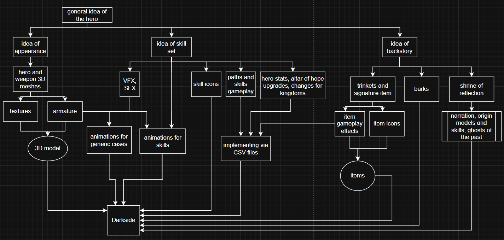\
*Don't take this image seriously I don't know how business processes are done* -->

<!-- Some animations require knowledge of what the skill effects will be like, but many animations are quite abstract. For example, healing animations don't need to know the amount of targets to look good. -->

<!-- Some of the work can be copied from the game (like VFX and SFX), and some things are reused even by vanilla heroes (many have about 8 unique skill animations, some skills share animations). -->

## Animating

<!-- The Darkside provides 3D models, but I wasn't able to import them into a Blender file correctly. Imported models were severely scaled down. Resetting armature's transforms in Pose Mode seemed to bring the model back to normal size.

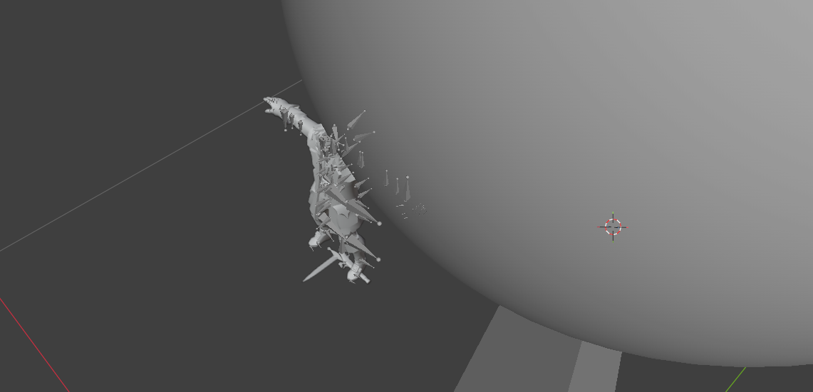\
*Armature gains weird scale in Blender after importing from Darkside*

For animations scale transforms can be deleted in the Graph Editor. -->

<!-- Then resetting armature's transforms in Pose Mode holds models in right scale throughout the animation. -->

<!-- 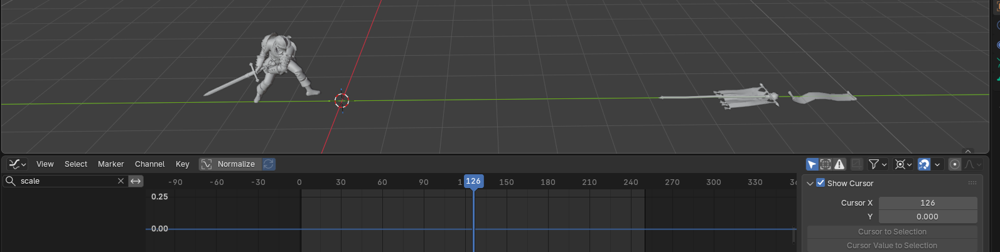\
*Crusader's animation after deleting scale keyframes*

These are destructive changes, but the results can be used as examples at least. -->

<!-- 
Character design 3D modeling required a lot more learning than I expected, and tons of mistakes was made and I was trying to fix them throughout the whole mod creation process.

There are many tutorials. Out of many ways to create a character model, I wanted to try sculpting. I made a mistake by not making the sculpt detailed enough and by not making it in T-pose.

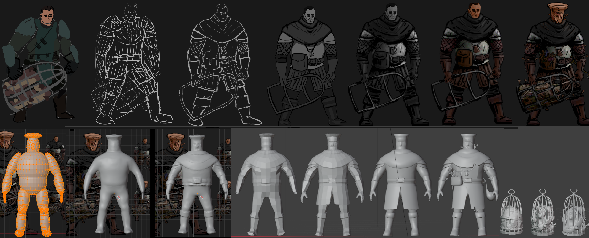\
*Coming up with concept and creating 3D models*

Models can use Smooth Shading with Sharp seams.

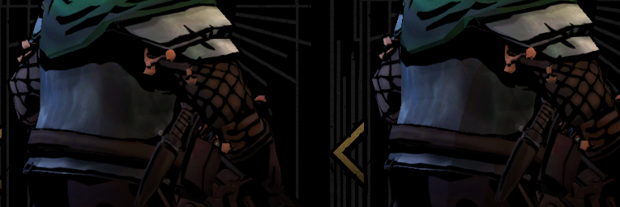\
*Model on the right doesn't use Smooth Shading, which makes edges slightly more visible* -->

In DD2 animations are fixed: there are no ragdolls or simulations. Cloth or hair might have been simulated when animations were created, but the resulting files only use bones for cloth/hair.

Facial expressions are animated with Shape Keys.
<!-- 
There is a bone that is attached to the mouth. I thought that all expressions are made with bones, but when I tried to replicate the GR's meltdown expression using this bone, textures looked different on the meltdown pose vs. what I could achieve with the armature.

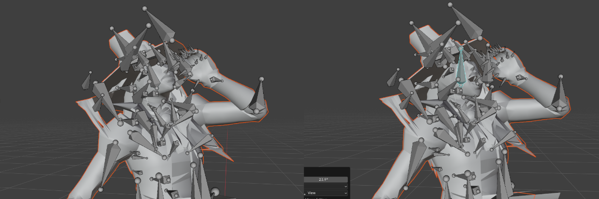\
*GR's armature has a bone that moves the jaw*

Turns out that this is done with Shape Keys. Dismas’ Shape Keys control his eyebrows. Audrey’s Shape Keys control her mouth.

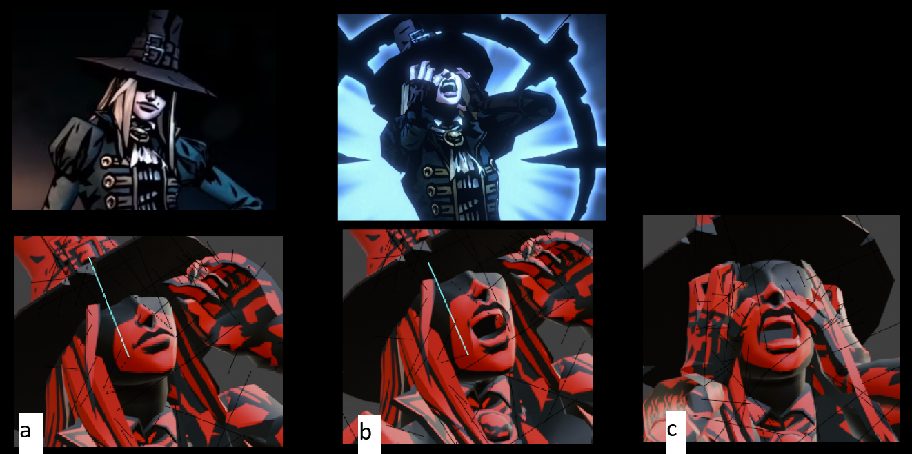\
*a: one of the skill poses, b: the effect of using a bone to change the expression, c: the meltdown pose that uses Shape Keys* -->

<!-- I tried to use Shape Keys too, but they brought a lot of confusion and frustration, so I used bones for everything. -->

Heroes can have multiple weapon meshes. Some accessories work as weapons so they can be changed depending on a Weapon Kit.

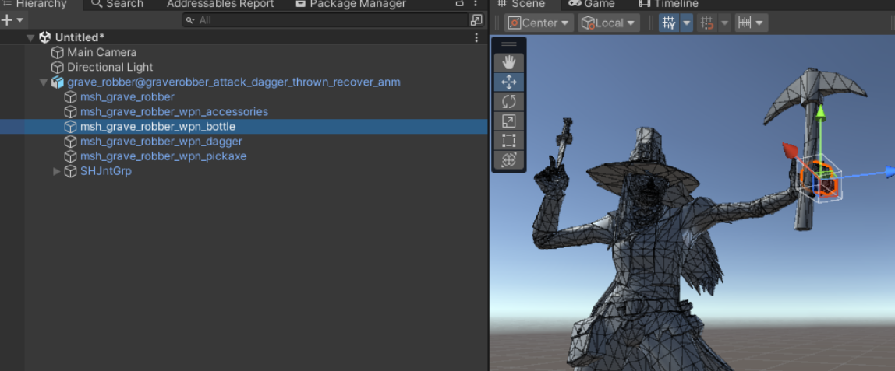\
*Grave Robber has four additional meshes: accessories, a bottle, a dagger, and a pickaxe*

FBX file does not include everything that Blender can create, and Unity does not support everything an FBX file can store. When importing in Unity, some of information of uncommon type might be lost. So complex modifiers need to be baked before exporting.

<!-- There are ways of simulating cloth in Blender, but every tool was falling apart in my hands. I scrapped it and animated cloth manually. -->

The game stores models in prefab files, and when a Weapon Kit/Skin is changed, I believe the game switches the whole prefab file of the hero. But I couldn't find a way to make WK/Skins use different armatures. It might be possible, but at least I can say that there should be no problem with WK/Skins as long as they use the same armature.

<!-- > Jumping ahead: Technically different weapon kits can even have different animations. But not all animations can be altered easily. DD2 uses two separate systems to trigger animations (Animation Controller and Playable files). Most of animations are triggered by the first system, and overriding them is straightforward, just specifying a different animation file is enough.

> Other animations that are triggered by Playable files are harder to replace. These animations are: skill execution pose, skill recovery animation, agressive act out execution/recovery, and riposte execution/recovery. Skill anticipation animations are handled by the first system though.

> A bruteforce solution would be duplicating all bones within one armature and make one set of bones influence one kit/skin, and the other one influence the other kit/skin. But it does not seem right to do so. -->

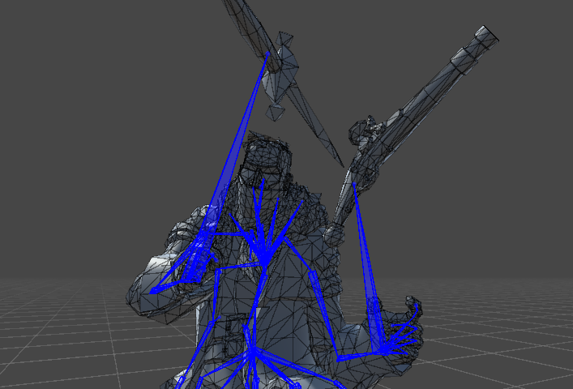\
*HWM's weapon bones are part of the main armature*

<!-- One Blender file can store multiple animations as Actions. Actions can be added and edited in the Action Editor. Every Action need to be protected with Fake User check mark, otherwise it might get deleted on exiting Blender. -->

With the default Blender export settings (and default Darkside import settings) the hero faces the right side in the game (Blender’s negative Y direction in the game will be directed to the right side in the game). Pressing Ctrl+Numpad 3 in Blender will show how the hero will look like on the first rank. On the fourth rank heroes get a bit distorted.

This is true for the Crossroads, fights, resolute, meltdown. The victory pose and inn animations are rotated or mirrored. On the victory screen Blender's negative Y direction will be faced to the camera.

In camps and inns models are rotated, the front of the chair matches Blender’s negative Y direction. If the hero is on the first or the second rank, this hero will be mirrored. If the hero is on the right side of the relationship reveal screen, this hero will also be mirrored.

In battles hero's model can appear a bit distorted if they are on the fourth rank.

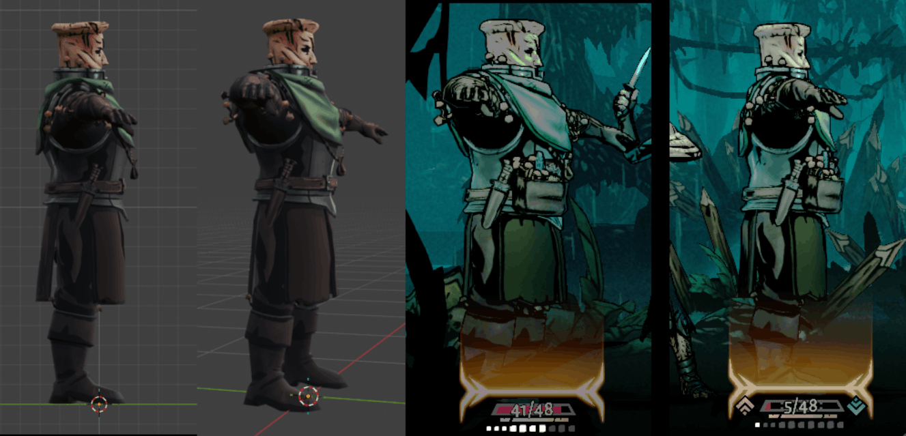\
*First image: Ctrl+Numpad 3 in Blender, second image: in the game on the fourth rank, third image: in the game on the first rank*

List of animations:
- Up to 11 skill start animations (antic, anticipation), 2-3 seconds long.
- Looped idle skill animations (1-2s).
- Recovery after skill.
- Crossroads animation.
- Character sheet animation.
- Embark animation (after leaving an inn).
- Idle battle animation (can be more than 10s).
- Entering Death’s Door animation.
- Idle Death’s Door animation.
- Inn item focus animation (about 1s).
- Move rank animation and recover animation (both less than 1s). Move forward and move backward can share the same animations (HWM uses the same animations for moving back or forth).
- Bark animations: bark negative, bark non-negative, listening to barks. I don’t remember them in the game. Maybe I just didn’t pay enough attention.
- Recovering from being hit.
- Recovering from dodge (a few heroes have this animation).
- Recovering from being buffed.

List of poses:
- Up to 11 skill poses.
- Victory pose after fights.
- Idle inn pose.
- Meltdown and resolute poses.
- Negative and positive relationship poses. If a hero is placed on the right side during the relationship reveal, the game flips the model.
- Being hit pose.
- Being backstabbed pose.
- Dodge pose.
- Act out pose (positive and negative).
- Being buffed pose, being guarded pose, guarding pose. The guarding pose can be the same as the being hit pose.

Animation files that the game uses store frames at the rate of 30 FPS. Poses need to have some duration. Skill poses hold for 60 frames, meltdown/resolute poses are longer.

Relationship poses should be offset to the left a bit.

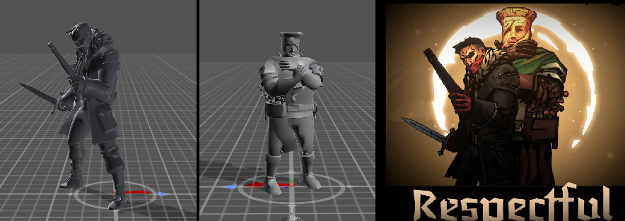\
*Relationship poses don't automatically shift positions. Ignore the arrow on the second image*


## Texturing

Hero and weapon models need two textures. One is for colors (col) and another one is for black details (ink). col textures have smaller pixel size compared to respective ink textures. For heroes, ink textures have 4096×4096 pixel size, while their col textures have 2048x2048 pixel size. Weapons have varied texture sizes: GR’s pickaxe ink texture is 1024×1024 pixels, and her dagger ink texture is 512×512 pixels.

The ink textures are black & red. The red color is pure red (`rgb(255, 0, 0)`). Black & white will also do.

I wasn't able to add palettes to my hero but I believe a palette is just a separate col texture.

<!-- 
I marked seams for UV unwrapping, didn't do the checkerboard testing even though I should have. The purpose of this testing is to ensure that every part of the model gets the appropriate texture resolution. -->

In Blender materials need to be configured to handle two textures. The col texture is combined with the ink texture by multiplying with the ink's red channel values.

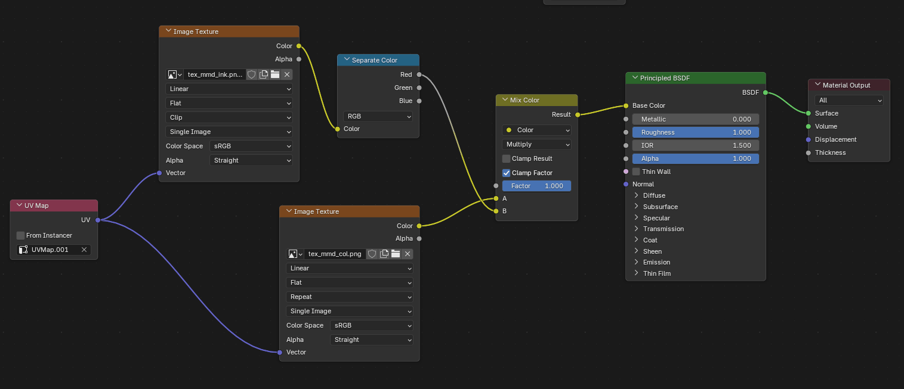\
*Shader settings in Blender*

Blender's materials are only needed for Blender, the game uses its own materials.

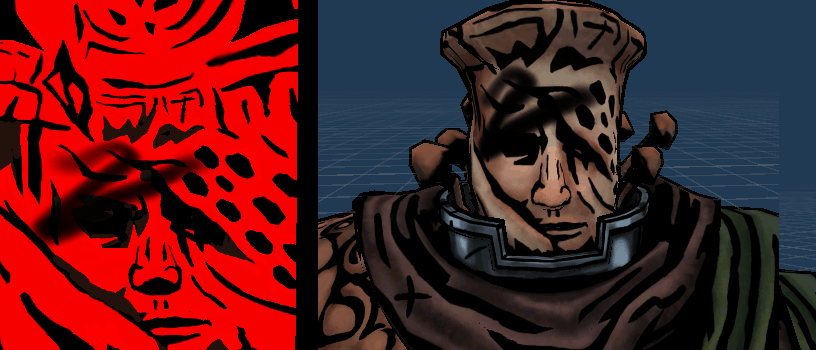\
*Ink textures can use tones*

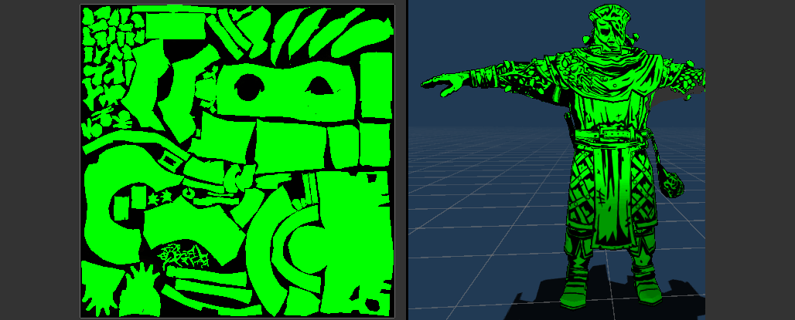\
*The game's material applies additional effects. For example it adds shadows to the model's lower part*

<!-- This material did its work, but I noticed that changing the threshold in the Math node changed the size of black strokes a bit. They get bigger when increasing the threshold value from 0 to 0.2 and I can not figure out why it is happening. It looks like the game uses something in-between.

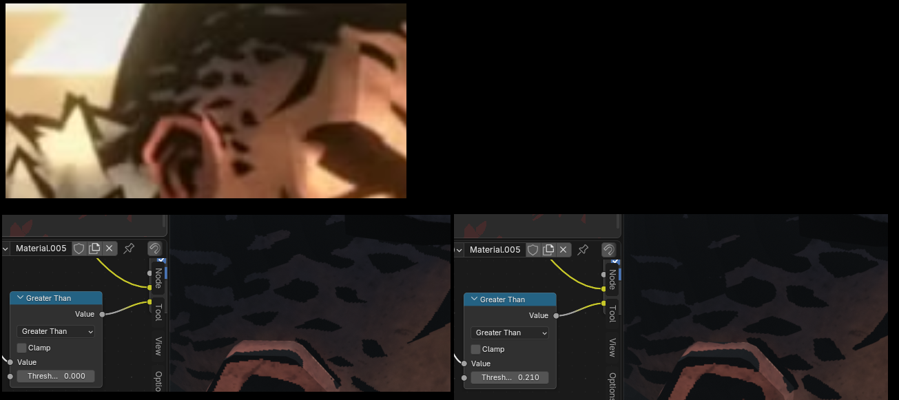\
*The top image is screenshot from the game, lower images show how my material behaves on different settings*

Drawing textures in Blender can be done in Texture Paint Mode. It has some brushes, allows to mask parts of the model. Separated UV islands can be selected by hovering over an island in the UV editor and pressing L. Clicking on an Image node in the Node Editor allows to switch between col and ink images to paint on. When a Blender session is done, all changed textures must be saved manually, otherwise texture changes might be lost.

Shadows can be turned off by using the Diffuse Color rendering mode.

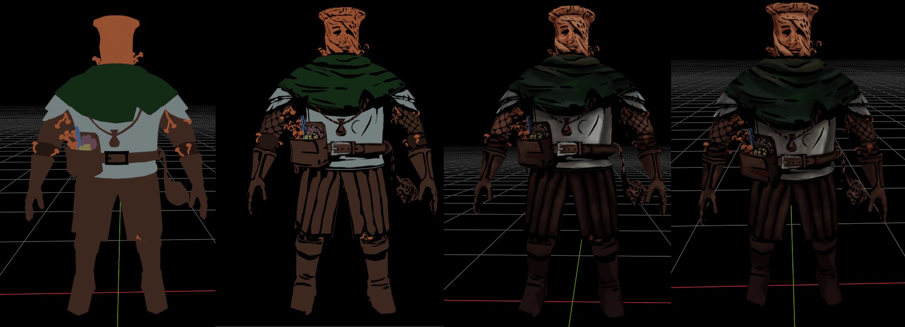\
*Texturing* -->

<!-- DD2 mixes smooth gradients, harsh black lines and some textures. Fine textures are subtle, but noticeable, for example, on the MAA’s shield. Heroes have some parts shadowed by black strokes (arm under shoulder plates) and some parts are shadowed softly (under the red strip).

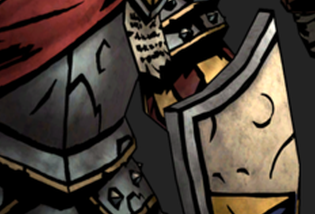\
*Different shadows* -->

The same is applicable for weapon textures.

## Installing the Mod Kit

The [official guide](https://docs.google.com/document/d/1ga3FNrL3eGDRMFekLx9-RKhTDLMxPO603XzXcZa8O78/edit?usp=drive_link) covers item creation, skins and palettes for vanilla heroes, publishing a mod, some basics and possible issues, local mod testing. I will repeat some things from this guide in this and following sections but in my own understanding.

The Mod Kit can be downloaded from Steam in the Library's Tools category. Alternatively, the Kit can be accessed on [Google Drive](https://drive.google.com/drive/u/0/folders/1SlMxq3O2nuOp3P__G-0QIU748RGFIFnu).

The Kit won’t start without Unity installed. The official guide requires to use the 2022.3.16f version. I went to the Unity Archive page and downloaded the 2022.3.16f1 version which I believe is the same.

During installation Unity got stuck at “Installing playback engines”, and there was a recommendation on a Unity forum to shut down the Windows Module Installer process in the Task Manager.

Then it also requires to install Unity Hub. After downloading it, the app suggested to download the newest Unity version. Instead I point to the already existing instance by specifying the .exe file of 2022.3.16f1 version somewhere in the Unity folder in Program Files.

Then I tried to launch the Mod Tools and got another error that said the project had invalid dependencies. After an hour the problem resolved itself, and I have no idea how it happened.

After that I was able to open the Mod Tools. It greeted me with a bunch of windows. They can be closed. They can be opened again through the Window tab at the top. The Unity console showed a bunch of errors, but I could not be bothered with them.

Sometimes when I accidentally modified files outside my mod folder, the mod builder started glitching and produced less files than usual. It can be fixed with the Verify Integrity function in Steam.

## Creating a placeholder hero

To create a new character (a duplicate of the HWM), click Window -> EmptyCharacterCreatorWindow. It will ask for an ID for the mod. It should be unique enough to make sure the game or other mods won't have conflicts, and at the same time not too long.

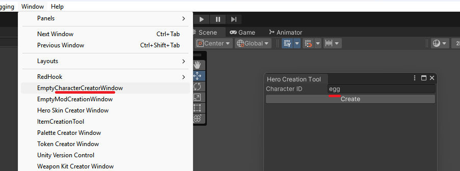\
*Character creation tool*

After that a new folder is created, its name matches the ID. There are two folders and a building tool inside. The first folder stores some source files, the second folder (the one with the _export suffix) stores compiled files and gameplay and language data. The second folder with its contents is all data that will be published to the Steam Workshop or other platform.

I’ll call the first folder “`F`” and the second folder “`exports`”.

The Steamworks tool has multiple functions:
1. It compiles all the mod data from the first folder (and some from the project files) into the second one.
2. It can also publish the mod to Steam Workshop.

The `exports` folder created by the Hero Creation Tool contains gameplay data (CSV files) and language data (the Localization folder). Created CSV file contains template data which is enough to make the mod work. Language data is empty, but the mod will still work.

CSV files are used to assign HP, tokens, DOTs to heroes, skills, etc. Language data stores names, descriptions, barks, etc.

The `F` folder has a bunch of other folders:
- The `animation` folder contains animation files and an Animation Controller.
- The `boss_body_spectre` folder is designated for Act 5 boss-related data. When the boss summons a ghost from the past it uses data from this folder.
- The `materials` folder stores textures and materails for models.
- Not all animations are controlled via an Animation Controller. Skill animations consist of four parts: antic animation (played when a skill is selected), idle animation (played when a skill is selected but not executed), skill execution pose, and recovery animation. The first two parts are controlled via Animation Controller. The last two parts should be made into a Playable file in the `playables` folder. This folder also contains files for Act Out, Riposte, and Exultation (Act 5) skills.
- The `icons` folder stores skill icons. It also has a Sprite Atlas but I don’t know how to use it. The same is for the `portraits` folder which stores different portraits that are used in UI.
- The `data` folder stores objects that serve as connectors between different objects. "Resource Zoom In Skill" files connect skill icons, SFX, and playables together under one name. The file that has mod's ID as its name connects the hero's model, skill files, and portraits together.
- `hero_paths` has images of path seals.
- `hero_story` has the big portrait that is used in the Shrine of Reflection.
- `lighting` and `unlocks` folders. I don't know what they are for.
- `nested_classes` has data about hero's corpse.
- `palettes` has some template data for hero's palette but this template data does not work and instead adds unwanted palettes and skins to unrelated heroes. This folder or its contents can be deleted.
- `skins` folder is supposed to store skin data.

I believe distribution of files between folders and folder structure itself within the `F` folder are somewhat arbitrary. When adding, for example, a new 3D file, it doesn't matter in what folder it is added in. For the most part Unity uses its own file identifiers rather than file paths. But filenames should still be unique if the mod does not overwrite existing data.

To make created placeholder hero appear in the game, click on the Steamworks file and click Build Assets in the Inspector. It also allows to set the title, description, and preview image for the mod. Assets should be built every time a change is made in the `F` folder.

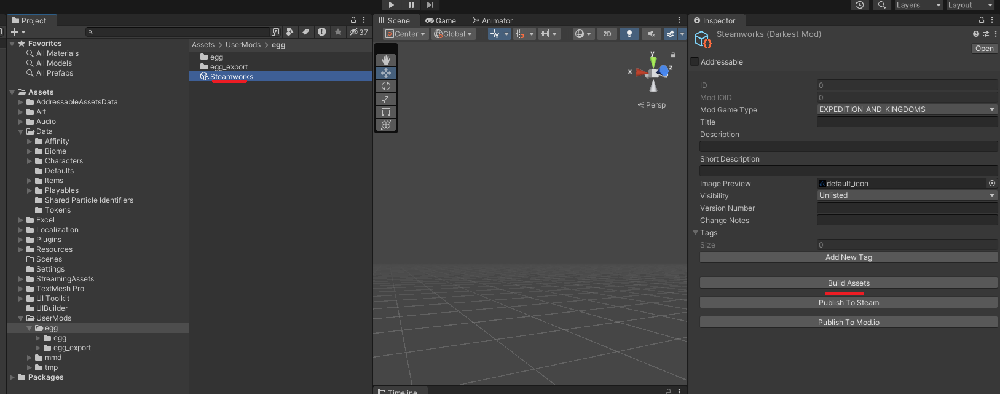\
*Steamworks tool*

When I first tried to build the mod, the console showed me “SBP ErrorException”. For some reason Unity Build Settings were set for “Dedicated Server”. Selecting “Windows, Mac, Linux” in File->Build Settings fixed this error.

After the build is finished, copy the `exports` folder and paste it in the mods folder that is located here:
```
C:\Program Files (x86)\Steam\steamapps\common\Darkest Dungeon® II\Darkest Dungeon II_Data\StreamingAssets\mods
```
If there is no mods folder, create it. It will then be like this:
```
C:\Program Files (x86)\Steam\steamapps\common\Darkest Dungeon® II\Darkest Dungeon II_Data\StreamingAssets\mods\egg_export
```
After that enable the mod in the game and a new hero will be available at the Crossroads.

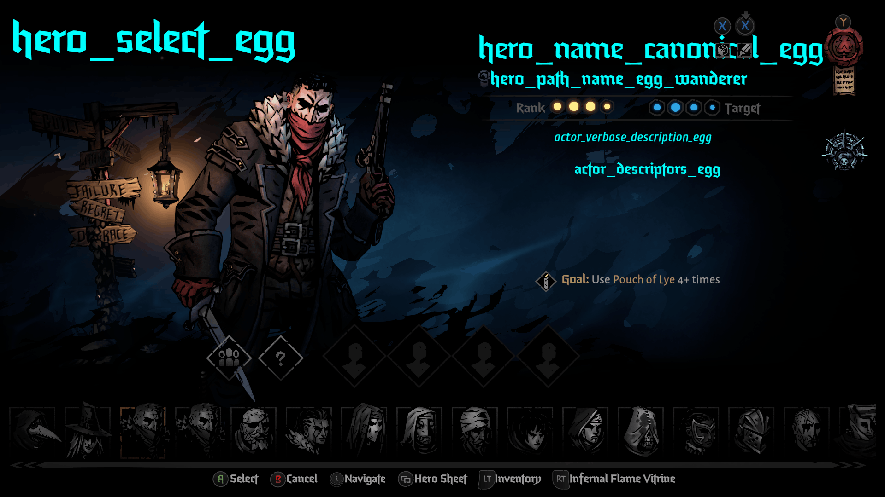\
*Second Highwayman. All text is blue because language data is empty*

This placeholder hero works and doesn't break anything. Almost anything. There is one issue that about this placeholder hero: when the mod is active, passing a turn triggers a zoom as if it was a regular skill. I will write about this later.

## Importing models to Darkside

This is the part I'm least comfortable with. I encountered a lot of issues, and not all of them I could fix.

### Adding meshes

First, I exported my model from Blender to an FBX file. This file requires meshes (hero and weapons) and an armature.

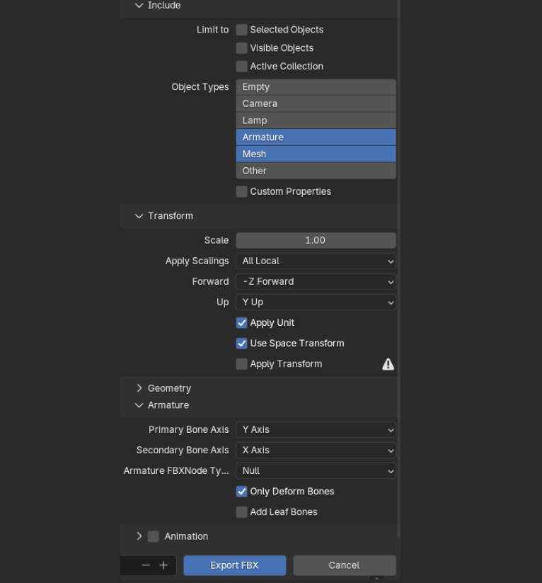\
*Blender's export options for meshes and an armature*

In Unity files can have links to each other. If files are moved in the Unity File Explorer, links remain valid. If a file is deleted and then another file is created with the same name, links are lost.

A file can be secretly replaced through Windows File Explorer (replacing it without prior deletion) and Unity will not track this change and the links will not be lost.

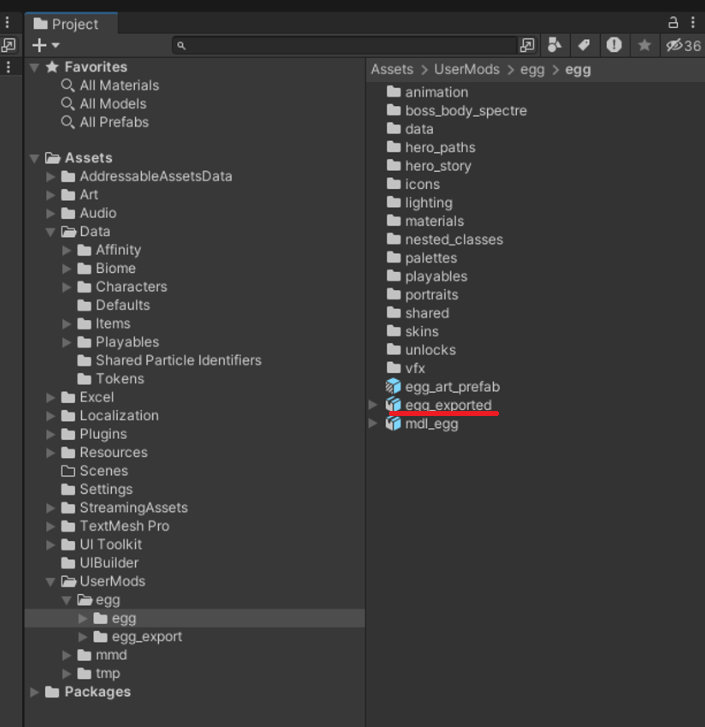\
*FBX file with meshes and an armature*

A file can be added to a Unity project by dragging it from Windows Explorer window to Unity Explorer. I added my FBX file, then double-clicked on the egg_art_prefab file. This prefab file connects models, VFX and other things in one place.

Then dragged the added FBX file to the Hierarchy window on the left. This showed my mesh intersecting with another model in the Scene Viewer.

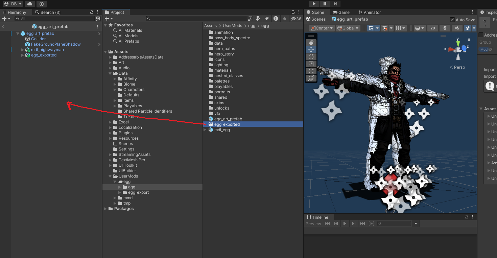\
*egg_exported is the exported from Blender FBX file*

Clicking on the egg_exported element in the Hierarchy window showed its properties in the Inspector window on the right. There I added three components: Animator, Animator State Sender, and Timeline Property Map Bhv. The Animator component required some more configuration. These components are copies from examples, I don't really know what they do.

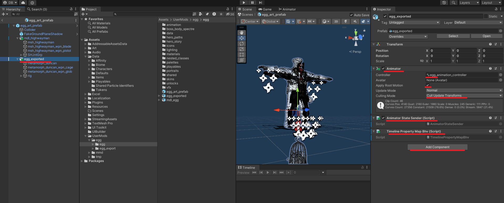\
*Adding animation components*

### Adding textures

To add textures to this model, I went to the `F/materials` folder, deleted everything inside except the mat_egg file, then added my texture images. Clicking on a texture file in the project opens import settings in the Inspector window. col and ink textures have different import settings.

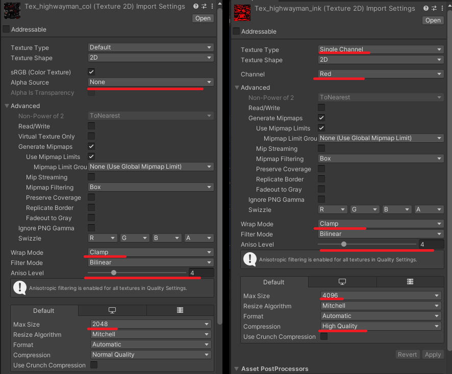\
*Import settings for col and ink textures*

Then I clicked on the mat_egg file. Textures can be dragged into the Base and Ink slots.

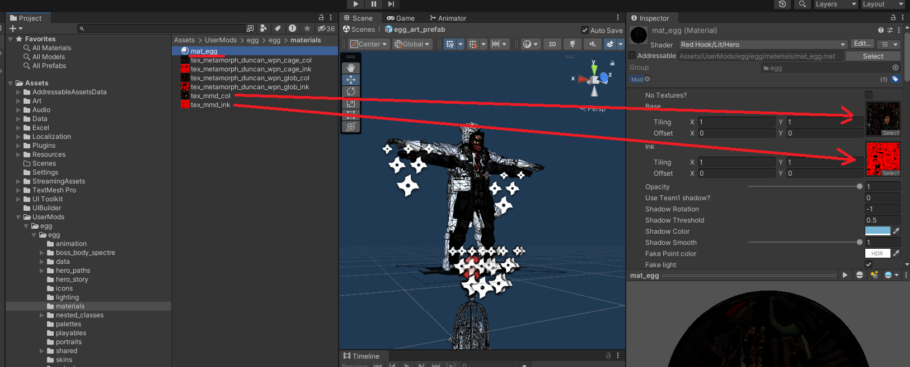\
*Assigning textures*

Then I duplicated the mat_egg file (Ctrl+C, Ctrl+V) for each model that required separate textures and then renamed the files. Textures in this material need to be switched to weapon's textures the same way.

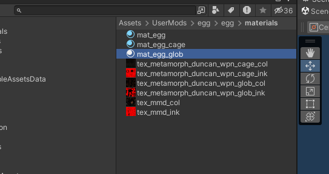\
*Multiple materials*

Materials can be applied to a model by dragging them from Unity Explorer onto the model in the Scene View.

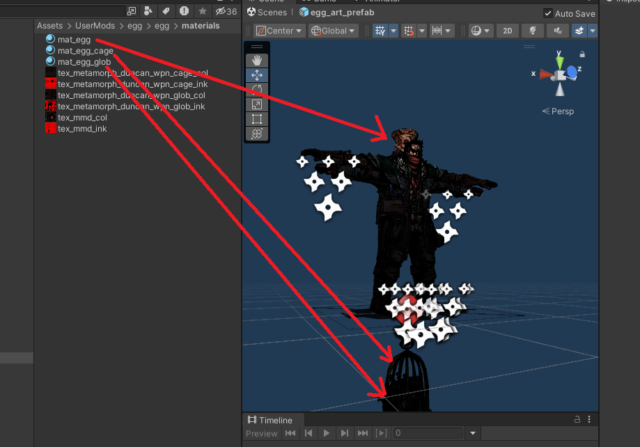\
*Applying materials*

Then I added the black outline by going in the mesh's properties and clicking the plus button in the Materials section and then choosing the `mat_default_character_outline` file for it.

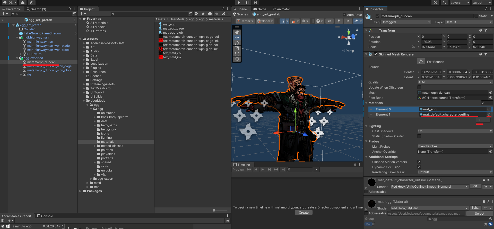\
*Adding the outline shader*

It should have added an outline to the model. But for me it didn't.

### Fixing the outline

If the outline works correctly, this fix is not needed.

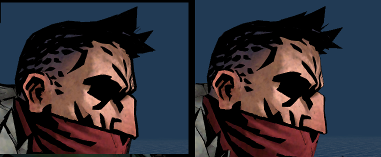\
*Left: with outline. right: without outline*

My model did not have any outline. The issue was related to tangents. For some reason Unity couldn't calculate them.

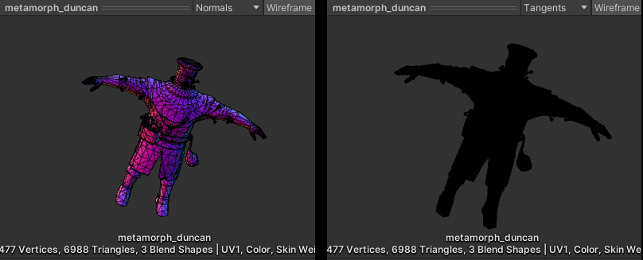\
*Tangents data is missing*

<!-- 
<details>

<summary>Click to see how I tried to locate the source of the problem</summary>

I knew the problem was with my model, because when I imported a cube, the shader worked.

For some reason my meshes didn’t have tangents data. I don’t know what that is but that was missing. The normals looked fine but the tangents display was black.

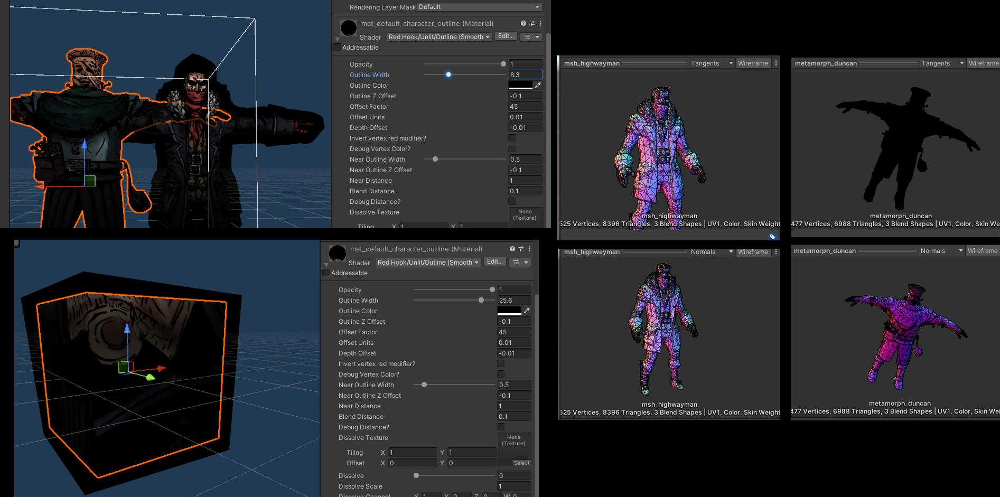\
*Top left: HWM has an outline and my model doesn't even though they have the same material settings. Right side: HWM's model has Normals and Tangents data, but my model only has Normals*

I made some more tests and found that with UV Spheres, the more segments there are the worse is the tangent situation. The tangent situation exactly matched the outline situation. So I knew that the outline was connected to the tangents.

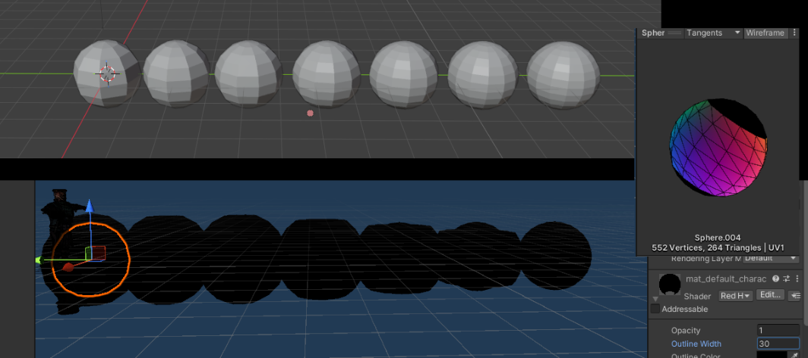\
*The more segments a UV sphere had, the worse was the outline*

So my mesh was the problem. It looks like polygon size matters. There is logic behind this but without foundational knowledge, this behavior causes confusion. I reduced my model to a single cuboid, added a couple of other cubes, deformed one, and imported all three into Unity. To my surprise, tangents for my reduced model still weren't calculated.

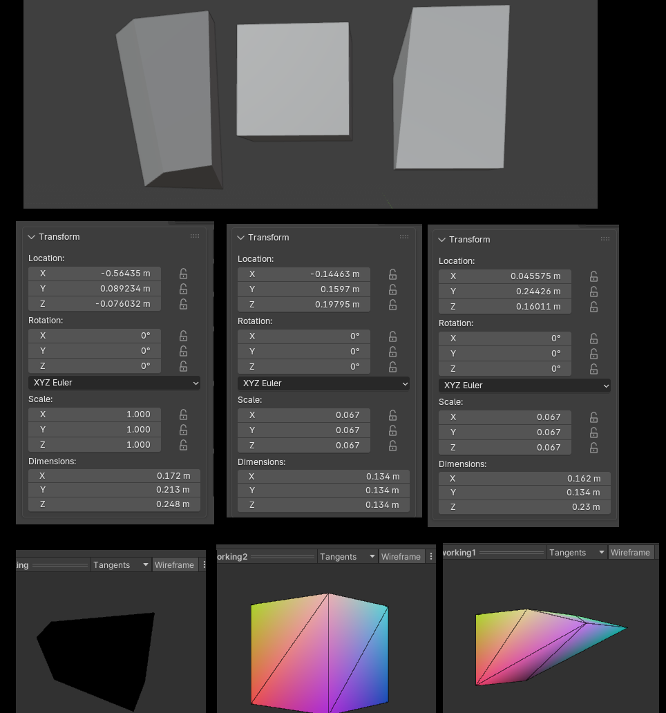\
*The only thing that differs between these is Scale*

So now I new that the issue was with the scale of my mesh.

</details>
-->

What did not work:
- Scaling the model up 10 times in Object Mode in Blender and exporting it.
- Increasing the scale parameter in Blender's export settings.

Two solutions that I found:
- Scaling the model up 10 times in Object Mode, applying Transforms, and exporting it.
- Or, unchecking the Convert Units field in import settings in the Unity Inspector.

I did the second one (unchecking the Convert Units field).

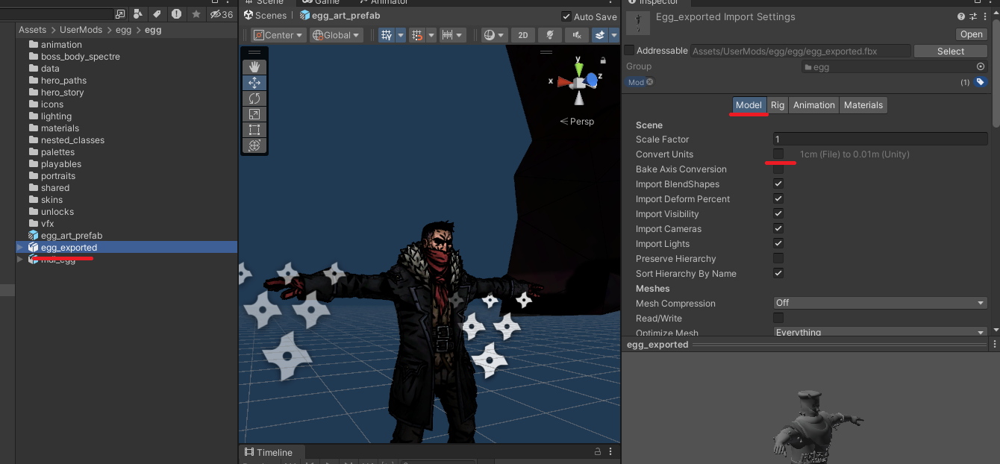\
*Disabling units conversion*

This made the model too big. To fix this, I clicked on egg_exported in the Hierarchy Viewer and set the Scale fields to 0.01 in the Inspector. Unchecking Convert Units needs to be done for all animation files too.

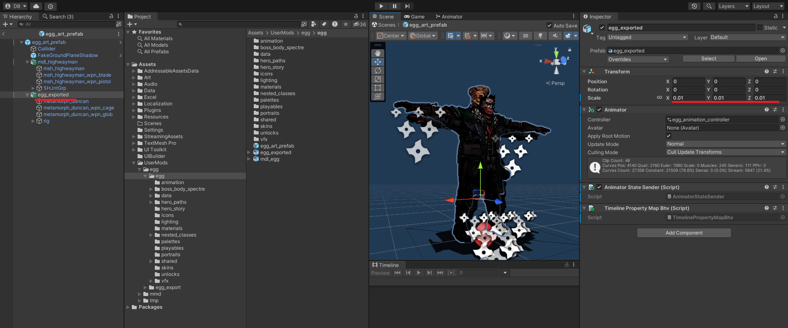\
*Scaling back to normal*

<!-- Just a note. My model in Blender has adequate dimensions. The scale is close to 1, and his height is 1.96 m. -->

I believe all my importing problems come from the armature. I probably created it in some wrong way.

### Adding effect anchors

Some visual effects like stress crowns, damage/heal numbers, and buff/debuff texts are connected to anchors in the model. I didn't delete the HWM's model from the prefab for easy access to these anchors. I found six anchors: hit_head, hit_projectile, hit_body, hit_root, stamp_loc, and pop_text_loc.

I moved hit_head to the bone that controls my hero's head, moved hit_projectile with hit_body to a bone near the center of my hero. The other three anchors I moved to the root bone.

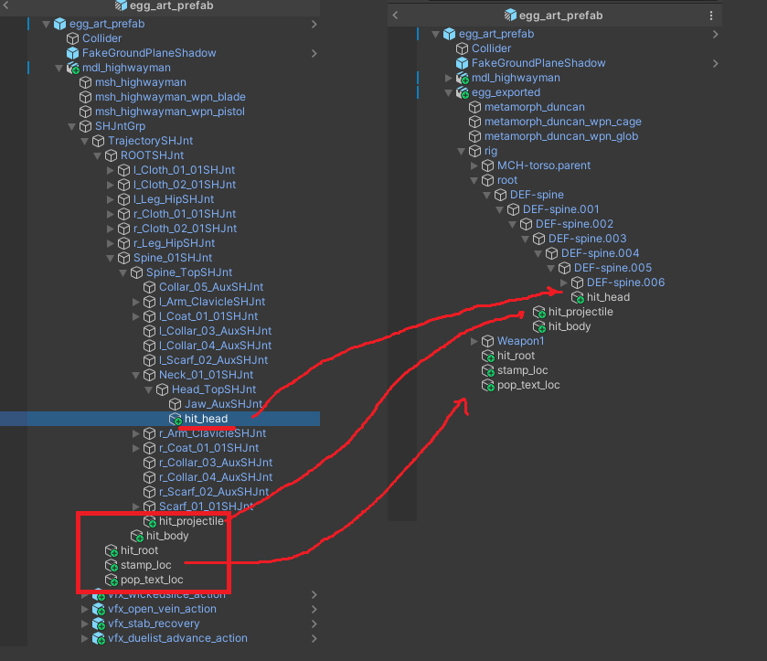\
*On this image my model is on the right side but it's because I photoshopped it because the list is too long*

After that, the mdl_highwayman element in the Hierarchy window needs to be deleted. Then the mdl_egg file (the old one with the HWM model) in the Unity File Explorer needs to be deleted too.

Then I built the mod using the Steamworks file and copied the `exports` folder into the game's mod folder.

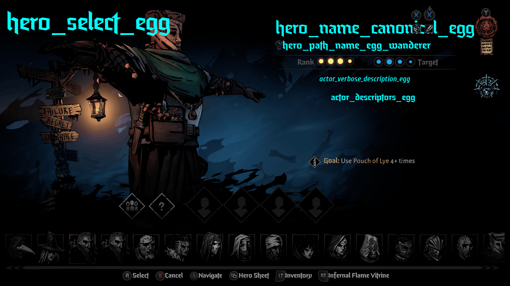\
*Textured model in the game*

Unfortunately there was another issue.

### Fixing the inn light

In inns, heroes get highlighted when an item is hovering over them. For my model, the light was too strong and it came from the wrong direction.

If the lighting works correctly, don't read this section.

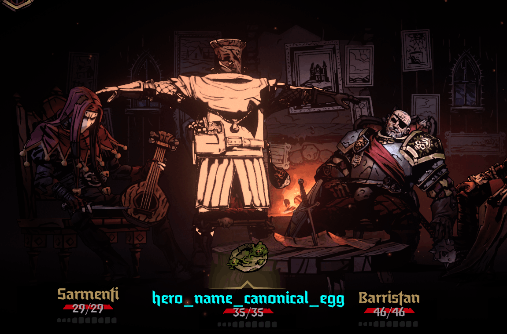\
*...*

I tried many things, and in the end came to a weird solution. First, I clicked on the egg_exported file in the Unity File Explorer and checked Bake Axis Conversion on in the Inspector Window.

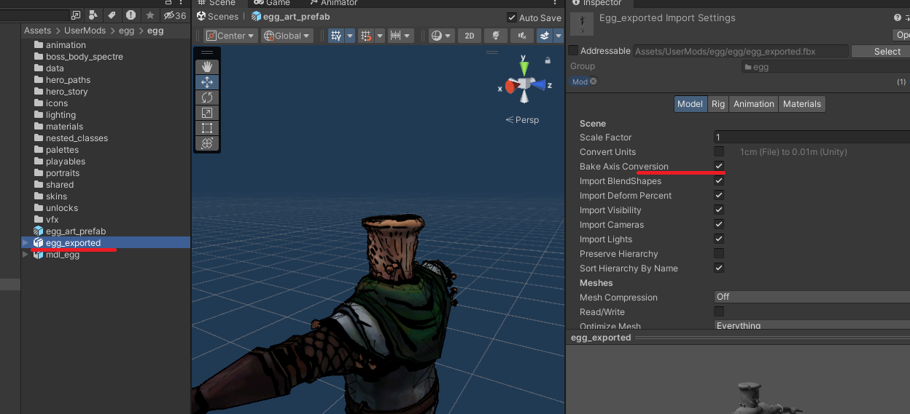\
*First step of a weird solution*

Then I clicked on the egg_exported element in the Hierarchy window and changed the settings in the Inspector window. I set X Scale to negative, Y Scale to negative, and X Rotation to 180.

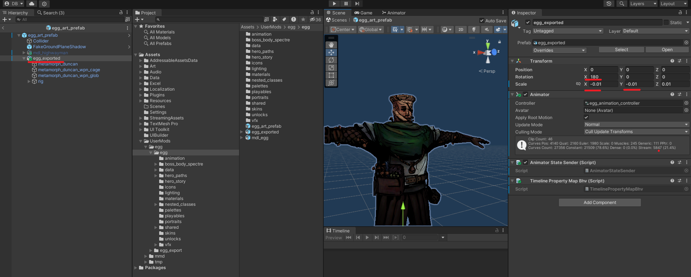\
*Second step of a weird solution*

After this, the inn lighting became more sensible.

Since the model was rotated, the anchors in the armature became displaced. Inverting the Z Position value for stamp_loc and pop_text_loc fixed them.

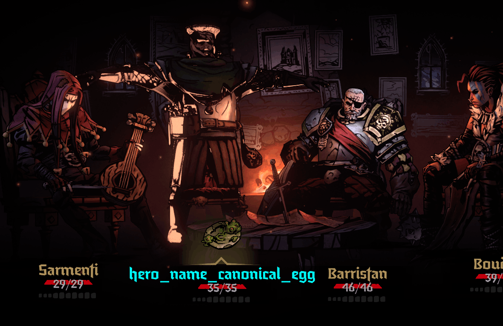\
*Fixed inn light*

This is a very weird solution, and I most certainly did something wrong during model export or even armature creation.

Moreover, this is not a perfect fix. Hovering over the icon in the turn order highlights my hero stronger it does for other heroes.

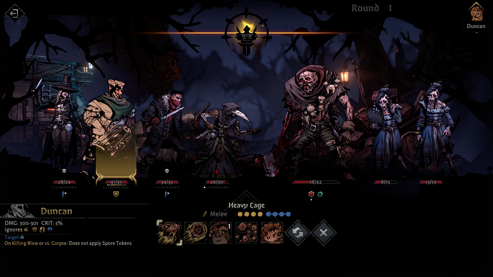\
*Strong highlight in battles*

I don't know how to fix this.

## Importing animations to Darkside

`F/animations` folder stores animation files. File names in this folder do not have strict rules. One FBX file can store multiple animation clips.

<!-- I believe there is only one way in Unity to rename an Animation Clip, and it doesn't work if an FBX file contains multiple clips. If a file has multiple clips, their names should be set before creating FBX files. -->

<!-- If an FBX file contains only one clip, this file can be named ID@ID_name, and Unity will rename the clip to ID_name. At least it will make an illusion of renaming. -->

When Blender exports animations to an FBX file, each Action becomes an Animation Clip.

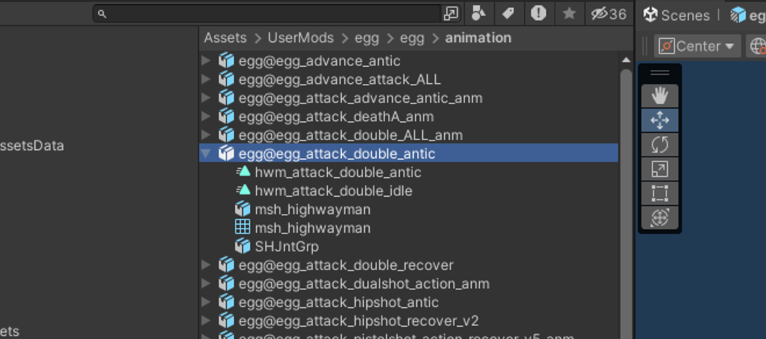\
*FBX file with two animation clips: antic and idle. Animation clips have a triangle as the icon*

In Darkside animation files have various amount of clips. I think there should be no difference for Unity whether there is one FBX file that has all animations in it or if there are fifty FBX files each containing one animation.

At first, I wanted to export one file with all animations, but something in Blender went not my way and my exported animations were broken. This wasn't a Unity problem because when I opened FBX files in Blender, they were broken too. For unknown to me reasons issues disappeared when I exported each Action into a separate FBX file.

Exporting a single animation can be done by unchecking the NLA Strips and All Actions fields in export settings.

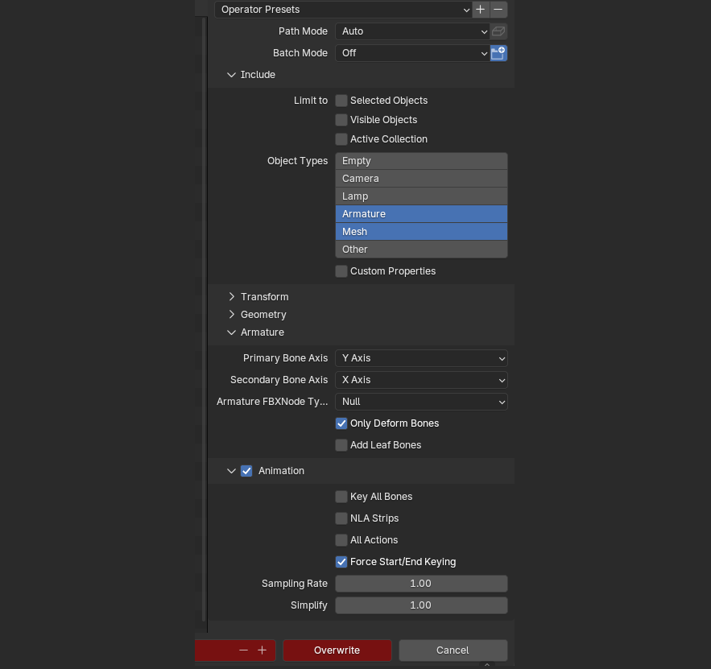\
*Animation export settings*

It can be automated by using this script. It creates a folder and exports Actions into separate FBX files.

```python
HERO_ID = "egg"

import bpy
import os
from datetime import datetime

timestamp = datetime.now().strftime("%Y%m%d_%H%M%S")
export_dir = os.path.join(os.path.dirname(bpy.data.filepath), f"{HERO_ID}_{timestamp}")
os.makedirs(export_dir)

arm = next(obj for obj in bpy.data.objects if (obj.type == 'ARMATURE'))

for action in bpy.data.actions:
    arm.animation_data.action = action
    start, end = map(int, action.frame_range)
    bpy.context.scene.frame_start = start
    bpy.context.scene.frame_end = end

    export_path = os.path.join(export_dir, f"{HERO_ID}@{action.name}.fbx")
    bpy.ops.export_scene.fbx(
        filepath=export_path,
        add_leaf_bones=False,
        use_armature_deform_only=True,
        object_types={'MESH', 'ARMATURE'},
        bake_anim=True,
        bake_anim_use_all_actions=False,
        bake_anim_use_nla_strips=False,
        use_selection=False,
        use_visible=False,
    )
```

I deleted everything in the `F/animations` folder except the file named egg_animation_controller and added my animations instead.

If the Convert Units field was unchecked during the outline fix, this option should be unchecked for all animation files too.

If the Bake Axis Conversion field was checked on during the lighting fix, this option should be checked for all animation files too.

Unity can change settings for multiple files at once. When one file is selected, clicking on another file while holding Shift selects both files and everything between them. After that, changing settings in the Inspector window will change settings for every file.

Loop Time option should be checked on for animations that need to be looped. If a file has multiple clips, they can be configured separately by selecting them in the Clips section.

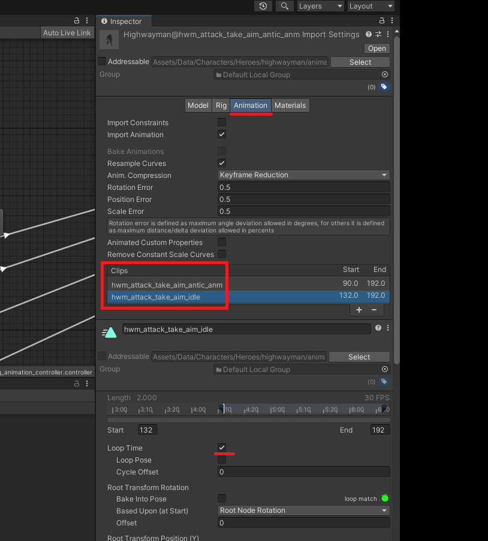\
*Making animations looped*

The Animation Controller file in the `F/animations` folder brings many (but not all) animations together. Double clicking on the Animation Controller file opens its graph. Each node has one animation clip assigned to it.

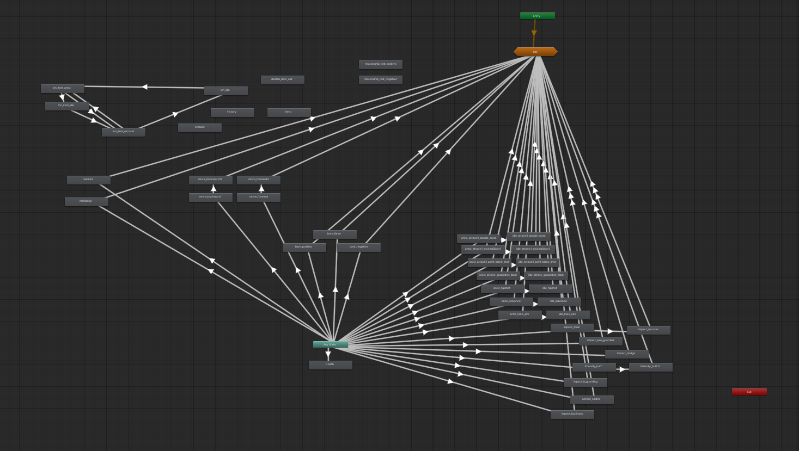\
*Animation Controller*

Since original animation files were deleted, clicking on a node will showed "None" in the Motion field in the Inspector window. The "Motion" field expects an animation clip as input. If some animations are missing, the hero will just play an idle animation if it exists, otherwise the hero will be in a default pose.

There are many nodes:
- inn_item_antic: an animation that plays in inns when an item is hovered over a hero
- inn_item_idle: an animation or a pose that plays when an item is hovered over a hero for a longer time.
- inn_item_recover: an animation that plays after an inn item stops hovering over a hero
- inn_idle: a default pose in inns
- embark: an animation of a hero exiting an inn and viewing the landscape while all relationships are revealed
- victory: a pose displayed while collecting loot after a fight
- hero: an animation that plays at the Crossroads and in the character sheet
- relationship_test_positive: a pose used when hero's relationship is revealed as positive
- relationship_test_negative: a pose used when hero's relationship is revealed as negative
- resolute: a pose when a hero overcomes the devastating horrors of campaigns
- meltdown: a pose when a hero does not overcome the devastating horrors of campaigns
- move_forward: an animation played when a hero uses their turn to move forward
- move_backward: an animation played when a hero uses their turn to move backward
- move_forward 0: a recovery animation after moving forward
- move_backward 0: a recovery animation after moving backward
- impact_backstab: a pose when an ally backstabs a hero as an act out
- actout_caster: a pose when a hero buffs an ally as an act out
- impact_is_guarding: a pose when a hero shields an ally
- friendly_buff: a pose when a hero is buffed by another hero
- friendly_buff 0: a recovery animation after being buffed by another hero
- impact_dodge: a pose when a hero dodges enemy's attack
- impact_was_guarded: a pose when an ally guards a hero
- impact_small: a pose when a hero is hit by an enemy
- impact_recover: a recovery animation after a hero is hit
- I can't remember any bark animations, so I do not know when bark_positive, bark_negative, and bark_listen are used
- deaths_door_exit: supposed to be used when a hero is healed from 0 HP
- Death node isn't used I think
- there are 14 nodes related to skills, I will write about skill animations separately because they require additional steps

The Idle node is expandable and reveals some more nodes:
- idle_neutral is an idle battle animation
- deaths_door_antic is an animation when a hero enters Death's Door state
- deaths_door_idle is an idle Death's Door animation

Node names can be changed, but I think it's better not to rename nodes that aren't connected to other nodes. Nodes like embark, victory, and hero aren't connected to anything else, and I guess the game uses their names to identify them.

After assigning animation clips to nodes, rebuilding the mod with Steamworks tool, and copying the `exports` folder, the game will show animations.

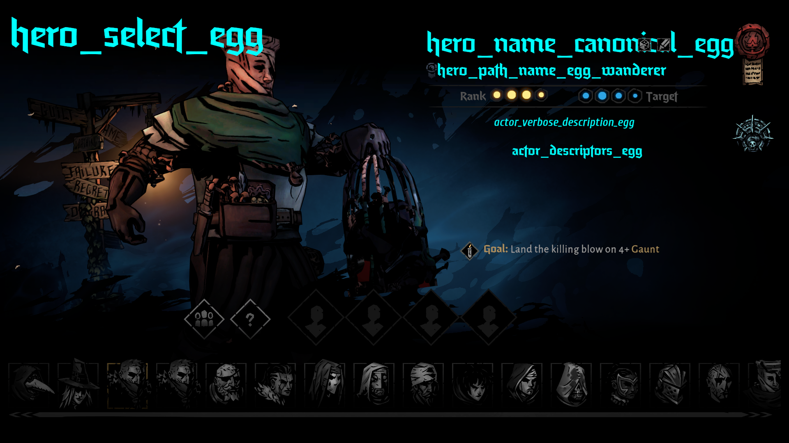\
*Hero animation at the Crossroads*

Adding skill animations requires some more steps.
1. In the `F/playables` folder duplicate the [hero id]_grapeshot_blast file.
2. Rename the new file to something like "[ID]_[skill_name]".
3. Double click on the duplicated file, a Timeline window will open.
4. Delete elements in the top row.
5. If the camera shouldn't shake during skill, delete the Camera Shake Track in the MISC tab at the bottom
6. Find the skill execution pose clip and drag it to the top row in the Timeline window, resize it so it's duration is 60 frames.
7. Find the skill recovery animation clip and drag it next to the first clip.
8. Click on the recovery clip in the Timeline and set the Ease Out Duration parameter in the Inspector window. This parameter can be anything, for example the Flagellant has some animations with Ease Out Duration of 16 frames and some of 24 frames.

    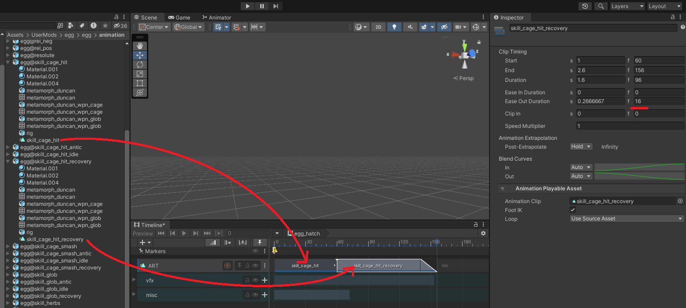\
    *Setting up a Playable file*

9. In the `F/data` folder duplicate the \[ID\]_wicked_slice file. This is a Resource Zoom In Skill file that serves as the connector between animations, icons, and gameplay effects of a skill. There is a such file for every skill, I’ll call this type of files RZIS files.
10. Rename the duplicated file to \[ID\]_\[skill_name\].
11. In the Inspector window set the "Select Skill Id Override" field to [hero id]_[skill name], same as the file name.
12. If skill icons are created, slot them to the "Skill Sprite" field.
13. Set "Timeline Sequence" to the according Playable file.
14. In the `F/data` folder click on the file that has mod ID as its name (Resource Actor file).
15. In the Skills category replace one of the resources with the custom RZIS file.
16. In the `exports` folder edit the `hero_template_data_export.Group.csv` file using an external text editor and add a skill definition. An example of CSV skill entry without upgrades or additional effects (replace text in square brackets).
    ```csv
    element_start,[ID]_[skill_name],ActorDataSkill
    m_IsFriendly,False,
    launch_ranks,1,2,3,4,
    target_ranks,1,2,3,4,
    m_IsMultiHit,False,
    m_CanBeRiposted,True,
    m_AverageRankIgnored,False,
    m_ValidActOutTypes,skill_before,skill_after,skill_additional,
    m_Tags,melee,[ID]_[skill_name],
    m_IsStallInvalidating,True,
    element_end
    element_start,[ID]_[skill_name],ActorDataStats
    key_map,health_damage,health_damage_range,crit_chance,
    add_stats,4,4,0.15,
    element_end
    ```
17. If this is one of the five starting skills, find these lines in the same CSV file and change the skill name that was replaced in the Resource Actor file to [ID]_[skill_name].
    ```csv
    element_start,egg_skill_kit_1,SkillSet
    skills,egg_wicked_slice,egg_tracking_shot,egg_pistol_shot,egg_double_cross,egg_duelists_advance,
    element_end
    ```
18. Open the animation controller in the `F/animations` folder.
19. Open the parameters tab in the top left of the Animator window.
20. Add a Trigger and name it select_skill_\[ID\]_\[skill_name\].

    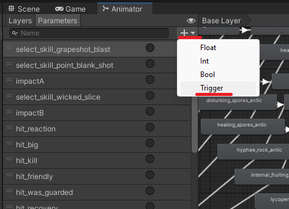\
    *Adding an animation trigger*

21. Rename two skill nodes (antic and idle) to match the skill.
22. Assign animation clips to them.
23. Select the arrow that points into the antic node. Change the condition to the new trigger.

If a skill uses the same antic and idle animations as another skill, then "Select Skill Id Override" field in RZIS file can be set to the ID of the referenced skill. Probably. I didn't test it.

The `F/playables` folder also has Playable files for riposte and aggressive act out (backstabbing or making a follow-up attack). It is better to modify the existing riposte file and not replacing it with another skill because it has some specific data. Both of these files are attachable to the hero's Resource file same as skill Playables, just in a different section.

To add more skill nodes to the animation controller:
1. press RMB and create an empty state for an antic animation. Then click RMB on the Any State node, make transition to the new node.
2. click on the transition and set the condition to select_skill_[hero id]_[skill name].
3. then add another node, for idle animation, and make transition from the antic node to the new node.
4. then make transition from the new node to the orange Idle node. Click on this transition and set condition to use_skill.

HWM and many other heroes don't have dodge recovery animation, and the default animation controller doesn't have it either. To add a dodge recovery node:
1. create a new node, make transition from the existing dodge node to the new node. Select this transition and set condition to hit_recovery.
2. then make transition from the new node to the orange Idle node, select StateMachine.
3. then delete the transition from the dodge node to the orange Idle node.

The position of the hero and the target during animation can be adjusted in the RZIS parameters. Decreasing X value for the Performer Team moves the hero to the left. Decreasing the X value for the Enemy Team moves the enemy to the right. Decreasing both parameters moves the hero and the target apart.

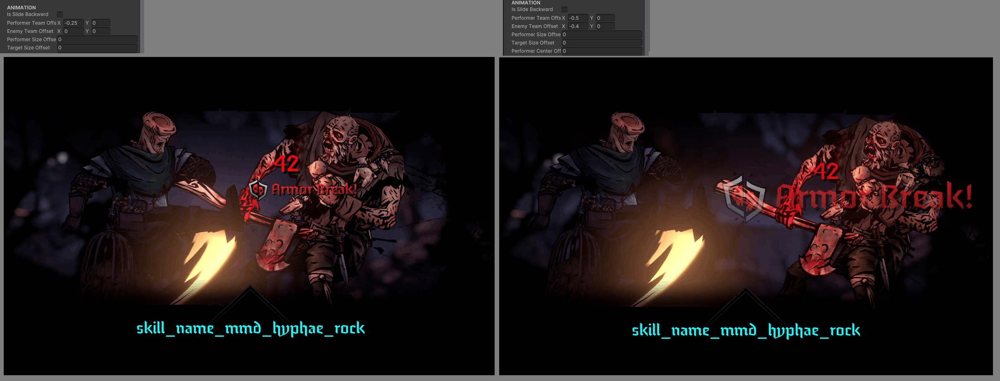\
*Ignore VFX*

When I was trying to test animations with bone constraints, transition from skill recovery animation to idle battle animation caused a glitch. Maybe it was because my animation was too simple. Setting the Simplify to zero in the Blender's export settings and disabling the Animation Compression option in Unity seemed to fix it.

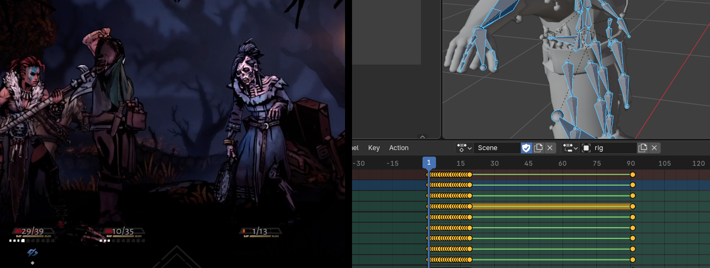\
*Glitched animation and probable cause*

Now after rebuilding the mod and copying the `exports` folder, new animations should appear in the game.

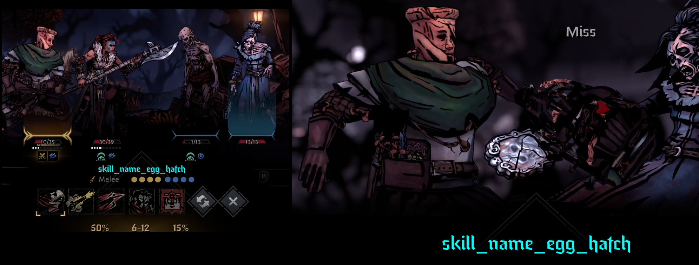\
*Skill animations in the game*

Some error displays:
- Endless loading screen. This was happening if I didn't set Resource files right and CSV data did not match file names in Darkside.
- White skill icons and glitched text. This was happening when I was making errors in CSV files. Though now I don't remember what exactly I did to get this.
- Invisible skill icons. This was fixed after turning the mod off, loading the save, quitting, turning the mod back on.

<!-- 
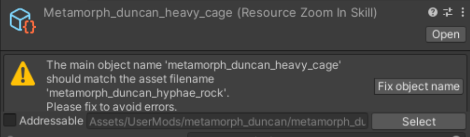\
*There once was a warning about mismatching names. I think this happened because I copied and renamed the files in the Windows explorer instead of doing it in Unity. Letting it fix it did not cause problems*
-->

There was one issue. If the mod is enabled, any character who passes a turn gets zoomed in as if they are performing a skill.

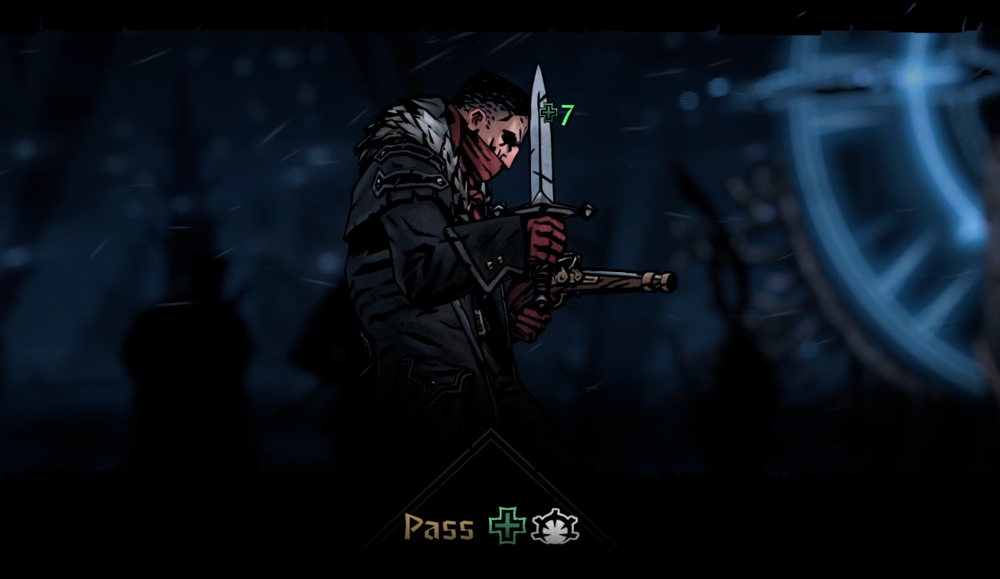\
*Passing a turn gets a zoom in like other skills*

To fix this, go to the `F/shared/Data` folder, click on the `pass_heal` file and disable the Zoom In option in the Inspector window. Do the same for the `pass_stress` file.

Maybe these files should ideally be deleted because they override existing game data, but I'm not familiar with overrides.

## Skill icons and portraits
Skill icons are 450×450 pxl PNG images. The game adds borders automatically. Borders are pushed a bit inward (about 35 pxl margin) from icon's edges.

\
*Skill icons are mostly transparent*

Game's skill icons have a lot of transparent parts and a soft semi-transparent black outline. I can't remember if transparency in the middle of an icon is used by the game anywhere. Relationship blessings and curses add effects outside the border of an icon.

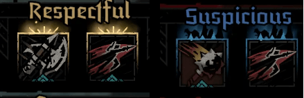\
*Relationship effects on skill icons*

<!-- 
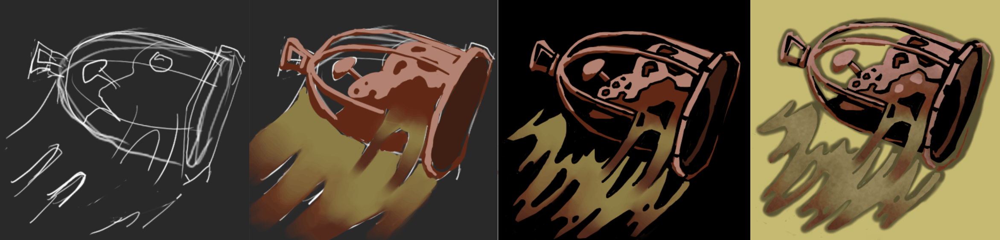\
*I wanted the icons to stand out by the colors, but I couldn't balance the details right so the icons stand out more than I wanted*
-->

<!-- If the icon is big enough to overlap the frame, transparency might look weird.

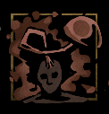\
*The frame is visible under the mushroom* -->

In Darkside skill icons are stored in the `F/icons` folder. Imported images of icons need their "Image Type" to be changed to Sprite in the Inspector.

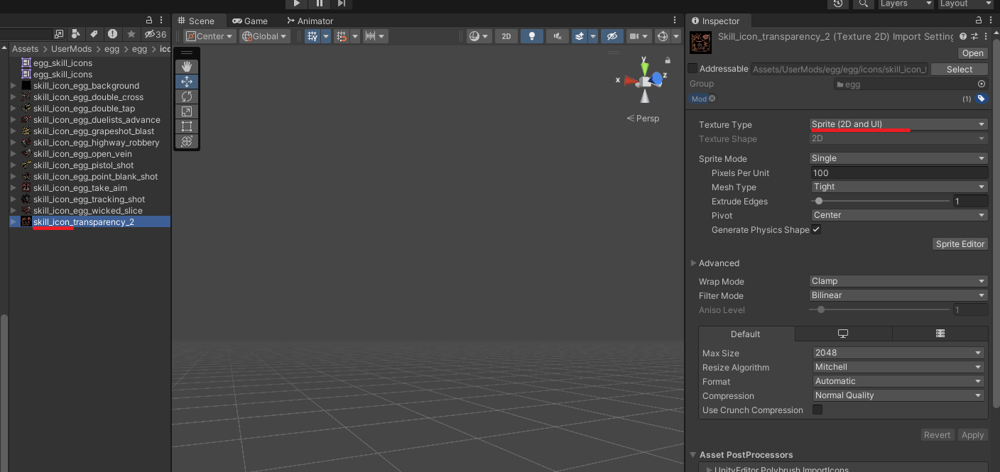\
*Skill icon slot*

Skill icons are assigned to skills via RZIS files that are located in the `F/data` folder.

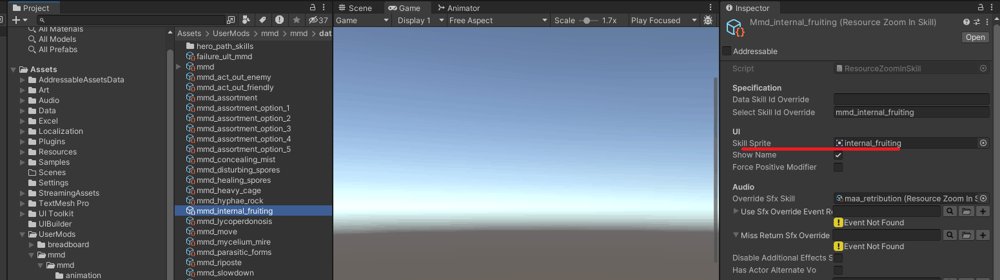\
*Changing image type*

Portraits are stored in `F/portraits`, `F/shared`, and `F/hero_story` folders. Their type also needs to be changed to Sprite.

Portraits need to be connected to the Resource Actor file in the `F/data` folder. If this file has no sprites attached, the game will show white squares.

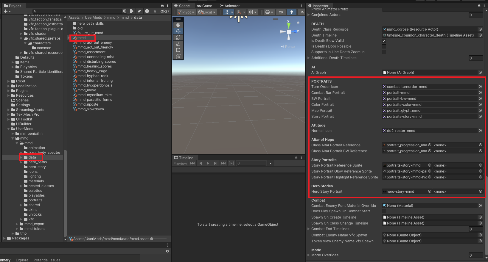\
*Assigning custom portraits*

<!-- For Story portraits I believe it's better to expand the file in the Unity Explorer and assign the purple square instead.

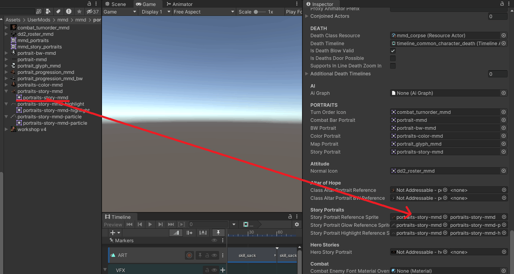\
*Assigning custom portraits* -->

<!-- Portraits for Story Choices (and Hospitals) consist of three parts. "Reference Sprite" is the base image, "Glow Reference" Sprite is the misty aura around the hero (the aura animation is handled by the game, the image by itself is static). "Highlight Reference" is the image with harsh rim light. -->

There are also Sprite Atlases but I don't know how they work.

## Adding VFX

VFX stuff is stored in various folders (`F/vfx`, `Assets/DataShared/vfx`, `F/lighting`). Unfortunately VFX creation was too much for me, so I copied existing VFX and adjusted their position and colors instead.

First I found a fitting VFX (VFX from any hero will work), then copied its prefab file into my `F/vfx/prefabs` folder and renamed it.

Then I opened the art_prefab file of my hero and dragged the VFX file to the armature root in the Hierarchy window.

For some reason the VFX elements were scattered in space, so I clicked on each element of the VFX and in the Inspector window set Position values to zeros. .

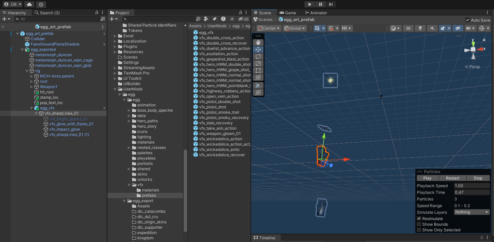\
*I don't know why these are so dispositioned. I am doing something wrong again probably*

To preview what the VFX in the Playable file is going to look like:
1. Open the art_prefab file of the hero.
2. In the Hierarchy window click RMB, then Add Empty. Before building the mod, this empty object needs to be deleted or deactivated (the checkbox left to the object name in the Inspector window). If it isn't deleted or deactivated, the hero would play the same animation every time they appear on screen.
3. Select the empty object and in the Inspector window add the Playable Director Component, then attach the Playable file in its settings.
4. Open the Timeline window alongside the Scene Viewport.
5. Deselect and reselect the empty object in the Hierarchy, this will open the playable file in the Timeline window.
6. In the Timeline window click on the white dot in a circle next to the “None (Animator)” and select the model.
7. If animations aren't played on dragging the timeline cursor, remove the Animation Clips from the timeline and reattach them.

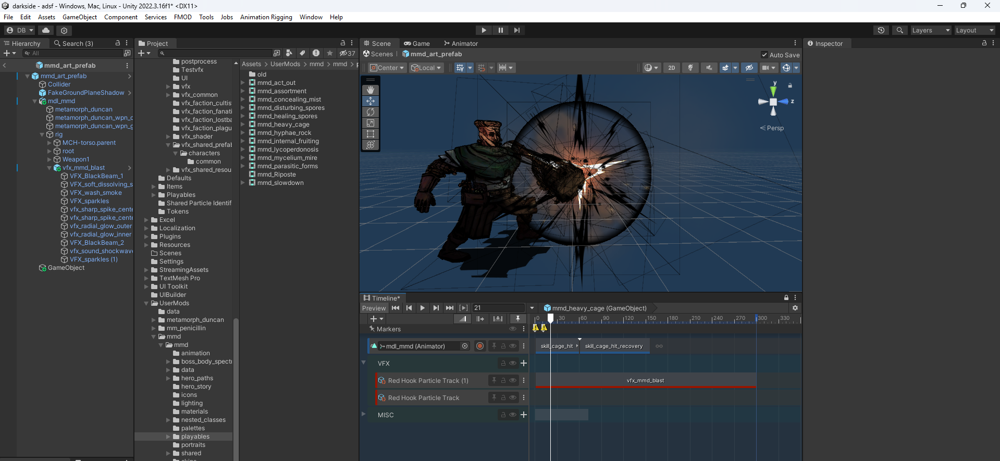\
*Here the VFX duration is too long which led to my hero being stuck in one pose until the VFX was finished*

To edit the VFX position while keeping the animation, press on the lock button on the top right of the Timeline window.

To edit a different Playable, unlock the Timeline window, select the empty object, slot the needed Playable, lock the Timeline window.

To make a VFX follow a specific bone, in the Hierarchy Window attach the VFX to the specific bone rather than to the root.

To reuse a VFX for a different animation it's better to duplicate it first.

VFX in the game look much brighter than they do in Darkside. There is a lightbulb in the top right corner of the Scene Viewport that makes the VFX colors look closer to what they are going to be like in the game but still not exactly the same though.

There are also markers (signals) under the timeline scale. They can be used to add secondary effects that are attached to specific body parts of a target (blood splashes from the center of an enemy’s body, bullet contact effects, or healing auras).

These target-attached VFXs are a bit different. They don’t need to be attached to the art_prefab file. And they need to be edited inside their prefab, not in the hero’s prefab. To attach a target effect, click on a marker and slot the prefab file in the Prefab field in the Inspector window.

To adjust where the target effect will be played, the "Bone Path" field is used. It can be changed to hit_root for ground effects, hit_projectile for body effects, or hit_head for head effects.

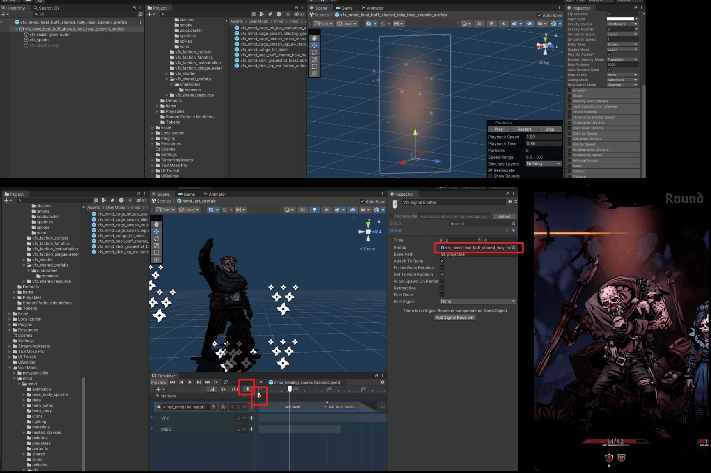\
*A VFX that is attached to the hit_projectile marker*

It looks like Playables can animate material properties of heroes and enemies, but I didn't try it.

When I copied VFX from the `Assets/Data/Characters/Shared/vfx_shared_prefabs` folder, those effects were playing every time the hero appeared on screen. It was be fixed by clicking on the VFX prefab and unchecking the "Play On Awake" option.

To add a VFX to an antic skill animation:
1. Click on the VFX in the Hierarchy Window.
2. In the Inspector Window attach a "Toggle Active State By Animation State" component.
3. Click on the plus button twice, it will add two fields.
4. In the first field write "Base Layer.X", instead of X write the name of the skill antic node in the Animation Controller.
5. In the second field write "Base Layer.Y", instead of Y write the name of the skill idle node.

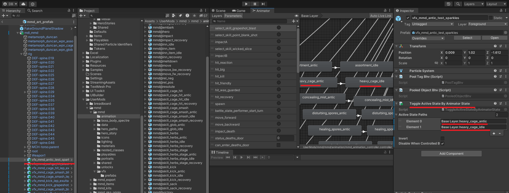\
*Assigning a VFX to an antic animation*

One time I renamed my VFX files and they suddenly disappeared from the game. Reattaching VFX to Playables fixed it.

## Adding SFX

There were some discussions about SFX, but I tuned out and decided that custom audio is not possible. So all SFX were copied from existing audio.

Skill SFX can be specified in RZIS files. I think that all SFX need to come from one single hero (my hero uses the MAA's SFX).

After selecting a RZIS, the Inspector window will show the "Override Sfx Skill" field. It needs to be filled with the RZIS file of the skill that has suitable SFX.

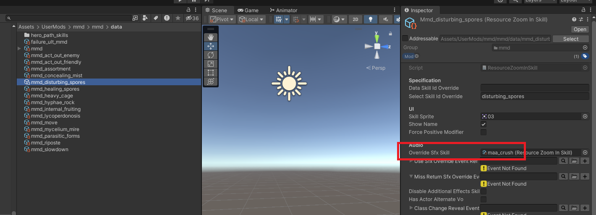\
*Setting the SFX skill source*

After that I selected the hero’s Resource Actor file and in the Inspector window there was the "Override Sfx Subpath Resource Actor" field. I changed it to the Resource Actor file of the hero from whom SFX is copied.

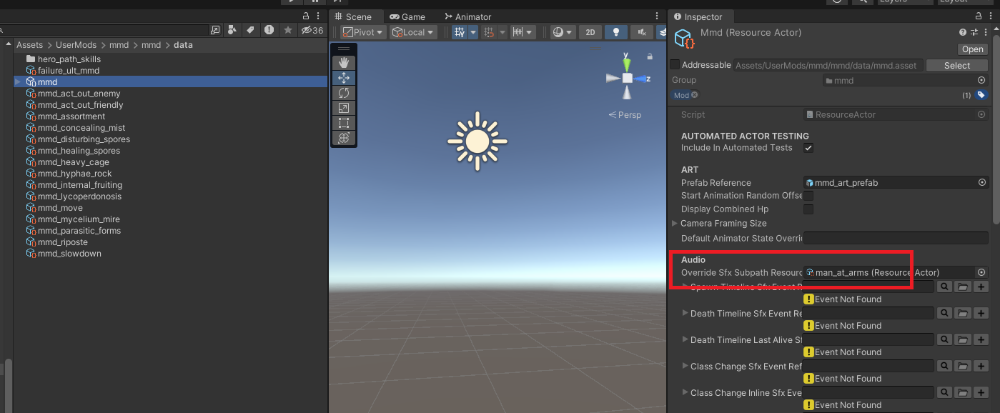\
*Setting the SFX hero source*

Assigning an SFX to a skill it assigns all SFX related to this skill at once: antic, execution, and recovery sounds.

## Creating an inn item

Item creation is covered in the [official guide](https://docs.google.com/document/d/1ga3FNrL3eGDRMFekLx9-RKhTDLMxPO603XzXcZa8O78/edit?usp=drive_link). To create an item mod, The Item Creation tool can be used.

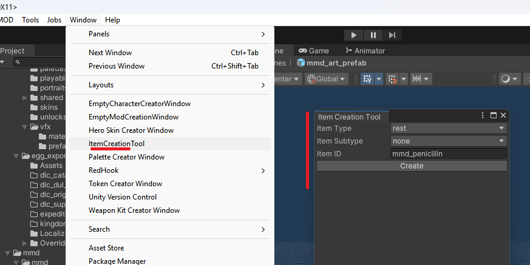\
*Tool for item creation*

This tool created `mmd_penicillin` folder in the `UserMods` folder. Inside, there is an `Art` folder, a Resource Item file, and a Prefab Asset file.

The `Art` folder has some example sprites. They can be deleted. After adding a custom image, it needs to be configured in the Inspector window. "Texture Type" needs to be set to Sprite, "Sprite Mode" to Single, and "Pixels Per Unit" to 1.

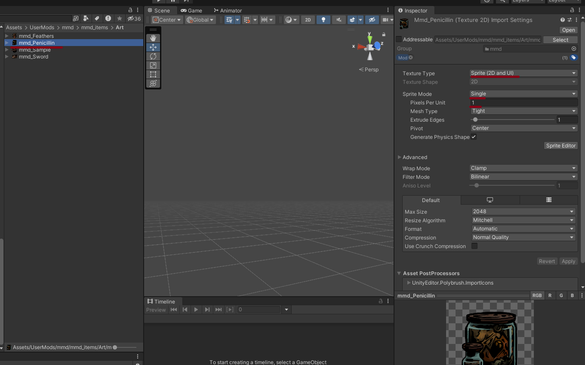\
*Adding custom image files*

Double clicking on the Prefab Asset file opens it in the Hierarchy window. In this window there is a default_item_icon element. Clicking on it will open it's properties in the Inspector window, where a custom sprite can be attached.

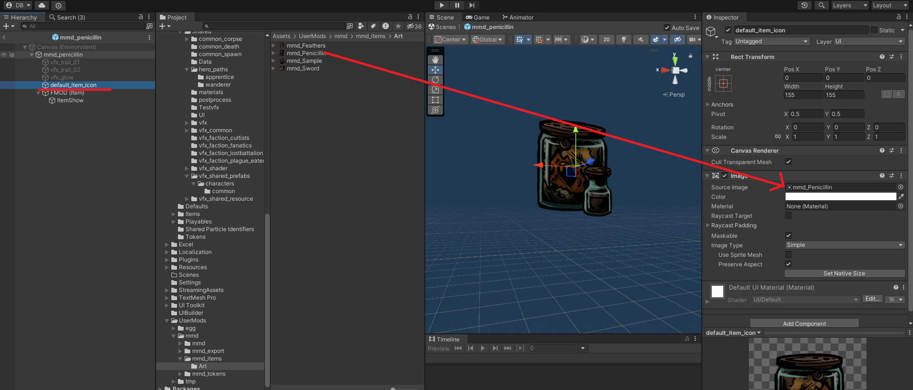\
*Assigning a sprite to the Prefab Asset*

Then in the `exports` folder the CSV file needs to be edited. Without it the game won't be able to connect graphics to item's gameplay data.

In the `dd2_mod_data_rest.Group.csv` file on lines 1 and 38 "rh_example_rest_item" needs to be replaced with the ID that was used in the ItemCreation tool window.

Now after building this item mod with the Steamworks tool, the exports folder can be copied into the local mods folder.

```
"C:\Program Files (x86)\Steam\steamapps\common\Darkest Dungeon® II\Darkest Dungeon II_Data\StreamingAssets\mods\meitem2_export
```

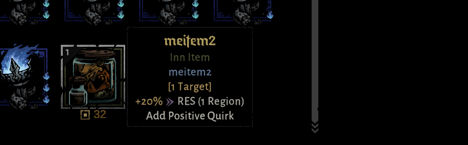\
*Custom item in the Valley Inn stock*

This item's effects and acquisition conditions can be changed by editing the CSV file.

## CSV data I

CSV files store a lot of things: hero stats, DOT effects, buffs, loot tables, etc. I will try to explain how they work, but everything here is personal experience.

CSV data can be separated into multiple files, but it is not necessary. They should be placed on the top level of the mod folder or in the `Overrides` folder. Other folders are not registered by the game. CSV filenames should end with `.Group.csv`.

CSV data consists of blocks called elements. Every element has an ID, a type, a beginning, and an end. Everything between element_start and element_end is its data. This data content varies depending on element's type.

```csv
element_start,add_1_dodge,Effect
m_Chance,1,
m_TokenAddId,dodge,
m_TokenAddAmount,1,
m_ShowValue,False,
element_end
```

Here **add_1_dodge** is the ID of this element. It should be unique enough so it doesn't conflict with existing data or with other mods (common way is to add mod's ID as a prefix). *Effect* is the type of this element.

IDs are mostly arbitrary (with the except of upgraded skill IDs I think), element types are predefined, there are more than 100 types.

CSV data is generally case-sensitive but some specific words can be written in any case. For example, this works fine:
```csv
element_start,mmd,ActorDataStats
sub_stat,RESISTANCE,stun,0.2,
sub_stat,rEsiStancE,blight,0.5,
sub_stat,resistance,bleed,0.3,
element_end
```
But this will cause errors:
```csv
element_start,mmd,ActorDataStats
sub_stat,resistance,sTun,0.2,
element_end
```

Order of elements does not matter. For example, this

```csv
element_start,effect1,Effect
m_Chance,1,
element_end

element_start,effect2,Effect
m_Chance,0.5,
element_end
```
is equivalent to this (unless they have the same ID and type and they are not addable, then only the first element will be used).

```csv
element_start,effect2,Effect
m_Chance,0.5,
element_end

element_start,effect1,Effect
m_Chance,1,
element_end
```

As long as CSV files are in the same folder level, it does not matter in what file which element is placed.

The order of lines inside an element does not matter in most cases. But some fields require a specific field following after them. For example, the *key_map* field:
```csv
element_start,mmd_corpse,ActorDataStats
key_map,health_max,speed,speed_number_of_turns,
add_stats,28,5,1,
element_end
```

This won't work:
```csv
element_start,mmd_corpse,ActorDataStats
add_stats,28,5,1,
key_map,health_max,speed,speed_number_of_turns,
element_end
```

The game does not support comments in CSV files. Some mods (and me too) use `//` to add comments but the game does not actually filter them out. It might be fine for short comments but if entire elements are commented out it might cause unexpected behavior.

```csv
// fake comment
```

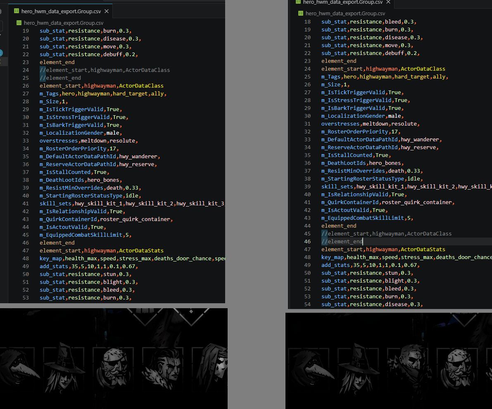\
*Adding a commented out highwayman ActorDataClass definition before the actual definition resulted in the hero missing at the Crossroads.*


The game treats spaces as self-sufficient characters. The data below will produce two independent effects with IDs `effect` and ` effect` (with space in the beginning).
```csv
element_start,effect,Effect
m_Chance,0.5,
element_end

element_start, effect,Effect
m_Chance,1,
element_end
```

Element IDs are not necessarily unique, and even a repeated combination of ID+Type can be valid data in some cases. Elements with repeating ID+Type signature are only allowed if:
- These elements are "Addable" elements like `LootTable`, `ActorDataExternalBuffs`, `InnTable`, `BattleConfigurationTable` elements, and maybe some more.
- Or, these elements are supposed to override previously defined elements.

The Excel folder with official data has this structure:
```
Excel
├───dlc_catacombs
├───dlc_dul_cru
├───dlc_origin_skins
├───dlc_supporter
├───expedition
└───kingdom
```

Mod folders look more or less like this:

```
Mod folder
├───Assets
├───dlc_catacombs
├───dlc_dul_cru
├───dlc_origin_skins
├───dlc_supporter
├───expedition
├───kingdom
├───Localization
└───Overrides
    ├───dlc_catacombs
    ├───dlc_dul_cru
    ├───dlc_origin_skins
    └───dlc_supporter
```

When a save file is being loaded, the game loads CSV files in this order (probably):
1. Base game CSV files from the top level of the Excel folder.
2. DLC files (IB, TBB, HOP, ISP).
3. Then the game checks if this is a Kingdoms or an Expedition save. If this is an Expedition save, files from the `expedition` folder are loaded, and the `kingdom` folder is ignored. If this is a Kingdoms save, its the other way around. Data from these two folders can override previously gathered data. 
4. Then mods are loaded. For each mod folder:
	1. Data from the top folder of the mod is gathered, this data does not override previously gathered data.
	2. Data from DLC-related folders. This data does not override previously gathered data.
	3. Depending on the game type, files either from `expedition` or `kingdom` folder are gathered. Data from this folder does not override previously gathered data.
	4. The `Overrides` folder is checked:
		1. Files on the top level of this folder are gathered, they override previously gathered data.
		2. Game type folder is gathered. Overrides previously gathered data.
		3. Data from DLC-related folders, overrides previously gathered data.

Addable types (not confident):
- ActorDataActOut
- ActorDataEffects
- ActorDataExternalBuffs
- ActorDataRunGoals
- ActorDataSkillReplacement
- BattleConfigurationTable
- DataAffinityTickTriggers
- DataExternalBuffs
- DataNodeReplacements
- DataStoryChoiceReplacements
- InnDataStats
- InnTable
- LootTable
- RunDataStats
- StoryDataEffects
- UnlockTable

Addable elements can be overridden too. In this case all previously defined addables with the same type and ID are removed.

Editing CSV data doesn't require rebuilding the mod with the Steamworks tool. CSV files can be edited in the `exports` folder and then copied into DD2 mods folder.

There is an official tool that can make editing CSV data easier. But this tool does not cover all situations. Exploring raw CSV data might be required to find out how certain things are implemented.

I only used this tool once, when I just started this project. After that I edited CSV files directly.

This tool is a Microsoft Excel file, and it's published in Google Drive: [dd2_mod_data_exporter.xlsm](https://drive.google.com/drive/u/0/folders/1SlMxq3O2nuOp3P__G-0QIU748RGFIFnu?ths=true).

The [official guide](https://docs.google.com/document/d/1ga3FNrL3eGDRMFekLx9-RKhTDLMxPO603XzXcZa8O78/edit?usp=drive_link) has instructions about this file (installation and usage). Since this Excel book uses macros, it requires some more steps after downloading.

This book has multiple sheets for different items: trinket, rest (inn item), combat (combat item), sc_general (stagecoach cargo), sc_pet, memory (Altar of Hope memories).
I will create Inn Item data using this tool. Inn item sheet looks like this:

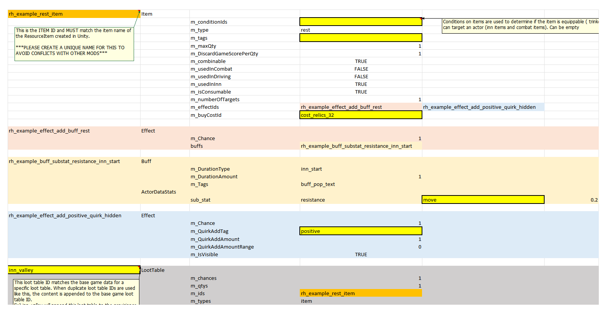\
*Inn item sheet*


It describes six elements:

| # | ID | Type |
| :---: | :--- | :--- |
| 1 | **rh_example_rest_item** | Item |
| 2 | **rh_example_effect_add_buff_rest** | Effect |
| 3 | **rh_example_buff_substat_resistance_inn_start** | Buff |
| 4 | **rh_example_buff_substat_resistance_inn_start** | ActorDataStats |
| 5 | **rh_example_effect_add_positive_quirk_hidden** | Effect |
| 6 | **Inn_valley** | LootTable |

The first element (**rh_example_rest_item**) has the *Item* type. *Item* elements are entry points for item data. This element has these fields (this is not a complete list):
- *m_conditionIds* describes in what conditions this item can be used. Here this field is empty so any hero can use it.
- *m_type* is set to "rest", meaning it's an inn item. It can also be set to *trinket*, *combat*, *stage_coach_upgrade*, *memory*, *currency*.
- *m_tags* field allows to add such tags as *serrated*, *noxious*, *flammable*, etc. Tags are arbitrary, they are used as an alternative to IDs for targeting groups of items.
- *m_maxQty* tells what is the stack size of this item.
- *m_numberOfTargets* tells if this item affects one hero, two heroes, or the full party. Here it is set to 1 which means that this item will not be shared with other heroes.
- *m_buyCostId* tells the cost of the item. It says **cost_relics_32** which is actually the ID of another element that stores a number of relics. That element is not present in the table because it's already defined in the official files.
- *m_effectIds* has two values. Some fields allow multiple values and some don't. Those that allow it usually use plural form in their names. **m_tags** also allows to use multiple values.

Gameplay effects are generally stored in either *Effect* or *Buff* elements. *Effect* elements are instantaneous, for example: adding a token, removing a disease, healing stress, pulling an enemy, applying a buff, applying DOT effect.

*Buff* elements last a certain amount of time (rounds, turns, regions, etc.), and a buff's inner conditions are met, it tries to apply effects to specified targets.

<!-- Inn items can only have links to *Effect* elements, they apply effects when consumed.

Trinkets, on the contrary, operate in buffs, that constantly check for suitable conditions. -->

In this example the *m_effectIds* field links this element to two more elements: **rh_example_effect_add_buff_rest** and **rh_example_buff_substat_resistance_inn_start**. Both of them have the *Effect* type. Upon consumption this item will apply these effects.

The **rh_example_effect_add_buff_rest** effect applies the **rh_example_buff_substat_resistance_inn_start** buff with 100% chance. This buff lasts one region.

The **rh_example_buff_substat_resistance_inn_start** ID belongs to two elements. One is a *Buff* element, another one is an *ActorDataStats* element. It isn't exactly visible in the sheet but in CSV files these would be two separate elements with the same ID.


The second effect, **rh_example_effect_add_positive_quirk_hidden**, adds one quirk with 100% chance. Quirks are also elements, and they can have tags the same way Items can. Tnd this effect says that it adds a *positive* quirk, meaning it will add any quirk that has *positive* among its tags. 

The last element is **Inn_valley**. *LootTable* elements are addable which means there can be multiple LootTable elements with a shared ID, and the game will merge all these elements into one table without overwriting.

In this example, the **Inn_valley** element says that the Valley Inn will have this new item for sale with 100% chance. The game already **Inn_valley** table with lots of items for sale, but nothing will be overwritten, the game extend the inn store.

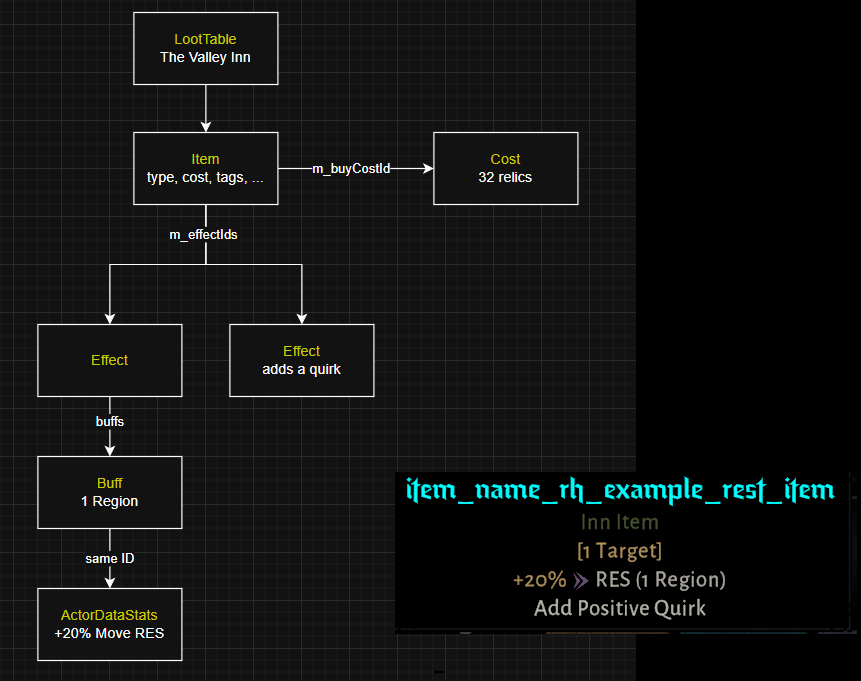\
*Connections between elements of the example inn item*

There were a couple of issues with the Excel tool. When I opened it, the export buttons were completely unresponsive no matter setting I changed. The workaround is to open the Visual Basic tool in Excel's Developer tab. Double clicking on Sheet8 (rest) opens the code.

Here the function assigned to the button can be called directly, by selecting the ExportGroupedButton_Click() function and clicking on the run button on top.

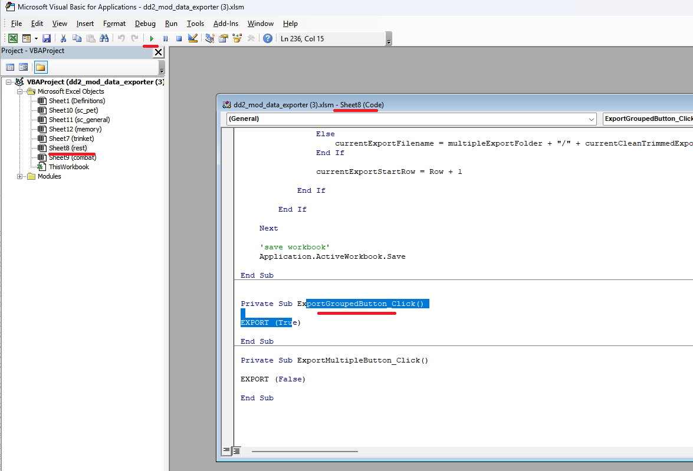\
*Calling the function directly*

This will create a CSV file in a folder. This CSV file should be placed in the `exports` folder so the game can find it.

I live in a country that uses comma as the decimal separator. And the game does not recognize comma as a decimal separator. There is a setting in Excel that is supposed to fix this but it didn't work. This can be fixed by finding this line in the code:
```vba
csvValue = csvValue & exportCell
```
and replacing it with this piece:
```vba
If IsNumeric(exportCell) Then
	csvValue = csvValue & Trim(Str(exportCell))
Else
	csvValue = csvValue & exportCell
End If
```

After executing this tool's code a CSV file appears with the following content:
```csv
element_start,rh_example_rest_item,Item
m_conditionIds,
m_type,rest,
m_tags,
m_maxQty,1,
m_DiscardGameScorePerQty,1,
m_combinable,True,
m_usedInCombat,False,
m_usedInDriving,False,
m_usedInInn,True,
m_isConsumable,True,
m_numberOfTargets,1,
m_effectIds,rh_example_effect_add_buff_rest,rh_example_effect_add_positive_quirk_hidden,
m_buyCostId,cost_relics_32,
element_end

element_start,rh_example_effect_add_buff_rest,Effect
m_Chance,1,
buffs,rh_example_buff_substat_resistance_inn_start,
element_end

element_start,rh_example_buff_substat_resistance_inn_start,Buff
m_DurationType,inn_start,
m_DurationAmount,1,
m_Tags,buff_pop_text,
element_end

element_start,rh_example_buff_substat_resistance_inn_start,ActorDataStats
sub_stat,resistance,move,0.2,
element_end

element_start,rh_example_effect_add_positive_quirk_hidden,Effect
m_Chance,1,
m_QuirkAddTag,positive,
m_QuirkAddAmount,1,
m_QuirkAddAmountRange,0,
m_IsVisible,True,
element_end

element_start,inn_valley,LootTable
m_chances,1,
m_qtys,1,
m_ids,rh_example_rest_item,
m_types,item,
element_end

```

This text describes the same six elements. The 32 relics cost element isn't generated because the game already has it.

## Creating a signature item

To convert an inn item into a signature item, its CSV data needs to be edited.

I will edit CSV files without the Excel tool. It is easier to do so with an app that allows to search words in all text files in a folder. One of them is Visual Studio Code.

Actually I even created my own [VS Code extension](https://marketplace.visualstudio.com/items?itemName=dnauu.DD2CSVMMD) to make editing CSV data easier. It can catch some errors but not all of them. It is better suited for exploring DD2 CSV files rather than for validation.

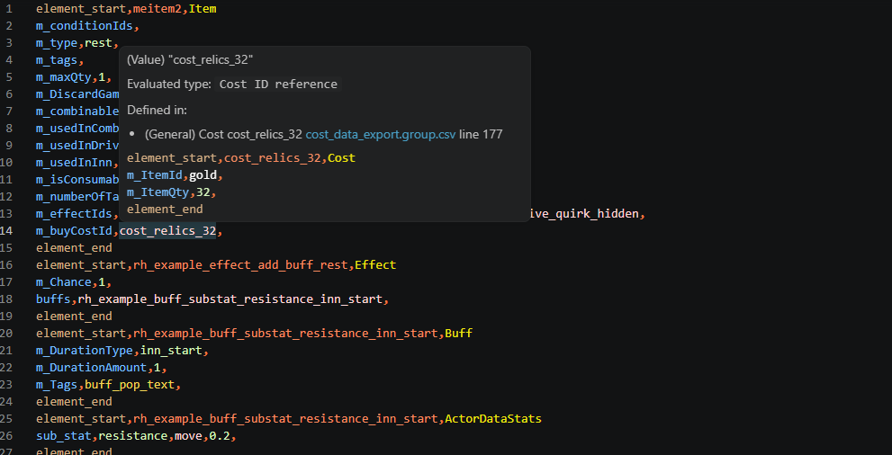\
*My extension*

If my extension does not for some reason there is another [VSCode extension](https://marketplace.visualstudio.com/items?itemName=PHombie.dd2-csv-syntax) that highlights syntax.

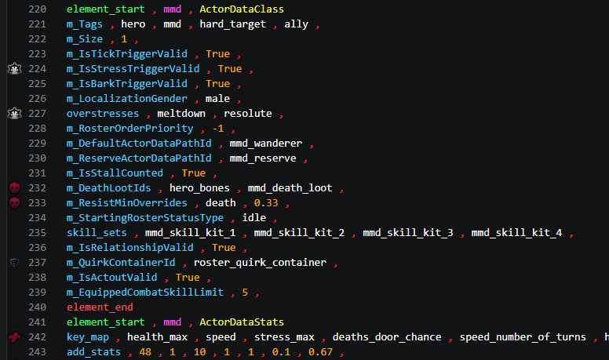\
*Syntax highlight by PHombie*


<!-- 
Gameplay-wise there is more single target (6) signature items than the ones that have two targets (5) or the ones that target the whole party (4). Most of them have only positive effects, with the exception of four signature items that belong to Runaway, Hellion, HWM, and Flagellant. Almost all of them have one or two effects. The ones that have three effects might not apply all three. The PD’s Remedy always applies two effects out of three (might be wrong), and the Flagellant’s Pain Box has a chance of applying only the two guaranteed effects out of four total.
-->

Besides making my item a signature item, I also wanted to add these effects:
- A chance of removing a disease.
- A chance of increasing disease RES for 1 region.
- A chance of increasing blight RES for 1 region.

In the CSV file I deleted all elements except the *Item* and *LootTable* elements. Then I changed the effect list and the number of targets:
```csv
element_start,mmd_penicillin,Item
m_type,rest,
m_tags,
m_maxQty,1,
m_DiscardGameScorePerQty,1,
m_combinable,True,
m_usedInCombat,False,
m_usedInDriving,False,
m_usedInInn,True,
m_isConsumable,True,
m_numberOfTargets,4,
m_effectIds,mmd_penicillin_effect_cure,mmd_penicillin_effect_disease,mmd_penicillin_effect_blight,
m_buyCostId,cost_relics_32,
element_end

element_start,inn_valley,LootTable
m_chances,1,
m_qtys,1,
m_ids,mmd_penicillin,
m_types,item,
element_end
```

Then I needed examples. They can be found in this folder:
```
C:\Program Files (x86)\Steam\steamapps\common\Darkest Dungeon® II\Darkest Dungeon II_Data\StreamingAssets\Excel
```

The game actually uses files in this folder so they shouldn't be edited.

In VSCode I opened this folder and searched for "remedy" to find PG's signature item. It produced a long list of entries.


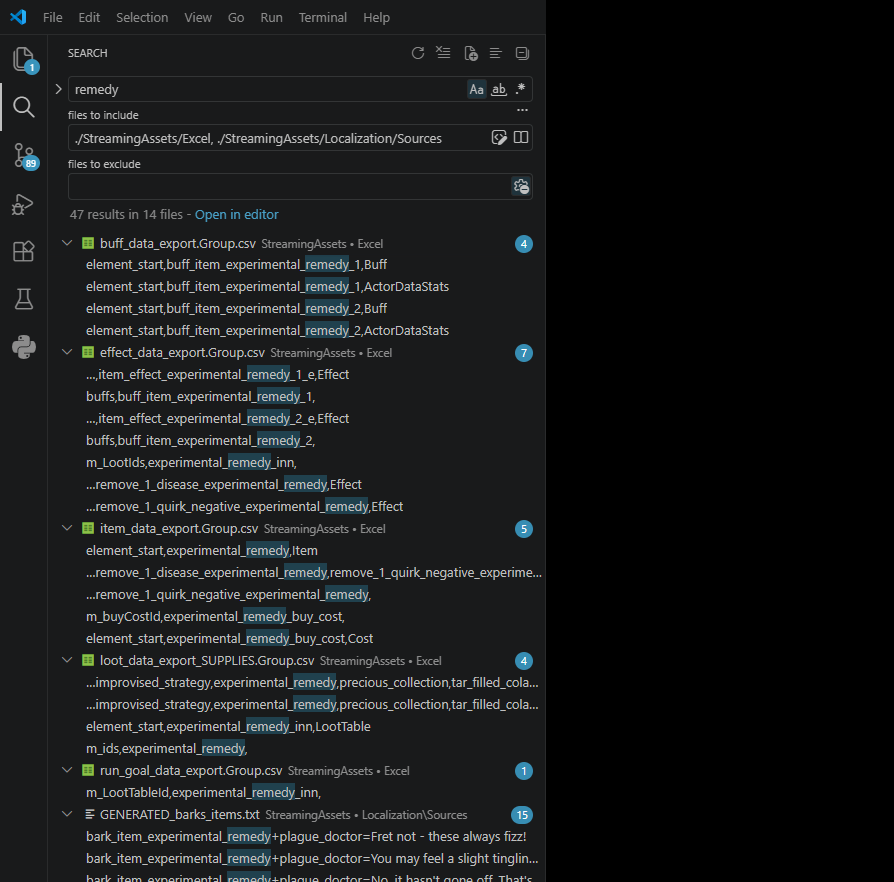\
*Search results in VS Code*

I clicked on every entry until I found the needed *Item* element.

There were these important lines:
```
sub_type,hero,
m_possessionLimit,1,
m_conditionIds,hero_party_has_plague_doctor,
m_applyLimitEffectIds,remove_1_disease_experimental_remedy,remove_1_quirk_negative_experimental_remedy,
m_effectApplyLimit,1,
```
The first field says it's a signature item. The second field says that it's not possible to obtain multiple Experimental Remedies. The third field says that this item is not usable without PD in party. The two last ones say that it applies one effect from the list of effects. 

**hero_party_has_plague_doctor** is a *Condition* element:

```csv
element_start,hero_party_has_plague_doctor,Condition
m_ConditionType,party_class,
m_ConditionString,plague_doctor,
m_ConditionNumber,1,
m_ConditionNumberType,EQUAL,
element_end
```

I copied these lines to my element changing PD's IDs to mine (except my item is not limited in number of applied effects).

```csv
element_start,mmd_penicillin,Item
m_type,rest,
m_tags,
m_maxQty,1,
m_DiscardGameScorePerQty,1,
m_combinable,True,
m_usedInCombat,False,
m_usedInDriving,False,
m_usedInInn,True,
m_isConsumable,True,
m_numberOfTargets,4,
m_effectIds,mmd_penicillin_effect_cure,mmd_penicillin_effect_disease,mmd_penicillin_effect_blight,
m_buyCostId,cost_relics_32,
sub_type,hero,
m_possessionLimit,1,
m_conditionIds,hero_party_has_mmd,
element_end

element_start,hero_party_has_mmd,Condition
m_ConditionType,party_class,
m_ConditionString,mmd,
m_ConditionNumber,1,
m_ConditionNumberType,EQUAL,
element_end

element_start,inn_valley,LootTable
m_chances,1,
m_qtys,1,
m_ids,mmd_penicillin,
m_types,item,
element_end
```

Now I needed to define the *Effect* elements. The first one is the disease removal effect. Experimental Remedy can remove diseases, so I searched "remove_1_disease_experimental_remedy" from that item's effect list, and found this element:
```csv
element_start,remove_1_disease_experimental_remedy,Effect
m_Chance,1,
m_QuirkRemoveTag,disease,
m_QuirkRemoveAmount,1,
m_QuirkRemoveAmountRange,0,
all_conditions,target_is_diseased_hidden,
element_end
```

Turns out diseases are technically quirks. I copied this element into my CSV file and modified it.
```csv
element_start,mmd_penicillin_effect_cure,Effect
m_Chance,0.8,
m_QuirkRemoveTag,disease,
m_QuirkRemoveAmount,1,
m_QuirkRemoveAmountRange,0,
all_conditions,target_is_diseased_hidden,
element_end
```

The *all_conditions* field tells what targets will roll for this effect. It is set to **target_is_diseased_hidden** which means this particular effect will roll only for heroes that have a disease. It is called hidden to emphasize that this condition isn't showed in the tooltip.

While the **remove_1_disease_experimental_remedy** effect is not rolled for healthy heroes, the item itself is still applicable to them, because item usage can only be blocked by conditions in the *Item* element (or by external factors like quirks), and the Experimental Remedy has only one condition in it (the party has the PD).

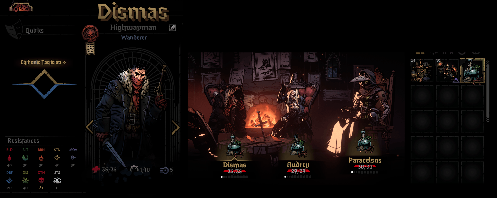\
*Heroes can use Experimental Remedy even if they have full HP and don't have diseases or negative quirks*

Second and third effects were not new. The whole text:
```csv
element_start,mmd_penicillin,Item
m_conditionIds,hero_party_has_mmd,
m_type,rest,
m_tags,
m_maxQty,1,
m_DiscardGameScorePerQty,1,
m_combinable,True,
sub_type,hero,
m_possessionLimit,1,
m_usedInCombat,False,
m_usedInDriving,False,
m_usedInInn,True,
m_isConsumable,True,
m_numberOfTargets,4,
m_effectIds,mmd_penicillin_effect_cure,mmd_penicillin_effect_disease,mmd_penicillin_effect_blight,
m_buyCostId,cost_relics_32,
element_end

element_start,hero_party_has_mmd,Condition
m_ConditionType,party_class,
m_ConditionString,mmd,
m_ConditionNumber,1,
m_ConditionNumberType,EQUAL,
element_end

// chance of cure disease

element_start,mmd_penicillin_effect_cure,Effect
m_Chance,0.8,
m_QuirkRemoveTag,disease,
m_QuirkRemoveAmount,1,
m_QuirkRemoveAmountRange,0,
all_conditions,target_is_diseased_hidden,
element_end

// chance of disease resistance buff

element_start,mmd_penicillin_effect_disease,Effect
m_Chance,0.6,
buffs,mmd_penicillin_buff_disease,
element_end

element_start,mmd_penicillin_buff_disease,Buff
m_DurationType,inn_start,
m_DurationAmount,1,
m_Tags,buff_pop_text,
element_end

element_start,mmd_penicillin_buff_disease,ActorDataStats
sub_stat,resistance,disease,0.3,
element_end

// chance of blight resistance buff

element_start,mmd_penicillin_effect_blight,Effect
m_Chance,0.6,
buffs,mmd_penicillin_buff_blight,
element_end

element_start,mmd_penicillin_buff_blight,Buff
m_DurationType,inn_start,
m_DurationAmount,1,
m_Tags,buff_pop_text,
element_end

element_start,mmd_penicillin_buff_blight,ActorDataStats
sub_stat,resistance,blight,0.2,
element_end

// adding to the first inn

element_start,inn_valley,LootTable
m_chances,1,
m_qtys,1,
m_ids,mmd_penicillin,
m_types,item,
element_end
```

After updating the CSV file in the mods folder and reloading the save, item's effects are changed.

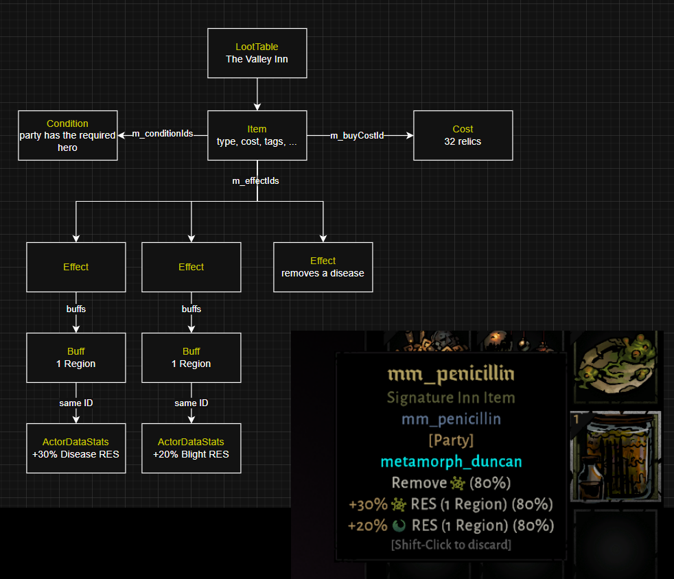\
*Connections between elements. The screenshot is old so numbers are different*

To make a signature inn item appear in the Hoarder's stock or other stocks, a different table is needed instead of the **inn_valley** table. Signature items have their own loot table called **SIGNATURE_INN_ITEMS**.

```csv
element_start,SIGNATURE_INN_ITEMS,LootTable
m_chances,1,1,
m_qtys,1,1,
m_ids,mmd_penicillin,mmd_penicillin,
m_types,item,item,
m_tags,
m_conditions,hero_party_has_mmd,kingdom_inn_has_mmd,
element_end

element_start,hero_party_has_mmd,Condition
m_ConditionType,party_class,
m_ConditionString,mmd,
m_ConditionNumber,1,
m_ConditionNumberType,EQUAL,
element_end

element_start,kingdom_inn_has_mmd,Condition
m_ConditionType,kingdom_class,
m_ConditionString,mmd,
m_ConditionNumber,1,
m_ConditionNumberType,EQUAL,
element_end
```

If multiple *LootTable* elements with the same ID are present in files, the game unites them into one table.

\
*Custom entries for the table with signature items*

This table has two entries, and for each entry:
- *m_chances* is a weighted chance value
- *m_qtys* is a number of items that will be looted when an entry is randomly selected. Or, if the entry is not an item but another *LootTable*, a number of pulls from that table.
- *m_ids* is item ID or table ID
- *m_tags* assigns a tag to an entry. It is used, for example, when an Icebox on the Stagecoach increases the number of looted food.
- *m_conditions* is a condition that can exclude item from the table. One entry can use multiple conditions by using `+`. There are only a few places where `+` is an operator, in most cases it is a regular character.


Making a signature item unlockable at the Shrine of Reflection and adding a chance of it being looted when reaching an inn is described in the Shrine of Reflection section of this document. 

This method of searching through files, copying and modifying elements was my primary way of editing CSV data. If I wanted to create something, I tried to remember if the game already has something similar. And if it does, that meant I can probably do the same.

## CSV data II

Here I will write about some element types that allow to achieve more complex effects. I will do this by explaining several trinkets.

A trinket is defined by an *Item* element. It connects to *Buff* elements via an intermediary *ActorDataExternalBuffs* element.

For a *Buff* element to do something it requires additional elements: *ActorDatatStats*, *ActorDataEffects*, or *ActorEffectTrigger* elements.

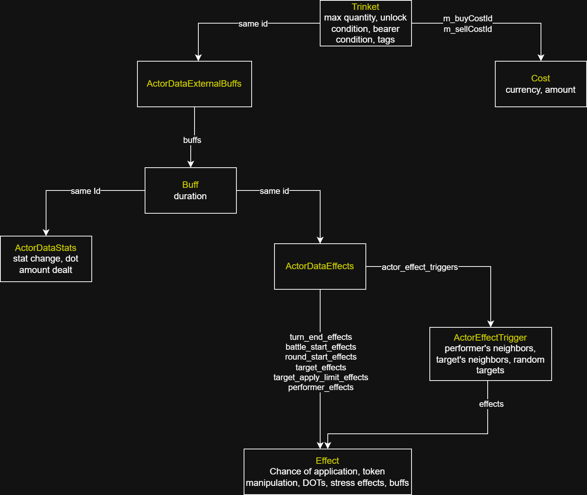\
*General schema of trinket elements*

*ActorDataStats* type is a more simple type among them. Elements of this type can increase or decrease hero's stats, buff or debuff DOT dealt to enemies, etc.

An example of a trinket that only uses *ActorDataStats* elements for buffs is the Sharpness Charm trinket.

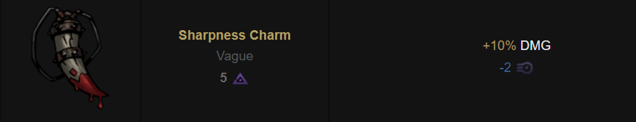\
*[Vague Sharpness Charm trinket](https://darkestdungeon.wiki.gg/wiki/Trinkets_(Darkest_Dungeon_II)#Sharpness_Charm)*

Here is its definition in CSV files, without the cost elements.

```csv
element_start,trinket_tiered_sharpness_charm_minor,Item
m_type,trinket,
m_possessionLimit,1,
m_maxQty,1,
m_combinable,False,
m_isConsumable,False,
sub_type,common,
m_buyCostId,trinket_tiered_sharpness_charm_minor_buy_cost,
m_sellCostId,trinket_vague_sell_cost,
m_DiscardGameScorePerQty,1,
element_end

element_start,trinket_tiered_sharpness_charm_minor,ActorDataExternalBuffs
buffs,trinket_tiered_minor_sharpness_charm_01,trinket_tiered_minor_sharpness_charm_02,
element_end

// +10% damage

element_start,trinket_tiered_minor_sharpness_charm_01,Buff
m_DurationType,infinite,
element_end

element_start,trinket_tiered_minor_sharpness_charm_01,ActorDataStats
key_map,health_damage_dealt_percent,
add_stats,0.1,
element_end

// -2 Speed

element_start,trinket_tiered_minor_sharpness_charm_02,Buff
m_DurationType,infinite,
element_end

element_start,trinket_tiered_minor_sharpness_charm_02,ActorDataStats
key_map,speed,
add_stats,-2,
element_end
```

Here the *Item* element connects to two buffs through an *ActorDataExternalBuffs* element. Both of these buffs say that they last an infinite amount of time. For trinkets (and memories) it means that these buffs work for any amount of time as long as trinkets (memories) are equipped.

If a buff caused by a skill has infinite duration, it will be lost when a run ends (in an inn or not).

The exceptions are buffs that are connected to a hero directly through their *ActorDataExternalBuffs* (not as a result of a skill or equipment effects). For example, Altar of Hope unlocks:

```csv
element_start,highwayman,ActorDataClass
⋮
element_end

element_start,highwayman,ActorDataExternalBuffs
buffs,hwm_ut_deathblow_resist_1,hwm_ut_deathblow_resist_2,hwm_ut_deathblow_resist_3,hwm_ut_stun_resist_1,hwm_ut_bleed_resist_1,hwm_ut_disease_resist_1,hwy_signature_item_buff,
element_end
```
The HWM has seven buffs in his *ActorDataExternalBuffs* element. They all have duration set to infinity. The last buff looks different, but it's a buff that says that every time an inn is reached, the Stagecoach will obtain his signature item with 5% chance.

Many trinkets apply effects on turn start, on battle start, on round end, on being hit, etc. For these effects an *ActorDataEffects* element is required. For example, the Sacred Scribblings trinket can apply a vulnerability token on turn start.

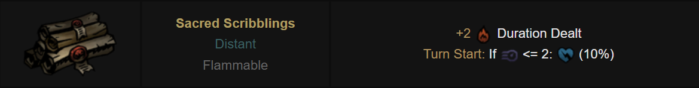\
*[Sacred Scribblings trinket](https://darkestdungeon.wiki.gg/wiki/Trinkets_(Darkest_Dungeon_II)#Sacred_Scribblings)*

Here is its definition in CSV files, without the cost elements.

```csv
element_start,trinket_city_sacred_scribblings,Item
m_type,trinket,
m_tags,flammable,
m_possessionLimit,1,
m_maxQty,1,
m_combinable,False,
m_isConsumable,False,
sub_type,rare,
m_buyCostId,trinket_city_sacred_scribblings_buy_cost,
m_sellCostId,trinket_distant_sell_cost,
m_DiscardGameScorePerQty,1,
element_end

element_start,trinket_city_sacred_scribblings,ActorDataExternalBuffs
buffs,trinket_city_sacred_scribblings_01,trinket_city_sacred_scribblings_02,
element_end

// +2 Burn duration dealt

element_start,trinket_city_sacred_scribblings_01,Buff
m_DurationType,infinite,
element_end

element_start,trinket_city_sacred_scribblings_01,ActorDataStats
sub_stat,dot_extra_duration_dealt,burn,2,
element_end

// add vulnerable on turn start with a condition

element_start,trinket_city_sacred_scribblings_02,Buff
m_DurationType,infinite,
element_end

element_start,trinket_city_sacred_scribblings_02,ActorDataEffects
turn_start_effects,add_1_vulnerable_10pct_spd_2orless,
element_end

element_start,add_1_vulnerable_10pct_spd_2orless,Effect
m_Chance,0.1,
m_TokenAddId,vulnerable,
m_TokenAddAmount,1,
m_ShowValue,False,
all_conditions,performer_speed_2orless,
element_end

element_start,performer_speed_2orless,Condition
m_ConditionType,actor_stat_value,
m_ConditionActorType,PERFORMER,
m_ConditionString,speed,
m_ConditionNumber,2,
m_ConditionNumberType,LESS_THAN_OR_EQUAL,
element_end
```

Here the *Item* element connects to two buffs through an *ActorDataExternalBuffs* element. The first buff increases burn duration dealt using an *ActorDataStats* element. The second buff uses an *ActorDataEffects* element to apply effects on start of every turn.

*m_showValue* field tells if the tooltip should show how many tokens will be applied. Here it is set to False, which means the tooltip will say "vulnerability token" instead of "1 vulnerability token".

*ActorDataEffects* element can have many different fields:
- *turn_start_effects*, *turn_end_effects*
- *combat_start_effects*, *combat_end_effects*
- *round_start_effects*, *round_end_effects*
- *target_effects* (when a hero uses a skill)
- *target_apply_limit_effects* (apply one effect only from a list of effects)
- *turn_start_apply_limit_effects*
- *turn_start_friendly_team_effects*, *turn_end_friendly_team_effects*, *turn_start_enemy_team_effects*, *turn_end_enemy_team_effects* I think these don't work consistently in *ActorDataEffects* elements. For me turn-end team-wide effects worked much better when I listed them in *ActorEffectTrigger* elements instead.
- *friendly_team_effects*, *enemy_team_effects*
- *move_effects* (when a hero moves between ranks)
- *on_hit_as_performer_to_target_effects* (when a hero hits an enemy, this enemy gets something)
- *on_hit_as_performer_to_performer_effects* (a hero gets something when they hit an enemy)
- *on_hit_as_target_to_target_effects* (when a hero is hit, this hero gets something)
- *on_hit_as_target_to_performer_effects* (when a hero is hit, the one who hit them gets something)
- *friendly_death_effects*
- *deaths_door_enter_effects*
- *deaths_door_exit_effects*
- *on_kill_as_performer_to_performer_effects*
- *on_crit_as_performer_to_target_effects*
- *on_miss_as_performer_to_performer_effects*
- *enter_biome_effects*
- *performer_after_target_apply_limit_effects*, *performer_after_target_apply_limit*, *performer_after_target_effects*
- *performer_from_target_effects*
- etc.

Sometimes even these are not enough. *ActorEffectTrigger* elements provide even more customizability. These elements allow to:
- affect hero's neighbors or target's neighbors
- apply effects on allies or enemies on hero's death
- apply effects to random targets
- apply effects on DOT/debuff resist
- copying tokens from a hero to others (the opposite, copying tokens to a hero, is possible without *ActorEffectTrigger* elements)

An example of a trinket that targets neighboring allies is the Hastening History trinket.

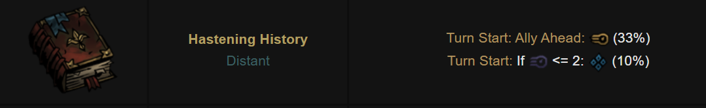\
*[Hastening History trinket](https://darkestdungeon.wiki.gg/wiki/Trinkets_(Darkest_Dungeon_II)#Hastening_History)*

Here is its definition in CSV files, without the cost elements.

```csv
element_start,trinket_city_hastening_history,Item
m_type,trinket,
m_possessionLimit,1,
m_maxQty,1,
m_combinable,False,
m_isConsumable,False,
sub_type,rare,
m_buyCostId,trinket_city_hastening_history_buy_cost,
m_sellCostId,trinket_distant_sell_cost,
m_DiscardGameScorePerQty,1,
element_end

element_start,trinket_city_hastening_history,ActorDataExternalBuffs
buffs,trinket_city_hastening_history_01,trinket_city_hastening_history_02,
element_end

// chance to apply a speed token to a neighboring ally on this hero's turn start

element_start,trinket_city_hastening_history_01,Buff
m_DurationType,infinite,
element_end

element_start,trinket_city_hastening_history_01,ActorDataEffects
actor_effect_triggers,turn_end_ally_front_speed_token_33pct,
element_end

element_start,turn_end_ally_front_speed_token_33pct,ActorEffectTrigger
m_ActorEffectType,turn_end,
m_ActorEffectTriggerSourceType,target,
m_ActorEffectTriggerTargetType,neighbor,
m_NeighborFrontCount,1,
m_IncludeSourceActor,False,
m_ActorCount,1,
effects,add_1_speed_33pct,
element_end

element_start,add_1_speed_33pct,Effect
m_Chance,0.33,
m_TokenAddId,speed,
m_TokenAddAmount,1,
m_ShowValue,False,
element_end

// stun if speed stat is 2 or less

element_start,trinket_city_hastening_history_02,Buff
m_DurationType,infinite,
element_end

element_start,trinket_city_hastening_history_02,ActorDataEffects
turn_start_effects,add_1_stun_10pct_spd_2orless,
element_end

element_start,add_1_stun_10pct_spd_2orless,Effect
m_Chance,0.1,
m_TokenAddId,stun,
m_TokenAddAmount,1,
m_ShowValue,False,
all_conditions,performer_speed_2orless,
element_end

element_start,performer_speed_2orless,Condition
m_ConditionType,actor_stat_value,
m_ConditionActorType,PERFORMER,
m_ConditionString,speed,
m_ConditionNumber,2,
m_ConditionNumberType,LESS_THAN_OR_EQUAL,
element_end
```

<!-- Here the *ActorEffectTrigger* applies an effect to one neighbor in front of the hero.

*ActorEffectTrigger* elements are connected to *ActorDataEffects* through the *actor_effect_triggers* field. -->

I am quite confused about *ActorEffectTrigger* elements. I will write how I understand them but I have no certainty. The general idea of an element of this type is this:
- *m_ActorEffectType* field tells when effects are going to be applied.
- *m_ActorEffectTriggerSourceType* field tells from whom these effects should originate.
- *m_ActorEffectTriggerTargetType* field tells to whom these effects should be applied (independent from the previous field).

In more details:
- *m_ActorEffectType*. This field can be set to:
    - *performer*: a hero counts as a performer anytime they perform a skill (11 hero skills), riposte, pass a turn, uses a turn to move between ranks. When this value is chosen, effects can be applied to the performer only.
    - *target*: effects are applied at the same moments as with the *performer* value except nothing is applied on miss. It can apply effects both to performer and the target.
    - *enemy_death*: needs to be applied as a hero buff, it doesn't work if it is connected to an *ActorDataSkill* element. This value doesn't allow to apply effects to corpses that appear after the killing blow. Effects aren't applied on clearing corpses either.
    - *death*, *deaths_door_enter*, *deaths_door_survive*: didn't test them.
    - *on_resist*: effects are activated on bleed/burn/blight/debuff resist. Didn't test it.
    - *on_[hit / crit / kill / miss]_as_target_to_target*: activates effects when the hero is attacked.
    - *on_[hit / crit / kill / miss]_as_performer_to_performer*: activates effects when the hero attacks.
- *m_ActorEffectTriggerSourceType* can be either *target*, *performer*, or not specified. This field tells from whom effects should originate. It has meaning for two-sided effects like copying or stealing tokens. It also matters for skills like Fester, where effects should account for Flagellant's Blight RES Piercing, not corpse's.
- *m_ActorEffectTriggerTargetType* tells to whom effects should be applied.
    - *friendly_team*, *enemy_team*
    - *performer*, *target*
    - *neighbor*: if this value is set, then additional fields are available:
        - *m_NeighborActorEffectTriggerSourceType* is either *performer* or *target*. It tells whose neighbors will be affected.
        - *m_NeighborFrontCount*: number of neighbors in front.
        - *m_NeighborBackCount*: number of neighbors behind.
- *m_IncludeSourceActor*.
- *m_ActorCount*: number of heroes/monsters to be affected. If this number is less than the number of heroes/monsters that previous fields stated, then effects are applied randomly to no more than to *m_ActorCount* heroes/monsters.
- *m_UseActorDataEffectsConditionCalculationInput*. No idea what this does.

I will show some examples of skills and buffs that use *ActorEffectTrigger* elements.

The Aspirant's Burning Stars copies burn from self to target. The copy effect by itself copies burn from the target to the performer, which is the opposite than what needed. *ActorEffectTrigger* elements allow to reverse the effect:
```csv
element_start,occ_the_burning_stars_p3_u_aet,ActorEffectTrigger
m_ActorEffectType,target,
m_ActorEffectTriggerSourceType,target,
m_ActorEffectTriggerTargetType,performer,
m_IncludeSourceActor,True,
m_ActorCount,1,
effects,copy_all_burn_dot,
element_end
```
The source (performer) became the target and the target became the source (performer). For the regular copying from target to performer this is unnecessary as it can be achieved with a regular *Effect* element directly.

<!-- It looks like when *on_[hit / crit / kill / miss]_as_target_to_target* or *on_[hit / crit / kill / miss]_as_performer_to_performer* is used, the hero takes both the target and the performer roles. For example here is a part from the Virtuoso's Finale data.
```csv
element_start,jes_virtuoso_finale_kill_aet,ActorEffectTrigger
m_ActorEffectType,on_kill_as_performer_to_performer,
m_ActorEffectTriggerSourceType,performer,
m_ActorEffectTriggerTargetType,friendly_team,
m_IncludeSourceActor,False,
m_UseActorDataEffectsConditionCalculationInput,True,
m_ActorCount,4,
effects,stress_heal_1_50pct,
element_end
```
And here is a part of the Killer's Glow Infernal Flame data:
```csv
element_start,infernal_killing_blow_allies_aet,ActorEffectTrigger
m_ActorEffectType,On_Kill_As_Performer_To_Performer,
m_ActorEffectTriggerSourceType,target,
m_ActorEffectTriggerTargetType,friendly_team,
m_IncludeSourceActor,False,
m_ActorCount,4,
effects,stress_damage_1_infernal_killing_Blow,
element_end
```

The Virtuoso's Finale removes 1 Stress from allies when an enemy is killed. The Killer's Glow adds 1 Stress to allies when an enemy is killed. Their *ActorEffectTrigger* elements are very similar except for one line: the Finale has *m_ActorEffectTriggerSourceType* set to *performer*, and The Killer's Glow has it set to *target*. -->

<!-- This is because i'm stupid -->

<!-- jester's source type tells that stress heal comes from the jester. -->

<!-- flame's source type tells that stress damage comes from the enemy -->

<!-- it can matter if some other effect retaliates stress heal/damage -->

The Flagellant's Fester skill clears a corpse and applies blight to its neighbors. Here is the definition of the corresponding *ActorEffectTrigger*:
```csv
element_start,flg_fester_neighbor_blight,ActorEffectTrigger
m_ActorEffectType,target,
m_ActorEffectTriggerSourceType,performer,
m_ActorEffectTriggerTargetType,neighbor,
m_NeighborFrontCount,1,
m_NeighborBackCount,1,
m_NeighborActorEffectTriggerSourceType,target,
m_IncludeSourceActor,False,
m_ActorCount,2,
effects,skill_dot_medium_blight,
element_end
```

<!-- At first I was confused because seemingly the same effect can be achieved by setting *m_ActorEffectTriggerSourceType* to *target*. This way it wouldn't be necessary to use the *m_NeighborActorEffectTriggerSourceType* field to override whose neighbors will be affected. -->

The application of blight needs to account the blight RES Piercing stat. If the *m_ActorEffectTriggerSourceType* was set to *target*, then the Piercing stat would be taken from the targeted corpse. To make it use Flagellant's Piercing stat this field should be set to *performer*.

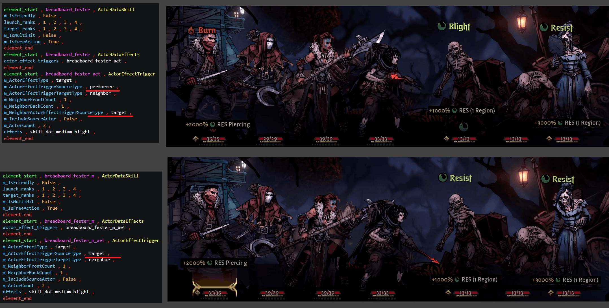\
*I conducted an experiment: I created two skills that are similar to Fester but one of them used *target* for *m_ActorEffectTriggerSourceType*. Then I gave +2000% Blight RES Piercing to a hero, +1000% Blight RES to a Lost Soul, and +3000% Blight RES to a Widow. A Lost Soul between them wasn't buffed. The skill, that used the performer value, was able to apply Blight to a target with less Blight RES. The second skill, that used the target value, wasn't able to apply Blight to any target*

Meaning of *ActorEffectTrigger*'s fields seems to alter a lot depending on what is set in the *m_ActorEffectType* field. I did some more testing:

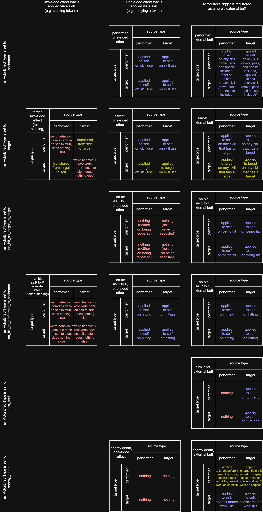\
*ActorEffectTrigger elements behave differently depending on what they are attached to (they can be attached to a skill, or they can be attached as a hero buff). In this image, one big square stands for one combination of m_ActorEffectType value and attachment place. For example, the square that has "target, one-sided effect" shows what happened when I tried to use ActorEffectTrigger to apply a one-sided effect, set its type to target, and attached it to a skill.*

I can't figure out a general rule for this data. Guess it's better to just copy examples from the official data.

Some trinkets (like Cursed Coin or Hag's Hoard) have some kind of scaling of their effects. The Cursed Coin trinket increases damage per positive token. The Hag's Hoard trinket increases healing received per positive token.

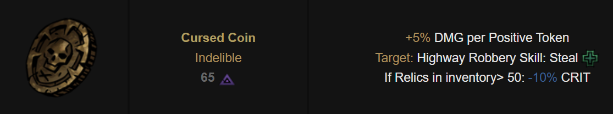\
*[Cursed Coin trinket](https://darkestdungeon.wiki.gg/wiki/Trinkets_(Darkest_Dungeon_II)#Cursed_Coin)*

```csv
element_start,trinket_hwy_cursed_coin_01,Buff
m_DurationType,infinite,
m_ConditionId,performer_has_multiple_positive_tokens,
element_end

element_start,trinket_hwy_cursed_coin_01,ActorDataStats
key_map,health_damage_dealt_percent,
add_stats,0.05,
element_end

element_start,performer_has_multiple_positive_tokens,Condition
m_ConditionType,token_tag_amount,
m_ConditionActorType,PERFORMER,
m_ConditionString,positive,
m_ConditionNumber,1,
m_ConditionNumberType,MULTIPLE,
element_end
```

It looks like it is achieved through *Condition* elements by setting *m_ConditionNumberType* to *MULTIPLE*.

## Creating hero trinkets

Trinkets can be created the same way as inn items in Darkside.

<!-- Since I already had a signature inn item, I duplicated the Prefab file and the Resource Item file three times and renamed them.

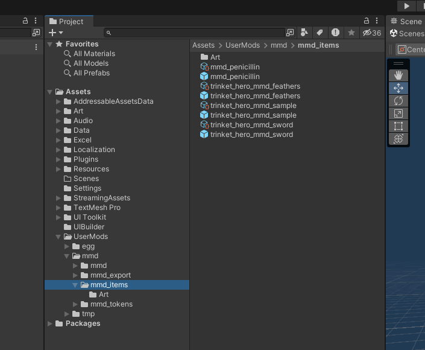\
*Inn items and trinkets can be placed inside the main mod folder without any issues*

I added my images in the `Art` folder, changed their type to Sprite, then connected each Resource Item file to its according Prefab file.

All my CSV data is stored in one file so the trinket CSV data also went in that file. -->

A trinket can be limited to a class this way:
```csv
element_start,trinket_hero_hwy_cursed_coin,Item
m_type,trinket,
⋮
m_conditionIds,performer_is_highwayman,
element_end
```

<!-- Each hero has three associated trinkets and one signature inn item. Hero trinkets usually resemble something from the past. Signature items are more tied to the present. -->

Hero trinkets have some effects that general trinkets usually don't. They trinkets can affect specific skills or require specific ranks (general trinkets only use relative rank referencing).

There are two ways to make a trinket affect specific skills. GR's His Rings trinket uses both of them.

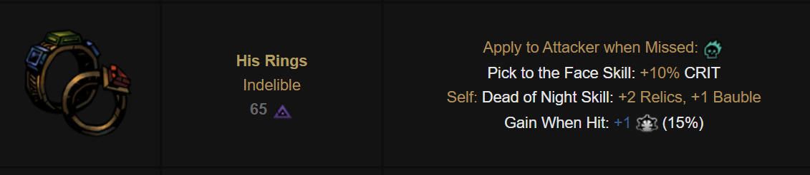\
*[His Rings trinket](https://darkestdungeon.wiki.gg/wiki/Trinkets_(Darkest_Dungeon_II)#His_Rings)*

Here is a shortened definition of this trinket:

```csv
element_start,trinket_hero_gr_his_rings,Item
m_type,trinket,
m_possessionLimit,1,
m_maxQty,1,
m_combinable,False,
m_isConsumable,False,
sub_type,epic,
m_UnlockId,grave_robber_5,
m_buyCostId,trinket_hero_gr_his_rings_buy_cost,
m_sellCostId,trinket_indelible_sell_cost,
m_DiscardGameScorePerQty,1,
m_conditionIds,performer_is_grave_robber,
element_end

element_start,trinket_hero_gr_his_rings,ActorDataExternalBuffs
buffs,trinket_gr_his_rings_01,trinket_gr_his_rings_02,trinket_gr_his_rings_03,trinket_gr_his_rings_04,
element_end

// +10% crit for the Pick to the Face skill.

element_start,trinket_gr_his_rings_02,Buff
m_DurationType,infinite,
m_ConditionId,skill_is_gr_pick_to_the_face,
element_end

element_start,trinket_gr_his_rings_02,ActorDataStats
key_map,crit_chance,
add_stats,0.1,
element_end

element_start,skill_is_gr_pick_to_the_face,Condition
m_ConditionType,skill,
m_ConditionActorType,NONE,
m_ConditionString,gr_pick_to_the_face,
m_ConditionNumberType,BOOL,
element_end

// Relics and baubles when the Dead of Night skill used

element_start,trinket_gr_his_rings_03,Buff
m_DurationType,infinite,
element_end

element_start,trinket_gr_his_rings_03,ActorDataEffects
performer_effects,add_relics_if_dead_of_night,add_baubles_if_dead_of_night,
element_end

element_start,add_relics_if_dead_of_night,Effect
m_Chance,1,
m_LootIds,RELICS_TINY,
all_conditions,skill_is_gr_dead_of_night,
element_end

element_start,add_baubles_if_dead_of_night,Effect
m_Chance,1,
m_LootIds,BAUBLES_MINUSCULE,
all_conditions,skill_is_gr_dead_of_night,
element_end

element_start,skill_is_gr_dead_of_night,Condition
m_ConditionType,skill,
m_ConditionActorType,NONE,
m_ConditionString,gr_dead_of_night,
m_ConditionNumberType,BOOL,
element_end
```

Here **gr_pick_to_the_face** and **gr_dead_of_night** IDs of GR's skills.

A buff can be limited to a specific skill by using the *m_ConditionId* field in the *Buff* element. This is used in the **trinket_gr_his_rings_02** buff.

An effect can be limited to a specific skill by using the *all_conditions* field in *Effect* elements. This is used in *Effect* elements that are connected to the **trinket_gr_his_rings_03** buff.

I don't know the difference between these two ways.

Hero Trinkets have several loot tables. Here is how Abomination's three trinkets are added to loot tables:

```csv
element_start,TRINKETS_HERO_ALL,LootTable
m_chances,1,1,1,1,1,1,
m_qtys,1,1,1,1,1,1,
m_ids,trinket_hero_abm_lock,trinket_hero_abm_antidote,trinket_hero_abm_confession,trinket_hero_abm_lock,trinket_hero_abm_antidote,trinket_hero_abm_confession,
m_types,item,item,item,item,item,item,
m_tags,
m_conditions,hero_party_has_abomination,hero_party_has_abomination,hero_party_has_abomination,kingdom_inn_has_abomination,kingdom_inn_has_abomination,kingdom_inn_has_abomination,
element_end

element_start,TRINKETS_HERO_ALL_UNCONDITIONAL,LootTable
m_chances,1,1,1,
m_qtys,1,1,1,
m_ids,trinket_hero_abm_lock,trinket_hero_abm_antidote,trinket_hero_abm_confession,
m_types,item,item,item,
m_tags,
m_conditions,
element_end

element_start,TRINKETS_HERO_ABM,LootTable
m_chances,1,1,1,
m_qtys,1,1,1,
m_ids,trinket_hero_abm_lock,trinket_hero_abm_antidote,trinket_hero_abm_confession,
m_types,item,item,item,
m_tags,
m_conditions,hero_party_has_abomination,hero_party_has_abomination,hero_party_has_abomination,
element_end

element_start,TRINKETS_HERO_ABM_UNCONDITIONAL,LootTable
m_chances,1,1,1,
m_qtys,1,1,1,
m_ids,trinket_hero_abm_lock,trinket_hero_abm_antidote,trinket_hero_abm_confession,
m_types,item,item,item,
m_tags,
m_conditions,
element_end
```

The first two tables add trinkets to the standard hero trinket tables. The third table is not used. The fourth table is used for run goal rewards.

## Skills

Adding custom skills to the game was described in the section about importing Animations. But it if animations are not ready:

1. Create an *ActorDataSkill* element for a custom skill in hero's CSV file.
2. In the `F/data` folder in Darkside rename one of the RZIS files to the ID of the *ActorDataSkill* element. These should match.
3. If this was one of the HWM's five starting skills, then find the *SkillSet* element in hero's CSV file and replace one of the IDs inside to the ID of the custom skill.

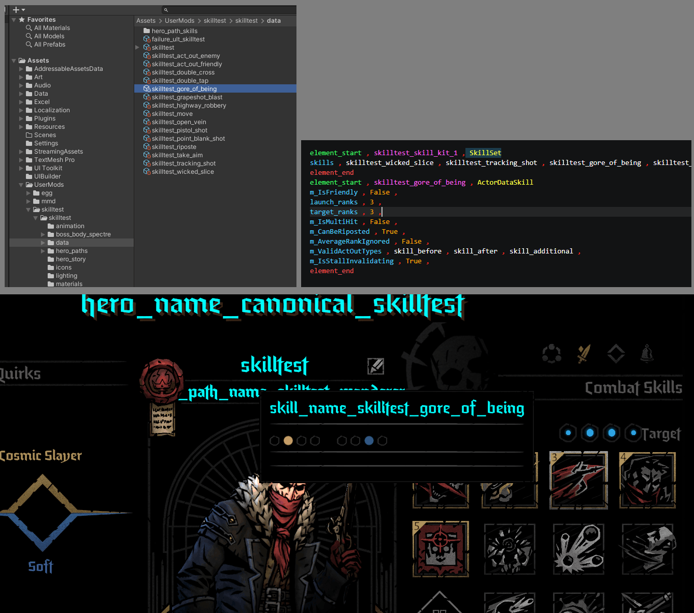\
*Adding a new skill*

In CSV data a skill starts with an *ActorDataSkill* element. Same as trinkets and inn items, this element needs to be connected to other elements to obtain more effects.

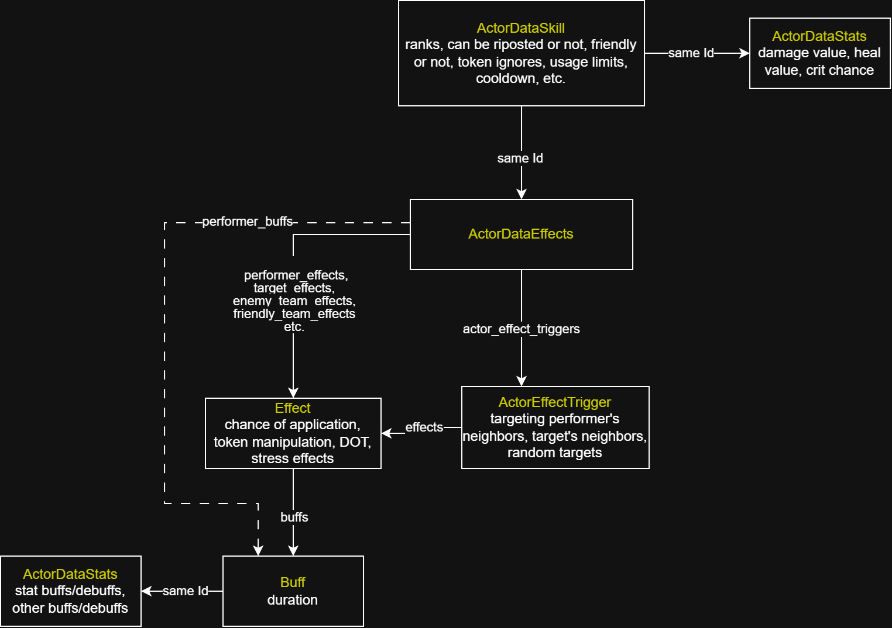\
*General schema of a skill element*

I will explain a couple of skills in the game. The first one is HWM's Wicked Slice.

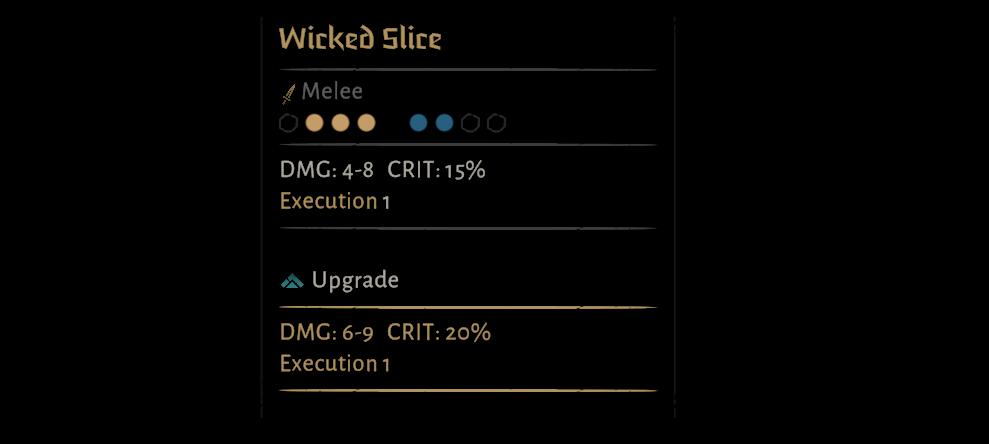\
*Wicked Slice skill*

Here is the definition of the unupgraded version of the skill:

```csv
element_start,hwm_wicked_slice,ActorDataSkill
m_IsFriendly,False,
launch_ranks,1,2,3,
target_ranks,1,2,
m_IsMultiHit,False,
m_CanBeRiposted,True,
m_AverageRankIgnored,False,
m_ValidActOutTypes,skill_before,skill_after,skill_additional,
token_ignores,til_execution_1,
m_Tags,melee,hwm_wicked_slice,
performer_buffs,execution_1_tooltip,
m_IsStallInvalidating,True,
element_end

element_start,hwm_wicked_slice,ActorDataStats
key_map,health_damage,health_damage_range,crit_chance,
add_stats,4,4,0.15,
element_end
```
In this skill element:
- *m_IsFriendly* tells from which team this skill will choose a target. If it's set to *False*, the skill will offer to choose a target from the enemy team. If it's set to *True*, the skill will offer to choose a target from the friendly team.
- *launch_ranks* is the list of ranks from which the skill is accessible. *1* stands for the front rank. *4* stands for the back rank.
- *target_ranks* is the list of enemy ranks that the skill can target (friendly ranks if the skill is friendly). The enemy ranks are the same as friendly ones: *1* stands for the front rank for both teams. If the skill only targets the performer then this field is not used.
    - *target_ranks* can be replaced with *m_TargetRelativeRanks* for relative rank selection. For example, move skills, Unchained's Absolution skill, or Tempest's Ruin skill.
- If *m_IsMultiHit* is set to *True* then the skill will try to target all ranks that are specified in the *target_ranks* field.
- *token_ignores* tells which tokens are ignored by the skill.
- *m_Tags* assigns tags to the skill. Common skill tags are *melee*, *ranged*, and *heal*. They are required for some mechanics. For example Act 1 boss can block melee skills, and if the skill isn't tagged as *melee*, it will not be blocked. 
- *m_IsStallInvalidating* is for detecting stalling I guess. Non-damaging hero skills have this field set to *False*, damaging hero skills have this field set to *True*. Enemies' skills have this field set to *False*.
- *m_AverageRankIgnored* is set to *True* for skills that aren't limited by ranks in any way (move skills, act out skills, riposte skills, skills that list all ranks in *launch_ranks* and *target_ranks*). I don't know what it does though.

**til_execution_1** is a *TokenIgnore* element that tells that the skill ignores 1 Death' Door Armor. Some other *TokenIgnore* elements: **til_execution_2**, **til_execution_3**, **til_ignore_block**, **til_ignore_block_plus**, **til_piercing** (block and block plus), **til_ignore_dodge**, **til_ignore_dodge_plus**, **til_unavoidable** (dodge and dodge plus), **til_ignore_guard**, **til_ignore_stealth** etc.

This skill also has an **execution_1_tooltip** buff. This is an empty buff that serves as a placeholder for the skill's tooltip. For some reason the **til_execution_1** doesn't add anything to the tooltip, while other *TokenIgnore* elements are visible in tooltips.

Skill's damage range is defined in the *ActorDataStats* element. Skill's damage without modifiers ranges from *health_damage* to *health_damage* + *health_damage_range*.

Upgraded versions of skills are defined almost the same way as the unapgraded versions but with some modifications.
- The upgraded version of the skill doesn't need a separate file in Darkside. One file is enough for both versions of the skill.
- IDs of upgraded version have a *_u* suffix. It seems that this suffix is a hard requirement for IDs of upgraded skills.
- *launch_ranks* and *target_ranks* should still be defined with the same values. I think it would still work if the ranks are different but tooltips won't show this.
- The upgraded version needs *m_ConditionIdOverride* and *m_SkillHistoryIdOverride* fields added and they should be set to the ID of the unupgraded version. I don't know what they do though.
- Upgraded skills also have *Unlock* elements with the same ID.
- All upgraded skills have the "*m_SkillModifierChanceModifiers*,*curse*,3," line. Maybe it makes upgraded skills more susceptible to negative relationships.

CSV data of the upgraded version of the HWM's Wicked Slice:

```csv
element_start,hwm_wicked_slice_u,ActorDataSkill
m_IsFriendly,False,
launch_ranks,1,2,3,
target_ranks,1,2,
m_IsMultiHit,False,
m_CanBeRiposted,True,
m_AverageRankIgnored,False,
m_ValidActOutTypes,skill_before,skill_after,skill_additional,
token_ignores,til_execution_1,
m_Tags,melee,hwm_wicked_slice,
m_ConditionIdOverride,hwm_wicked_slice,
m_SkillHistoryIdOverride,hwm_wicked_slice,
performer_buffs,execution_1_tooltip,
m_IsStallInvalidating,True,
m_SkillModifierChanceModifiers,curse,3,
element_end

element_start,hwm_wicked_slice_u,ActorDataStats
key_map,health_damage,health_damage_range,crit_chance,
add_stats,6,3,0.2,
element_end

element_start,hwm_wicked_slice_u,Unlock
m_RequirementIds,hwm_wicked_slice,
m_CostId,hero_skill_upgrade,
element_end
```

Skills can apply buffs in a similar way inn items do, using intermediary *Effect* elements to apply buffs.

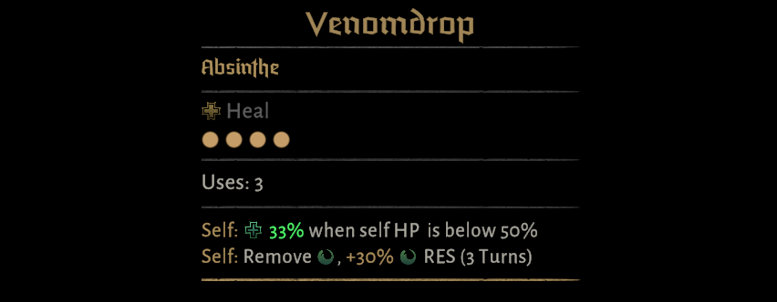\
*Absinthe skill*

Here's the definition of the Venomdrop's Absinthe skill:

```csv
element_start,gr_absinthe_p3,ActorDataSkill
m_IsFriendly,True,
m_IsFriendlySelfTargetValid,True,
launch_ranks,1,2,3,4,
m_IsMultiHit,False,
m_Limit,3,
m_AverageRankIgnored,True,
m_ValidActOutTypes,skill_before,skill_after,skill_block,
m_Tags,heal,gr_artemisia,
m_ConditionIdOverride,gr_artemisia,
m_SkillHistoryIdOverride,gr_artemisia,
m_IsStallInvalidating,False,
element_end

element_start,gr_absinthe_p3,ActorDataEffects
performer_apply_limit_effects,heal_33pct_self_threshold_high,
performer_apply_limit,1,
performer_effects,remove_all_blight,grv_venomdrop_absinthe_blight_res_e,
element_end

// heal with condition

element_start,heal_33pct_self_threshold_high,Effect
m_Chance,1,
m_HealthHealPercent,0.33,
m_CritChance,0.05,
m_CritMultiplier,0.5,
all_conditions,performer_meets_heal_threshold_high,
element_end

element_start,performer_meets_heal_threshold_high,Condition
m_ConditionType,health_percent,
m_ConditionActorType,PERFORMER,
m_ConditionNumber,0.5,
m_ConditionNumberType,LESS_THAN,
element_end

// remove blight

element_start,remove_all_blight,Effect
m_Chance,1,
m_DotRemoveAllTypes,blight,
all_conditions,target_has_blight_dot_hidden,
element_end

element_start,target_has_blight_dot_hidden,Condition
m_ConditionType,dot_tag_amount,
m_ConditionActorType,TARGET,
m_ConditionString,blight,
m_IsVisible,False,
m_ConditionNumber,1,
m_ConditionNumberType,GREATER_THAN_OR_EQUAL,
element_end

// buff blight resistance

element_start,grv_venomdrop_absinthe_blight_res_e,Effect
m_Chance,1,
buffs,grv_venomdrop_absinthe_blight_res,
element_end

element_start,grv_venomdrop_absinthe_blight_res,Buff
m_DurationType,performer_turn_end,
m_DurationAmount,3,
m_Tags,buff,
element_end

element_start,grv_venomdrop_absinthe_blight_res,ActorDataStats
sub_stat,resistance,blight,0.3,
element_end
```

This skill doesn't use *target_ranks* because it only targets the performer. Skills that can target the performer have *m_IsFriendlySelfTargetValid* field set to *True*.

*m_Limit* tells how many times the skill can be used. Some other skill modifiers: *m_Cooldown* (adds a cooldown), *m_IsFreeAction* (doesn't use a turn if it's set to *True*).

<!-- This skill has *gr_artemisia* tag, probably because it was its previous name. It also uses *performer_apply_limit_effects* to link to the healing effect. This field is usually used when only one effect from a list of effects should be applied. But here the list consists from one effect only. I guess this skill was supposed to give random effects before. -->

Since it is a path skill, it has *m_ConditionIdOverride* and *m_SkillHistoryIdOverride* fields. Path skills need these fields in both upgraded and unupgraded versions

*m_CritMultiplier* here tells that crit will add 50% to the healed value.

**target_has_blight_dot_hidden** condition is not visible in the tooltip (emphasized by the _hidden suffix). To make a requirement invisible in tooltips the *m_IsVisible* field should be set to *False*.

*m_Tags* field in *Buff* elementscan be used to add visual indicators to the sides of a healthbar. If a buff is tagged as *buff*, then it will add an indicator to the left to a healthbar. If a buff is tagged as *debuff*, then it will add an indicator to the right to a healthbar. Tagging a negative buff as *debuff* will also allow targets to resist this buff.

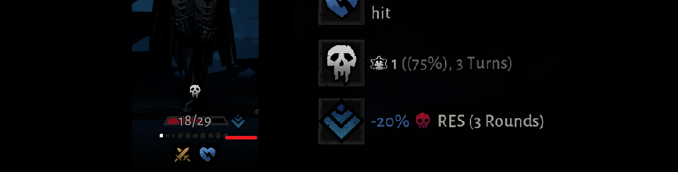\
*A buff tagged as debuff*

Adding *debuff_pop_text* or *buff_pop_text* will show "Debuff!" or "Buff!" text above targeted hero upon applying this buff.

Some buffs can be applied directly to the skill. Usually these are one-time buffs that expire right after the skill is used. For example, increasing crit chance if the target has a Combo token, or increasing Blight RES Piercing if the target has Bleeding.

Hatchetman's Finishing Blow skill deals double damage if the target has a Combo token.

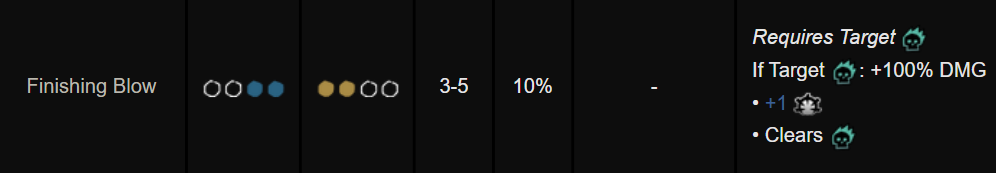\
*[Hatchetman's skill](https://darkestdungeon.wiki.gg/wiki/Pillager_Hatchetman)*

Here's the CSV definition of this skill.

```csv
element_start,pillager_melee_sever,ActorDataSkill
m_IsFriendly,False,
launch_ranks,1,2,
target_ranks,1,2,
m_IsMultiHit,False,
m_AllConditionIds,target_is_combo_primed,
m_CanBeRiposted,True,
m_AverageRankIgnored,False,
m_IsForced,True,
m_IsBlockPass,True,
m_ValidActOutTypes,skill_before,skill_after,skill_additional,
m_Tags,melee,pillager_melee_sever,
performer_buffs,combo_damage_boost_100pct,
m_IsStallInvalidating,False,
element_end

element_start,pillager_melee_sever,ActorDataStats
key_map,health_damage,health_damage_range,crit_chance,
add_stats,3,2,0.1,
element_end

// Double damage when target has the Combo token.
// Connected directly to the ActorDataSkill.

element_start,combo_damage_boost_100pct,Buff
m_DurationType,skill_calculate,
m_DurationAmount,1,
m_ConditionId,target_is_combo_primed,
element_end

element_start,combo_damage_boost_100pct,ActorDataStats
key_map,health_damage_dealt_percent,
add_stats,1,
element_end

element_start,target_is_combo_primed,Condition
m_ConditionType,token_amount,
m_ConditionActorType,TARGET,
m_ConditionString,combo,
m_ConditionNumber,1,
m_ConditionNumberType,GREATER_THAN_OR_EQUAL,
element_end

// Combo tokens need to be removed manually

element_start,pillager_melee_sever,ActorDataEffects
target_effects,stress_damage_1,end_combo,
element_end

element_start,end_combo,Effect
m_Chance,1,
m_IsCombo,True,
m_TokenRemoveId,combo,
m_TokenRemoveAmount,1,
m_ShowValue,False,
m_IsVisible,False,
element_end
```

Combo buffs are connected to the *ActorDataSkill* through a *performer_buffs* field. These buffs have *m_DurationType* set to *skill_calculate* and the *m_DurationAmount* field set to 1.

Combo tokens need to be removed manually.

*m_IsForced* makes other skills unavailable if this skill can be used. Examples of forced skills: Sharpshoot's Double Tap (second shot), **pyro_bomb**, **medic_salve**, **harvest_hunger**, etc.

<!-- I don't know what *m_IsBlockPass* is but it is always used when a skill is forced and it is always set to *True*. -->

Warlock's Chaotic Offering grants one Unchecked Power on Round Start if this skill is equipped.

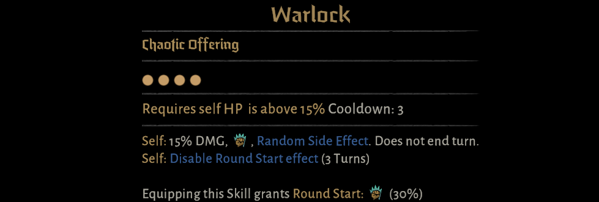\
*Warlock's Chaotic Offering*

When the Warlock enters a combat, he tries to apply a buff to self. If he has the skill equipped, the buff is applied, otherwise it isn't. This buff gives one Uchecked Power at Round Start. Skill equipment check is defined by a *Condition* element.

```csv
element_start,occ_warlock,ActorDataPath
m_ActorClassIds,occultist,
m_UnlockId,occultist_7,
m_OrderPriority,2,
m_Tags,warlock,occ_path,
element_end

element_start,occ_warlock,ActorDataEffects
combat_start_effects,occ_chaotic_offering_p2_buff_e,occ_chaotic_offering_p2_u_buff_e,
element_end

// apply a buff if this skill is equipped

element_start,occ_chaotic_offering_p2_buff_e,Effect
m_Chance,1,
buffs,occ_chaotic_offering_p2_buff,
all_conditions,skill_equipped_occ_chaotic_offering_p2,
m_IsVisible,False,
element_end

element_start,skill_equipped_occ_chaotic_offering_p2,Condition
m_ConditionType,skill_equipped,
m_ConditionActorType,PERFORMER,
m_ConditionString,occ_chaotic_offering_p2,
m_ConditionNumberType,BOOL,
element_end

// buff definition

element_start,occ_chaotic_offering_p2_buff,Buff
m_DurationType,combat_end,
m_DurationAmount,1,
m_Tags,buff,
m_InstanceLimit,1,
element_end

element_start,occ_chaotic_offering_p2_buff,ActorDataEffects
round_start_effects,add_1_unchecked_power_p2_chaotic_chance,
element_end
```

<!-- Some CSV words that can be helpful when creating skills:
- adding tokens: *m_TokenAddId*, *m_TokenAddTag*
- removing tokens: *m_TokenRemoveId*, *m_TokenRemoveTag*
- ignoring resistances: *m_IgnoreResist*
- positional tokens: *m_IsRankToken*, *m_IsLockedTeamPosition*
- summoning: *m_SummonClassActorId*
- changing class id (carion eater evolving, fanatics igniting, bishop’s reviving): *m_ChangeClassActorId*
- targets of effects: *performer_effects*, *target_effects*
- effects when spawning: *spawn_effects*
- additional effects to all enemies/allies: *enemy_team_effects*, *friendly_team_effects*, *target_team_effects*
- additional effects to some enemies/allies: *m_ActorEffectTriggerSourceType*, *m_ActorEffectTriggerTargetType*
- targeting neighbors: *m_NeighborFrontCount*, *m_NeighborBackCount*
- Adding conditions (disjunction): *any_conditions*, *m_AnyConditionIds*
- Adding conditions (conjunction): *all_conditions*, *m_AllConditionIds*
- inflicting diseases: *m_QuirkAddTag*
- guaranteed Crossroads quirks: *m_IdGuaranteeGenerationLimits*
- rank conditions: **target_is_in_rank_**..., **performer_is_in_rank_**...
- skill cooldown: *m_Cooldown*
- skill max use amount: *m_Limit*
- skill that doesn’t end a turn: *m_IsFreeAction*
- add extra turn: **extra_action**
- token conversion: *m_TokenConvertFromTokenIds*, *m_TokenConvertToId*, *m_TokenConvertFromDotTags*
- stress damage/heal: *m_StressHeal*, *m_StressDamage*
- turn-based effects: *combat_start*, *combat_end*, *round_start*, *round_end*, *turn_start*, *turn_end*
- applying one effect from selection: ...*_apply_limit_effects*
- increasing DOT duration dealt: *dot_extra_duration_dealt* -->

Some fields look the same but they are not. For example *all_conditions* is used in *Effect* elements, *m_AllConditionIds* is used in *Buff* elements. They are not interchangeable.

Same as with inn items, *Effect* elements inside a skill might be disabled by their conditions. But even if all skill's effects are blocked, the skill itself is still usable. A skill can become unavailable by its own conditions or by external factors (forced skills, skill blocks).

If a skill has multiple targets, and this skill's conditions filter out some targets, then the skill will only be used on the targets that are left. For example, Flagellant's Necrosis.

Also for some reason zooming into other heroes during skill animation does not work if *friendly_team_effects* is used instead of *target_effects*.

## Paths

In Darkside Path seals are stored in the `F/hero_paths` folder. Added seal images need to be changed to sprites and attached to their respective Resource Actor Path files.

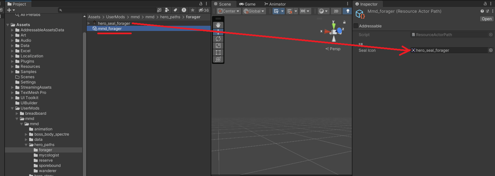\
*Adding a seal to a path*

In CSV path data starts with an *ActorDataPath* element. ID of this element must match the name of the Resource Actor Path file.

```csv
element_start,hwy_yellowhand,ActorDataPath
m_ActorClassIds,highwayman,
m_UnlockId,highwayman_10,
m_OrderPriority,3,
m_Tags,yellowhand,

element_end
element_start,hwy_yellowhand,DataExternalBuffs
buffs,path_descriptor_hwy_yellowhand,
element_end
```

*m_UnlockId* is used to lock a path behind the Altar of Hope. Without this field paths are available from the start.

*m_OrderPriority* tells what position the path should take in the list of paths. The lower the value, the higher the path will be on the list.

**path_descriptor_hwy_sharpshot** here is a fake buff that is used to add description to paths.

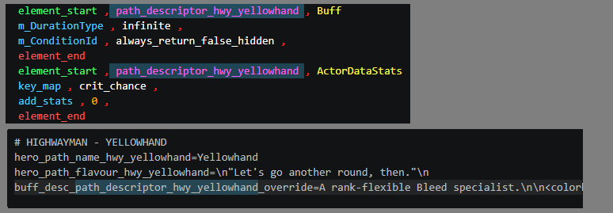\
*Path description in the localization file*

Path-specific buffs are added in various ways. For example, Yellowhand’s bleed on riposte is a regular effect on the riposte skill. This effect technically is present in all HWM paths, but this effect has a condition that checks if the performer has the yellowhand tag.

```csv
element_start,hwm_riposte,ActorDataSkill
m_IsFriendly,False,
launch_ranks,1,2,3,4,
target_ranks,1,2,3,4,
⁝
element_end

// HWM's riposte has two effects, one for yellowhand, one for other paths

element_start,hwm_riposte,ActorDataEffects
target_effects,prime_combo_hwy_not_yellowhand_33pct,hwy_yellowhand_riposte_bleed,
element_end

// effect that can't be triggered if the performer has yellowhand tag

element_start,prime_combo_hwy_not_yellowhand_33pct,Effect
m_Chance,0.33,
m_TokenAddId,combo,
m_TokenAddAmount,1,
m_ShowValue,False,
all_conditions,performer_not_hwy_yellowhand,
m_IsVisible,False,
element_end

element_start,performer_not_hwy_yellowhand,Condition
m_ConditionType,path_tag_amount,
m_ConditionActorType,PERFORMER,
m_ConditionString,yellowhand,
m_IsVisible,False,
m_ConditionNumber,0,
m_ConditionNumberType,EQUAL,
element_end

// effect that can't be triggered unless the performer has yellowhand tag

element_start,hwy_yellowhand_riposte_bleed,Effect
m_Chance,1,
m_DotAddId,skill_small_bleed_dot,
m_DotAddAmount,1,
all_conditions,performer_is_hwy_yellowhand,
m_IsVisible,False,
element_end

element_start,performer_is_hwy_yellowhand,Condition
m_ConditionType,path_tag_amount,
m_ConditionActorType,PERFORMER,
m_ConditionString,yellowhand,
m_IsVisible,False,
m_ConditionNumber,1,
m_ConditionNumberType,EQUAL,
element_end
```

Another way to add a buff can be found in the Surgeon’s data. To recover some health after a kill, an *ActorDataEffects* element is used:

```csv
element_start,plg_surgeon,ActorDataPath
m_ActorClassIds,plague_doctor,
m_UnlockId,plague_doctor_3,
m_OrderPriority,1,
element_end

element_start,plg_surgeon,ActorDataEffects
on_kill_as_performer_to_performer_effects,hot_heal_small,
element_end

element_start,hot_heal_small,Effect
m_Chance,1,
m_DotAddId,heal_hot_small,
m_DotAddAmount,1,
element_end
```

In CSV files path-specific skills and effects have _p1, _p2, or _p3 suffix. Unlike the _u suffix for skill upgrades, these suffixes aren't strictly required.

One more difference from Wanderer skills is that *m_ConditionOverride* and *m_SkillHistoryOverride* are used in both upgraded and not upgraded versions of a path skill. And they both are set to the ID of Wanderer's unupgraded skill.

The *Unlock* element of an upgraded version of a path skill needs to be linked to the unupgraded version of the same path skill, not to the Wanderer's skill.

```csv
// unupgraded path skill

element_start,hwm_pistol_shot_p2,ActorDataSkill
m_IsFriendly,False,
launch_ranks,3,4,
target_ranks,2,3,4,
⁝
m_ConditionIdOverride,hwm_pistol_shot,
m_SkillHistoryIdOverride,hwm_pistol_shot,
element_end

element_start,hwm_pistol_shot_p2,ActorDataStats
key_map,health_damage,health_damage_range,crit_chance,
add_stats,5,3,0.1,
element_end

// upgraded path skill

element_start,hwm_pistol_shot_p2_u,ActorDataSkill
m_IsFriendly,False,
launch_ranks,3,4,
target_ranks,2,3,4,
⁝
m_ConditionIdOverride,hwm_pistol_shot,
m_SkillHistoryIdOverride,hwm_pistol_shot,
m_SkillModifierChanceModifiers,curse,3,
element_end

element_start,hwm_pistol_shot_p2_u,ActorDataStats
key_map,health_damage,health_damage_range,crit_chance,
add_stats,7,3,0.15,
element_end

element_start,hwm_pistol_shot_p2_u,Unlock
m_RequirementIds,hwm_pistol_shot_p2,
m_CostId,hero_skill_upgrade,
element_end
```

To tell the game that this skill is a path skill, *SkillReplacement* and *ActorDataSkillReplacement* elements are used. The first element tells what element is switched to what. The second element gathers these replacements under one path.

```csv
element_start,hwy_sharpshot,ActorDataSkillReplacement
skill_replacements,sharpshot_double_tap_replacement,sharpshot_double_tap_u_replacement,sharpshot_grapeshot_blast_replacement,sharpshot_grapeshot_blast_u_replacement,sharpshot_pistol_shot_replacement,sharpshot_pistol_shot_u_replacement,sharpshot_point_blank_shot_replacement,sharpshot_point_blank_shot_u_replacement,
element_end

element_start,sharpshot_pistol_shot_replacement,SkillReplacement
m_FromActorDataSkillId,hwm_pistol_shot,
m_ToActorDataSkillId,hwm_pistol_shot_p2,
element_end

element_start,sharpshot_pistol_shot_u_replacement,SkillReplacement
m_FromActorDataSkillId,hwm_pistol_shot_u,
m_ToActorDataSkillId,hwm_pistol_shot_p2_u,
element_end

element_start,sharpshot_grapeshot_blast_replacement,SkillReplacement
m_FromActorDataSkillId,hwm_grapeshot_blast,
m_ToActorDataSkillId,hwm_grapeshot_blast_p2,
element_end

...
```

Path-specific skills require separate RZIS files:
1. In the `F/data` folder, copy the RZIS file of the skill that needs to be replaced in a path.
2. Create a folder for the new path.
3. Paste the RZIS file inside the created folder.
4. Rename the pasted RZIS file to match the ID of the path skill.

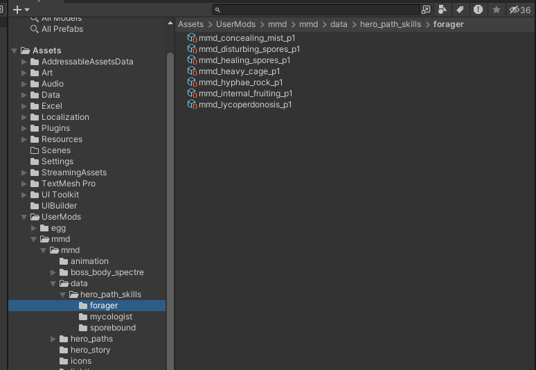\
*RZIS files of path skills*

Upgraded versions of path skills don't need separate RZIS files.

## Creating tokens

I created tokens following [this guide](https://docs.google.com/document/d/1FcWUTaz4nRhRtgW_haOZUEuLNB1u41Lqi03kav63f8Y/edit?tab=t.0#heading=h.c976l88xa9o). It focuses on creating multiple tokens but creating one token is similar:
1. In Darkside use the Token Creation Tool.
2. Replace the texture, set its type to Sprite.
3. Inspect the Resource Token file and attach the sprite.
4. Right click on the sprite, then in the Create section select TextMeshPro and then select SpriteAsset. Rename the resulting file to tmp_[token id].
5. Delete the file in the `Sprite Assets` folder.
6. Move the created tmp_[token id] file in the `Sprite Assets` folder.
7. Inspect the file, set BX to 0, set BY to the same value as H.

    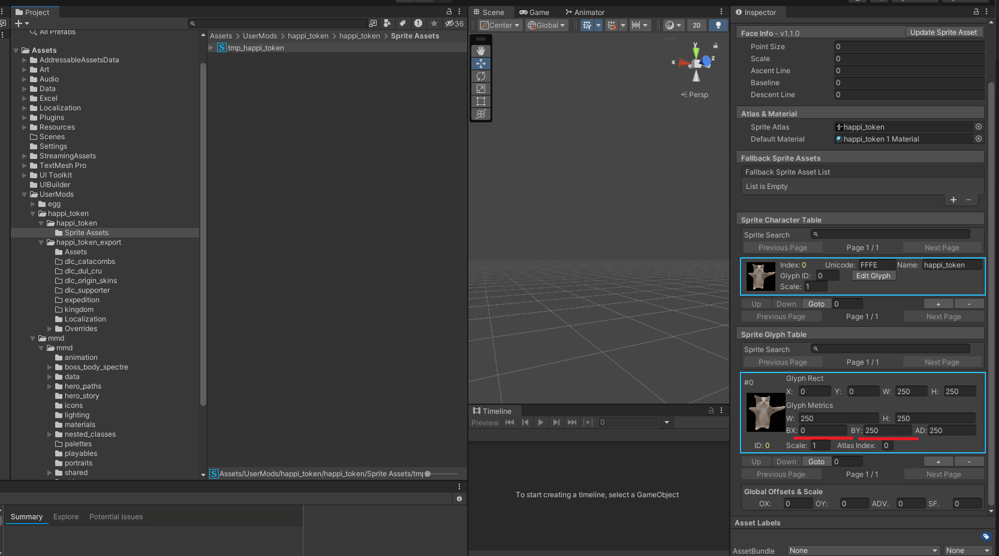\
    *If this isn't done, the token sprite will be cropped in tooltips*

8. Build the mod using the Steamworks tool and copy the `exports` folder.
9. To make it appear in the Token Glossary the CSV data should have glossary tags, for example "m_TokenGlossaryHeroTag,vestal," line in the *Token* element.

After that the token should appear in the Glossary and in tooltips of skills that use this token.

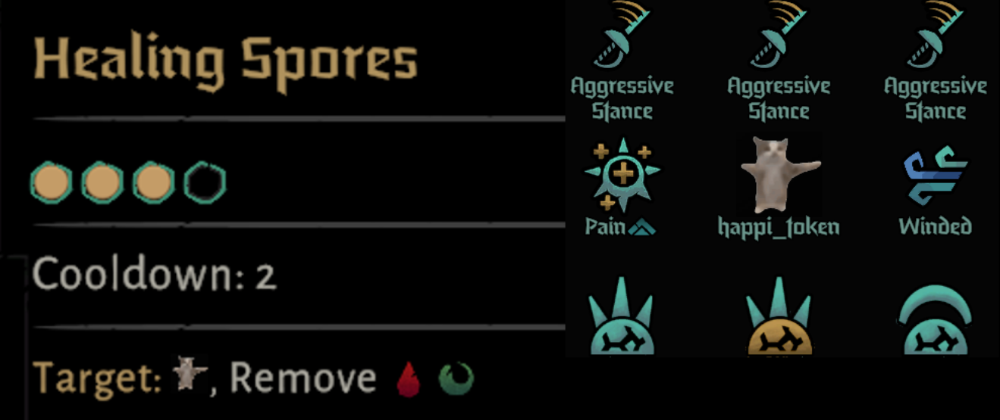\
*Token's name and description are set in localization files.*

To make a token positional, “m_IsRankToken,True,” should to be added to the *Token* element. And then “m_IsLockedTeamPosition,True,” should be added in all *Effect* elements that apply this token. The first line is for the visual square bracket under the token only.

Upgraded token is just a separate token. The upgrade symbol can be specified in a localization file:

```
token_mmd_token_heal=<sprite={q}mmd_tokens{q} name={q}mmd_token_heal{q}>
token_name_mmd_token_heal=<color=#{notable}>Healing Spores</color>
token_mmd_token_heal_description=Example Token Description

token_mmd_token_heal_u=<sprite={q}mmd_tokens{q} name={q}mmd_token_heal_u{q}>
token_name_mmd_token_heal_u=<color=#{notable}>Healing Spores<sprite name={q}icon_upgraded_skill{q}></color>
token_name_mmd_token_heal_u_sheet=<color=#{notable}>Healing Spores+</color>
token_mmd_token_heal_u_description=Example Token Description
```

Tokens can be shown in the Token Glossary depending on hero's path. Path-related tokens use the *m_TokenGlossaryPathTag* field.

To merge a token mod with my main mod, I copied the contents of the localization file and CSV file to the appropriate files in my main mod folder, then moved `token_mod/F` data into the main `F` folder.

Everything was good except the tooltips. They were showing localization text instead of icons.

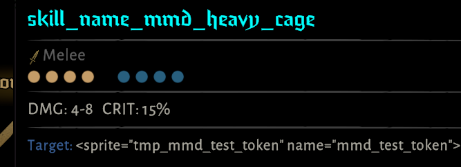\
*The tooltip just showed raw text from my localization file instead of substituting it with token's sprite*

I changed the group of the `Sprite Assets` folder to the group of the main mod. Then I wrote "Sprite Assets" in the "Addressable" field instead of what was there. This fixed the problem.

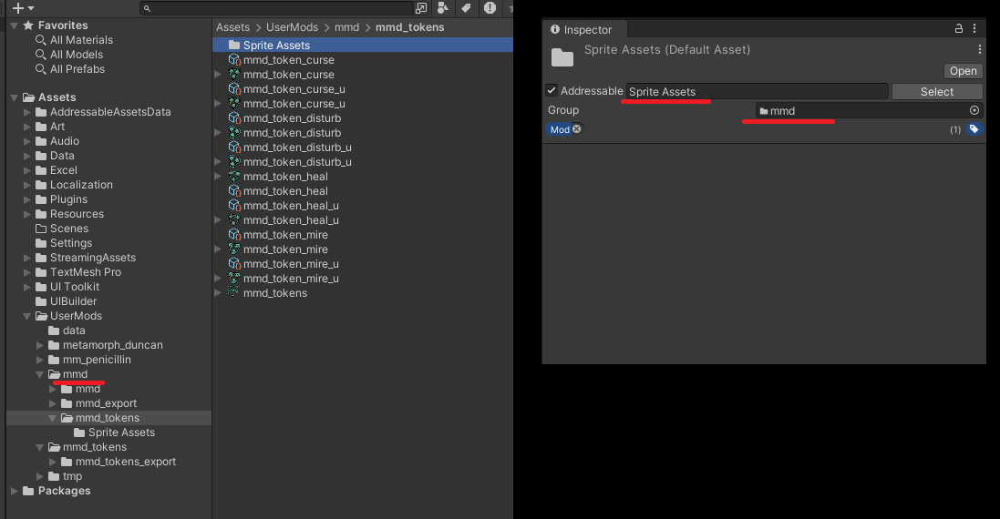\
*It looks like it doesn’t really matter to what folder the token data is being moved to as long as Addressables and Groups are correct*

It seems like it's not the very correct way of merging a token mod with a hero mod. Every time I used the Verify Integrity function in Steam it reset the Addressable field and the Group. Reconfiguring the `Sprite Assets` folder was then needed again.

## Localization

### Syntax

The localization file in the `exports` folder allows to set names to heroes, skills, items, etc. It also stores barks, token descriptions, skill tooltip adjustments and other stuff.

The game has its localization files as open as its CSV files:
```
C:\Program Files (x86)\Steam\steamapps\common\Darkest Dungeon® II\Darkest Dungeon II_Data\StreamingAssets\Localization\
```

The game uses two types of localization files: .txt and .po files. Plain text files store English data. Translations from English to other languages are stored in PO files.

English localization files use different syntax than CSV files. Every entry in localization files is one line and they have structure similar to this:
```
item_translation_id=Item's name on screen
```

Localization can be randomized by using the same localization ID:
```
random_localization=Option A
random_localization=Option B
random_localization=Option C
```

Localization files allow comments:
```
# comment
```

If something needs to be written in multiple lines, `\n` is used:
```
actor_verbose_description_mmd=“Defences crumble as the spores\nfill the air.”
```

Text can be colored by using this syntax:
```
actor_class_mmd_corpse=<color=#{deathdoor}>Parasitic Form</color>
```

Some colors:
- `<color=#{deathdoor}></color>`
- `<color=#{notable}></color>`
- `<color=#{buff}></color>`
- `<color=#{debuff}></color>`
- `<color=#{move}></color>`
- `<color=#{heal}></color>`
- `<color=#{bleed}></color>`
- `<color=#{burn}></color>`
- `<color=#{blight}></color>`
- `<color=#{stress}></color>`
- `<color=#{disease_quirk}></color>`
- etc.

<!-- And some specific colors:
- `<color=#{stat_reg}></color>`
- `<color=#{item_nameline}></color>`
- `<color=#{item_coach}></color>`
- `<color=#{item_pet}></color>`
- `<color=#{item_radiant}></color>`
- `<color=#{item_infernal}></color>`
- etc. -->

Colors can be custom, for example:

```
<color=#9e75e6>Custom Color</color>
```

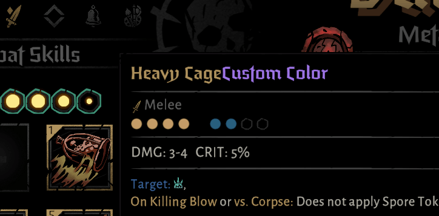\
*Custom localization color*


Parts of text can be emphasized, for example:
```
bark_act_out_start_my_turn_stress_dmg_partner+resentful=And we're supposed to trust <i>your</i> genius?
hero_path_flavour_occ_warlock=\n"Those beyond the veil hear my calls <b>and obey!</b>"\n
```

Some localizations can have fallbacks:

```
bark_item_blasphemous_idol=What harm is there in a small prayer and a bit of blood?
bark_item_blasphemous_idol+occultist=I will try to extract favours from this imp.
```

Here if the Occultist uses this idol then the game will display the second line. If a new hero that has ID, for example, **mmd**, uses this item then the game will try to find `bark_item_blasphemous_idol+mmd` localization. If there is no such localization, then the game will use the first line.

Localizations can use icons:
```
buff_leper_revenge_strength=Turn Start: <sprite name={q}token_strength{q}>
buff_combo_increase_bleed_amount_2=<color=#{buff}>+2 <sprite name={q}icon_bleed{q}> Dealt</color>
```

One way of localizing is to look at the blue text in the game and copy it to the localization file. For example I had this blue text:

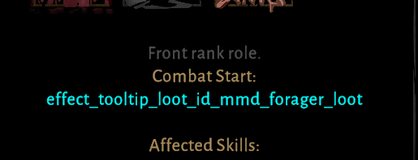\
*Missing localization*

I wrote this in my localization file:
```
effect_tooltip_loot_id_mmd_forager_loot=Get an Inn Item (50%)
```
And it fixed it.

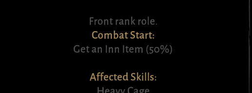\
*Fixed localization*

This is an intuitive way of localizing, but sometimes it is not enough.

Editing localization data doesn't require rebuilding the mod with the Steamworks tool.

The game does not generate tooltips for custom tokens in Token Glossary. They need to be manually defined in localization files.

### Names and barks

Hero's class and name are localized in this way:
```
highwayman=Highwayman
hero_select_highwayman=<sup><size=90%>The</size></sup> Highwayman
hero_name_canonical_highwayman=Dismas
```
Hero’s name wasn’t working for me until I disabled and reenabled the mod.

Path description and four main traits are specified like this:
```
actor_verbose_description_highwayman=“Violently versatile, ruthlessly pragmatic.”
actor_descriptors_highwayman=+ Any Rank\n+ High Dmg\n+ Versatile\n+ Riposte
```

Path localization is done in this way:
```
hero_path_name_hwy_wanderer=Wanderer
hero_path_flavour_hwy_wanderer=\n"To seek is to find."\n
buff_desc_path_descriptor_hwy_wanderer_override=<color=#{buff}>Riposte applies <sprite name={q}token_combo{q}></color>(33%)

hero_path_name_hwy_reserve=Wanderer
hero_path_flavour_hwy_reserve=\n"To seek is to find."\n

hero_path_name_hwy_yellowhand=Yellowhand
hero_path_flavour_hwy_yellowhand=\n"Let's go another round, then."\n
buff_desc_path_descriptor_hwy_yellowhand_override=A rank-flexible Bleed specialist.\n\n<color=#{buff}>Riposte apply <sprite name={q}icon_bleed{q}></color><color=#{bleed}>2</color>
```

I don’t know what the reserve path is.

Party names are set this way:
```
party_name_plague_doctor_grave_robber_runaway_hellion=Sisters of Battle
party_name_hellion_plague_doctor_man_at_arms_highwayman=Highway to Hell
```

The amount of all possible party names for a given number $n$ of heroes can be calculated as the number of permutations of $n$ taken $4$. For example, for five heroes this would be: $P(5,4) = 5! / (5 - 4)! = 120$

If some heroes ($r$) out of selection should be present in all party combinations of $n$ heroes, the number of parties can be calculated as:

$$
C(n-r, 4-r) × 4!
$$

If one hero out of five should be present in all parties, then this number can be calculated as $C(5-1, 4-1) × 4! = 96$. If two heroes out of five should be present in all parties, then it would be further reduced to $C(5-2, 4-2) × 4! = 72$.

Party names can be generated on [this page](https://dnauu-bmsotc.github.io/DD2-Hero-Mod-Metamorph/Source%20files/scripts/party_names_generator.html).


\
*Party names generator*

<!-- This code prints all party combinations for a given number of heroes with some of them being required. It can be run using any online Python interpreter.

```python
import itertools

def print_party_combinations(required_heroes, nonfocus_heroes):
    names = list(generate_party_combinations(required_heroes, nonfocus_heroes))
    names.sort(key=lambda x: tuple(x.index(kw) for kw in required_heroes))
    print_party_names(names)

def generate_party_combinations(required_heroes, nonfocus_heroes):
    n_free_slots = 4 - len(required_heroes)
    secondary_combinations = list(itertools.combinations(nonfocus_heroes, n_free_slots))
    for comb in secondary_combinations:
        four_heroes = required_heroes + list(comb)
        permutations = list(itertools.permutations(four_heroes))
        for perm in permutations:
            yield list(perm)

def print_party_names(combinations):
    loc_line = "party_name_{}_{}_{}_{}="
    for comb in combinations:
        print(loc_line.format(*comb))

required_heroes=["mmd"]
nonfocus_heroes=["grave_robber", "plague_doctor", "man_at_arms", "highwayman"]

print_party_combinations(required_heroes, nonfocus_heroes)
```

`required_heroes` is a list with heroes that should be present in all parties, `nonfocus_heroes` is a list of heroes that will be included in party names but not in all of them.

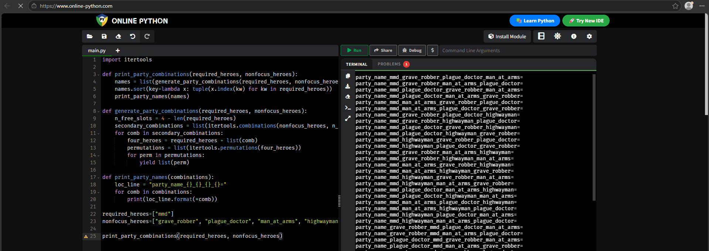\
*An online interpreter* -->

Most of hero barks have a default fallback localization, but there are some that don't. I hope this is the full list of barks that have no fallback version and thus need to be written.

```
bark_act_out_rest_item_hate_block+envious
bark_act_out_rest_item_hate_block+hateful
bark_act_out_rest_item_hate_block+resentful
bark_act_out_rest_item_hate_block+tumultuous
bark_god_summon_failure
bark_hero_failure_kill
bark_item_experimental_remedy
bark_item_guided_meditation
bark_item_improvised_strategy
bark_item_morbid_joke
bark_item_oddly_tuned_lute
bark_item_precious_collection
bark_item_tar_filled_colambre
bark_item_the_very_best
bark_item_war_paint
bark_node_exit_altarofhope
bark_node_exit_bridge
bark_node_exit_bridgegang
bark_node_exit_cache
bark_node_exit_cachegang
bark_node_exit_failure_creatureden
bark_node_exit_failure_dungeon
bark_node_exit_failure_gauntchirurgeon
bark_node_exit_failure_guardian
bark_node_exit_failure_storycultist
bark_node_exit_failure_storyresist
bark_node_exit_gate
bark_node_exit_gate+kingdominnsieged
bark_node_exit_heroselect
bark_node_exit_hospital
bark_node_exit_oasis
bark_node_exit_store
bark_node_exit_storyassist
bark_node_exit_storyassistgang
bark_node_exit_storycosmic
bark_node_exit_success_creatureden
bark_node_exit_success_dungeon
bark_node_exit_success_gauntchirurgeon
bark_node_exit_success_guardian
bark_node_exit_success_storycultist
bark_node_exit_success_storyresist
bark_node_exit_watchtower
bark_route_combat
bark_route_hazard
bark_route_oblivion_tear
bark_route_rough_patch
bark_route_safe
skill_hover_bark_god_face_your_failure
story_bark_assist_avoid_101
story_bark_assist_combat_items_1
story_bark_assist_compassionate_1
story_bark_assist_curmudgeon_1
story_bark_assist_donate_1
story_bark_assist_donate_2
story_bark_assist_donate_3
story_bark_assist_donate_4
story_bark_assist_donate_5
story_bark_assist_food_1
story_bark_assist_greed_stealfood_1
story_bark_assist_greed_stealrelics_1
story_bark_assist_inn_items_1
story_bark_assist_inspire_1
story_bark_assist_inspire_2
story_bark_assist_inspire_3
story_bark_assist_inspire_4
story_bark_assist_inspire_5
story_bark_assist_lazy_1
story_bark_assist_raconteur_1
story_bark_assist_repair_armor_1
story_bark_assist_repair_wheels_1
story_bark_assist_scout_1
story_bark_assist_selfish_1
story_bark_assist_stealfood_101
story_bark_assist_stealrelics_101
story_bark_assist_thanatomania_1
story_bark_assist_torch_1
story_bark_assist_torch_lowtorch_1
story_bark_assist_vicious_slay_1
story_bark_assist_vicious_stealrelics_1
story_bark_oasis_avoid_101
story_bark_oasis_high_stress_1
story_bark_oasis_rare_1
story_bark_oasis_standard_1
story_bark_oasis_supplies_1
story_bark_valley_stagecoach_item_01
story_bark_valley_supply_01
story_bark_valley_trinket_01
```

For example, `bark_hero_failure_kill` should be changed to something like this (**mmd** is my hero's ID):
```
bark_hero_failure_kill+mmd=You'll fall like any other sick critter.
```

All barks can be changed this way, not only the ones that have no fallbacks.

<!-- A script that searches for barks that have no default value:
```python
source_dir = r"C:\Program Files (x86)\Steam\steamapps\common\Darkest Dungeon® II\Darkest Dungeon II_Data\StreamingAssets\Localization\Sources"

# Examples:
# 1.
# bark_act_out_start_my_turn_stress_heal_partner=Steady those hands. We shall win this.
# bark_act_out_start_my_turn_stress_heal_partner+highwayman=You're tougher than this. Breathe.

# will output nothing.

# 2.
# bark_act_out_start_my_turn_buff_partner+highwayman=Shoot to kill.
# bark_act_out_start_my_turn_buff_partner+man_at_arms=Show them what you're made of!

# will output bark_act_out_start_my_turn_buff_partner

# 3.
# bark_act_out_rest_item_hate_block+envious+highwayman=You'd love that, I'm sure.
# bark_act_out_rest_item_hate_block+envious+highwayman=Let me cut you off there - no.

# will output bark_act_out_rest_item_hate_block+envious

# 4.
# bark_node_exit_gate+kingdominnsieged+highwayman+beastmen=Keep vigilant at choke points.
# bark_node_exit_gate+kingdominnsieged+highwayman+beastmen=Air's so stagnant. Not a breath of wind.

# will output bark_node_exit_gate+kingdominnsieged

import os

markers = {
    "highwayman",
    "man_at_arms",
    "grave_robber",
    "plague_doctor",
    "occultist",
    "jester",
    "leper",
    "hellion",
    "runaway",
    "vestal",
    "flagellant",
}

generic_bases = set()
special_bases = set()

def parse_file(file_path):
    encoding = "utf-8-sig" # to remove \ufeff at the beginning of each file
    with open(file_path, encoding=encoding) as f:
        for line in f:
            key = line.strip().split("=", 1)[0]
            parts = key.split("+")

            # find a marker
            special_idx = None
            for i, part in enumerate(parts):
                if part in markers:
                    special_idx = i
                    break

            if special_idx is None:
                # generic entry
                generic_bases.add(key)
            else:
                # if additional +something are present before a marker, they count as part of the base.
                # If they are present after a marker, they are ignored.
                base = "+".join(parts[:special_idx])
                special_bases.add(base)

for root, dirs, files in os.walk(source_dir):
    for filename in files:
        file_path = os.path.join(root, filename)
        parse_file(file_path)

missing_generics = sorted(special_bases - generic_bases)
for base in missing_generics:
    print(base)
```

It also prints out lines that start with "bark_item_ccourtier_blood_default". It's probably a typo in the MAA's lines. -->

### Skill tooltips

Skill names are localized in this way:
```
skill_name_hwm_wicked_slice=Wicked Slice
skill_name_hwm_wicked_slice_u=Wicked Slice<sprite name={q}icon_upgraded_skill{q}>
```

Tooltips for skill effects are automatically generated by the game. If the effects are of common type, these tooltips are fine. But for complicated skills tooltip generation is flawed.

It is better to keep tooltip adjustments minimal, because if a skill is changed, the localization needs to be changed too, and it's easy to forget. Also these adjustments are only visual. If a skill's CSV data is set up incorrectly, localization will only hide it, real effects will still be broken.

For example this skill:

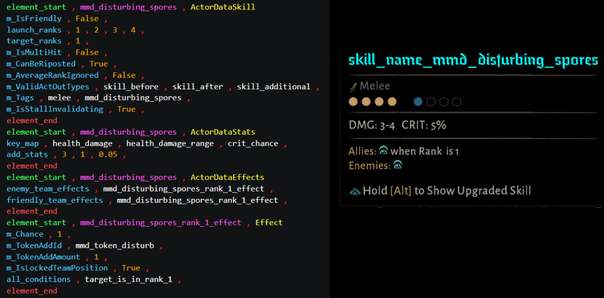\
*This tooltip misses a rank condition on the second line (this skill has the same effect for enemies and allies)*

Since there is no blue text apart from the skill's name, a deeper dive into localization syntax is required. The rules for adjusting tooltips are written in the beginning of this file:
```
C:\Program Files (x86)\Steam\steamapps\common\Darkest Dungeon® II\Darkest Dungeon II_Data\StreamingAssets/Localization/Sources/hero_skill_hardcode_tooltips.txt.
```
These rules explain how to get the localization IDs of skills, effects, buffs, conditions, etc.

| Purpose | Syntax |
| --- | --- |
| ENTIRE Effect List | <span style="white-space: nowrap;">effect_skill_[ActorDataSkill ID]_[ActorDataEffectType]_override=TEXT</span> |
| Effect | <span style="white-space: nowrap;">effect_skill_[EffectDefinition ID]_override=TEXT</span> |
| Effect Condition | <span style="white-space: nowrap;">effect_skill_condition_[Effect ID]_[Condition ID]_override=TEXT</span> |
| Skill Condition | <span style="white-space: nowrap;">effect_condition_[Condition ID]_override=TEXT</span> |
| Buff | <span style="white-space: nowrap;">buff_desc_[BUFF ID]_override=TEXT</span> |
| Ignore | <span style="white-space: nowrap;">token_ignore_desc_[TOKEN IGNORE DEF ID]_override=TEXT</span> |
| Performer Buff | <span style="white-space: nowrap;">performer_buff_desc_BUFFID_override=TEXT</span> |
| Target Buff | <span style="white-space: nowrap;">target_buff_desc_BUFFID_override=TEXT</span> |
| Path Seal Data | <span style="white-space: nowrap;">buff_desc_path_descriptor_PATH_override=\nDESCRIPTOR\n\n<color=#{debuff}>BUFF AND DEBUFF TEXT</span> |

Entire effect list phrase can be a bit confusing. The skill that I showed has two effect lists:

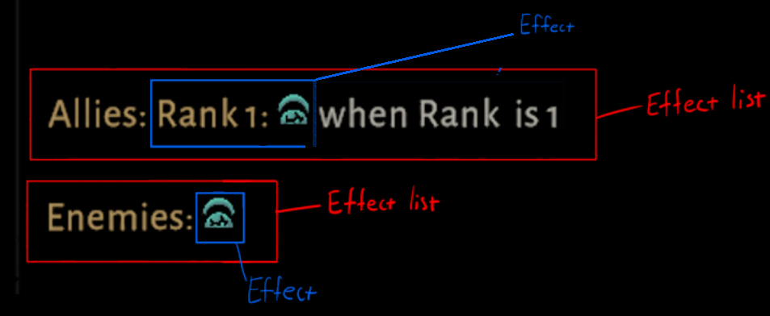\
*At first I thought entire effect list means everything in the picture*

I tried to use this effect list override. `[ActorDataSkill ID]` part is the ID of the skill, `[ActorDataEffectType]` can be substituted with *target*, *performer*, *enemy_team*, *friendly_team*, etc. I wrote these lines in the localization file:
```csv
effect_skill_mmd_disturbing_spores_enemy_team_override=<color=#{notable}>Enemy on Rank 1: <sprite={q}mmd_tokens{q} name={q}mmd_token_disturb{q}></color>
effect_skill_mmd_disturbing_spores_friendly_team_override=<color=#{notable}>Ally on Rank 1: <sprite={q}mmd_tokens{q} name={q}mmd_token_disturb{q}></color>
```

This gave me the following result:

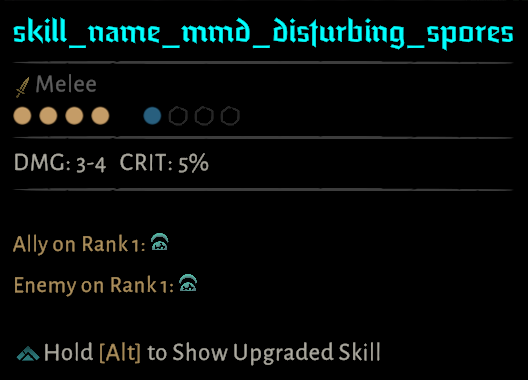\
*Replacing effect lists*

An alternative way to fix a tooltip is to use the second type of override (Effect override). It will replace the Effect parts of the skill (conditions are not affected).

`EffectDefinition ID` is the ID of the *Effect* element. This time there is only one localization line as this skill uses one effect for both teams.
```csv
effect_skill_mmd_disturbing_spores_rank_1_effect_override=<color=#{notable}>Rank 1: <sprite={q}mmd_tokens{q} name={q}mmd_token_disturb{q}>
```
This changed the tooltip into this:

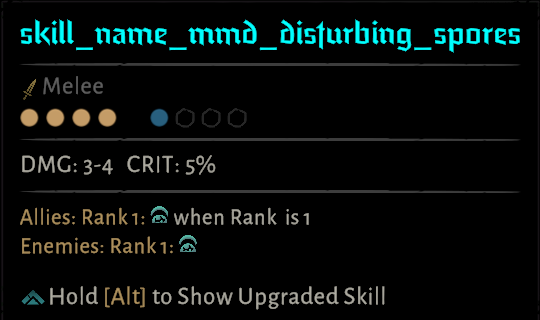\
*Replacing effect description*

It almost worked, I just needed to remove the generated condition explanation. This is achievable with the *m_IsVisible* field in CSV data:

```csv
element_start,mmd_disturbing_spores_target_is_in_rank_1,Condition
⁝
m_IsVisible,False,
element_end
```
After this the tooltip looked like this:

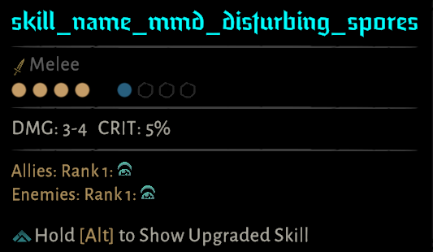\
*This skill was fixed. But it didn't last long because positional tokens are weird and I had to remake the skill*

Custom description can also be added to the section of the tooltip where DMG, CRIT, Uses, Cooldown information is showed.

This can be achieved by adding a fake buff.

<!-- The next weird skill that I had was the Slowdown skill. Here the problem was the opposite. I made it so the skill ignores stun resistance, but the tooltip wasn’t showing it. -->

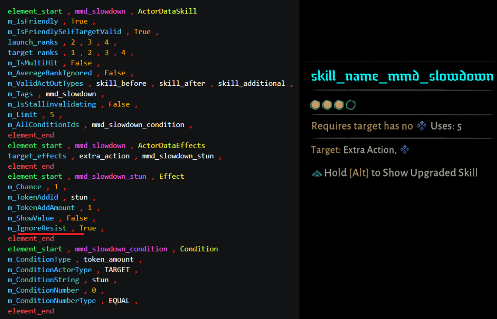\
*Some details aren't generated by the tooltip engine*

<!-- The unrelenting application of deduction yielded me the conclusion that additional information is supplemented via fake buffs and effects. For example there is a buff called **execution_1_tooltip**, and it has a condition **always_return_false_hidden**, which means this buff is never active. One of the localization files says:
```
#Performer Buff - execution_1_tooltip (fake buff to carry a tool tip)
performer_buff_desc_execution_1_tooltip_override=<color=#{buff}>Execution 1\n
``` -->

I created a fake buff and attached it to the *ActorDataSkill* via *performer_buffs*.
```csv
element_start,mmd_slowdown,ActorDataSkill
...
performer_buffs,mmd_slowdown_fake_ignore_resist,
element_end

element_start,mmd_slowdown_fake_ignore_resist,Buff
m_DurationType,skill_calculate,
m_DurationAmount,1,
m_ConditionId,always_return_false_hidden,
element_end
```

And in the localization file added:
```
performer_buff_desc_mmd_slowdown_fake_ignore_resist_override=Ignores <sprite name={q}icon_debuff{q}> RES
```

Now the tooltip has a new note.

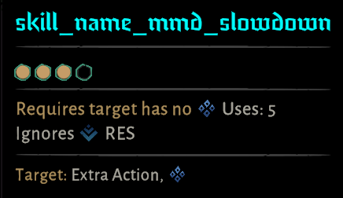\
*Note above effect lists*

### Other languages

TXT files in the `exports/Localization` folder add English text only. If the game's language is switched and there are no files for that specific language, all text turns back to blue placeholders.

Translations are stored in PO files. They can be placed in the same `exports/Localization` folder along with TXT files.

There is a tool for building PO files located at `StreamingAssets/Localization/BuildPotFile`.

To use this tool on mod files:
1. Create a temporary folder outside the mod folder (`temporary`).
2. Inside, create `Poedit` and `Sources` folders.
3. Copy the `StreamingAssets/Localization/BuildPotFile` folder and paste it into the temporary folder.
4. Add TXT localization files in the `Sources` folder.
4. Folder structure should look like this:
    ```
    temporary
    ├───BuildPotFile
    │       BuildPotFile.dll
    │       BuildPotFile.exe
    │       BuildPotFile.runtimeconfig.json
    │       GenerateMO.bat
    │       msgfmt.exe
    │       Readme.txt
    │
    ├───Poedit
    └───Sources
            dd2_loc_strings.txt
    ```
5. Install [.NET 5.0 Runtime](https://aka.ms/dotnet-core-applaunch?missing_runtime=true&arch=x64&rid=win10-x64&apphost_version=5.0.10+)
6. Execute `temporary/BuildPotFile/BuildPotFile.exe`. This should create a new file in the `temporary/Poedit` folder.
7. Download a PO Editor
8. Using this editor, translate `temporary/Poedit/iron_crown.pot`
9. Save translated file into the `exports/Localization` folder

After that translated text should appear in the game.

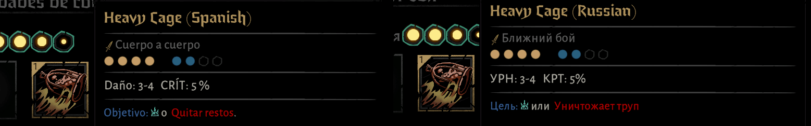\
*In other languages*

If translations are not specified in a PO file, text will still be blue.

To create PO files for other languages but with the same English text (I think it's better than blue text), use [this page](https://dnauu-bmsotc.github.io/DD2-Hero-Mod-Metamorph/Source%20files/scripts/localization_placeholders.html). Select the `iron_crown.pot` file, and it will generate and download an archive with placeholder files.

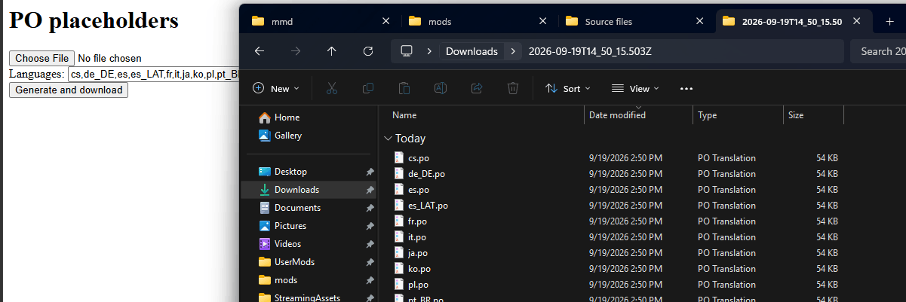\
*Generating placeholders for other languages*

Editing PO files, same as TXT files, does not require restarting the game (reloading a save is enough for changes to be applied).


## Altar of Hope

Most heroes have these upgrades in the Altar of Hope:
1. Unlocking the hero 
2. +5 Deathblow resist
3. Hero trinket unlock
4. Path unlock
5. Stat buff
6. Hero trinket unlock
7. Path unlock
8. +5 Deathblow resist
9. Stat buff
10. Hero trinket unlock
11. Path unlock
12. Stat buff
13. +5 Deathblow resist
14. Signature item unlock

To lock things behind the Altar of Hope progression, *Unlock* elements need to be added along with their *Cost* elements. Here are the Hellion's first two *Unlocks*:

```csv
element_start,hellion_1,Unlock
element_end

element_start,hellion_1,Cost
m_ProfileValueType,candles,
m_ProfileValue,5,
element_end

element_start,hellion_2,Unlock
element_end

element_start,hellion_2,Cost
m_ProfileValueType,candles,
m_ProfileValue,2,
element_end

...
```

To tell the game that these are the Altar of Hope unlocks, they need to be gathered in the *UnlockTrack* element.
```csv
element_start,hellion,UnlockTrack
m_ProgressGroupId,base,
unlocks,hellion_1,hellion_2,hellion_3,hellion_4,hellion_5,hellion_6,hellion_7,hellion_8,hellion_9,hellion_10,hellion_11,hellion_12,hellion_13,hellion_14,
element_end
```

To make the hero themselves unlockable, *m_ExpeditionUnlockId* element is used:
```csv
element_start,hellion,ActorDataClass
⁝
m_ExpeditionUnlockId,hellion_1,
⁝
element_end
```

To assign a buff to an *Unlock*, the *m_UnlockId* field is used.

```csv
element_start,hel_ut_deathblow_resist_4,Buff
m_DurationType,infinite,
m_UnlockId,hellion_13,
element_end

element_start,hel_ut_deathblow_resist_4,ActorDataStats
sub_stat,resistance,death,0.05,
element_end
```

These buffs need to be attached to hero's *ActorDataExternalBuffs* element.

```csv
element_start,hellion,ActorDataExternalBuffs
buffs,hel_ut_deathblow_resist_1,hel_ut_deathblow_resist_2,hel_ut_deathblow_resist_3,hel_ut_deathblow_resist_4,hel_ut_max_hp_1,hel_ut_disease_resist_1,hel_signature_item_buff,
element_end
```


To assign a trinket or a path to an *Unlock*, the same field is used.

```csv
element_start,trinket_hero_hel_bloodied_branch,Item
⁝
m_UnlockId,hellion_3,
⁝
element_end

element_start,hel_ravager,ActorDataPath
⁝
m_UnlockId,hellion_4,
⁝
element_end
```

The signature inn item unlock is a bit different. This is technically a buff that adds a chance of looting hero's signature inn item every time the stagecoach enters an inn. This buff also needs to be in *ActorDataExternalBuffs*.

```csv
element_start,hellion,ActorDataExternalBuffs
buffs,...,hel_signature_item_buff,
element_end

element_start,hel_signature_item_buff,Buff
m_DurationType,infinite,
m_UnlockId,hellion_14,
element_end

element_start,hel_signature_item_buff,ActorDataEffects
inn_start_effects,hel_signature_item_effect,
element_end

element_start,hel_signature_item_effect,Effect
m_Chance,0.05,
m_LootIds,war_paint_inn,
element_end

element_start,war_paint_inn,LootTable
m_chances,1,
m_qtys,1,
m_ids,war_paint,
m_types,item,
element_end
```

Here **war_paint_inn** is a loot table with only one item in it, and **war_paint** is the Hellion's signature inn item. This *LootTable* can be used for run goal rewards.

Unlocks have titiles:
- Trinket unlocks are called Trinket
- Path unlocks are called Path
- Signature Item unlocks are called Trademark Item
- Unlocking the hero is called Presence.
- Deathblow resist buff is called Resolution.
- Stun resist buff is called Unshakeability.
- Move resist buff is called Foundation.
- Debuff resistance buff is called Persistence.
- Blight resistance buff is called Circulation.
- Fire resistance buff is called Sturdiness.
- Bleed resistance buff is called Toughness.
- Disease resistance buff is called Cleaniness.
- Max health buff is called Health.
- Speed buff is called Haste.

Titles are set in localization files:
```
upgrade_track_highwayman_1_title=Resolution
upgrade_track_highwayman_2_title=Trinket
upgrade_track_highwayman_3_title=Path
upgrade_track_highwayman_4_title=Unshakeability
...
upgrade_track_highwayman_12_title=Resolution
upgrade_track_highwayman_13_title=Trademark Item
```

If paths, items, or buffs aren't locked behind the Altar of Hope (if they don't use the *m_UnlockId* field) then they behave in the same way as if they were unlocked.

<!-- ## Loot tables

It is possible to create custom loot tables. For example, my Forager path (that I had to cut) loots an inn item when a combat starts. For this I created a loot table with limited assortment.

```csv
element_start,mmd_forager_loot,LootTable
m_chances,1,1,1,1,
m_qtys,1,1,1,1,
m_ids,pipeweed,speed_bag,wild_tea,restorative_herbs,
m_types,item,item,item,item,
element_end

element_start,mmd_forager_loot,LootTable
m_chances,1,1,1,1,1,
m_qtys,1,1,1,1,1,
m_ids,clarifying_poultice,clotting_poultice,impermeable_poultice,soothing_poultice,stimulating_poultice,
m_types,item,item,item,item,item,
element_end
```

Custom tables with same ID are merged as all other tables: looting from a **mmd_forager_loot** table gives an item from any of these tables.

Getting an item from a loot table is possible in an *Effect* element.

```csv
element_start,mmd_forager_combat_start_effect,Effect
m_Chance,0.5,
m_LootIds,mmd_forager_loot,
element_end
```

*m_LootIds* field tells from what table loot is going to be pulled. -->

## Act 5 boss

The Ghost of the Past in the final fight can be configured in the settings of the Resource Actor file in the `F/boss_body_spectre/data` folder:
- The Prefab Reference is a prefab file that contains the model.
- The skills section needs a RZIS file that defines the attack skill. If CSV data for Act 5 wasn’t changed, the file needs to be named failure_[id]_attack.
- Two small portraits.
- SFX settings.

I don't know why but I couldn't make the ghost use SFX other than the example SFX.

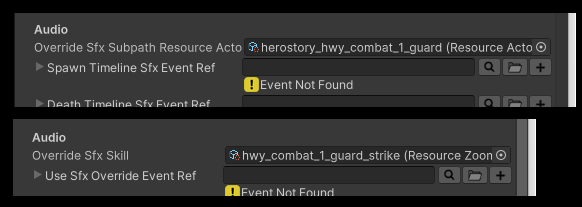\
*Audio settings in Resource Actor and RZIS example files*

Now the boss will summon a customized ghost.

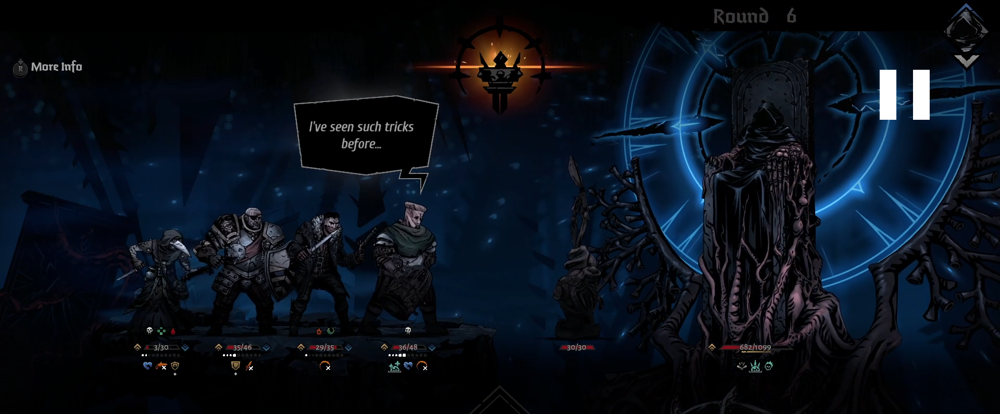\
*I forgot that Ghosts have a VFX under them when I switched the model*

The localization file needs these lines:
```
boss_body_failure_[id]=Spectre
skill_name_failure_[id]_attack=Regression
skill_name_failure_ult_[id]=Exultation
```

After a hero defeats their ghost from the past, they use their Exultation skill. The RZIS file of this skill is located in the `F/data` folder.

<!-- Its antic animation can be changed by using the "Select Skill Id Override" field. Its recovery animation can be set by specifying a Timeline file. -->

<!-- If a hero dies while facing their failures, the boss despawns their failure. The boss tracks if the hero is still alive by assigning a hidden token (`failure_facing`) to this hero, and then checks if the party has any actor with this token. If for some reason this token is not removed (for example if the corpse's data is changed), the boss will not despawn failures. -->


## Shrine of Reflection

<!-- It looks like since it’s not possible to add audio to the game, the regular narrations for the stories are not possible either. I tried to do the narration with subtitles only, but in the game reflection sessions didn't show any subtitles and it skipped to the result screen. -->

I don't know if it's possible to add custom narration subtitles for the Shrine of Reflection. But these aren't the only way to display text. It is possible to create custom enemies that have text instead of 3D models. With this approach every reflection session is technically a fight. I will explain the first two fights (one with narration only and one with narration and a battle).

Shrine of Reflection data starts with a *StoryChoice* element. Its progress is stored via Unlocks.

```csv
element_start,herostory_MMD_01,StoryChoice
m_AnyTags,Hero,
m_DrawTags,herostory,
m_Chance,1,
m_AlignmentId,
m_ProgressGroupId,base_story,
all_conditions,performer_is_mmd,
m_ResultType,COMBAT,
m_ResultBattleConfigurationId,mmd_chapter_1,
element_end

element_start,herostory_MMD_01,Unlock
element_end

element_start,herostory_MMD_01,Condition
m_ConditionType,profile_unlock,
m_ConditionString,herostory_MMD_01,
m_ConditionNumberType,BOOL,
element_end
```

For another hero all "MMD" and "mmd" should be replaced with that hero's ID.

To lock a skill behind the Shrine of Reflection, the *m_ProfileUnlockId* field is used:

```csv
element_start,mmd_concealing_mist,ActorDataSkill
⁝
m_ProfileUnlockId,herostory_MMD_01,
element_end
```

The *m_ResultBattleConfigurationId* in the *StoryChoice* allows to add a battle to a Reflection Chapter.

```csv
element_start,mmd_chapter_1,BattleConfiguration
m_Chance,1,
m_BackgroundSceneOverride,combat_arena_hero_story_hellion_origin_1,
m_TorchOverride,no_torch,
m_RunDataStatsId,no_retreat,
m_EndAtMaxStress,True,
m_PlayerActors,peasant_militia_melee_b,
m_EnemyActors,mmd_story_plate_1,
m_CompleteStoryLootTables,hero_story_rewards_all,
m_ResultActors,peasant_militia_melee_b,
m_IsStallInvalidating,True,
m_IsRollBattleModifier,False,
m_TokenViewValid,False,
element_end
```

Here
- *m_BackgroundSceneOverride* changes the background.
- *m_PlayerActors* allows to set hero's party.
- *m_ResultActors* tells who will appear on screen after the reflection ends.
- *m_EnemyActors* allows to set the enemy party.

The hero that shows up in Reflections has a different skillset than outside. It can be done by creating a separate actor.

To add a new actor it is needed to:
- Create or copy a prefab file that contains models and an Animation Controller.
- Copy RZIS files for new skills and rename them.
- Copy a Resource Actor file and rename it. In the Inspector it needs:
    - Prefab file slot
    - Sfx override
    - RZIS slots
    - Portraits (Turn Order, Combat Bar)
- Define *ActorDataClass* and *ActorDataSkill* elements.

To add text to a prefab file, I:
1. In the Hierarchy window: added text element by RMB, 3D Object, Text - TextMeshPro.
2. Positioned the new element in space.
3. Downloaded a TFF file and added it to my mod folder.
4. RMB on the font file in the Unity Explorer, Create, TextMeshPro, FontAsset, SDF.
5. In the prefab file, changed the font by inspecting the text element.

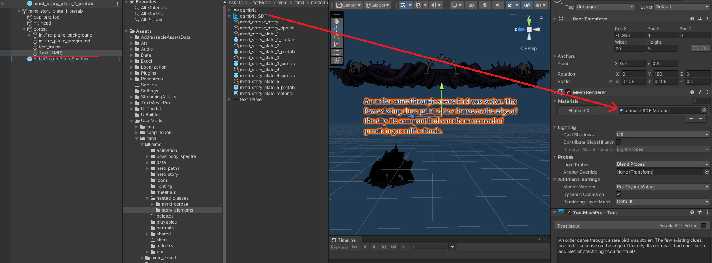\
*Setting a font*

With this approach each text plate is a different actor, I don't know how to optimize it. And I don't know if it is possible to add translations to other languages.

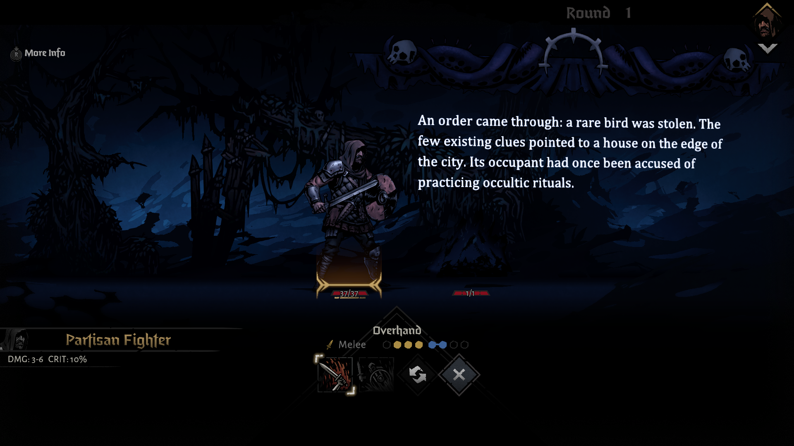\
*Text block in the game*

The second Story Choice configuration has a couple of differences. First, the *all_conditions* field needs additional condition that tells that the previous reflection should be completed.

```csv
element_start,herostory_MMD_02,StoryChoice
⁝
all_conditions,performer_is_mmd,herostory_MMD_01,
⁝
element_end
```

An actor can summon enemies after its death, so in the second Reflection I made the textplate enemy to summon other enemies after its death:

```csv
element_start,mmd_story_plate_2,ActorDataClass
...
element_end

...

element_start,mmd_story_plate_2,ActorDataEffects
actor_effect_triggers,mmd_story_plate_2_death_aet,
element_end

element_start,mmd_story_plate_2_death_aet,ActorEffectTrigger
m_ActorEffectType,death,
m_ActorEffectTriggerSourceType,target,
m_ActorEffectTriggerTargetType,friendly_team,
m_IncludeSourceActor,True,
m_ActorCount,4,
effects,mmd_story_plate_2_death_aet_effect,mmd_story_plate_2_death_aet_effect,mmd_story_plate_2_death_aet_effect,
element_end

element_start,mmd_story_plate_2_death_aet_effect,Effect
m_Chance,1,
m_SummonClassActorId,mmd_corpse_story,
m_SummonLocationType,BACK,
m_SummonIfRoom,True,
element_end
```
**mmd_corpse_story** is a custom actor.

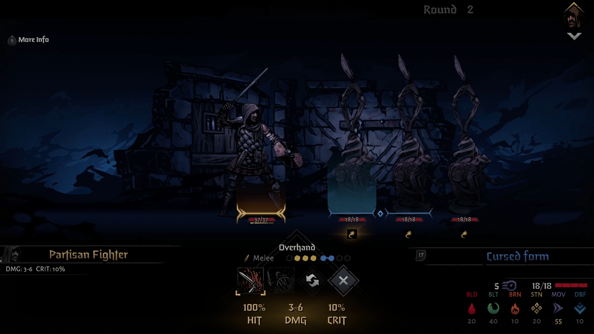\
*Enemies spawned after killing a story plate*

Heroes have barks before and after each Reflection. They are set in localization files:

```csv
story_bark_herostory_MMD_01=A simple search was all that was required...
hero_story_mmd_chapter_title_0=A Search Order
bark_node_exit_success_storyhero+herostory_MMD_01=I believed that these were just rumors.

story_bark_herostory_MMD_02=I was not aware of my actions back then.
hero_story_mmd_chapter_title_1=Ambushed
bark_node_exit_success_storyhero+herostory_MMD_02=My impatience almost killed me.
bark_node_exit_failure_storyhero+herostory_MMD_02=I did nothing wrong!

story_bark_herostory_MMD_03=The universe is a cruel, uncaring void.
hero_story_mmd_chapter_title_2=A Faint Relief
bark_node_exit_success_storyhero+herostory_MMD_03=I thought that I won by surviving.

story_bark_herostory_MMD_04=I wanted answers, more than anything.
hero_story_mmd_chapter_title_3=The Interrogation
bark_node_exit_success_storyhero+herostory_MMD_04=I didn't want this. This shouldn't have happened.

story_bark_herostory_MMD_05=I was hiding long enough.
hero_story_mmd_chapter_title_4=The Call of the Curse
bark_node_exit_success_storyhero+herostory_MMD_05=I am not a human anymore.

bark_node_exit_success_storyhero+herostory_MMD_06=I am changing.
```

- `story_bark_[StoryChoice ID]` is a bark when the hero is being selected before reflection sessions.
- `bark_node_exit_success_storyhero+[StoryChoice ID]` is a bark when past is resolved.
- `bark_node_exit_failure_storyhero+[StoryChoice ID]` is a bark when past is not resolved.

I tried to animate textplates with armatures and sprites with Recorded material property animations but the process was a mess and the results are still flawed.

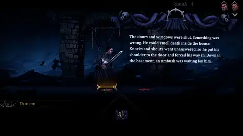\
*Spawn and death animations*

<!-- Heroes have a sixth story bark but I don't remember if it is used.

Then I wanted to create more props for the fight. I couldn't make it flawlessly, but here is the path I walked.

Since these props appeared after a plate was removed, they needed a spawn animation. By default they appear instantly. There is an option in Unity that allows to create material animations in Playable files (for example fading to black or reducing transparency). Even though such animations worked in Darkside, making them work in the game turned to be harder than it appeared at first.

There is a "Spawn On Create Timeline" field in Resource Actor files, and it works for armature animations, but material animations were ignored for some reason. The same is with the "Death Timeline" field. I don't know what is the root of this problem, but I decided to copy corpse files and apply minimum changes, because they have spawn and death animations:
1. copied the prefab file from `Assets/Data/Characters/Shared/common_corpse/`
2. copied the shared_corpse material from `Assets/Data/Characters/Shared/common_corpse/materials/`
3. copied the Resource Actor file from `Assets/Data/Characters/Heroes/abomination/nested_classes/abomination_corpse/data/`
4. inspected the Resource Actor file and set "Prefab Reference" to the copied prefab
5. (not working) Ibid set "Spawn On Create Timeline" to "common_corpse_spawn_timeline"
6. replaced the image in the material file
7. opened the prefab file and replaced the material of the grave
8. scaled the image so it isn't squeezed

Now props fade out on death. Unfortunately they don't fade in on spawn. Don't know why. So:

1. I opened the prefab file, selected the "background_corpse_body" element
2. opened the Timeline window, created a new Timeline
3. dragged background_corpse_body into the timeline window, Add Animation Track
4. clicked the Start recording button, set timeline's cursor to zero
5. inspected background_corpse_body and set material's dissolve to max
6. set timeline's cursor to some other timestamp, changed material properties, stopped recording.

The "Play On Awake" option is turned on by default, and it allowed props to play animation on spawn. Sadly, when props spawn, there is a brief moment when the prop is fully visible before it disappears and the spawn animation plays. Also this corpse material makes textures very dark and unsaturated. -->

<!-- \
*Here the textplate's fading out is inherited from a corpse, props' fading in was created using the Record function in a Playable file, and it is visible how props flash before playing their spawn animation. Text's compression animation is made with bones* -->

It is possible to reset the Shrine of Reflection progress. To do this open one of the same files that looks like this:
```
%USERPROFILE%\AppData\LocalLow\RedHook\Darkest Dungeon II\SaveFiles\xxx\profiles\mod_profile_x.json
```
Keep the game opened in the main menu, otherwise Steam might restore save data. Search for `herostory_[ID]_` and delete unlock lines of chapters that need to be reset. Save the file, exit the game, and open it again. Without exiting the game, changes will not be applied.

If, for example, a second reflection unlock is deleted, subsequent unlocks don't have to be deleted, the game will allow to enter the earliest unresolved reflection.

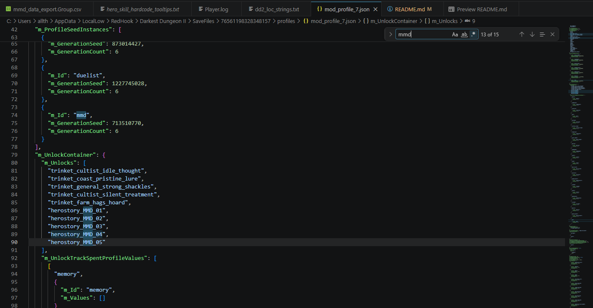\
*Resetting Shrine of Reflection progress*

It is possible to reentry a Shrine of Reflection node after completing it. To do this, keep the game opened in the main menu, go to this folder:
```
%USERPROFILE%\AppData\LocalLow\RedHook\Darkest Dungeon II\SaveFiles\xxx\mod_profile_xxx_runs\xxx_xxx
```

In this folder delete one or several of the last folders.

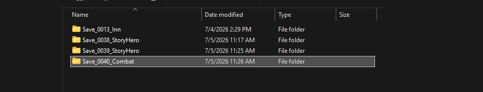\
*Here Save 0039 stores data upon arriving at a Shrine, Save 0040 stores data after a hero is selected for reflection*

Deleting these files does not require exiting the game, a run can be loaded right after deletion.

## Run goals

Wanderer paths have a candle bonus for reaching the second inn.

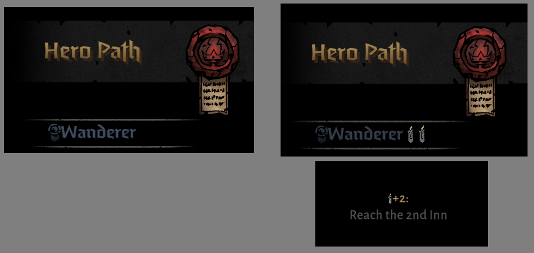\
*The left image is without the Wanderer bonus*

This can be set in CSV files:
```csv
element_start,mmd_wanderer,ActorDataRunGoals
run_goals,mmd_visit_two_inn,
element_end

element_start,mmd_visit_two_inn,RunGoal
all_conditions,performer_visit_inn_2,
m_Score,2,
element_end
```

Other goals are not tied to paths.

Before the Altar of Hope is completed, all goals reward candles only. Some of these goals are applied to all heroes, these goals are assigned to custom heroes automatically.

Heroes have goals related to skills. Goals that require unlockable skills need to use the same Unlock.

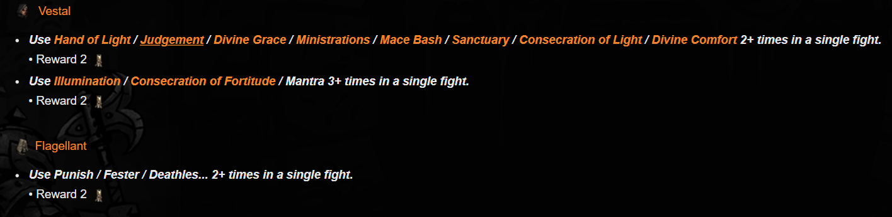\
*[Use skill goals](https://darkestdungeon.wiki.gg/wiki/Hero_Goals)*

Flagellant's skill goals:
```csv
element_start,e_skill_hist_flg_punish,RunGoal
m_Chance,1,
m_RunGoalCategoryId,easy,
m_ActorClassIds,flagellant,
m_CompletionLimit,-1,
any_conditions,performer_skill_hist_flg_punish,
generation_all_conditions,profile_has_under_100pct_base_altar,
m_Score,1,
m_GoalIconOverride,candle_item,
m_GoalTooltipLocKeyOverride,goal_candle_reward_1_tooltip,
element_end

...

element_start,m_skill_hist_flg_fester,RunGoal
m_Chance,1,
m_RunGoalCategoryId,medium,
m_ActorClassIds,flagellant,
m_CompletionLimit,-1,
any_conditions,performer_skill_hist_flg_fester,
generation_all_conditions,profile_has_under_100pct_base_altar,
m_Score,2,
m_GoalIconOverride,candle_item,
m_GoalTooltipLocKeyOverride,goal_candle_reward_2_tooltip,
element_end

...

element_start,h_skill_hist_flg_necrosis,RunGoal
m_Chance,1,
m_RunGoalCategoryId,hard,
m_ActorClassIds,flagellant,
m_CompletionLimit,-1,
any_conditions,performer_skill_hist_flg_necrosis,
generation_all_conditions,herostory_FLG_05,profile_has_under_100pct_base_altar,
m_Score,4,
m_GoalIconOverride,candle_item,
m_GoalTooltipLocKeyOverride,goal_candle_reward_4_tooltip,
element_end
```

Skill goals need to be localized:
```
effect_condition_performer_skill_hist_flg_necrosis_override=Use <color=#{notable}>Necrosis</color> 2+ times in a single fight
```

After the Altar of Hope is completed, new goals appear. These goals reward signature items or hero trinkets. Killing 8 Cosmic beings rewards with a signature inn item. Killing a lair boss rewards with a random hero trinket.

For example, here are all Abomination-specific goals:

```csv
element_start,h_kill_cosmic_abm,RunGoal
m_Chance,1,
m_RunGoalCategoryId,hard,
m_CompletionLimit,-1,
all_conditions,performer_kill_cosmic_8,
m_ActorClassIds,abomination,
generation_all_conditions,profile_has_100pct_base_altar,
m_LootTableId,abm_diary_inn,
m_GoalIconOverride,rest,
element_end

element_start,h_kill_lair_boss_city_abm,RunGoal
m_Chance,1,
m_RunGoalCategoryId,hard,
m_CompletionLimit,-1,
any_conditions,performer_kill_lair_boss_city_1,performer_kill_lair_boss_city_1_ignite,
m_ActorClassIds,abomination,
generation_all_conditions,profile_has_100pct_base_altar,
m_LootTableId,TRINKETS_HERO_ABM_UNCONDITIONAL,
m_GoalIconOverride,trinket,
element_end

element_start,h_kill_lair_boss_coast_abm,RunGoal
m_Chance,1,
m_RunGoalCategoryId,hard,
m_CompletionLimit,-1,
all_conditions,performer_kill_lair_boss_coast_1,
m_ActorClassIds,abomination,
generation_all_conditions,profile_has_100pct_base_altar,run_boss_is_not_brain,
m_LootTableId,TRINKETS_HERO_ABM_UNCONDITIONAL,
m_GoalIconOverride,trinket,
element_end

element_start,h_kill_lair_boss_farm_abm,RunGoal
m_Chance,1,
m_RunGoalCategoryId,hard,
m_CompletionLimit,-1,
all_conditions,performer_kill_lair_boss_farm_1,
m_ActorClassIds,abomination,
generation_all_conditions,profile_has_100pct_base_altar,run_boss_is_not_brain,
m_LootTableId,TRINKETS_HERO_ABM_UNCONDITIONAL,
m_GoalIconOverride,trinket,
element_end

element_start,h_kill_lair_boss_forest_abm,RunGoal
m_Chance,1,
m_RunGoalCategoryId,hard,
m_CompletionLimit,-1,
all_conditions,performer_kill_lair_boss_forest_1,
m_ActorClassIds,abomination,
generation_all_conditions,profile_has_100pct_base_altar,
m_LootTableId,TRINKETS_HERO_ABM_UNCONDITIONAL,
m_GoalIconOverride,trinket,
element_end
```

These goal elements are collected by the game automatically, they don't need to be explicitly connected to anything else.

## Kingdoms

*SkillSet* elements store information about starting skill sets for the semi-random skill mode in Kingdoms.

```csv
element_start,flg_skill_kit_1,SkillSet
skills,flg_punish,flg_lash_gift,flg_redeem,flg_fester,flg_endure,
element_end
element_start,flg_skill_kit_2,SkillSet
skills,flg_punish,flg_lash_gift,flg_reclaim,flg_fester,flg_suffer,
element_end
element_start,flg_skill_kit_3,SkillSet
skills,flg_punish,flg_lash_gift,flg_reclaim,flg_rain_of_sorrows,flg_endure,
element_end
element_start,flg_skill_kit_4,SkillSet
skills,flg_punish,flg_lash_gift,flg_redeem,flg_rain_of_sorrows,flg_suffer,
element_end
```

Hero upgrades in Kingdoms work similar to how they work in the Altar of Hope. These upgrades are buffs that are attached to a hero through a *ActorDataExternalBuffs* element and their unlocking condition is specified using an *m_UnlockId* field. This time, however, there are no *Unlock* elements.

```csv
element_start,highwayman,ActorDataExternalBuffs
buffs,hwm_kingdoms_buff_1,hwm_kingdoms_buff_2,hwm_kingdoms_buff_3,hwm_kingdoms_buff_4,hwm_kingdoms_buff_5,
element_end

element_start,highwayman,ActorDataEffects
respawn_effects,respawn_add_quirk,respawn_remove_unlock,temp_kingdom_roster_buff,
element_end

element_start,hwm_kingdoms_buff_1,Buff
m_DurationType,infinite,
m_UnlockId,kingdom_hero_upgrade_1,
m_Tags,character_sheet_condition,
element_end

element_start,hwm_kingdoms_buff_1,ActorDataStats
sub_stat,resistance,death,0.05,
sub_stat,resistance,disease,0.1,
sub_stat,resistance,stun,0.1,
add_stat,wound_percent_max,-0.1,
element_end

...
```

Hero and item stats can be overridden in Kingdoms by redefining them in CSV files in the `exports/kingdom` folder. Or, they can be overridden in Expeditions in the `exports/expedition` folder.

## Weapon Kits and Origin Skin

Weapon Kits and Skins are very similar. At least in terms of their capabilities. Visually WKs only switch some models, but I believe when a WK is changed, the whole model is switched to another one.

In Darkside, a WK file uses a separate prefab file, which means anything that is included in it can be changed for a WK: Animation Controller, VFX, meshes, textures.

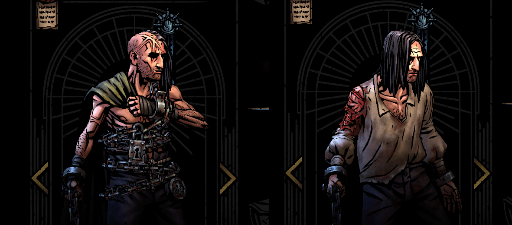\
*Bigby's origin version has different a completely different animation*

To create a Weapon Kit, use the Weapon Kit Creator Tool. There is no option for a custom hero, so select any class.

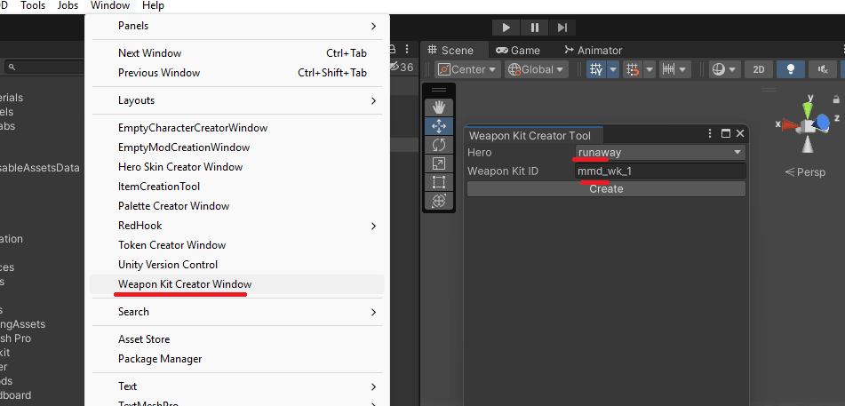\
*Weapon Kit Creator Tool*

Then inspect the Resource Actor Weapon Kit file and configure all settings except the Actor Override.

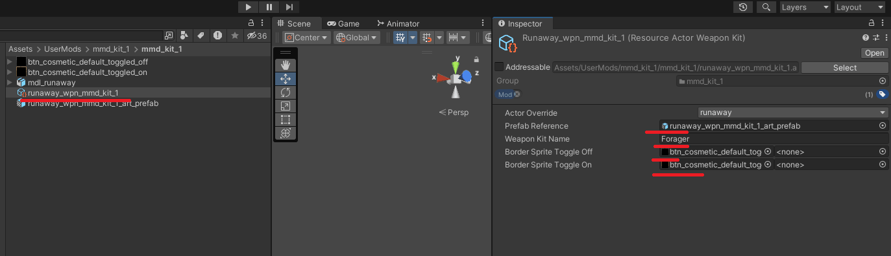\
*Settings of Resource Actor Weapon Kit*

After other fields are set, open the Resource Actor Weapon Kit file using a text editor. Then find the m_ActorOverride line and replace a vanilla ID to the ID of the custom hero. This step should be performed last, because if settings of this file are changed afterwards, the ID will fallback to bounty_hunter and it will be needed to edit the file again. The "Actor Override" field in the inspector will always show bounty_hunter, but it does not matter.

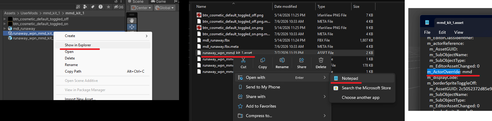\
*Editing Resource Actor Weapon Kit's content*

An Origin Skin can be created the same way, using the Hero Skin Creator Tool. The Resource Actor Skin file has an additional field "Unlock Id". It can be used to lock a skin behind Shrine of Reflection by setting it to "herostory_[ID]_05".

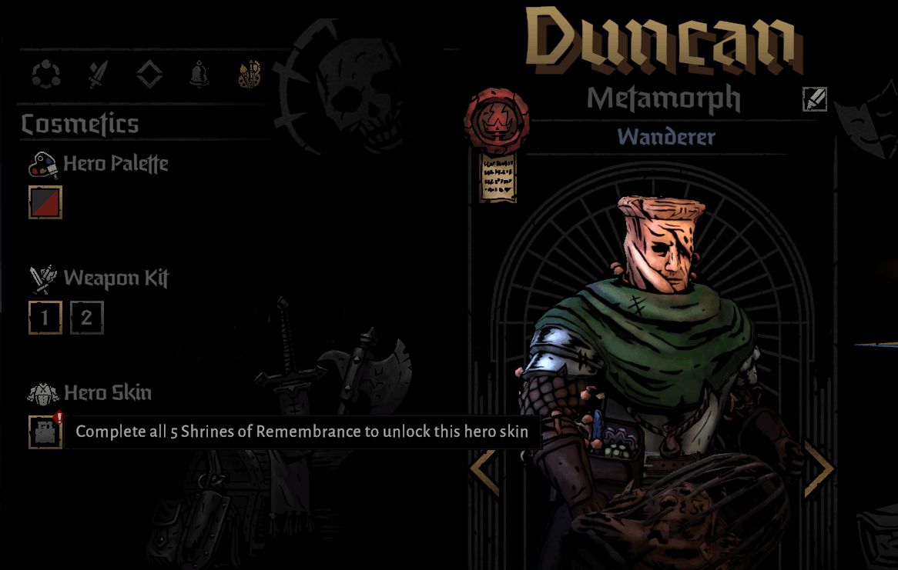\
*Origin skin's unlock localization is assigned automatically*

Each kit/skin requires a separate art_prefab file. To create a new art_prefab file without configuring it from scratch:

1. Duplicate the main art_prefab file and open it.
2. Inspect the element that stores the rig and the meshes.
3. Drag the new mdl file to the prefab field in the Inspector. This mdl file should have the same import settings as the main mdl file.
4. Select "Replace and Keep Overrides" in the opened context window.
5. Reattach the Animator component and set the Controller.
6. Outline, and Material Property Bhv component might be reset so they need to be checked.

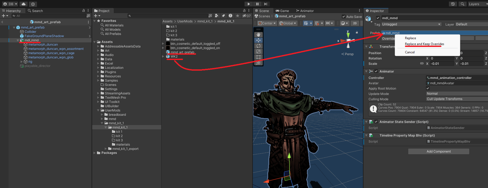\
*Redirecting the link to a different FBX file. Filenames of art_prefab or FBX files are arbitrary*

I couldn't find a good way to make all animations dependend on a Weapon Kit. Animations (and VFX) that are attached to Playable files are out of reach of the main prefab file.

Since Animation Controller is assigned inside the main prefab file, it is possible to change a lot of animations by just assigning a different controller. So idle, battle idle, skill antic, skill idle, meltdown, inn, and other animations can be changed easily by a WK or a skin.

But I don't know how to change animations that are triggered by Playable files (skill execution pose, skill recovery animation, agressive act out execution/recovery, and riposte execution/recovery).

<!-- If a kit/skin has an additional detail, this detail can be animated just by adding an additional bone. But if a shared part of a kit/skin is incompatible with the default kit, alterating animations that are triggered by a Playable file can become problematic. -->

<!-- 
Since kits/skins require separate art_prefab files, VFX and anchors need to be copied reattached. When I copied VFX from a prefab file to another they got displaced. Grouping them under an empty object and then copying the empty object instead copied vfx keeping them in the right position.

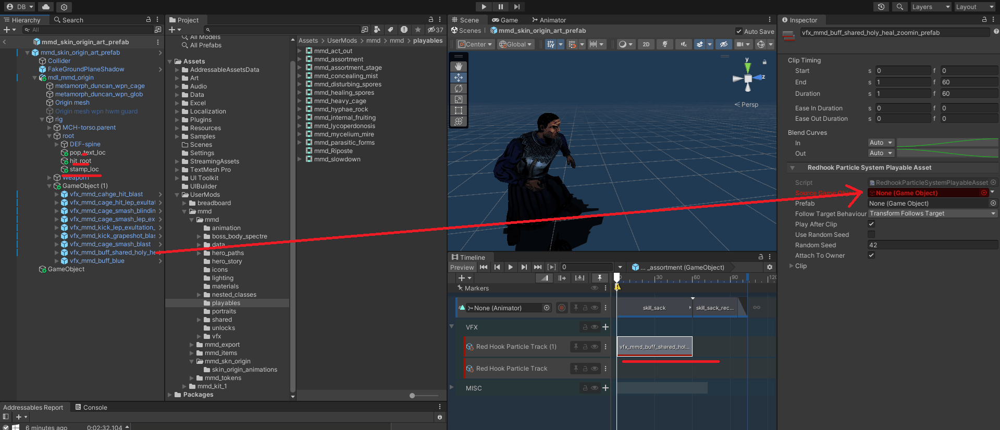\
*Existing VFX tracks shouldn't be deleted* -->

<!-- I still don't understand how Playable files work. They store timelines for VFX, armature animations, camera movement. It is possible to alterate VFX for skins by creating another VFX prefab file and attaching it to a separate track in Playable files. I imagined that animations can be altered the same way, by adding another track with a different animation clip. But it didn't work, I couldn't make the second animation track work, hero always took animations from the first track. -->

<!-- 
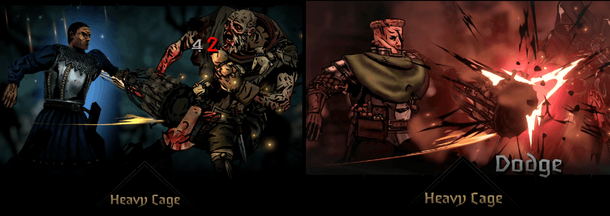\
*One skill can have different VFX depending on hero's kit/skin, I didn't change the mod between taking these images* -->

A bruteforce solution would be creating two sets of bones within a single armature. Both sets are always active, but each of them controls a different set of meshes. Or, it can be used locally. I used it for facial expressions.

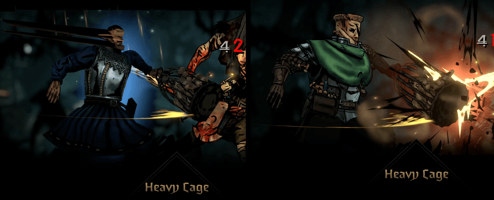\
*Different VFX and facial expressions depending on a skin, exaggerated on purpose*


<!-- Unfortunately for me I created an origin skin and animated it not even knowing about this pitfall. I just forgot that Playable files exist. My hero's origin skill had different facial animations and I didn't want to fix weight paint and reanimate. -->


<!-- What I had: two Blender files, one for the default skin, one for the origin skin. They shared the same armature by a link. One file had a skill animation with one facial expression, the other file had this animation with a different expression. Since I couldn't specify two different animations in Playables, I put both facial expressions in one animation.

1. Duplicated the bones that need to act differently depending on kit/skin.
2. Renamed them and moved them to a different Bone Collection so they are distinguishable.
3. Since animations were already made, I moved skin's keyframes to the duplicated bones.
4. Renamed skin's Vertex Groups to move bone weights to the duplicated bones.
5. 

I renamed duplicated bones by adding a sknOrigin_ prefix to them. This script moves animations from a bone X to the bone prefix+X.

<!-- 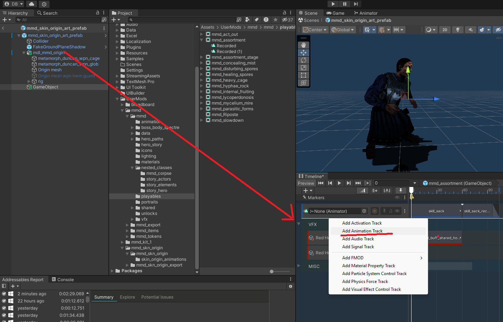\
** -->

<!-- 1. Duplicated the armature, added a prefix to all bone names.
2. Renamed Bone Collections to make duplicated bones separatable from the originals.
3. Joined the two armatures and made them share one root bone.
5. Added prefixes to the skin's vertex groups to attach them to the duplicated bones.
4. Since I created animations for original bones, I needed to transfer them to the duplicated bones.
6. Profit?

Or, in more detail:
1. make a backup because this is a questionable solution
1. create a new blender file
2. delete all objects
3. File -> Append, open the file with the armature, go into the Object folder, select the armature
4. select the armature, switch to the Pose Mode
5. open the Batch Rename tool by pressing Ctrl+F2
6. set these settings: All, Bones, Set Name, Prefix, specify this prefix. I added "~sknOrigin_" prefix
7. rename/reorganize bone collections so duplicated bones can be easily separated
7. save and close the file
8. open the main file
9. File -> Link, open the created file, select the renamed armature.
10. in the outline, right click on the linked armature, Library Override, Make, Selected.
11. switch to the Object Mode, select the linked armature, then the main armature, Ctrl+J
12. switch to the Edit Mode, create a new bone that will work as a parent to the main and duplicated root bones. It will be the new root bone.
13. select the old root bone, select the new root bone, Ctrl+P, Keep Offset
14. select the duplicated root bone, select the new root bone, Ctrl+P, Keep Offset

Now there are two sets of bones. Great.

If animations were created for bones without the prefix, this script can transfer keyframes to the prefixed bones:

```python
PREFIX = "~sknOrigin_"

import bpy
from bpy_extras import anim_utils

arm = next(obj for obj in bpy.data.objects if (obj.type == 'ARMATURE'))

def redirect_animation(fcurve, prefix):
    data_path = fcurve.data_path
    bone_name = data_path.split('"')[1]
    
    is_a_bone_animation = data_path.startswith('pose.bones["')
    its_a_prefixed_bone = data_path.startswith(f'pose.bones["{prefix}')
    there_is_a_prefixed_bone = (prefix + bone_name) in arm.data.bones
    
    if is_a_bone_animation and (not its_a_prefixed_bone) and there_is_a_prefixed_bone:
        fcurve.data_path = data_path.replace('pose.bones["', f'pose.bones["{prefix}')


for action in bpy.data.actions:
    for slot in action.slots:
        channelbag = anim_utils.action_get_channelbag_for_slot(action, slot)
        for fcurve in channelbag.fcurves:
            redirect_animation(fcurve, PREFIX)
```
To transfer weights from original bones to the duplicated ones, rename the mesh's Vertex Groups by adding the prefix to them.

If a kit/skin are stored in a separate file:
1. File -> Link, select the file with the skin, go into the Object folder, select the mesh.
2. in the Outliner right click on the linked object, Library Override, Make, Selected.
3. select the mesh in the Object Mode, Alt+P, Clear Parent.
4. select the mesh, select the armature, Ctrl+P -->

I couldn't make palettes work. It is possible to change the colors of the default palette icon though.

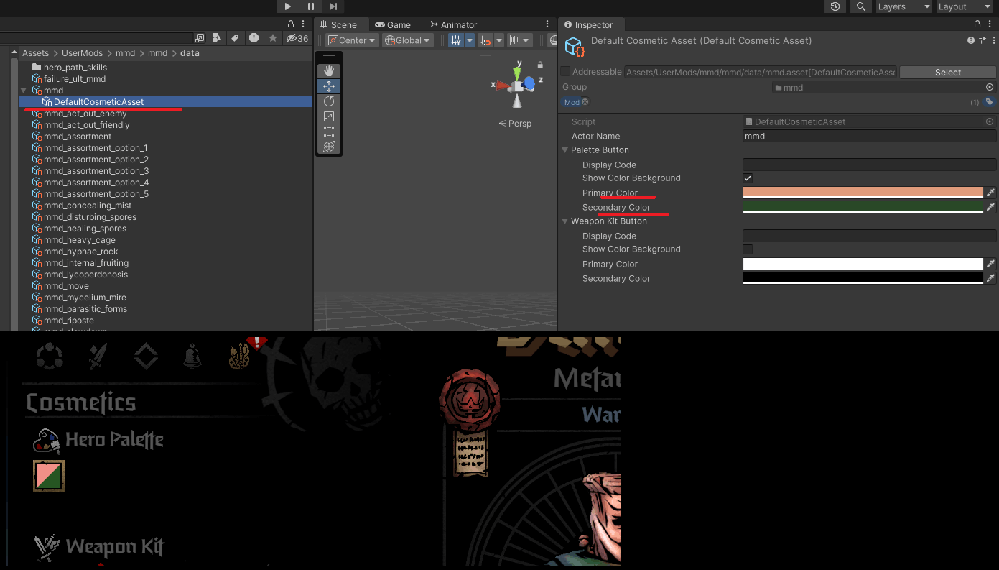\
*Changing default palette icon's colors*

The Mountain section of the Altar of Hope has buttons for each hero's palettes and kits. I don't know how to add a custom button, but kits' unlock can be assigned to other progressions, for example, to the Living City, if needed.

## A summoning skill

There are many difficulties with adding custom actors to heroes' or enemies' team. For example, Act 5 boss relies on hidden tokens to function. If a new actor spawns, it might break the logic of tokens.

When the third phase begins, the boss applies a hidden token `failure_incomplete`. If a summon is in heroes' party, it will get this token and will be eligible for the Face Your Failure action that should summon a failure. If an actor is selecting for facing their failure, they will get a hidden token `failure_facing`. If a summon is selected but it does not provide a failure class, the boss will not summon any failure, but will still apply a hidden token. And the boss will not summon Cherubs until selected summon dies. Adding summons to the enemy party can also break the battle.

So either the summon shouldn't be acessible in boss batles, or it should be tested on different bosses. I don't know if any other boss is as dependent on hidden mechanics as the Act 5 boss though.

It is definetly possible to create a summon that can act randomly on its own, The Metamorph was able to summon those Creatures from his Shrine of Reflection, and it worked perfectly in regular battles. But I had no idea what to do with the last boss, so instead my hero can only summon corpses that don't do anything.

<!-- Only a hero that is facing the failure should be able to damage it. But I don't know how it is implemented. The Runaway can damage other hero's failure. And my summons were able to damage my hero's failure, but only those summons that were spawned while my hero was facing his failure. Unfortunately I noticed it too late, I have no idea how to make it more consistent. -->

<!-- There are at least two ways to create a summon:
1. Base it on a hero
2. Base it on a corpse 

Both ways have difficulties. If a summon is created as a separate hero, then it should be somehow removed from rosters and maybe some other actions are needed.

A summon based on a corpse sounds easier to create, because it is already on heroes' side, doesn't prolong a battle when other heroes are dead, disappears after a fight, has no relationships, etc.

I think I made a mistake by modifying my hero's corpse file into a summon instead of copying it and making it a completely separate class. Its combat bar portrait is hero's, it is not changed to the summon's image. And during the Act 5 battle, if a summon is spawned while hero is facing their failure, this summon will damage the failure, but not the ones that were summonned before. But I noticed it too late.

If a summon kills a failure during act 5, the Exultation skill still applies to the appropriate hero. -->

<!-- Every hero has a separate corpse even though all corpses look the same. So modifying one does't affect the others. -->

<!-- Signal Flare and Thrilling Tablet count number of actors with an "ally" tag in the party to adjust their effects. So if a summon does not have this tag, Signal Flare will be usable even if all ranks without heroes are occupied with summons. And if it does have this tag, Thrilling Tablet will not increase stats when ranks are occupied with summons.

So I modified my hero's corpse file (or I could've copied it, but I wanted a summon to spawn if my hero dies). Attached a new model to the prefab file, added materials and animation components. -->

<!-- Since I didn’t use any scale references in Blender the model was too big. Fortunately changing scaling models using the Inspector window doesn't break anything. -->

<!-- 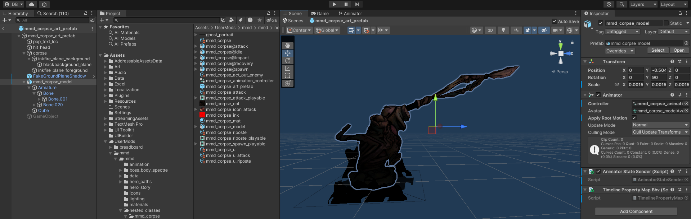\
*Summon's prefab* -->

<!-- Then added animations to its Animation Controller.

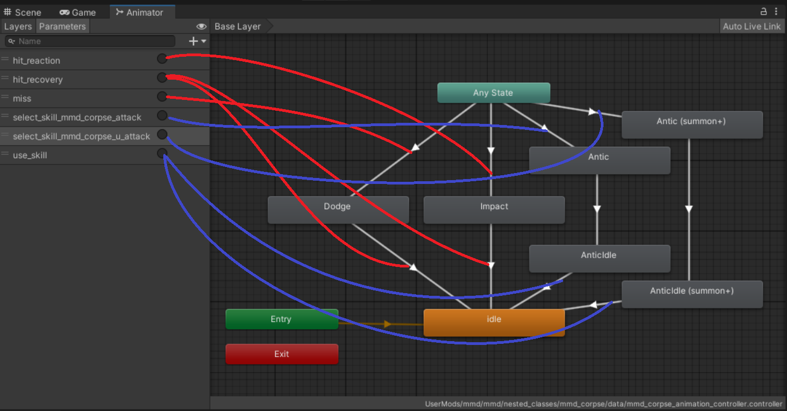\
*There are two attacks I had two versions of a summon* -->

<!-- In the `nested_classes` folder there was a Resource Actor for my hero’s corpse. I switched the prefab reference to my new prefab file. So when my hero dies this new creature appears instead of a grave. -->

<!-- To give it a skill I copied an existing RZIS file, renamed and reconfigured it. Then I attached it to the summon's Resource Actor file.

To add it a spawn animation, I created a Playable file, and attached it to the summon's Resource Actor file.

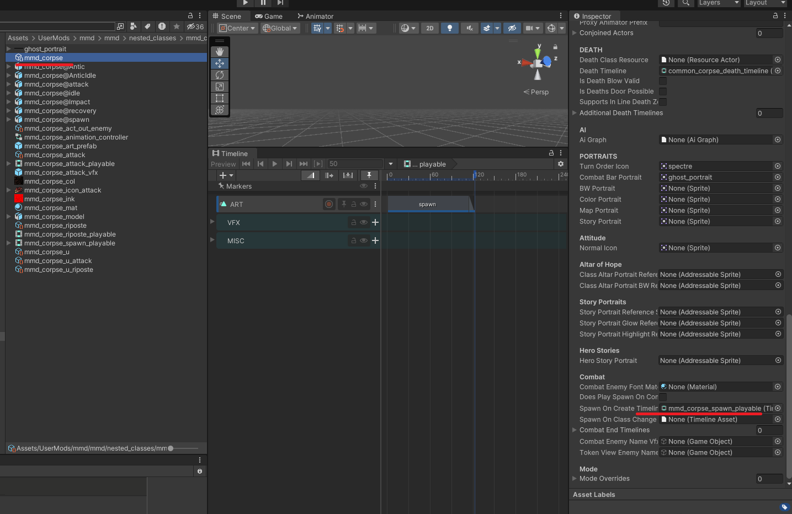\
*Adding a spawn animation*

But when I summoned it, it played a summon animation and froze. It can be fixed by setting the clip's Post-Extrapolate field to None in the Playable file.

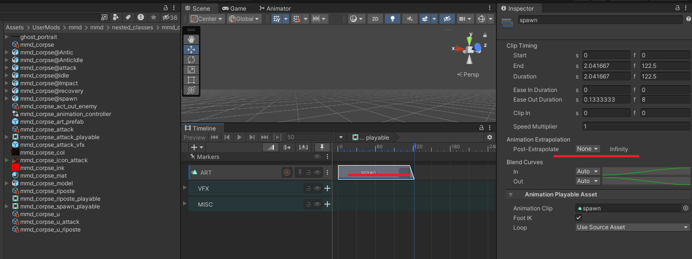\
*Fixing a spawn animation*

A summoning skill can be defined this way:


element_start,mmd_parasitic_forms,ActorDataSkill
⁝
m_AllConditionIds,hero_party_has_less_than_4_allies_hidden,
element_end

element_start,mmd_parasitic_forms,ActorDataEffects
performer_after_target_apply_limit_effects,mmd_parasitic_forms_summon,
performer_after_target_apply_limit,1,
friendly_team_effects,clear_corpse,
element_end

element_start,mmd_parasitic_forms_summon,Effect
m_Chance,1,
m_SummonClassActorId,mmd_corpse,
m_SummonLocationType,BACK,
m_SummonIfRoom,True,
element_end


Opening character sheet while it's the summon's turn shows a very broken sheet.

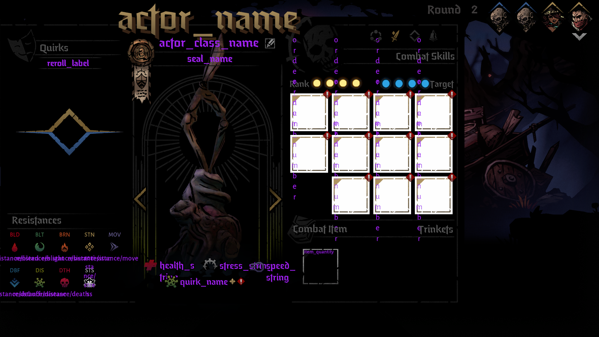\
*No stats, no quirks, no names. Everything was purple instead of blue*

I guess that since this summon is not a hero, this sheet can't be fixed. I see several solutions:
1. Block the sheet menu. If it doesn’t appear on a screen then there is no problem. Militia already blocks it. Unfortunately I couldn't find a setting to control this behavior.
2. Remove its turns entirely so there will be no time to open the sheet. But it needs to do something.
    - The summon gains taunt and riposte tokens periodically. Even though it doesn't have any turns, Round Start effects can still be used to apply tokens.
    - The summon uses Act Out system. Technically banters are Act Outs, so it can be triggered without relationships. I tried to trigger it by giving my hero a quirk that causes them to Act Out (like the Crimson Curse does). It worked. Unfortunately, I don't know how to add quirks to a non-hero actor.
3. Make it act randomly. It can be achieved by adding a "m_ActorControllerType,RANDOM," line to the summon's *ActorDataClass* element. If it has turn pass or move skills then it will choose randomly between common skills and these. Common skills can be made into forced skills though. But the pass turn skill can be removed entirely from the summon, then, if all skills are blocked (e.g. by the Shackles of Denial), it will skip a turn the same way enemies do when all heroes are in stealth. I didn't know that making something act randomly was possible until I saw the mod that [makes enemies controllable](https://steamcommunity.com/sharedfiles/filedetails/?id=3319111967). -->

<!-- I will describe *ActorDataClass* of my summon. First I removed the corpse tag because it was breaking the game. I put a *meat* tag instead. Thrilling Tablet counts the amount of *ally* tags in hero party so I didn't add it.

I deleted the *m_SkillBlockId* field and set *m_IsTickTriggerValid* field to true but I don't know what these fields do. -->

<!-- Corpses have zero turns each round. It can be changed by changing the value of *speed_number_of_turns* to 1 in its *ActorDataStats* element.

There was a glitch. When the summon killed an enemy, this enemy turned into a corpse, but only visually. This enemy corpse was still attacking. Removing the *corpse* tag in *ActorDataClass* seems to fix it.

Removing the *m_DeathRound* field didn't have any effect for some reason. Summons still disappeared after three turns. So I just set it to a big number.

Since my summon was technically a corpse of my hero, the *m_ClearContainerTypes* has to stay. When I tested the final boss, my hero's spectre didn't disappear after hero's death. Turned out the boss applies hidden tokens to heroes to track if they are still alive or the boss needs to summon another spectre. Removing this field will not remove those tokens and the fight will break. -->

<!-- I believe *m_IgnoredSkillAttributeTypes* blocks some effects from being applied. Corpses ignore tokens, quirks, and buffs. I allowed my summon to get tokens and buffs. -->

<!--
```csv
element_start,mmd_corpse,ActorDataClass
m_Tags,meat,
m_IsBattleComplete,True,
m_Size,1,
m_IsTickTriggerValid,True,
m_DeathRound,30,
m_TokenViewValid,False,
m_IsEffectsReasonValid,False,
m_ClearContainerTypes,BuffContainer,TokenContainer,DotContainer,
m_IgnoredSkillAttributeTypes,QUIRK_ADD,
m_ActorControllerType,RANDOM,
element_end
```
-->

<!-- Creating multiple summons is also possible. It is enough to duplicate the Resource Actor file, rename it, duplicate CSV data and change IDs. -->

<!-- 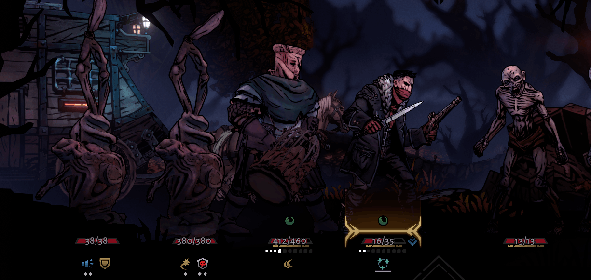\
*I summoned both versions. One version has higher HP. I added the ability to generate block to one version and the ability to generate Death’s Door Armor to the other one. They both worked as expected.* -->

<!-- VFX and SFX can be added the same way as for heroes. But for some reason this summon didn't have any SFX when it was on enemies' side (Act 5, Shrine of Reflection), unless it was SFX from enemies from HWM's first Shrine fight. I probably did something wrong though. -->

## CSV data III

I will try to explain how the Sharpshoot's Double Tap skill and one of the Tribecaller's passives work.

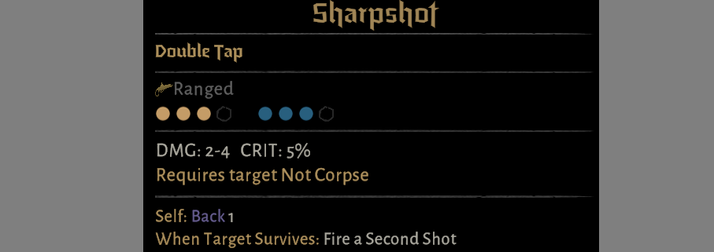\
*Sharpshoot's Double Tap*

This skill allows to fire a second shot if the target survives. It is implemented by giving an extra action and forcing to use another skill that looks the same but has multiple limitations.

Tokens can provide additional skills to a hero. I believe these skills don't have to be forced. But Sharpshoot's Double Tap applies hidden tokens to force him to shoot again.

I believe this skill works this way:

1. The HWM fires the first shot.
2. If it doesn't kill the target, the target gets a hidden token (Target token).
3. If it doesn't kill the target, the HWM gets an extra action and a different hidden token (HWM token).
4. The HWM token forces him to use his extra action and fire a second shot. This second shot skill is actually a completely different skill that just has the same icon and name.
5. This second shot skill can only target those enemies that have the Target token.
6. HWM and Target tokens are removed after the second shot is used.

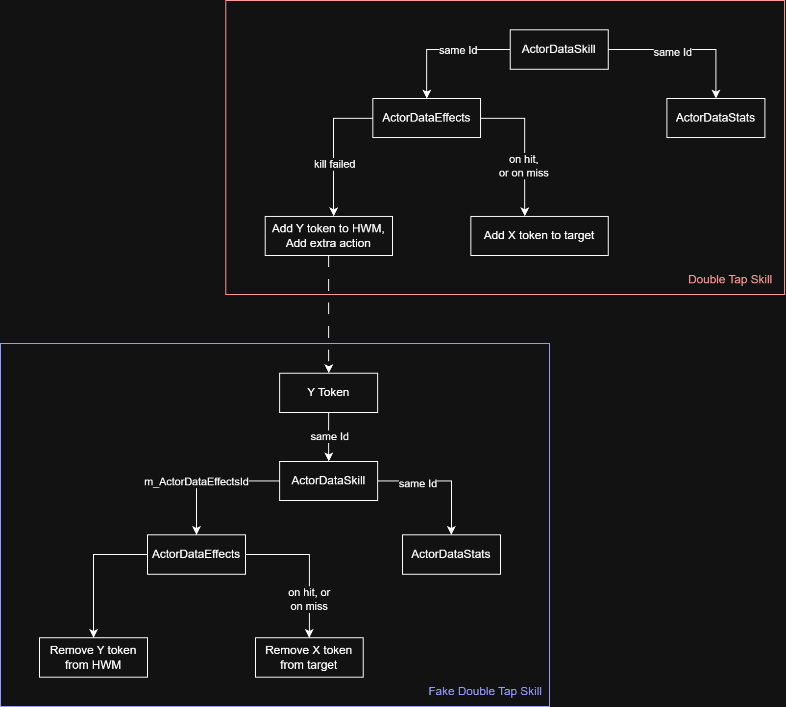\
*Schema of the Sharpshoot's Double Tap skill*

Here is a shortened definition of the skill:

```csv
element_start,hwm_double_tap_p2,ActorDataSkill
m_IsFriendly,False,
launch_ranks,2,3,4,
⁝
element_end

element_start,hwm_double_tap_p2,ActorDataStats
key_map,health_damage,health_damage_range,crit_chance,
add_stats,2,2,0.05,
element_end

// On kill fail the HWM gains the Y token (add_1_hwy_double_tap) and an extra action
// Whether missed or not, target gains the X token (add_1_hwy_double_tap_target)

element_start,hwm_double_tap_p2,ActorDataEffects
performer_on_kill_fail_effects,add_1_hwy_double_tap,extra_action_sharpshot_double_tap,
target_effects,add_1_hwy_double_tap_target,
on_miss_as_performer_to_target_effects,add_1_hwy_double_tap_target,
performer_effects,move_backward_1,
element_end

// extra action effect

element_start,extra_action_sharpshot_double_tap,Effect
m_Chance,1,
m_AddTurn,1,
⁝
element_end

// Target token application effect

element_start,add_1_hwy_double_tap_target,Effect
m_Chance,1,
m_TokenAddId,hwy_double_tap_target,
⁝
element_end

// Target token definition

element_start,hwy_double_tap_target,Token
m_Chance,1,
m_ConsumeTypes,manual,
m_Tags,token,bottom,hwy_double_tap,
m_DurationType,round_end,
m_DurationAmount,1,
m_Limit,1,
element_end

// HWM token application effect

element_start,add_1_hwy_double_tap,Effect
m_Chance,1,
m_TokenAddId,hwy_double_tap,
⁝
element_end

// HWM token definition

element_start,hwy_double_tap,Token
m_Chance,1,
m_ConsumeTypes,manual,
m_Tags,token,bottom,
m_DurationType,round_end,
m_DurationAmount,1,
m_Limit,1,
element_end

// skill definition of the second shot
// it is a forced skill, and the HWM has to use it
// its conditions don't it to be used on a different target 

element_start,hwy_double_tap,ActorDataSkill
m_IsFriendly,False,
launch_ranks,1,2,3,4,
target_ranks,1,2,3,4,
m_IsMultiHit,False,
m_AllConditionIds,target_has_hwy_double_tap_target,performer_has_hwy_double_tap,
m_CanBeRiposted,True,
m_ValidActOutTypes,skill_additional,
m_IsForced,True,
m_IsBlockPass,True,
token_ignores,til_ignore_taunt,
m_Tags,ranged,hwy_double_tap,
m_IsBlockPass,True,
m_IsStallInvalidating,True,
m_ActorDataEffectsId,hwy_double_tap_skill,
element_end

element_start,hwy_double_tap,ActorDataStats
key_map,health_damage,health_damage_range,crit_chance,
add_stats,2,2,0.05,
element_end

// remove HWM and Target tokens

element_start,hwy_double_tap_skill,ActorDataEffects
target_effects,remove_all_hwy_double_tap_target,
performer_after_target_effects,remove_all_hwy_double_tap,
on_miss_as_performer_to_target_effects,remove_all_hwy_double_tap_target,
element_end

element_start,remove_all_hwy_double_tap,Effect
m_Chance,1,
m_TokenRemoveId,hwy_double_tap,
⁝
element_end

element_start,remove_all_hwy_double_tap_target,Effect
m_Chance,1,
m_TokenRemoveId,hwy_double_tap_target,
⁝
element_end
```

<!-- Tokens that shouldn't be displayed need to have the *bottom* tag. When I was making something similar I didn't add this tag and the game stopped working. -->

*ActorDataClass* element of the second skill is connected to its *ActorDataEffects* through a *m_ActorDataEffectsId* field, not by using the same ID. I guess it's because if *ActorDataEffects* had the same ID, the game would not be able to resolve to what this element is connected: to a token, or to a skill.

<!-- Many restrictions of this skill can be removed. This allows, for example, to select an enemy target and a friendly target in one skill. Not simultaneously, but still. -->

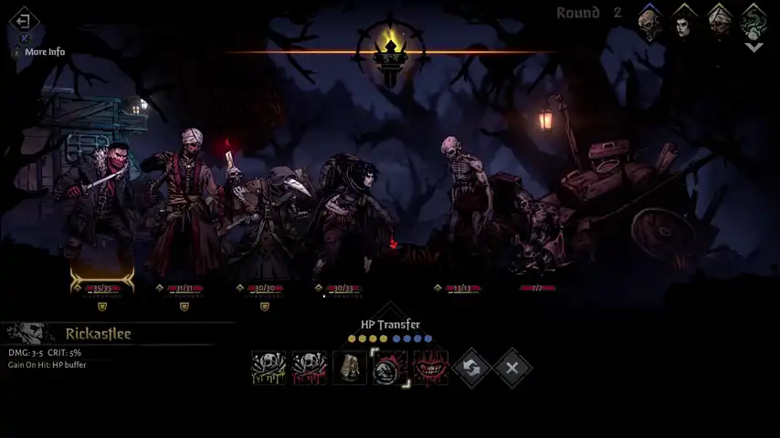\
*Damaging an enemy and healing an ally in "one turn"*

The Tribecaller enemy from K1 has a passive: when an adjacent ally is hit, the Tribecaller gets one Berserk token.

\
*[Tribecaller's passive](https://darkestdungeon.wiki.gg/wiki/Tribecaller)*

The challenging part is that there is no direct mechanic that watches when allies are hit. But it is possible to affect allies when the actor is hit.

On combat start the Tribecaller gives a hidden buff to all allies. And when an ally is hit, it checks if this ally has adjacent Tribecallers, and gives them one Enrage token.

```csv
// on combat start, apply a buff to all allies

element_start,beastmen_tribecaller_combat_start_aet,ActorEffectTrigger
m_ActorEffectType,combat_start,
m_ActorEffectTriggerSourceType,target,
m_ActorEffectTriggerTargetType,friendly_team,
m_IncludeSourceActor,True,
m_ActorCount,4,
effects,beastmen_tribecaller_enrager_e,
element_end

element_start,beastmen_tribecaller_enrager_e,Effect
m_Chance,1,
buffs,beastmen_tribecaller_enrager,
element_end

// this buff is on all allies
// to make sure that the buff won't be doubled when two Tribecallers are in battle,
// it is capped at 1 instance for each actor.

element_start,beastmen_tribecaller_enrager,Buff
m_DurationType,infinite,
m_InstanceLimit,1,
element_end

element_start,beastmen_tribecaller_enrager,ActorDataEffects
actor_effect_triggers,beastmen_tribecaller_enrager_aet,
element_end

element_start,beastmen_tribecaller_enrager_aet,ActorEffectTrigger
m_ActorEffectType,on_hit_as_target_to_target,
m_ActorEffectTriggerSourceType,target,
m_ActorEffectTriggerTargetType,neighbor,
m_NeighborFrontCount,1,
m_NeighborBackCount,1,
m_NeighborActorEffectTriggerSourceType,performer,
m_IncludeSourceActor,False,
m_ActorCount,2,
effects,add_1_enrage_33pct_tribecaller,
element_end
```

<!-- Now about my skills and tokens. There is a problem with positional tokens. They aren’t applied if the enemy dies from the skill. They also aren’t applied if the target is already a corpse. Strangely, killing an enemy while they have a positional token doesn’t remove the token. If an enemy dies the token also disappears.

Rank-locked token behaviour is also not very clear when an enemy takes more than one rank. I guess in situations where there is one size 2 enemy, the game treats rank-locked tokens as if there were three ranks total. So if this big enemy moves to any side, the rank token will be transferred to another enemy, even if the big enemy moved only by one rank. When a big enemy dies (a big corpse disappears), the game assigns the token to the rank closest to the front. But I didn't test it enough.

This is why my Hyphae Rock skill has its limitation. When I tried to bypass it, my first idea was to replace the corpses with something else. Like one of the infernal torches transforms corpses into Carion Eaters. Unfortunately I couldn’t implement it. I think it is because when an enemy dies they kind of disappear and a corpse appears on their place and the link between them is lost and it's not possible to know what corpse to transform.

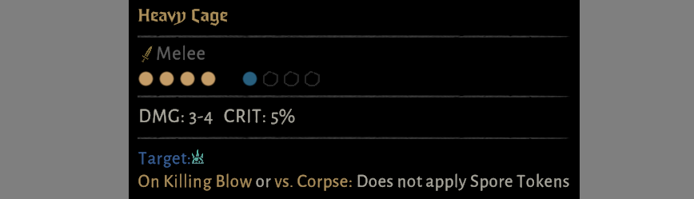\
*I had a choice between adding this limitation and removing all corpses behind the enemy*

For my Disturbing Spores skill I wanted to assign positional tokens to the first ranks no matter what. So I decided that the skill should clear corpses.

\
*Disturbing Spores skill*

The problem: when I tried to clear corpses and apply a positional token at the same time, the corpses were cleared but if the first rank was occupied with a corpse, then the token wouldn't be applied. It often lead to asymmetric situations where only hero's team gained a positional token. Order of effects didn't make anything different.

The solution was to clear corpses as a skill action and add an intermediary token that handles the application of positional tokens:
1. Skill clears corpses.
2. Skill applies a temporary token to the Metamorph.
3. On turn end this temporary token applies positional tokens and removes itself.

There is actually a something that is supposed to achieve this without intermediary tokens: *turn_end_friendly_team_effects* and *turn_end_enemy_team_effects* but for some unknown to me reason when I tried to apply those with *enemy_team_effects* and *friendly_team_effects* they didn't work. It might be that I did something wrong. But there is only two examples of those fields in the game, and they are literally two simple examples which aren’t actually used in the game.

The Cursed Spores token is applies a Combo token to a target when this target is hit. The problem was that if a skill removes a Combo token then my effect doesn't reapply it. I guess when the game gets instructions to both add and remove a certain token then this token won't be applied. Or with a block token: if the game gets instructions to remove block tokens, add block tokens, and add vulnerability token at the same time, then the result would be a vulnerability token. But it's just a guess, I didn't test it.

\
*Cursed Spores token*

The challenge here is that I don't know who hits a cursed target. In the previous case I knew that the performer was the Metamorph and his turn is going to end right now. With this token I can't just wait until the Metamorph's turn. I had to change the tactic a bit:
1. The Metamorph applies the Cursed Spores token to an enemy.
2. An ally hits the enemy and tries to remove a Combo token.
3. If the enemy had a Combo token, it gets removed.
4. On hit the Cursed Spores token applies an X token to the enemy.
5. On hit the Cursed Spores token applies a Y token to the ally.
6. On hero's turn end the Y token converts all X tokens to Combo tokens and removes itself.

This also needs to account for situations when an enemy attacks a hero and gets riposted. Both sides get tokens, but turn end effects aren't triggered until it's the end of hero's turn, even though tokens were applied during enemy's turn. To fix this, X token should also get a turn end effect:

7. On enemy's turn end the X token removes all Y tokens and converts all X tokens to Combo tokens. -->

When I was creating an extension for VS Code, I created a list of all elements, fields, and what values each field expects. It does not include everything that the game supports, only what is present in CSV files.

This list is located on [this page](https://github.com/dnauu-bmsotc/VSC-DD2-CSV-MMD#csv-data-description).

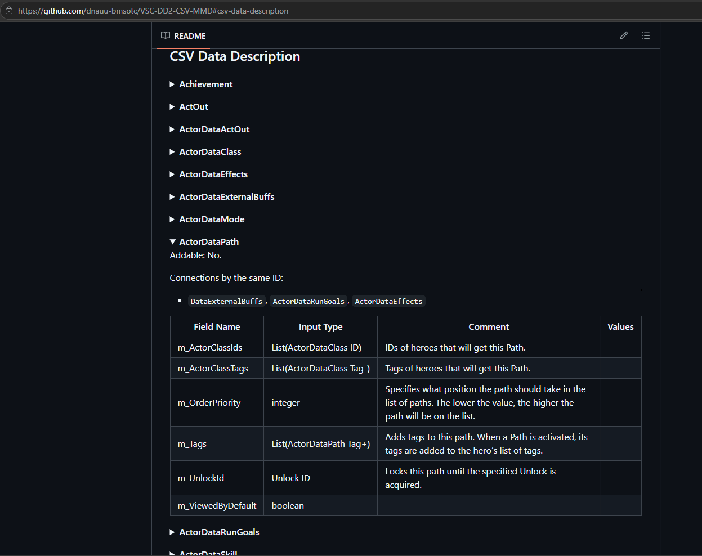\
*Desription of elements*

There is much more to explore in CSV files. I haven't tried to understand Abomination's transformations, various DOT mechanics, edge cases of forced skills, obscure fields and values.

## Testing

There is a log file. When the game is launched it clears this file and writes some messages there.

```
%USERPROFILE%\AppData\LocalLow\RedHook\Darkest Dungeon II\Player.log
```

This file often pointed me the IDs that I misspelled. Messages about missing IDs and some other warnings after a "VALIDATION" word.

Sometimes when the save has an ongoing expedition, mod changes won't be registered by the game until this expedition is ended.

Sometimes to make the game register mod changes it might be needed to turn the mod off, load the save, exit to main menu, and turn the mod back on.

For some changes (CSV and localization edits) it is enough to exit to main menu and load the save.

Turning game cheats on is very helpful. The [official guide](https://docs.google.com/document/d/1ga3FNrL3eGDRMFekLx9-RKhTDLMxPO603XzXcZa8O78/edit?usp=drive_link) explains how to do it. For unknown reasons cheat interface was glitching for me, and some options became inaccessible. But it allowed to:
- add candles
- add stress, heal stress
- deal damage to heroes, heal health
- skip a region, get a trophy for the Mountain
- get relics or baubles
- teleporting to Altar or Crossroads
- there are many other buttons, but I don't know what most of them do

There is a mod that allows to skip Cultist fights before bosses:
[Skip Mountain Cultist](https://steamcommunity.com/sharedfiles/filedetails/?id=3740321028)

<!-- I haven't encountered any differences between local and Workshop versions of my mod. Uploading a mod to Workshop worked without issues. -->

Some other mods can serve as example. Downloaded mods are stored in this folder:

```
C:\Program Files (x86)\Steam\steamapps\workshop\content
```

This folder only has files from `exports` folders. Source assets are not easily accessable, but CSV and localization data is open.

<!-- 
Some issues that might appear with modded heroes:
- passing a turn zooms in a hero as if it is a normal skill
- meltdown and resolute poses aren't held long enough
- overly strong inn highlight
- overly strong turn order highlight
- ?winning against the ghost of the past
- ?losing against the ghost of the past
- ?shrine of reflection
- ?kingdoms skillsets and hero upgrades
- ?shackles blocks
- ?getting stunned on extra action
- ?getting riposted, moving, passing a turn, using a combat item
-->

## Cloning this mod

It is better to create a new hero from scratch, using the EmptyCharacterCreator tool. But if the goal is to base a mod on this particular one or to use it as an example, then, to add this mod to a Darkside project:
1. Download and install Darkside from official resources.
2. Download the `.unitypackage` file from [here](https://drive.google.com/drive/folders/1KUBoXx9fL7DmxBuwkBUyXPfV348Qtks1?usp=drive_link)
3. In the Darkside project, open the `Assets` folder.
4. In this folder click RMB, select Import package, Custom package.
5. Select the downloaded package file, click Import.
6. Build the mod using the `Steamworks` file in the `UserMods/mmd` folder.
6. Open the `mmd/mmd_tokens` folder.
7. Click on the `Sprite Assets` folder, check the Addressable field on.
8. Write `Sprite Assets` in the Addressable field instead of a path.
9. Change the group to `mmd`.
10. Build the mod using the `Steamworks` file again.
11. Copy the `mmd/mmd_exports` folder to the local DD2 mods folder.

Local mods folder (Steam version):
```
C:\Program Files (x86)\Steam\steamapps\common\Darkest Dungeon® II\Darkest Dungeon II_Data\StreamingAssets\mods\
```

Now it should appear in the game

Since mods must have unique IDs, a clone of this mod will not be compatible with the original one (the game will be stuck in an endless loading screen if both mods are activated).

<!-- 

To change ID of a hero, all filenames in every folder and prefab should be changed.

1. Acquire the free [Mulligan Renamer](https://assetstore.unity.com/packages/tools/utilities/mulligan-renamer-99843) asset from Unity AssetStore.
2. Install it in the Darkside project.

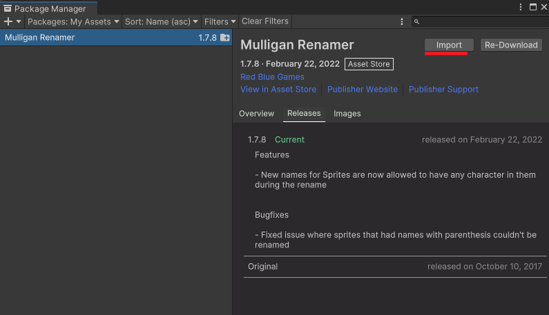\
*Mulligan Renamer*

3. Open the renamer through Window -> Red Blue -> Mulligan Renamer.
4. Open Unity Search window through Window -> Panels -> Search.
5. Search `mmd`.
6. Switch to the All tab.
7. Click on the first element, then scroll to the end, Shift+Click on the last element. This should select all elements.
8. Drag selected files to the Renamer.

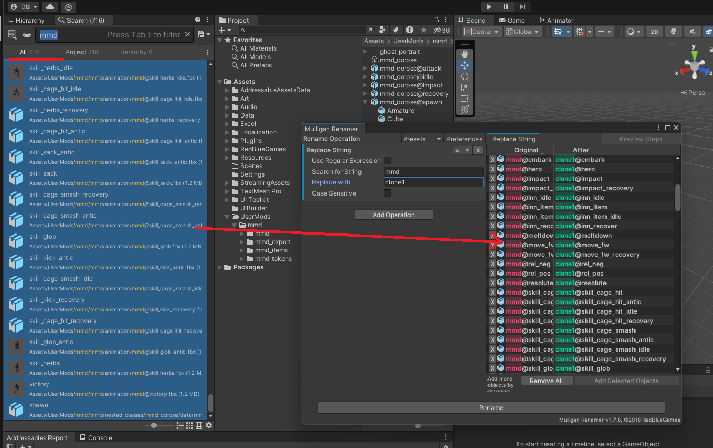\
*Renaming all files*

9. In the Renamer set the Search for String field to `mmd`.
10. Set the Replace with field to the new ID.
11. Click Rename.
12. Open the CSV file in the `exports` folder, replace all `mmd` strings with the new ID, save file.
13. Open the localization file in the `exports` folder, replace all `mmd` strings with the new ID, save file.

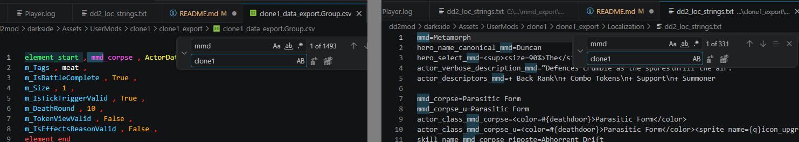\
*Replacing ID in CSV and localization files. Case sensitivity should be disabled*

14. In Darkside, click on the Steamworks tool and switch it to Debug mode.

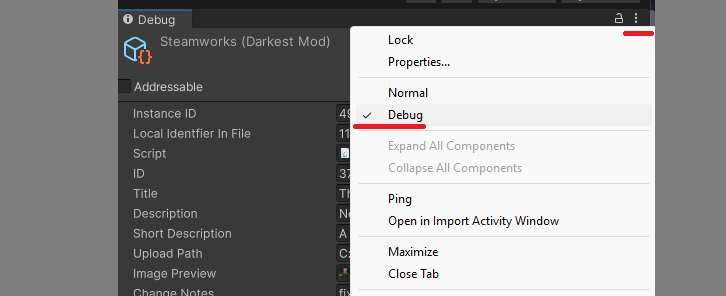\
*Debug mode*

15. Change the Sanitized Name field to the new ID.

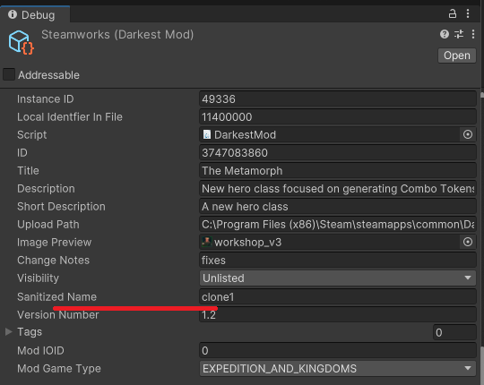\
*Sanitized Name*

16. Switch the Steamworks tool back to Normal mode.
17. Go to the `Sprite Assets` folder in the token folder.
18. Click on the TMP Sprite Asset file, rename tokens.

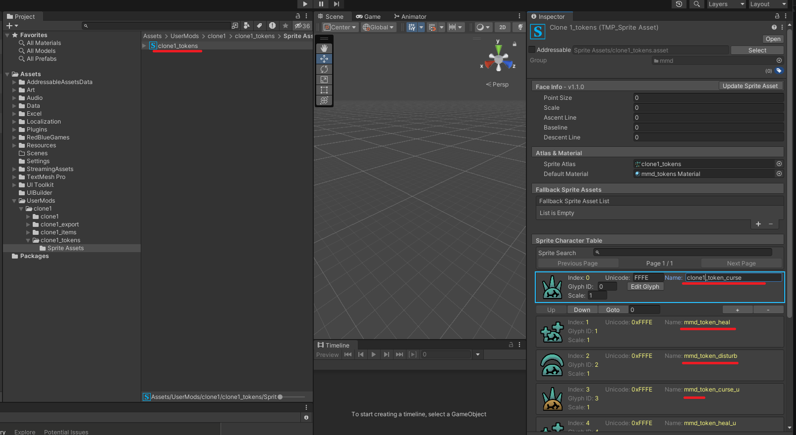\
*Fixing tokens*

19. If the new hero needs to apply the same tokens as the Metamorph (otherwise there will be duplicates of tokens) then:
    1. Delete token definitions in the CSV file of the new hero (lines 405 - 855).
    2. Find and replace `[id]_token_curse` with `mmd_token_curse`. 
    2. Find and replace `[id]_token_mire` with `mmd_token_mire`. 
    2. Find and replace `[id]_token_heal` with `mmd_token_heal`. 
    2. Find and replace `[id]_token_disturb` with `mmd_token_disturb`. 
    3. Save the file.
20. Build the mod, copy the `exports` folder to the DD2 mod folder.

After that Duncan's doppelganger should appear in the game.

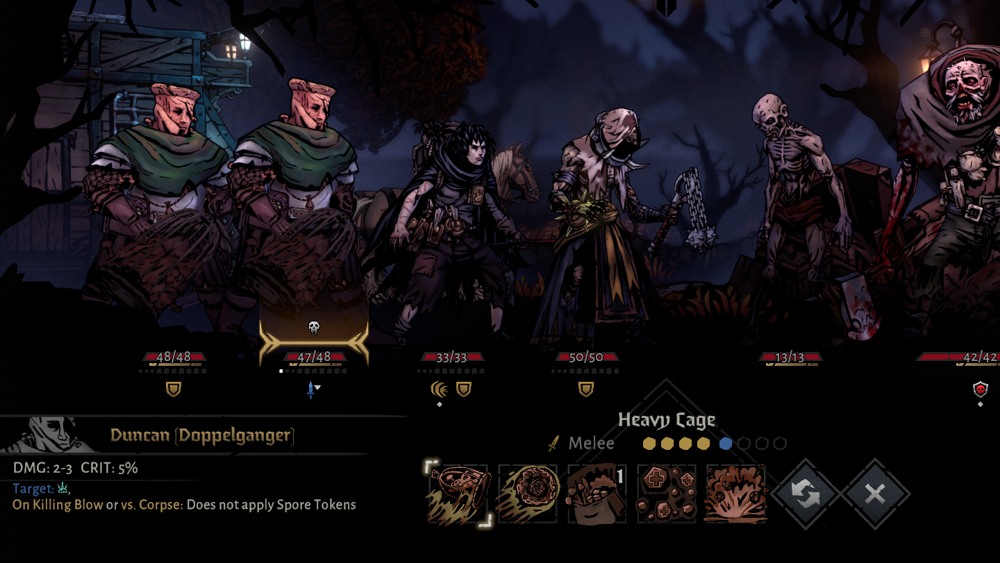\
*I don't know why would anybody want my hero doubled but at least it works*

I don't know reliable this ID changing is, but I'm inclined to believe that there shouldn't be any big problems.

-->

<!-- ## Afterword

This process was a lot of fun. I remember how happy I was when my 3D model appeared the game for the first time, even though it was just a T-pose. I felt so smart when I created skills that I didn’t even know were possible, or when I made the Shrine of Reflection work, even if with some workarounds. -->

<!-- 
I loved the process of 3D modeling, texturing, drawing, animating, editing CSV data, figuring out how the game works, polishing things.

- Day 1: trying to come up with the idea.
- Day 2: drew a concept art.
- Day 3: drew a signature item and trinkets, installed modding tools.
- Day 4: watched some tutorials, created my first inn item.
- Day 5: transformed the inn item into a signature item, started 3D modeling.
- Day 6: finished a mesh for the hero.
- Day 7: created a mesh for the weapon.
- Day 8: textured the meshes.
- Day 9: fixed the mesh and the rig, created a couple of animations.
- Day 10: created all generic animations.
- Day 11: drew skill icons, made six skill animations.
- Day 12: figured out how to import animations in Darkside.
- Day 13: imported skill icons in Darkside.
- Day 14: created the summon’s model and animations.
- Day 15: was trying to figure out how to implement a summon.
- Day 16: finally implemented a summon.
- Day 17: fixed the outline issue, fixed the inn light issue, drew portraits.
- Day 18: added vfx to some animations, drew token icons, imported token icons in Darkside.
- Day 19: fixed token tooltips, implemented token effects.
- Day 20: redrew token icons, defined some skills, adjusted some tooltips.
- Day 21: finished wanderer skills, added vfx to all skills.
- Day 22: discovered issues with positional tokens, changed some skills, drew path seals.
- Day 23: tried to create palettes and skins, added sfx.
- Day 24: redrew trinkets and the signature item, added altar progression, finished a new path.
- Day 25: finished all paths.
- Day 26: added trinket effects, set loot tables up.
- Day 27: learned how the Shrine of Reflection works, added barks.
- Day 28: implemented the Shrine of Reflection story.
- Days 29-36: preparing everything for publication.
 -->


## Locations of files and folders

Streaming Assets folder (contains CSV data, localization data, local mod folder):

- Steam:

    ```
    C:\Program Files (x86)\Steam\steamapps\common\Darkest Dungeon® II\Darkest Dungeon II_Data\StreamingAssets\
    ```

- Epic Games:

    ```
    C:\Programs\EPIC\Epic Games\DarkestDungeonII\Darkest Dungeon II_Data\StreamingAssets\
    ```

-   GOG:

    ```
    C:\GOG Games\Darkest Dungeon II\Darkest Dungeon II_Data\StreamingAssets\
    ```

Log file:

```
%USERPROFILE%\AppData\LocalLow\RedHook\Darkest Dungeon II\Player.log
```

Save files:

```
%USERPROFILE%\AppData\LocalLow\RedHook\Darkest Dungeon II\SaveFiles\
```

Darkside UserMods folder (if Darkside is installed via Steam):

```
C:\Program Files (x86)\Steam\steamapps\common\Darkest Dungeon® II Mod Tools\darkside\Assets\UserMods\
```

Steam Workshop Folder:

```
C:\Program Files (x86)\Steam\steamapps\workshop\content\1940340\
```